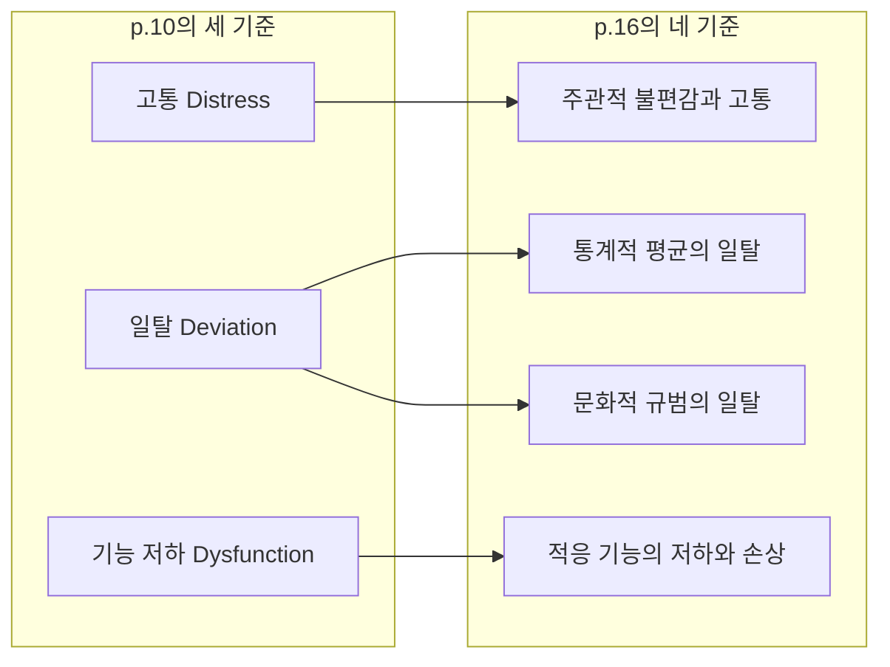



요약

무엇이 이상인지 가르는 잣대는 넷이다. 본인이 괴로운가, 통계적으로 드문가, 사회의 규범에서 벗어나는가, 생활이 제대로 돌아가지 않는가. 넷 모두 그럴듯하지만, 어느 하나만 쓰면 반드시 틀리는 사례가 생긴다. 그래서 단 하나의 절대 기준 없이 여러 잣대를 함께 보고 판단한다.

## 예시로 보기

슬라이드의 두 사람 A와 B에 세 사람을 더해, 네 잣대를 하나씩 대 본다[^1][^s1].

| 사람 | 주관적 고통 | 통계적 일탈 | 규범 일탈 | 기능 저하 | 이상인가 |
|---|---|---|---|---|---|
| A: 결혼·직장생활에 문제가 없지만 공허감을 자주 느낀다 | 있음 | 없음 | 없음 | 없음 | 고통 하나만으로는 이상이라 하기 어렵다 |
| B: 매우 자신감 있고 행복하지만 다른 사람을 착취한다 | 없음 | 있을 수 있음 | 있음 | 본인은 없다고 느낌 | 고통 잣대로는 걸러내지 못한다 |
| C: 지능지수가 145다 | 없음 | 있음 | 없음 | 없음 | 드물지만 바람직한 방향이라 이상이 아니다 |
| D: 정보기관이 자신을 감시한다고 굳게 믿지만 불편해하지 않는다 | 없음 | 있음 | 있음 | 있음 | 이상이다. 고통 잣대만 이를 놓친다 |
| E: 가족을 잃고 몇 주 동안 울며 일을 쉰다 | 있음 | 없음 | 없음 | 있음 | 사회가 예상하는 애도 반응이라 이상이 아니다 |

표의 어느 열도 마지막 열과 일치하지 않는다. 한 잣대로 판단하면 누군가는 잘못 분류된다. 필기에도 B 옆에 "해당 기준을 가지고는 B를 걸러낼 수 없다"고 적혀 있다[^2].

## 정의

이상행동을 한 번에 정의하기 어려운 이유는 셋이다[^3]. 모든 이상행동이 함께 가진 단일한 특성이 없다. 이상행동을 정의하는 단일한 기준이 없다. 정상과 이상 사이에 뚜렷한 경계가 없다.

그래서 여러 기준을 쓴다. 슬라이드 p.10은 셋(Distress, Deviation, Dysfunction)을 들고, 요약 그림 p.16은 일탈을 통계와 문화로 나눠 넷으로 정리한다[^4]. 아래 표는 네 기준의 판단 방식과 장단점이다.

| 기준 | 이상으로 보는 경우 | 장점 | 단점 |
|---|---|---|---|
| 주관적 불편감과 고통 (distress) | 본인이 주관적으로 불편하고 고통스러울 때[^1] | 직관적으로 와닿는다 | 증상이 심해도 본인은 고통을 못 느낄 수 있다(망상, 성격장애). 얼마나 괴로워야 비정상인가? 삶의 많은 부분이 고통인데 모두 이상인가? |
| 통계적 평균의 일탈 (statistical deviation) | 특성을 수치로 재서, 평균에서 크게 벗어난 극단값일 때. 특성이 정규분포를 이룬다고 전제한다[^5] | 순위를 매길 수 있어 절단점을 정할 수 있다. 객관적이고 정확하다 | 절단점을 누가 어디에 정하나? 절단점 바로 옆 사례(2점이 기준이면 1.98점은?)는? 바람직한 방향의 일탈(지능이 높은 경우)은? 사람의 수많은 특성에 다 적용되지 않고, 모든 특성이 정규분포를 이루지도 않는다[^6] |
| 문화적 규범의 일탈 (normative deviation) | 그 사회의 규범에 맞추지 못하고 벗어날 때[^7] | 직관적으로 와닿는다 | 일탈이 곧 이상은 아니다. 규범은 문화마다 다르다. 규범 자체가 바람직하지 않을 수 있다 |
| 적응 기능의 저하와 손상 (dysfunction) | 사회·직업·학업·가정생활에서 제 기능을 못 할 때. 최근 진단 기준에 적극 반영된다[^8] | 겉으로 드러난 것을 관찰하므로 추론이 비교적 적다 | 적응과 부적응의 경계가 모호하다(성적이 얼마나 떨어져야 하나?). 누가 무엇으로 평가하나(가치가 들어간다). 부적응이 어떤 심리 특성 때문인지 판단하기 어렵다 |

결론은 슬라이드와 필기가 함께 강조한다. 단일한 절대적 기준은 없으며, 여러 기준을 종합적으로 고려해 판별한다[^4].

### 동치인 다른 정리 방식

- **셋이냐 넷이냐:** p.10의 Deviation 하나를 p.16은 "통계적 평균의 일탈"과 "문화적 규범의 일탈" 둘로 나눴다. 내용은 같고 나누는 굵기만 다르다[^4].
- **위험(danger)을 더한 4D:** 다른 교재는 일탈(deviance), 고통(distress), 기능장애(dysfunction)에 자신이나 남에게 위험한가(danger)를 더해 넷으로 정리한다[^s2]. 이 과목의 네 기준에는 위험이 따로 없다.

두 정리는 일탈 하나가 통계와 문화 둘로 갈라진 것만 다르다. 고통과 기능 저하는 그대로 하나씩 이어진다[^s4].

### 설계 이유

네 기준은 서로 다른 것을 잰다. 고통은 본인의 경험을, 통계는 분포 속 위치를, 규범은 사회의 판단을, 기능은 생활의 결과를 본다. 재는 대상이 다르니 약점도 다른 곳에 있다. 한 기준이 놓친 사례를 다른 기준이 잡는다. 위 표에서 고통 잣대가 놓친 B와 D를 규범·기능 잣대가 잡는 것이 그 예다.

### 스스로 설명해 보기

1. "통계적 기준은 특성이 정규분포를 이룬다고 전제한다."
   

근거

   평균에서 표준편차의 몇 배 떨어졌는지로 절단점을 잡으면, 그 밖에 놓이는 사람의 비율은 분포 모양이 정한다. 정규분포라야 "평균 − 2 표준편차 아래는 약 2.3%"처럼 비율이 정해진다. 계산은 [통계적 일탈 기준 ↔ 정규분포](/Hongs_Blog/studies/abnormal-psychology/statistical-deviation--normal-distribution/)에 있다.
   

2. "기능 기준은 비교적 작은 추론이 필요하다."
   

근거

   결근, 낙제, 가족과의 단절처럼 겉으로 드러난 결과를 보면 된다. 마음속 상태나 규범의 옳고 그름을 추측할 필요가 적다. 필기의 "겉으로 드러나는 것들 관찰 가능"이 이 뜻이다[^8].
   

3. "기능 기준은 가치 지향적이다."
   

근거

   무엇을 "기능"으로 볼지부터 가치가 정한다. 필기의 "신속성 vs. 정확성"이 예다. 느리지만 꼼꼼한 직원은 속도를 중시하는 직장에서는 부적응, 정확성을 중시하는 직장에서는 적응이다[^8].
   

4. "규범 기준은 규범 자체가 틀렸으면 함께 틀린다."
   

근거

   동성애는 미국정신의학회 진단 편람 2판(DSM-II)에 장애로 올라 있다가 1973년에 빠졌다[^s3]. 당시 규범에 따라 이상으로 분류했지만, 규범이 바뀌자 분류도 철회했다.
   

- 네 기준을 함께 쓰는 핵심 아이디어는?
  

답

  각 기준이 서로 다른 측면(경험, 분포, 사회, 결과)을 재서 약점이 겹치지 않는다. 하나의 약점을 다른 기준이 보완한다.
  

- 같은 방식을 쓸 수 있는 다른 상황은?
  

답

  신체 질병도 비슷하다. 검사 수치가 정상 범위를 벗어났는가(통계), 아픈가(고통), 일상생활을 못 하는가(기능)를 함께 본다. 콜레스테롤 수치가 높아도 증상이 없고, 두통이 있어도 검사는 정상일 수 있다.
  

## 예제

**문제.** 스무 살 대학생 F는 밤마다 게임을 7시간씩 한다. F는 즐겁다고 말한다. 하지만 두 학기 연속 학사경고를 받았고, 가족과 거의 대화하지 않는다. F의 행동을 네 기준으로 판단하라[^s1].

1. *주관적 고통:* 본인은 즐겁다고 한다. 이 기준으로는 이상이 아니다.
2. *통계적 일탈:* 또래의 게임 시간 분포에서 하루 7시간은 극단에 가깝다고 볼 수 있다. 다만 절단점을 누가 정하는지가 문제로 남는다.
3. *문화적 규범:* 게임 자체는 규범 위반이 아니다. 이 기준만으로는 판단이 어렵다.
4. *기능 저하:* 학업(학사경고)과 가정(대화 단절)에서 기능이 떨어졌다. 이 기준에서는 이상이다.
5. *종합:* 고통 기준은 놓치지만 기능 기준이 잡는다. 여러 기준을 함께 볼 때 F의 문제가 드러난다. 장애 여부는 진단 기준을 따로 확인해야 한다(10회 인터넷 게임 장애).

**경계 사례.** 절단점 바로 옆의 두 사람은 거의 같은데 한쪽만 "이상"이 된다. 필기의 질문 "2점이 기준이라면 1.98점은?"이 이것이다[^6]. 이 문제는 [범주적 분류와 차원적 분류 비교](/Hongs_Blog/studies/abnormal-psychology/categorical-vs-dimensional/)로 이어진다.

## 연결

- 통계 기준의 수학: [통계적 일탈 기준 ↔ 정규분포](/Hongs_Blog/studies/abnormal-psychology/statistical-deviation--normal-distribution/)
- 이 기준들이 진단 편람의 정의에 들어간 모습: [정신장애와 DSM](/Hongs_Blog/studies/abnormal-psychology/mental-disorder-dsm/). 고통과 기능 저하는 정의의 둘째 요소가 되고, 문화적으로 예상되는 반응은 정의에서 빠진다.
- 절단점 문제: [범주적 분류와 차원적 분류 비교](/Hongs_Blog/studies/abnormal-psychology/categorical-vs-dimensional/)

## 자주 하는 오해

"드물면 이상이다"

틀렸다. 통계적 기준만 보면 드문 것이 곧 이상이라 그럴듯하다. 하지만 통계적 일탈에는 방향이 없다. 지능지수 145인 사람과 55인 사람은 평균에서 똑같이 3 표준편차 떨어져 있지만, 앞사람을 장애로 보지 않는다. 드물다는 사실은 이상의 필요조건도 충분조건도 아니다. 우울처럼 흔한 문제도 장애가 될 수 있다. 확인 방법: 드물지만 바람직한 특성(절대음감, 높은 지능)을 하나 떠올려 네 기준에 대 본다. 통계 기준 하나만 걸린다.

"본인이 괴롭지 않으면 문제가 없다"

틀렸다. 고통은 가장 직관적인 잣대라 그럴듯하다. 하지만 망상이 있는 사람은 자기 믿음이 사실이라 여겨 괴로워하지 않을 수 있고, 다른 사람을 착취하는 B는 오히려 행복하다[^1]. 이런 경우 고통은 본인이 아니라 주변 사람에게 생긴다. 확인 방법: 표의 B와 D를 규범·기능 기준에 대 보면 이상으로 걸린다.

## 확인 문제

<b>C1</b> 이상행동의 네 기준을 쓰고, 기준마다 단점을 하나씩 쓰라.

**답:** (1) 주관적 불편감과 고통: 증상이 심해도 본인이 고통을 못 느끼는 경우(망상, 성격장애)를 놓친다. (2) 통계적 평균의 일탈: 절단점을 정하기 어렵고, 바람직한 방향의 일탈도 이상이 된다. (3) 문화적 규범의 일탈: 규범이 문화마다 다르고, 규범 자체가 틀릴 수 있다. (4) 적응 기능의 저하: 적응과 부적응의 경계가 모호하고, 평가에 가치가 들어간다. 
**흔한 오답:** 통계적 기준의 단점으로 "주관적이다"를 쓰는 경우. 통계 기준의 장점이 객관성이고, 문제는 절단점과 방향이다.

<b>C2</b> "주관적 고통" 기준과 "통계적 일탈" 기준 각각에 대해, 그 기준만 쓰면 잘못 판단하는 사례를 하나씩 만들라.

**답:** 고통 기준: 다른 사람을 착취하며 행복하게 사는 사람, 또는 망상을 확신해 괴로워하지 않는 사람. 문제가 있는데 "정상"으로 판단한다. 통계 기준: 지능지수 145인 사람. 바람직한 방향으로 드문데 "이상"으로 판단한다. 
**이유:** 고통 기준은 본인이 괴로움을 느끼지 않는 문제를 놓치고, 통계 기준은 일탈의 방향을 구별하지 못한다.

<b>C3</b> 적응 기능의 저하 기준이 최근 진단 기준에 적극 반영되는 이유와, 그래도 이 기준만으로는 부족한 이유를 쓰라.

**답:** 반영되는 이유: 학업·직업·대인관계의 결과처럼 겉으로 드러난 것을 관찰하므로 추론이 적고 판단이 비교적 쉽다. 부족한 이유: 어디서부터 부적응인지 경계가 모호하고(성적이 얼마나 떨어져야 하나), 무엇을 기능으로 볼지 평가자의 가치가 들어가며, 부적응이 어떤 심리적 특성에서 왔는지 알려 주지 않는다. 가족을 잃고 일을 쉬는 사람처럼, 기능이 떨어져도 정상 반응인 경우도 있다.

<b>C4</b> 무대 공포가 심한 가수 G는 공연 전날마다 잠을 못 자고 괴로워하지만, 공연은 한 번도 빠지지 않고 성공적으로 해낸다. 네 기준으로 판단하고 결론을 쓰라.

**답:** 고통: 있다. 통계적 일탈: 공연 전 긴장은 흔하므로 뚜렷하지 않다. 규범 일탈: 없다. 기능 저하: 없다(공연을 해낸다). 결론: 고통 기준 하나만 걸리므로 이상행동으로 보기 어렵다. 다만 고통이 점점 커져 공연을 피하기 시작하면 기능 기준에도 걸리므로 다시 판단한다. 
**이유:** 한 기준만 걸리는 경우는 판단을 유보하고, 여러 기준을 종합한다.

[^1]: 이상 심리학 1회 강의 자료 「이상심리학」, p.11 (Distress / Discomfort, A와 B의 예)
[^2]: 이상 심리학 1회 강의 자료 「이상심리학」, p.11 손글씨 필기. "공허감을 자주 느끼는"에 형광펜, B에 빨간 체크.
[^3]: 이상 심리학 1회 강의 자료 「이상심리학」, p.9 (이상행동 정의의 어려움)
[^4]: 이상 심리학 1회 강의 자료 「이상심리학」, p.10 (세 기준), p.16 (네 기준 요약 그림과 형광펜 필기)
[^5]: 이상 심리학 1회 강의 자료 「이상심리학」, p.12 (통계적 기준, 정규분포 그림). 옆의 손글씨 "직관적이라는 장점"은 정규분포 그림이 기준을 직관적으로 보여 준다는 뜻으로 읽었다[판독불확실: 어느 기준의 장점을 가리키는지]. 같은 강의에서 "직관적 호소력"은 p.11 주관적 고통 기준의 장점으로 적혀 있고, p.13의 통계적 기준 장점은 "절단점 설정 가능, 객관적, 정확"이다.
[^6]: 이상 심리학 1회 강의 자료 「이상심리학」, p.13. 장단점은 슬라이드, 괄호 안 질문과 예("순위를 매기므로", "누가 결정할 것인가?", "2점이 기준이라면 1.98점은?", "ex. 지능이 높은 경우", "전제가 항상 정규분포를 이루지 않음")는 손글씨 필기다.
[^7]: 이상 심리학 1회 강의 자료 「이상심리학」, p.14
[^8]: 이상 심리학 1회 강의 자료 「이상심리학」, p.15. "겉으로 드러나는 것들 관찰 가능", "성적이 얼마나 떨어져야 하는가?", "신속성 vs. 정확성"은 손글씨 필기다.
[^s1]: 보충 C, D, E, F, G의 사례와 판단 표는 슬라이드의 네 기준을 가상 사례에 적용한 것이다. 표의 판단은 설명용이고 진단이 아니다.
[^s2]: 보충 위험(danger)을 넣은 "4D"는 Comer의 이상심리학 교재가 쓰는 정리다.
[^s3]: 보충 미국정신의학회는 1973년 동성애를 DSM-II의 장애 목록에서 삭제했다. 널리 알려진 역사적 사실이다.
[^s4]: 보충 다이어그램 1개는 원본에 없다. '동치인 다른 정리 방식'의 첫 항목(슬라이드 p.10의 세 기준, p.16의 요약 그림)을 그렸다.

