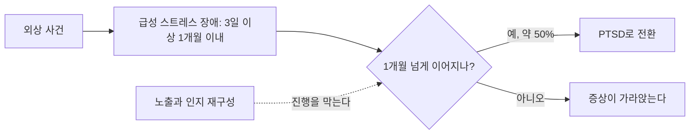



요약

외상 사건 직후 PTSD와 거의 같은 증상이 3일에서 한 달 사이에 나타나는 장애다. 멍하고 현실감이 없고 기억이 끊기는 해리 증상이 두드러진다. 해리는 너무 강한 충격에서 잠시 자신을 지키는 방패 역할을 한다. 한 달이 지나도 증상이 이어지면 약 절반이 PTSD로 넘어가므로, 이 시기에 노출과 인지 재구성으로 개입하면 PTSD를 막는 데 도움이 된다.

## 예시로 보기

건물 붕괴 현장에서 구조된 DW는 구조 다음 날부터 "모든 게 꿈속 같다", "내가 나를 밖에서 보는 것 같다"고 말한다. 무너지던 순간의 일부가 기억나지 않고, 밤마다 그 장면이 떠올라 잠을 못 이루며, 작은 진동에도 소스라친다. 사고 뒤 2주째다[^s1].

- 외상 사건 직후, 3일 이상 1개월 이내.
- 침투, 부정적 기분, 회피, 각성 증상에 더해 해리 증상(비현실감, 이인증, 기억상실).
- 4주가 지나도 이어지면 PTSD로 진단을 바꾼다.

## 정의

외상 사건을 직접 겪거나 목격한 직후에 나타나는 부적응 증상이 3일 이상 1개월 이내의 짧은 기간 동안 이어지는 장애다[^1][^2].

- 증상의 기간이 짧다는 점 말고는 PTSD와 주요 증상과 진단기준이 비슷하다.
- 외상 직후 나타나는 증상은 침투 증상, 부정적 기분, 회피 증상, 각성 증상, 해리 증상이다.
- **해리 증상**은 기억이나 의식의 통합 기능이 교란되거나 변질된 상태다. 비현실감, 이인증, 정서적 마비, 기억상실이 있고, 강력한 외상에서 일시적으로 자신을 보호하는 기능을 한다([해리](/Hongs_Blog/studies/abnormal-psychology/dissociation/)).
- 증상이 1개월 이상 이어지면 약 50%가 PTSD로 전환된다.

DSM-5-TR은 다섯 묶음(침투, 부정적 기분, 해리, 회피, 각성)의 14개 증상 가운데 9개 이상을 요구한다[^s2].

원본 오류 의심

원문: "급성 스트레스 장애의 임상적 특징: 시점 유병률 0.03~1%(상당히 드문 장애), 보통 5세 이전 발병, 남 < 여, 몇 달 지속이 흔하며, 몇 년 계속 되는 경우도 있음"(p.29) / 문제점: 04.불안장애.pdf p.14의 선택적 함구증 임상적 특징과 글자까지 같다. 복사한 슬라이드로 보인다. "몇 달~몇 년 지속"은 1개월 이내라는 급성 스트레스 장애의 정의와 모순된다. 필기도 이 쪽에 X표와 "오류"를 적었다. / 수정안: 이 쪽의 수치를 쓰지 않는다. 급성 스트레스 장애의 유병률은 외상의 종류에 따라 다르며 DSM-5-TR은 대인관계 외상이 아닌 사건 뒤 20% 미만, 폭행·강간 같은 대인관계 외상 뒤 더 높다고 적는다[^s3]. / 근거: 두 슬라이드의 대조, 정의와의 모순, 손글씨 필기[^3].

## 원인과 치료[^4]

- PTSD의 한 변형으로 원인도 비슷하다. 심한 무력감을 겪은 외상 사건에 대한 단기적인 신체적·심리적 반응이다.
- 해리 증상은 강력한 외상에 대한 자기 보호 기능이다.
- 침투 증상이나 각성 증상이 두드러지면 PTSD로 진행할 가능성이 높다. 방치하면 증상이 악화되어 PTSD로 발전한다.
- **치료:** 노출과 인지 재구성을 중심으로 한 인지행동치료가 증상을 완화하고 PTSD로의 진행을 막는 데 효과적이다.

갈림길은 한 달이 지난 시점이다. 치료가 끼어드는 곳도 이 갈림길 앞, 곧 급성 스트레스 장애 시기다[^s4].

## 연결

- 더 오래 가는 형태: [외상 후 스트레스 장애](/Hongs_Blog/studies/abnormal-psychology/ptsd/)
- 해리의 뜻: [해리](/Hongs_Blog/studies/abnormal-psychology/dissociation/)
- 외상이 아닌 스트레스 뒤의 부적응: [적응장애](/Hongs_Blog/studies/abnormal-psychology/adjustment-disorder/)

## 확인 문제

<b>C1</b> 화재를 겪은 DX의 증상이 (a) 사건 뒤 1주째 (b) 사건 뒤 5주째이고 여전히 이어진다. 각각 무엇을 진단하는가? 사건 뒤 이틀째라면?

**답:** (a) 급성 스트레스 장애(3일 이상 1개월 이내). (b) PTSD(1개월 이상). 이틀째는 아직 3일이 되지 않아 급성 스트레스 장애의 기간에도 못 미친다. 외상 직후의 정상적인 급성 반응일 수 있어 경과를 본다.

<b>C2</b> 급성 스트레스 장애에서 해리 증상이 두드러지는 이유와, 이 시기에 치료하는 의미를 쓰라.

**답:** 해리는 감당하기 어려운 강력한 외상 앞에서 의식과 기억의 통합을 잠시 끊어 자신을 보호하는 기능이다. 그래서 외상 직후에 두드러진다. 그러나 이 상태가 이어지면 외상 기억이 처리되지 못하고, 약 절반이 PTSD로 넘어간다. 이 시기에 노출과 인지 재구성으로 개입하면 증상을 줄이고 PTSD로의 진행을 막을 수 있다.

[^1]: 이상 심리학 6회 강의 자료 「외상 후 스트레스 장애 및 해리장애」, p.28
[^2]: 이상 심리학 6회 강의 자료 「외상 후 스트레스 장애 및 해리장애」, p.3 (범주 표: 3일에서 한 달 이내)
[^3]: 이상 심리학 6회 강의 자료 「외상 후 스트레스 장애 및 해리장애」, p.29. X표와 "오류"는 손글씨 필기다. 비교 대상은 04.불안장애.pdf p.14.
[^4]: 이상 심리학 6회 강의 자료 「외상 후 스트레스 장애 및 해리장애」, p.30
[^s1]: 보충 DW의 사례는 진단 조건을 보이려고 만든 가상 사례다.
[^s2]: 보충 DSM-5-TR 급성 스트레스 장애 진단기준 B(14개 중 9개 이상)를 보탰다.
[^s3]: 보충 DSM-5의 유병률 설명(Psychology Today "Acute Stress Disorder" 항목이 DSM-5를 인용): 대인관계 폭행이 아닌 외상(교통사고, 가벼운 외상성 뇌손상, 화상) 뒤에는 20% 미만, 폭행·강간·총기 난사 목격 같은 대인관계 외상 뒤에는 20~50%다.
[^s4]: 보충 다이어그램 1개는 원본에 없다. 이 문서 `정의`의 기간 조건과 약 50% 전환, `원인과 치료`의 치료 효과 서술(슬라이드 p.3, p.28, p.30)을 근거로 그렸다.

