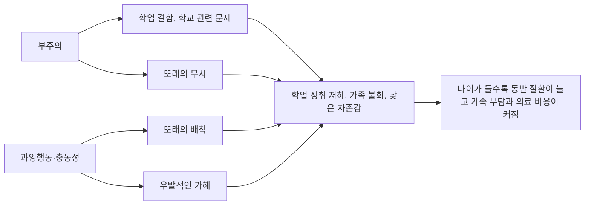



요약

한 가지에 주의를 오래 붙잡아 두지 못하고(부주의), 가만히 있지 못하며 생각보다 행동이 먼저 나가는(과잉행동·충동성) 상태가 어릴 때부터 집과 학교처럼 여러 곳에서 나타나는 장애다. 게으르거나 버릇이 없어서가 아니라, 행동에 브레이크를 거는 뇌의 기능이 약한 것이다. 자라면서 뛰어다니는 모습은 줄지만 부주의와 내적인 안절부절은 성인까지 이어지기도 한다. 약물과 인지행동치료를 함께 쓴다.

## 예시로 보기

여덟 살 JW는 수업 중 자꾸 자리에서 일어나 돌아다니고, 선생님의 질문이 끝나기도 전에 대답한다. 받아쓰기에서 아는 글자도 실수하고, 숙제를 시작해도 끝까지 하지 못하며, 준비물을 매일 잃어버린다. 집에서도 저녁 식사 동안 가만히 앉아 있지 못하고, 동생이 놀고 있으면 끼어들어 방해한다. 유치원 때부터 그랬다[^s1].

- 부주의: 부주의한 실수, 과제를 끝내지 못함, 물건을 잃어버림.
- 과잉행동·충동성: 자리 이탈, 성급한 대답, 끼어들기.
- 12세 이전, 학교와 집 두 곳 이상에서.
- 복합형.

## 정의

주의력결핍 과잉행동장애의 증상[^1]

**부주의(inattention)**
- 세부적인 면에 주의를 기울이지 못해 부주의한 실수를 한다.
- 지속적으로 주의를 집중하지 못한다.
- 경청하지 않는 것처럼 보인다.
- 지시를 끝까지 따르지 못하고 임무를 완수하지 못한다.
- 과제와 활동을 체계화하기 어렵다.
- 지속적인 정신적 노력이 필요한 과제를 피하고 싫어하거나 저항한다.
- 과제나 활동에 필요한 물건을 자주 잃어버린다.
- 외부 자극에 쉽게 산만해진다.
- 일상적인 활동을 자주 잊어버린다.

**과잉행동(hyperactivity)·충동성(impulsivity)**
- 손발을 만지작거리며 가만두지 못하거나 의자에 앉아서도 몸을 꿈틀거린다.
- 앉아 있어야 하는 상황에서 자리를 떠난다.
- 부적절하게 뛰어다니거나 기어오른다(좌불안석).
- 조용히 놀거나 여가 활동에 참여하지 못한다.
- 끊임없이 움직이거나 "태엽 풀린 자동차처럼" 행동한다.
- 지나치게 수다스럽게 말한다.
- 질문이 끝나기 전에 성급하게 대답한다.
- 자기 차례를 기다리지 못한다.
- 다른 사람의 활동을 방해하거나 침해한다.

- 증상이 12세 이전에 나타나고, 2가지 이상의 환경에서 존재한다.
- 유형: 복합형, 부주의 우세형, 과잉행동·충동성 우세형.

DSM-5-TR은 각 영역에서 6개 이상(17세 이상은 5개 이상)의 증상이 6개월 이상 이어져야 한다고 정한다[^s2].

## 임상적 특징[^2][^3][^4][^5]

- 핵심 증상은 부주의, 또는 과잉행동·충동성이다.
- 운동, 언어, 사회적 발달이 가볍게 지연되기도 한다.
- 정서 조절 곤란, 정서적 충동성, 좌절에 대한 인내력 부족.
- 청소년과 성인에게도 진단한다. 성인 ADHD는 시간 관리, 체계화와 조직화의 어려움, 잦은 이직, 대인관계 문제로 나타난다.
- 유병률은 아동 5%, 성인 2.5%. 남성이 더 많고, 과잉행동-충동형과 복합형에서 더 두드러진다.
- 발병은 3세 무렵이지만 대개 초등학교 입학 전까지는 진단하지 않는다.

### 나이에 따른 모습[^3]

| | 학령전기 | 초등학교 | 청소년기 | 성인기 |
|---|---|---|---|---|
| 주요 발현 | 과잉행동 | 부주의 | 만지작거림, 내적인 신경과민, 좌불안석, 참을성 부족 | 부주의, 좌불안석, 충동성 |
| 줄어드는 행동 | — | — | 과잉행동 | 과잉행동 |

- **부주의**는 학업 결함, 학교 관련 문제, 또래의 무시로 이어지고, **과잉행동·충동성**은 또래의 배척과 우발적인 가해로 이어진다.
- 학업 수행과 성취 저하, 가족 간의 불화와 부정적 상호작용, 낮은 자존감과 정서적 문제가 따른다.
- 품행장애, 반사회성 성격장애, 물질사용장애, 투옥, 부상과 사고의 가능성이 높아 전반적인 사망률이 높아진다.
- 나이가 들수록 동반 질환이 늘어나(아동기의 불안장애·틱장애·적대적 반항장애·품행장애에서, 성인기의 양극성장애·우울증·물질사용장애·성격장애까지) 가족의 부담과 의료 비용이 커진다.

두 증상 영역은 서로 다른 길로 문제를 만들지만, 결국 학업, 가족, 자존감의 문제로 모인다[^s3].

## 원인[^6]

- **유전적 요인:** 가족력이 대표적 취약성이다. 부모가 ADHD이면 자녀의 위험률이 57%다.
- **신경학적 요인:**
    - 출생 전후의 미세한 뇌손상, 출생 후 고열과 감염, 독성 물질, 대사 장애, 외상으로 인한 뇌손상.
    - 미세 두뇌기능 장애: 중추신경계의 뚜렷한 손상은 없지만 비정상적인 뇌파 같은 경미한 뇌손상.
    - 전두엽의 억제 기능 저하: 전두엽의 혈류와 신진대사가 줄어 있다.
    - 신경전달물질: 노르에피네프린과 도파민이 관여한다. 그래서 암페타민 같은 자극제가 증상 개선에 효과적이다.
- **취약성-스트레스 이론:** 아동의 과잉활동적 기질에 부모의 잘못된 양육 방식이 더해진다.

## 치료[^7][^8]

약물치료와 인지행동치료가 효과적이다.

- **약물치료:**
    - 중추신경자극제: 메틸페니데이트(콘서타, 메디키넷).
    - 비중추신경자극제: 아토목세틴, 클로니딘.
- **인지행동치료:**
    - 부모교육: 아이를 이해하고, 적절한 양육 행동을 배우고, 관계를 개선한다.
    - 행동치료: 체계적인 보상과 처벌로 바람직한 행동을 강화하고 부적응적 행동을 줄인다.
    - 인지치료: 생각과 문제해결 방식을 바꾼다. "소리 내어 생각하기(think aloud)"로 문제를 스스로 말로 표현하며 자기 행동을 조절하고, 네 단계로 생각한다: 문제가 뭐지? 어떻게 해야 하지? 계획대로 잘 되고 있나? 계획대로 잘 끝났나?
- **협동적 생활기술(Collaborative Life Skills, CLS):** 교사와 부모가 학교와 가정에서 함께 치료한다. 사회적 기술과 일상생활 기술을 12주 동안 훈련해, ADHD 증상, 숙제하기, 학교 적응이 뚜렷이 나아진다.

## 스스로 설명해 보기

1. "ADHD 아이에게 각성제 계열의 약을 준다."
   

근거

   ADHD는 전두엽의 억제 기능이 약하고 노르에피네프린·도파민 체계가 관여한다. 자극제는 이 신경전달물질을 늘려 전두엽의 억제 기능을 높이므로, 행동에 브레이크가 걸리고 주의가 유지된다.
   

2. "소리 내어 생각하기가 충동성을 줄인다."
   

근거

   충동성은 생각보다 행동이 먼저 나가는 것이다. 문제와 계획을 말로 표현하게 하면 행동 전에 생각하는 단계가 끼어들어, 약한 내적 억제를 바깥의 말이 대신한다.
   

3. "나이가 들수록 가족의 부담이 커진다."
   

근거

   과잉행동은 줄지만 부주의와 충동성이 남고, 동반 질환(우울, 물질사용장애, 성격장애)과 직업·성적 문제, 부상이 늘어 의료 비용과 대체 비용이 커진다.
   

- 이 장애의 핵심 아이디어는?
  

답

  유전적 취약성에 따른 전두엽 억제 기능과 도파민·노르에피네프린 체계의 약화가 부주의와 충동성을 낳는다. 의지나 양육만의 문제가 아니므로 약물로 억제 기능을 돕고, 행동·인지치료와 부모·교사의 협력으로 바깥에서 구조를 만들어 준다.
  

## 자주 하는 오해

"산만한 아이에게 각성제를 주면 더 흥분해서 날뛸 것이다"

틀렸다. "각성제"라는 이름 때문에 그럴듯하다. 하지만 ADHD의 문제는 흥분이 넘치는 것이 아니라 행동을 억제하는 전두엽의 기능이 약한 것이다. 메틸페니데이트 같은 중추신경자극제는 노르에피네프린과 도파민의 작용을 높여 이 억제 기능을 강화하므로, 오히려 주의가 유지되고 충동적 행동이 줄어든다[^6][^7].

## 확인 문제

<b>C1</b> ADHD의 두 증상 영역과 각 영역의 증상 셋 이상, 시작 나이와 환경 조건, 세 유형을 쓰라.

**답:** 부주의(부주의한 실수, 주의 지속 곤란, 경청하지 않는 듯함, 과제 미완수, 체계화 곤란, 정신적 노력 회피, 물건 분실, 산만함, 잊어버림), 과잉행동·충동성(만지작거림, 자리 이탈, 뛰어다님, 조용히 놀지 못함, 끊임없이 움직임, 수다, 성급한 대답, 차례 못 기다림, 방해). 12세 이전, 2가지 이상의 환경. 복합형, 부주의 우세형, 과잉행동·충동성 우세형.

<b>C2</b> 선생님의 지시를 따르지 않는 두 아이가 있다. KJ는 지시를 듣다가 창밖에 정신이 팔려 무엇을 하라고 했는지 잊는다. KK는 지시를 정확히 알아듣고도 "싫어요"라며 일부러 거부한다. 각각 무엇을 먼저 의심하는가?

**답:** KJ는 ADHD(부주의): 할 수 없어서, 곧 주의가 흩어져 지시를 놓친다. KK는 적대적 반항장애: 할 수 있는데 일부러 거부한다. 두 장애는 자주 함께 나타나므로 둘 다 평가한다.

<b>C3</b> 스물다섯 살 KL은 어릴 때 "산만하다"는 말을 들었고, 지금은 뛰어다니지는 않지만 마감을 늘 놓치고, 일을 체계적으로 하지 못해 1년에 두 번 직장을 옮겼다. 회의 중에도 속으로 안절부절못한다. 나이에 따른 모습의 표로 설명하라.

**답:** 성인 ADHD의 가능성이 있다. 성인기에는 과잉행동이 줄어드는 대신 부주의(마감, 체계화), 좌불안석(내적인 안절부절), 충동성이 주요 발현이다. 12세 이전에 증상이 있었는지, 여러 환경에서 나타나는지 확인한다.

[^1]: 이상 심리학 11회 강의 자료 「신경발달장애, 신경인지장애」, p.37
[^2]: 이상 심리학 11회 강의 자료 「신경발달장애, 신경인지장애」, p.38
[^3]: 이상 심리학 11회 강의 자료 「신경발달장애, 신경인지장애」, p.39
[^4]: 이상 심리학 11회 강의 자료 「신경발달장애, 신경인지장애」, p.40
[^5]: 이상 심리학 11회 강의 자료 「신경발달장애, 신경인지장애」, p.41 (발달 단계별 ADHD와 가족 부담 그림)
[^6]: 이상 심리학 11회 강의 자료 「신경발달장애, 신경인지장애」, p.42
[^7]: 이상 심리학 11회 강의 자료 「신경발달장애, 신경인지장애」, p.43
[^8]: 이상 심리학 11회 강의 자료 「신경발달장애, 신경인지장애」, p.44
[^s1]: 보충 JW의 사례는 두 영역의 증상과 조건을 보이려고 만든 가상 사례다.
[^s2]: 보충 DSM-5-TR 주의력결핍 과잉행동장애 기준 A의 개수(6개, 17세 이상 5개)와 기간(6개월)을 보탰다.
[^s3]: 보충 다이어그램 1개는 원본에 없다. '나이에 따른 모습' 아래 목록(p.39~41)을 흐름으로 이었다. 가운데 상자로 모으는 화살표는 목록의 순서를 따른 정리다.

