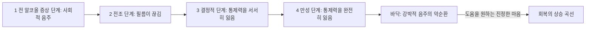



요약

술 때문에 일, 가정, 건강에 문제가 생기는 것을 알면서도 조절하지 못하고 계속 마시는 상태가 알코올 사용장애다. 같은 효과를 얻으려고 점점 더 마시고(내성), 끊으면 손이 떨리고 잠을 못 이룬다(금단). 가장 흔한 정신장애 가운데 하나이지만, 본인은 문제를 잘 인정하지 않아 의지만으로 벗어나기 어렵다. 회복한 사람 대부분은 한 모금만으로도 다시 폭음으로 돌아가므로 완전한 금주가 목표가 된다.

## 예시로 보기

40대 JF는 지난 1년 동안 "한 잔만"이라며 시작해 매번 한 병 넘게 마셨다(1). 술을 줄이겠다고 여러 번 다짐했지만 실패했다(2). 퇴근하면 술 생각이 간절하고(4), 숙취로 지각이 잦아 경고를 받았다(5). 술 문제로 아내와 자주 다투고(6), 주말마다 하던 등산 모임도 그만두었다(7). 예전보다 훨씬 많이 마셔야 취기가 돌고(10), 아침에 손이 떨려 해장술을 마신다(11)[^s1].

- 11개 기준 가운데 8개: 중증 알코올 사용장애(6개 이상).
- 내성과 금단이 함께 있다.

## 정의

### 알코올 관련 장애의 구분[^1]

- **알코올 사용장애:** 알코올 사용으로 생기는 부적응적 문제.
- **알코올 유도성 장애:** 알코올 중독(과음으로 심하게 취한 상태의 문제), 알코올 금단(계속 마시던 술을 끊거나 줄였을 때의 문제), 알코올 유도성 정신장애(불안장애, 우울장애 등).

알코올 사용장애의 진단기준[^2]

문제적 알코올 사용 양상이 지난 12개월 동안 다음 가운데 최소 2개로 나타난다.
1. 의도한 것보다 더 많은 양을, 또는 더 오랜 기간 마신다.
2. 술을 줄이거나 조절하려는 욕구가 있거나, 그런 노력에 실패한다.
3. 술을 구하고, 마시고, 그 효과에서 벗어나는 데 많은 시간을 쓴다.
4. 술에 대한 갈망, 강한 바람, 욕구.
5. 반복적인 음주로 직장, 학교, 가정에서 역할을 하기 어렵다.
6. 술의 효과로 대인관계 문제가 반복된다.
7. 술 때문에 중요한 사회적·직업적·여가 활동을 포기한다.
8. 신체적으로 위험한 상황에서도 반복해서 마신다.
9. 지속적·반복적으로 신체적·심리적 문제가 있음을 알면서도 계속 마신다.
10. 내성: 같은 효과를 얻으려고 더 많이 마시거나, 같은 양의 효과가 뚜렷이 줄어든다.
11. 금단: 알코올 특유의 금단 증후군, 또는 금단을 피하려고 마신다.

심각도: 경도 2~3개, 중등도 4~5개, 중증 6개 이상.

알코올 중독(intoxication)[^3]

A. 최근의 알코올 섭취. 
B. 섭취 중이나 직후의 임상적으로 심각한 문제적 행동 변화와 심리적 변화(예: 부적절한 성적 또는 공격적 행동, 기분 변동, 판단력 손상). 
C. 섭취 중이나 직후에 다음 가운데 1가지 이상: 불분명한 말, 운동 조정 장해, 불안정한 걸음, 안구진탕, 집중력·기억력 손상, 혼미 또는 혼수.

알코올 금단(withdrawal)[^4]

술을 마시다가 중단하거나 줄인 지 몇 시간에서 며칠 안에 다음 가운데 2가지 이상이 나타난다: 자율신경계 항진(땀 또는 맥박 100회 이상), 손 떨림, 불면, 오심 또는 구토, 일시적인 환각이나 착각, 정신운동 초조, 불안, 대발작.

## 임상적 특징[^5][^6]

- **신체적 황폐화:** 영양실조, 코르사코프 증후군(심한 기억장애), 태아알코올증후군.
- **심리적 황폐화:** 죄의식, 자기혐오, 피해의식.
- **가족관계 악화:** 음주할 때는 폭언, 폭행, 추태로 가족을 괴롭히고, 금주할 때는 가족이 언제 다시 터질지 모르는 긴장 속에 산다. 이 패턴 속에 기념일과 가족행사 같은 가족 의식이 무너지고 가족관계가 와해된다.
- 다음 세대로 이어질 가능성, 다른 물질 문제의 가능성.
- 사고, 폭력, 신체 질병, 자살과 관련이 높다.
- 유병률이 높다. 미국 성인 평생유병률 29.1%, 한국 성인 평생유병률 11.6%(국립정신건강센터, 2022). 남성이 더 많다.
- 발병 시기는 대부분 30대 후반이다. 관해와 재발을 자주 되풀이하며 경과가 다양하다.

### 발전 과정: 옐리네크(Jellinek, 1952)의 4단계[^7][^8]

| 단계 | 특징 |
|---|---|
| 1. 전 알코올 증상 단계 | 사회적 음주. 긴장 해소, 관계 증진(대부분의 음주자) |
| 2. 전조 단계 | 문제성 음주, 필름이 끊김(blackout). 술에 매력을 느끼고, 음주량·빈도·마시는 속도가 점점 늘어난다 |
| 3. 결정적 단계 | 음주 통제력을 서서히 잃는다(일부는 유지). 아침 음주, 혼자 마시기, 과음으로 가정과 직장에 심각한 문제 |
| 4. 만성 단계 | 통제력을 완전히 잃고, 내성과 금단이 심하다. 외모와 사회 적응에 무관심. 영양실조, 신체 질병 |

옐리네크 곡선은 이 하강 곡선의 바닥(강박적 음주의 악순환)에서 "도움을 원하는 진정한 마음"을 계기로 회복의 상승 곡선으로 올라가는 모습까지 그린다[^8].

곡선은 4단계까지 내려가다 바닥에서 방향을 바꾼다. 방향을 바꾸는 계기는 본인이 도움을 원하는 것이다[^s5].

## 원인[^9][^10][^11]

| 입장 | 설명 |
|---|---|
| 생물학적 | 유전: 가족의 공병률이 높다. 알코올 신진대사: 알코올 분해 능력이 우수한 사람이 더 많이 마시게 된다 |
| 알코올 성격 | 충동성, 공격성, 정서적 불안정, 적개심, 욕구 불만에 대한 낮은 인내력. 스트레스 상황에서 불편감을 피하거나 스스로 약을 먹듯(자가 투약) 마신다. 그래서 적절한 대처 기제가 발달하지 못한다 |
| 정신분석 | 구강기 고착 성격(구강기의 자극 결핍이나 과잉). 무의식적 자기파괴 행위: 내면화된 나쁜 어머니를 파괴한다 |
| 행동주의 | 음주는 학습된 행동이다. 고전적 조건형성, 조작적 조건형성(정적 강화: 기분이 좋아짐, 부적 강화: 긴장과 불안이 사라짐), 모델링(대리학습) |
| 인지 | 음주기대 이론(alcohol expectancy theory): 술에 대한 긍정적 기대와 신념. "기분이 좋아질 것이다"(긍정적 정서), "사람들과 잘 어울리게 될 것이다"(사교적 촉진), "성적으로 더 왕성해질 것이다"(성기능 강화) |
| 사회문화 | 가족과 또래의 음주, 술에 관대한 문화(대한민국의 술 문화), 불안정한 가정환경, 낮은 사회경제적 지위 |

슬라이드는 알코올 신진대사 항목 옆에 "클로닝거(Cloninger)의 제2형 알코올 의존"을 적는다. 클로닝거의 제2형은 보통 이른 발병, 남성, 강한 유전성, 새로움 추구와 반사회적 경향으로 정의되어, 분해 능력과의 연결은 확인이 필요하다[^s2] [확인필요].

## 치료[^12][^13][^14][^15]

- 개인의 의지로 치료하기는 어렵다. 자기 문제를 잘 인정하지 않기 때문이다. 치료에서 가장 중요한 것은 자기 음주 문제의 심각성을 얼마나 받아들이느냐다.
- 치료보다 예방이 중요하다.
- 치료 목표를 금주로 할지 절주로 할지 정한다.
- **장애가 심할 때: 입원치료.** 금단증상 때문에 생기는 술의 유혹을 막고 약물치료를 한다.
- **장애가 가벼울 때: 심리치료.**
    - 음주를 부르는 심리사회적 갈등을 탐색하고 해소한다.
    - 동기강화면담.
    - 가족 역동에 초점을 두고, 무너진 가족 의식을 되살리며 가족관계를 다시 세운다.
    - 인지행동적 접근: 스트레스 대처훈련, 사회기술훈련, 의사소통훈련, 감정표현훈련, 부부관계증진훈련, 자기주장훈련.
    - 외래 약물치료는 금단 현상에 도움이 된다.
- **행동치료: 혐오치료.** 술과 혐오 자극을 짝짓는다. 술을 마시는 장면을 상상한 뒤 구토를 떠올리게 해 조건형성하기도 한다.

원본 오류 의심

원문: "술에 구토제(예: 안타부스)를 주입하여 술냄새만 맡아도 구토, 오심 일어나게 함"(p.61) / 문제점: 안타부스(디설피람)는 구토제가 아니고 술에 넣는 약도 아니다. 매일 먹는 약으로, 알코올 분해 효소(알데하이드 탈수소효소)를 막아 복용 중 술을 마시면 아세트알데하이드가 쌓여 오심, 구토, 얼굴 붉어짐이 생긴다. 술과 구토를 반복해 짝지어 "냄새만 맡아도 구토"하게 만드는 혐오 조건형성에는 에메틴 같은 구토 유도제를 쓴다. / 수정안: "술과 구토 유도제(예: 에메틴)를 짝지어 술 냄새만 맡아도 오심이 나게 조건형성한다. 안타부스는 복용 중 음주 시 불쾌한 반응을 일으켜 음주를 억제하는 약이다." / 근거: 디설피람의 약리 작용[^s3].

- **자조집단: 익명의 알코올 중독자 모임(Alcoholics Anonymous, AA).** 금주를 목표로 하는 자조집단이다. 익명으로 정기적으로 모여 경험을 나누고, 알코올 의존을 극복하는 방법을 알려 주고 서로 지원한다. 슬로건은 "당신을 취하게 하는 것은 첫 번째 잔이다."
- **회복 뒤:** 대부분 한 모금만으로도 폭음이 재발하므로, 완전히 금주해야 하는 사람이 대부분이다. 처음 몇 년은 술 없이 불안, 초조, 우울을 느끼며 괴로울 수 있다. 술 때문에 잃어버렸던 일상의 작은 것들에서 즐거움과 의미를 찾는 것이 중요하고, 가족과 친구의 애정 어린 지지가 꼭 필요하다.

## 스스로 설명해 보기

1. "스트레스를 받을 때 마시는 술이 알코올 사용장애를 키운다."
   

근거

   술이 긴장과 불안을 없애 주면 부적 강화로 음주가 늘어난다(행동주의). 자가 투약처럼 술에 기대면 다른 대처 기제가 발달하지 못해, 스트레스마다 술이 유일한 해결책이 된다(알코올 성격).
   

2. "회복한 사람에게는 절주보다 금주가 목표가 된다."
   

근거

   회복 뒤에도 대부분 한 모금만으로 폭음이 재발한다. 첫 잔이 통제력 상실의 방아쇠가 되므로("당신을 취하게 하는 것은 첫 번째 잔이다") 첫 잔을 마시지 않는 것이 현실적인 목표다.
   

3. "금주 시기에도 가족은 괴롭다."
   

근거

   음주 시기의 폭언과 폭행을 겪은 가족은 금주 시기에도 언제 다시 터질지 모르는 긴장 속에 산다. 이 반복이 가족 의식을 무너뜨리므로 치료에 가족 역동과 가족관계의 재정립이 들어간다.
   

- 이 장애의 핵심 아이디어는?
  

답

  술이 주는 즉각적인 보상(좋은 기분, 긴장 해소)과 긍정적 기대가 음주를 강화하고, 내성과 금단이 생리적으로 음주를 붙잡으며, 본인의 부인이 도움을 막는다. 그래서 문제의 수용, 동기 강화, 금주, 가족과 자조집단의 지지가 함께 필요하다.
  

## 자주 하는 오해

"술을 끊었던 사람도 이제는 조절해서 한두 잔은 괜찮다"

틀렸다. 회복했으니 조절할 수 있을 것 같아 그럴듯하다. 하지만 알코올 중독에서 회복한 사람은 대부분 한 모금만으로도 폭음이 재발하며, 완전히 금주해야 하는 사람이 대부분이다[^15]. AA가 첫 번째 잔을 경계하는 이유다. 치료 목표로 절주를 고려하는 것은 장애가 가볍고 아직 통제력이 남은 경우에 한정된다.

## 확인 문제

<b>C1</b> JG는 지난 1년 동안 의도보다 많이 마셨고, 줄이려다 실패했으며, 술 때문에 아내와 자주 싸우고, 음주운전을 두 번 했다. 내성과 금단은 없다. 해당하는 기준의 개수와 심각도는?

**답:** 의도보다 많이(1), 조절 실패(2), 대인관계 문제의 반복(6), 신체적으로 위험한 상황에서의 음주(8)로 4개, 중등도(4~5개). 흔한 오답은 "내성과 금단이 없으니 장애가 아니다"다. 내성과 금단은 11개 기준 가운데 둘일 뿐 필수가 아니다.

<b>C2</b> (a) 회식에서 과음해 말이 꼬이고 비틀거리다 넘어졌다 (b) 매일 마시던 술을 병원 입원으로 끊은 다음 날 땀을 흘리며 손이 떨리고 잠을 못 잔다 (c) 문제를 알면서도 1년째 조절하지 못하고 마신다. 각각 무엇인가?

**답:** (a) 알코올 중독(intoxication): 최근 섭취 직후의 행동 변화와 불분명한 말, 불안정한 걸음. (b) 알코올 금단: 중단 후 몇 시간~며칠 안의 자율신경 항진, 손 떨림, 불면. (c) 알코올 사용장애.

<b>C3</b> 음주기대 이론으로 볼 때, 술을 마시지 않았는데도 "술을 마셨다"고 믿은 사람이 더 사교적으로 행동할 수 있는 이유와, 이 이론이 치료에 주는 시사점을 쓰라.

**답:** 행동을 바꾸는 것이 알코올의 약리 작용만이 아니라 "술을 마시면 잘 어울리게 된다"는 기대와 신념이기 때문이다. 그래서 치료에서는 술에 대한 긍정적 기대(기분 향상, 사교적 촉진, 성기능 강화)를 찾아 현실적으로 재평가하고, 술 없이 그 기대를 채우는 방법(사회기술훈련, 감정표현훈련)을 익히게 한다[^s4].

<b>C4</b> 옐리네크의 4단계를 순서대로 쓰고, 각 단계의 대표 특징을 하나씩 쓰라.

**답:** 전 알코올 증상 단계(사회적 음주, 긴장 해소), 전조 단계(필름이 끊김, 음주량·빈도·속도 증가), 결정적 단계(통제력 상실의 시작, 아침 음주, 혼자 마시기), 만성 단계(통제력 완전 상실, 심한 내성과 금단, 신체 질병).

[^1]: 4-1학기/이상 심리학/1.수업자료/10.파괴적, 충동조절 및 품행장애, 물질관련 및 중독장애.pdf, p.48
[^2]: 4-1학기/이상 심리학/1.수업자료/10.파괴적, 충동조절 및 품행장애, 물질관련 및 중독장애.pdf, p.49
[^3]: 4-1학기/이상 심리학/1.수업자료/10.파괴적, 충동조절 및 품행장애, 물질관련 및 중독장애.pdf, p.50
[^4]: 4-1학기/이상 심리학/1.수업자료/10.파괴적, 충동조절 및 품행장애, 물질관련 및 중독장애.pdf, p.51
[^5]: 4-1학기/이상 심리학/1.수업자료/10.파괴적, 충동조절 및 품행장애, 물질관련 및 중독장애.pdf, p.52
[^6]: 4-1학기/이상 심리학/1.수업자료/10.파괴적, 충동조절 및 품행장애, 물질관련 및 중독장애.pdf, p.53
[^7]: 4-1학기/이상 심리학/1.수업자료/10.파괴적, 충동조절 및 품행장애, 물질관련 및 중독장애.pdf, p.54
[^8]: 4-1학기/이상 심리학/1.수업자료/10.파괴적, 충동조절 및 품행장애, 물질관련 및 중독장애.pdf, p.55 (옐리네크 곡선, Addiction and Recovery)
[^9]: 4-1학기/이상 심리학/1.수업자료/10.파괴적, 충동조절 및 품행장애, 물질관련 및 중독장애.pdf, p.56
[^10]: 4-1학기/이상 심리학/1.수업자료/10.파괴적, 충동조절 및 품행장애, 물질관련 및 중독장애.pdf, p.57
[^11]: 4-1학기/이상 심리학/1.수업자료/10.파괴적, 충동조절 및 품행장애, 물질관련 및 중독장애.pdf, p.58
[^12]: 4-1학기/이상 심리학/1.수업자료/10.파괴적, 충동조절 및 품행장애, 물질관련 및 중독장애.pdf, p.59
[^13]: 4-1학기/이상 심리학/1.수업자료/10.파괴적, 충동조절 및 품행장애, 물질관련 및 중독장애.pdf, p.60
[^14]: 4-1학기/이상 심리학/1.수업자료/10.파괴적, 충동조절 및 품행장애, 물질관련 및 중독장애.pdf, p.61
[^15]: 4-1학기/이상 심리학/1.수업자료/10.파괴적, 충동조절 및 품행장애, 물질관련 및 중독장애.pdf, p.62
[^s1]: 에이전트 보충. JF의 사례는 11개 기준의 번호를 짚으려고 만든 가상 사례다.
[^s2]: 에이전트 보충. 클로닝거(Cloninger, 1981)의 유형론에서 제1형은 늦은 발병·환경 영향·불안 성향, 제2형은 이른 발병·남성 한정·높은 유전성·새로움 추구와 반사회적 행동이 특징이다. 출처: Cloninger, Bohman & Sigvardsson(1981), "Inheritance of alcohol abuse: cross-fostering analysis of adopted men", *Archives of General Psychiatry* 38(8), 861–868. 슬라이드가 이 유형을 왜 분해 능력 옆에 적었는지는 강의 확인이 필요하다.
[^s3]: 에이전트 보충. 디설피람은 알데하이드 탈수소효소를 억제하는 약으로, 음주 시 아세트알데하이드가 쌓여 불쾌 반응(디설피람-알코올 반응)을 일으킨다. 혐오 조건형성에서 구토 유도제로 에메틴을 쓴 역사가 있다.
[^s4]: 에이전트 보충. "마셨다고 믿기만 해도 행동이 바뀐다"는 예는 음주기대 연구의 위약 음료(balanced placebo) 실험 결과를 요약했다. 원본 범위를 넘는 문항이다.
[^s5]: 에이전트 보충. 다이어그램 1개는 원본에 없다. 옐리네크의 4단계 표(p.54)와 p.55의 옐리네크 곡선 설명을 흐름도로 옮겼다.

