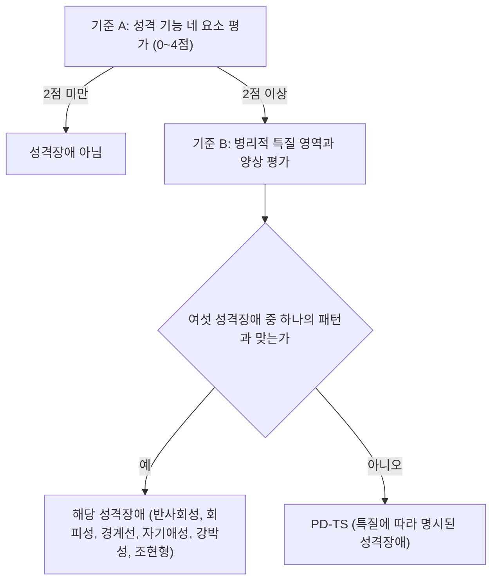



요약

기존 진단이 "열 개의 상자 중 어디에 들어가나"를 묻는다면, 대안 모델은 "성격이 얼마나 제 기능을 하나"와 "어떤 특질이 얼마나 강한가"를 눈금으로 잰다. 성격장애를 자기와 대인관계라는 성격 기능이 상당히 손상되고, 병리적인 성격 특질이 함께 있는 상태로 정의한다. 상자와 눈금을 함께 쓰는 혼용 모델이라, 경계에 걸친 사람과 여러 상자에 동시에 들어가는 사람을 더 잘 기술한다. 다만 DSM-5-TR의 공식 진단은 여전히 열 가지 범주를 쓰고, 이 모델은 대안으로 함께 실려 있다.

## 예시로 보기

MF는 남의 반응에 따라 자기 가치가 크게 흔들리고, 인생 목표가 몇 달마다 바뀐다. 가까운 사람의 감정을 헤아리기 어렵고, 관계가 깊어지면 불안해서 상대를 밀어낸다. 감정 기복이 심하고, 충동적으로 돈을 쓰며, 버림받을까 봐 늘 불안하다[^s1].

| 단계 | MF에게 적용 | 대응하는 기준 |
|---|---|---|
| 1. 성격 기능 | 정체성(자기 가치의 흔들림), 자기주도성(목표가 계속 바뀜), 공감(감정을 헤아리기 어려움), 친밀감(가까워지면 밀어냄)이 모두 "상당한 손상"(2점) | 기준 A 충족 |
| 2. 병리적 특질 | 감정 기복, 불안, 버림받음의 불안(부정적 정서성), 충동성(탈억제) | 기준 B 충족 |
| 3. 특정 성격장애 | 이 특질 조합이 경계선 성격장애의 패턴과 맞는다 | 경계선 성격장애 |
| 3'. 맞는 패턴이 없다면 | A와 B는 채우지만 여섯 장애 어디에도 맞지 않을 때 | 특질에 따라 명시된 성격장애(PD-TS) |

기존 범주 모델에서 MF는 "경계선 성격장애"라는 이름 하나로 기술된다. 대안 모델에서는 손상의 수준(2점)과 특질 프로필이 함께 남는다. 추상화하면서 버리는 것은 개별 행동 목록이고, 남기는 것은 기능 수준과 특질의 강도다.

## 정의

### 기존 범주 모델의 한계[^1]

1. 행동적 측면만을 강조해 진단한다.
2. 공병률이 높다. 한 사람이 여러 성격장애에 동시에 진단될 수 있다.
3. 같은 성격장애로 진단된 환자들끼리도 모습이 크게 다르다(이질성).
4. 이분법적 진단이다. 실제 성격 특성은 연속선 위에 분포하는데, 경계선에 걸친 문제를 놓칠 수 있다.

### 대안 모델의 특징[^2][^3]

- 성격의 5요인 이론을 적극적으로 반영해 진단기준에 넣었다.
- 범주적 분류와 차원적 분류를 함께 쓰는 혼용 모델(hybrid model)이다.
- 성격장애를 성격 기능의 손상과 병리적 성격 특질로 정의한다.
- 성격장애를 여섯 가지로 줄였다: 반사회성, 회피성, 경계선, 자기애성, 강박성, 조현형(분열형). 여기에 들지 않으면 특질에 따라 명시된 성격장애(Personality Disorder-Trait Specified, PD-TS)로 진단할 수 있다.
- 여섯 성격장애의 세부 진단기준은 심각도에 따라 평정한다.

| | DSM-5 범주 모델 | 대안 모델 |
|---|---|---|
| 범주적 분류 | A군: 편집성, 조현성, 조현형 / B군: 반사회성, 연극성, 자기애성, 경계선 / C군: 강박성, 회피성, 의존성 | 반사회성, 경계선, 자기애성, 조현형, 강박성, 회피성 (+ PD-TS). 성격 5요인과 병리적 성격 특질에 따라 |
| 차원적 분류 | 없음 | 성격 기능의 요소별 수준(0~4점)을 구분하고, 상당한(중등도) 수준 이상의 손상이면 성격장애로 진단 |

원본 오류 의심

원문: p.72 "성격기능의 요소별 0~5점 수준 구분" / 문제점: 같은 강의 p.74는 척도를 "0-손상 없음, 1-약간의 손상, 2-상당한 손상, 3-심각한 손상, 4-극심한 손상"의 다섯 단계로 적는다. 가장 높은 점수는 4점이다. / 수정안: 0~4점(다섯 단계) / 근거: p.74의 척도 정의, DSM-5-TR 성격 기능 수준 척도(Level of Personality Functioning Scale)의 0~4 수준.

### 일반 진단기준[^4]

성격장애 = 성격 기능의 결함 + 병리적 성격 특질.

- **A.** 자기와 대인관계를 포함한 성격 기능의 상당한 또는 심각한 손상.
- **B.** 한 개 이상의 병리적 성격 특질. — 병이 될 만큼 지나치게 강한 성격 경향이 하나 이상 있다.
- **C.** 성격 기능의 손상과 성격 특질의 표현이 개인적·사회적 상황 전반에 걸쳐 광범위하고 경직되게 나타난다.
- **D.** 성격 기능의 손상과 성격 특질의 표현이 시간적으로 상당히 안정되어 있고, 시작은 적어도 청소년기나 초기 성인기로 거슬러 올라간다.
- 이 밖에 다른 정신장애, 신체 질병, 물질의 생리적 효과로 생긴 것이 아니어야 하고, 발달 단계나 사회문화적 환경을 고려했을 때 정상으로 볼 수 없어야 한다.

원본 오류 의심

원문: p.73 기준 D "그 시작은 적어도 청소년기나 초기 아동기로 거슬러 올라갈 수 있다" / 문제점: DSM-5 대안 모델의 기준 D는 "adolescence or early adulthood", 곧 청소년기나 초기 **성인기**다. 같은 강의 p.3의 일반 진단기준도 "청소년기나 성인기에 시작"으로 적는다. / 수정안: 청소년기나 초기 성인기 / 근거: DSM-5-TR 3편 대안 모델의 일반 기준 D, p.3과의 일관성.

### 기준 A: 성격 기능의 수준[^5]

자기와 대인관계에서의 부적응 정도를 다섯 단계로 평가한다.

| 영역 | 요소 |
|---|---|
| 자기 | 정체성, 자기주도성 |
| 대인관계 | 공감, 친밀감 |

| 점수 | 0 | 1 | 2 | 3 | 4 |
|---|---|---|---|---|---|
| 수준 | 손상 없음 | 약간의 손상 | 상당한 손상 | 심각한 손상 | 극심한 손상 |

상당한 손상(2점) 이상이면 성격장애로 진단한다.

### 기준 B: 병리적 성격 특질[^5]

- **5가지 특질 영역(trait domain):** 부정적 정서성, 애착상실, 적대성, 탈억제, 정신병적 경향성.
- **25개의 특질 양상(trait facet).**

다섯 특질 영역은 성격 5요인의 부적응적인 극단에 대응한다[^s2].

| 특질 영역 | 대응하는 5요인 |
|---|---|
| 부정적 정서성(negative affectivity) | 신경증(정서적 불안정)의 높은 끝 |
| 애착상실(detachment) | 외향성의 낮은 끝 |
| 적대성(antagonism) | 우호성의 낮은 끝 |
| 탈억제(disinhibition) | 성실성의 낮은 끝 |
| 정신병적 경향성(psychoticism) | 개방성과 연결되지만 대응이 약하다 |

### 진단의 흐름

기준 C와 D(만연함과 지속성), 배제 조건은 모든 경로에 공통으로 적용한다[^s3].

## 치료 목표로 이어지는 점[^6]

성격장애를 성격의 핵심 기능(자기, 대인관계)의 결함으로 보므로, 치료 목표도 그 네 요소에 맞춰진다. 더 분명한 자기정체감(정체성)을 갖고, 건설적인 삶의 목표를 향해 주도적으로 살며(자기주도성), 다른 사람의 마음에 더 잘 공감하고(공감), 친밀한 관계를 맺는 능력(친밀감)을 키운다.

## 스스로 설명해 보기

1. "대안 모델은 혼용 모델이다."
   

근거

   여섯 성격장애와 PD-TS라는 이름(범주)을 남기면서, 성격 기능은 0~4점의 수준으로, 특질은 영역과 양상의 강도로 잰다(차원). 기술은 차원으로 하고 진단의 결정은 절단점(2점 이상)과 패턴 일치로 한다.
   

2. "대안 모델은 같은 진단을 받은 환자들의 이질성 문제를 줄인다."
   

근거

   범주 모델에서는 9개 중 5개를 채우는 조합이 많아, 같은 경계선 성격장애라도 겹치는 증상이 거의 없을 수 있다. 대안 모델은 진단명과 함께 기능 수준과 특질 프로필을 기록하므로 같은 이름 안의 차이가 드러난다.
   

3. "기준 A 없이 기준 B만으로는 성격장애가 아니다."
   

근거

   병리적 특질이 강해도 자기와 대인관계의 기능이 유지되면(2점 미만) 개성의 범위다. 성격장애 = 기능의 결함 + 특질이라는 정의의 두 항이 모두 필요하다.
   

- 이 모델의 핵심 아이디어는?
  

답

  "무엇이 문제인가"(특질)와 "얼마나 문제인가"(기능 수준)를 분리해 각각 잰다는 것이다.
  

## 연결

- 범주와 차원의 일반론: [범주적 분류와 차원적 분류 비교](/Hongs_Blog/studies/abnormal-psychology/categorical-vs-dimensional/)
- 범주 모델의 열 가지 성격장애와 일반 기준: [성격장애](/Hongs_Blog/studies/abnormal-psychology/personality-disorders/)
- DSM의 구성: [정신장애와 DSM](/Hongs_Blog/studies/abnormal-psychology/mental-disorder-dsm/)

## 자주 하는 오해

"DSM-5부터 성격장애는 여섯 가지로 줄었다"

틀렸다. 대안 모델이 여섯 가지와 PD-TS를 쓰기 때문에 그렇게 기억하기 쉽다. 그러나 DSM-5와 DSM-5-TR의 공식 진단 체계는 여전히 A·B·C군의 열 가지 범주를 쓴다. 대안 모델은 추가 연구가 필요한 모델로 함께 실린 것이다. 확인할 때는 "편집성, 조현성, 연극성, 의존성"이 공식 진단명으로 남아 있는지 보면 된다[^s4].

## 확인 문제

<b>C1</b> 대안 모델에서 성격장애를 정의하는 두 요소를 쓰고, 기준 A의 네 요소와 진단의 절단점을 쓰라.

**답:** 성격 기능의 결함(기준 A) + 병리적 성격 특질(기준 B). 기준 A의 요소: 자기(정체성, 자기주도성), 대인관계(공감, 친밀감). 0~4점 가운데 상당한 손상(2점) 이상이면 성격장애.

**흔한 오답:** 척도를 0~5점으로 쓰는 것. 다섯 단계(0~4점)다.

<b>C2</b> 대안 모델의 다섯 특질 영역과 특질 양상의 수, 대안 모델이 남긴 여섯 성격장애를 쓰라.

**답:** 부정적 정서성, 애착상실, 적대성, 탈억제, 정신병적 경향성. 25개의 특질 양상. 반사회성, 회피성, 경계선, 자기애성, 강박성, 조현형(+ PD-TS).

**흔한 오답:** 여섯 가지에 편집성이나 의존성을 넣는 것. 이 둘과 조현성, 연극성은 대안 모델에서 빠졌다.

<b>C3</b> 기존 범주 모델의 한계 네 가지를 쓰고, 대안 모델이 각각을 어떻게 보완하는지 쓰라.

**답:** (1) 행동만 강조 → 자기와 대인관계라는 성격 기능을 평가한다. (2) 높은 공병률 → 특질 프로필로 한 사람을 기술하고 장애 수를 여섯으로 줄였다. (3) 같은 진단 안의 이질성 → 기능 수준과 특질 강도를 함께 기록한다. (4) 이분법적 진단 → 0~4점의 차원적 평정으로 경계선에 걸친 문제를 포착한다.

<b>C4</b> 다섯 특질 영역을 성격 5요인의 어느 쪽 극단에 대응시킬 수 있는지 쓰라.

**답:** 부정적 정서성 ↔ 신경증의 높은 끝, 애착상실 ↔ 외향성의 낮은 끝, 적대성 ↔ 우호성의 낮은 끝, 탈억제 ↔ 성실성의 낮은 끝, 정신병적 경향성 ↔ 개방성(대응이 약하다).

[^1]: 4-1학기/이상 심리학/1.수업자료/12.성격장애.pdf, p.70
[^2]: 4-1학기/이상 심리학/1.수업자료/12.성격장애.pdf, p.71
[^3]: 4-1학기/이상 심리학/1.수업자료/12.성격장애.pdf, p.72. 대안 모델 칸의 "분열형"은 조현형의 예전 이름이다.
[^4]: 4-1학기/이상 심리학/1.수업자료/12.성격장애.pdf, p.73
[^5]: 4-1학기/이상 심리학/1.수업자료/12.성격장애.pdf, p.74. 기준 A와 B를 잇는 빨간 괄호 손글씨 필기가 있다.
[^6]: 4-1학기/이상 심리학/1.수업자료/12.성격장애.pdf, p.5. 대안 모델 줄에 빨간 체크 손글씨 필기가 있다.
[^s1]: 에이전트 보충. MF의 사례와 표는 대안 모델의 진단 단계를 보이려고 만든 가상 예다. 경계선 성격장애의 대안 모델 기준은 특질 양상(정서 불안정, 불안, 분리 불안정, 우울, 충동성, 위험 감수, 적대감) 가운데 여러 개를 요구한다.
[^s2]: 에이전트 보충. DSM-5-TR 3편은 다섯 특질 영역을 성격 5요인 모델 영역의 부적응적 변형으로 설명한다. 정신병적 경향성과 개방성의 대응은 연구마다 결과가 달라 약하다고 적었다.
[^s3]: 에이전트 보충. 진단의 흐름 그림은 p.71~74의 내용을 순서도로 옮긴 것이다.
[^s4]: 에이전트 보충. DSM-5와 DSM-5-TR은 이 모델을 3편 "새로 등장한 척도와 모델"에 싣고, 2편의 공식 진단은 열 가지 성격장애를 유지한다. 슬라이드 p.6의 제목도 "성격장애의 종류(DSM-5-TR)"로 열 가지를 적는다.

