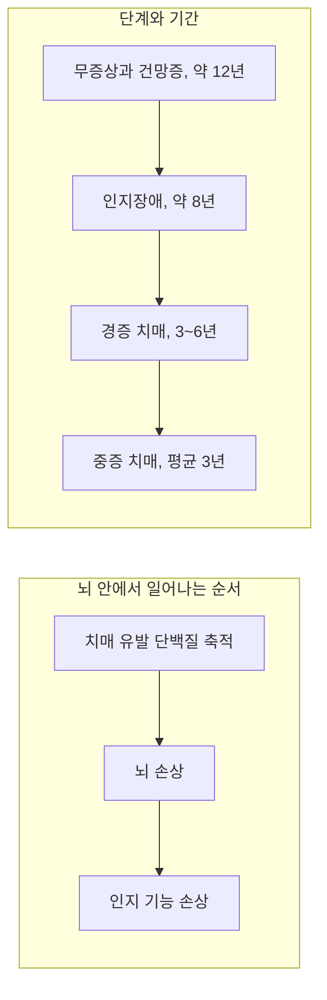



요약

치매의 절반 이상을 차지하는 가장 흔한 원인이다. 뇌에 비정상 단백질 찌꺼기가 쌓이고 신경세포가 죽어 가면서, 방금 한 일부터 잊기 시작해 길 찾기, 말, 옷 입기까지 수년에 걸쳐 차례로 무너진다. 증상이 나타나기 10년 이상 전부터 뇌의 변화가 시작된다. 아직 망가진 뇌를 되살리는 치료는 없고, 약과 생활 지원으로 진행을 늦추고 삶의 질을 지키는 것이 목표다.

## 예시로 보기

일흔 살 LA는 3년 전 의욕이 떨어지고 최근 일을 자주 잊었다. 이듬해에는 날짜를 헷갈리고 익숙한 동네에서 길을 잃었으며, 지갑을 누가 훔쳐 갔다고 의심했다. 올해는 단추를 채우지 못하고 가족 이름이 헷갈린다. 딸은 가족사진과 이름, 하루 일과를 적은 작은 앨범을 만들어 LA의 주머니에 넣어 두었다[^s1].

- 초기: 의욕 저하, 가까운 기간의 기억 장애, 시간 지남력 장애.
- 중기로 가며: 공간 지남력 장애, 망상(도둑 망상), 실행 기능 장애.
- 기억 지갑: 심리사회적 치료.

## 위험 요인[^1]

- **연령:** 65세 이상에서 가장 흔히 시작한다.
- **성별:** 여성이 걸릴 가능성과 증상이 심할 가능성이 더 크다.
- **유전:** 일부 가족에서 발병률이 높다(40~70%).
- **교육 수준.**

## 진행[^2]

인지 기능이 정상 노화보다 훨씬 빠르게 떨어진다.

| 단계 | 나타나는 증상 |
|---|---|
| 정상~경도인지장애 | 의욕 저하 |
| 초기 | 가까운 기간의 기억 장애, 시간 지남력 장애, 공간 지남력 장애, 각종 망상 |
| 중기 | 실행 기능(언어, 행동) 장애, 요실금, 배회, 이식(먹을 수 없는 것을 먹음) |
| 후기 | 일상생활 활동(ADL) 기능 저하, 대화 불가능, 와상 상태, 사망 |

단계별 기간은 무증상과 건망증이 약 12년, 인지장애 8년, 경증 치매 3~6년, 중증 치매 평균 3년이다. 치매 유발 단백질은 증상보다 먼저 쌓이기 시작하고, 뇌 손상과 인지 기능 손상이 그 뒤를 따른다.

단백질은 증상보다 먼저 쌓이기 시작한다. 그래서 단백질 축적은 단계와 기간 줄의 무증상 시기부터 이미 진행된다[^s2].

## 원인[^3]

원본 오류 의심

원문: "아밀로이드반(신경반, 노인성반): 타우 단백질의 축적 결과, 주로 대뇌피질에 위치" / "신경섬유다발: 죽은 세포에서 나온 미세소관의 축적물" / 문제점: 아밀로이드반의 주성분은 타우가 아니라 베타 아밀로이드 단백질이다. 타우 단백질이 쌓여 생기는 것은 신경섬유다발이다. 신경섬유다발은 살아 있는 신경세포 **안에서** 미세소관을 붙잡아 주는 타우 단백질이 과인산화되어 엉킨 것이고, 세포가 죽은 뒤에도 남는다. / 수정안: 아밀로이드반 = 신경세포 **밖**에 베타 아밀로이드가 쌓인 덩어리. 신경섬유다발 = 신경세포 **안**에 과인산화된 타우 단백질이 엉킨 섬유 / 근거: 같은 쪽의 그림도 아밀로이드반(amyloid plaques)을 세포 밖 덩어리로, 신경섬유다발(neurofibrillary tangles)을 세포 안 섬유로 그린다. 표준 신경병리학 기술(DSM-5-TR 알츠하이머병에 의한 신경인지장애의 진단적 표지)과도 일치한다.

- **유전자 이상:** APOE4(아포지단백 E4).
- **아밀로이드반(신경반, 노인성반):** 신경세포 밖에 베타 아밀로이드 단백질이 쌓인 덩어리. 주로 대뇌피질에 있다.
- **신경섬유다발:** 신경세포 안에 과인산화된 타우 단백질이 엉킨 섬유. 주로 피질과 해마에서 발견된다.
- **뇌 위축과 퇴행:** 신경세포의 가지가 줄고 끊어지면서 뇌가 쪼그라든다[^4].
- **신경전달물질의 소실:** 아세틸콜린, 노르아드레날린, 도파민, 세로토닌, NMDA와 AMPA 글루타메이트 수용체.

## 치료[^5]

현재로서는 심한 뇌 손상으로 잃은 능력을 되살리는 치료법이 없다. 치료의 목적은 세 가지다.

1. 신경인지장애를 일으킬 수 있는 약물 남용이나 뇌졸중 같은 상태를 막는다.
2. 증상의 시작을 늦춰 삶의 질을 높인다.
3. 환자와 보호자가 심한 퇴화에 잘 대처하도록 돕는다.

**약물치료.**

| 약물 | 작용 |
|---|---|
| 콜린에스테라제 억제제(ChEI) | 아세틸콜린을 분해하는 효소를 억제해 뇌의 아세틸콜린을 유지하고 인지 기능 개선을 돕는다 |
| NMDA 수용체 길항제 | 글루타메이트의 과도한 활성을 억제해 신경세포 파괴를 줄이고, 기억력을 돕고 진행을 늦춘다 |
| 항정신병 약물, 항불안제, 항경련제 등 | 여러 정신적·행동적 증상을 조절한다 |

두 핵심 약은 각각 원인 목록의 신경전달물질 소실에 대응한다. 아세틸콜린이 줄어드니 분해를 막아 남은 것을 오래 쓰게 하고, 글루타메이트의 과도한 자극은 막아 세포 파괴를 줄인다.

**심리사회적 치료[^6].**

- 정확한 진단, 인지 기능 수준, 가족의 돌봄 능력을 고려해 현실적인 목표를 세운다.
- 환자뿐 아니라 보호자의 삶의 질을 높이는 데 주목한다.
- 잃은 능력을 보완하는 기술을 배울 수 있다.
    - **기억 지갑(Michelle Bourgeois):** 주변 사람의 사진과 이름, 중요한 장소나 사건의 설명, 일상 루틴 정보를 사진과 짧은 문장으로 담은 소형 앨범이나 지갑.
    - **인지 자극:** 더 심한 인지적 퇴화를 늦추는 효과적인 방법이다.
- 보건·의료, 위기관리, 간호, 사회복지 서비스.

## 연결

- 상위 범주와 주요/경도 구분: [신경인지장애](/Hongs_Blog/studies/abnormal-psychology/neurocognitive-disorders/)
- 알츠하이머병 환자에게 급성 혼란이 겹칠 때: [섬망과 치매 비교](/Hongs_Blog/studies/abnormal-psychology/delirium-vs-dementia/)

## 확인 문제

<b>C1</b> 알츠하이머병의 원인 다섯 가지를 쓰라. 아밀로이드반과 신경섬유다발은 각각 무엇이 어디에 쌓인 것인지 포함하라.

**답:** APOE4 유전자 이상. 아밀로이드반(세포 밖, 베타 아밀로이드). 신경섬유다발(세포 안, 과인산화된 타우). 뇌 위축과 퇴행. 신경전달물질 소실(아세틸콜린, 노르아드레날린, 도파민, 세로토닌, 글루타메이트 수용체).

**흔한 오답:** 슬라이드처럼 아밀로이드반을 타우의 축적으로 쓰는 것. 타우는 신경섬유다발이다.

<b>C2</b> 콜린에스테라제 억제제와 NMDA 수용체 길항제는 각각 어떤 원인에 대응하는가?

**답:** 콜린에스테라제 억제제는 아세틸콜린의 소실에 대응한다. 분해 효소를 막아 남은 아세틸콜린을 뇌에 오래 유지한다. NMDA 수용체 길항제는 글루타메이트의 과도한 활성에 대응한다. 이 과도한 자극이 신경세포를 파괴하므로 막아서 진행을 늦춘다. 두 약 모두 잃은 세포를 되살리지는 못한다.

<b>C3</b> 다음 증상을 알츠하이머병의 진행 순서대로 배열하라: 배회, 가까운 기간의 기억 장애, 와상 상태, 의욕 저하, 공간 지남력 장애

**답:** 의욕 저하 → 가까운 기간의 기억 장애 → 공간 지남력 장애 → 배회 → 와상 상태. 정상~경도인지장애, 초기, 중기, 후기의 순서다.

[^1]: 4-1학기/이상 심리학/1.수업자료/11.신경발달장애, 신경인지장애.pdf, p.70
[^2]: 4-1학기/이상 심리학/1.수업자료/11.신경발달장애, 신경인지장애.pdf, p.71 (진행 그래프 두 개)
[^3]: 4-1학기/이상 심리학/1.수업자료/11.신경발달장애, 신경인지장애.pdf, p.72
[^4]: 4-1학기/이상 심리학/1.수업자료/11.신경발달장애, 신경인지장애.pdf, p.73 (건강한 뇌와 알츠하이머병 뇌, 신경세포 가지의 소실 그림)
[^5]: 4-1학기/이상 심리학/1.수업자료/11.신경발달장애, 신경인지장애.pdf, p.74
[^6]: 4-1학기/이상 심리학/1.수업자료/11.신경발달장애, 신경인지장애.pdf, p.75
[^s1]: 에이전트 보충. LA의 사례는 p.71의 진행 단계를 보이려고 만든 가상 사례다.
[^s2]: 에이전트 보충. 다이어그램 1개는 원본에 없다. '진행'의 단계별 기간과 단백질·뇌 손상·인지 손상의 순서(p.71 그래프 설명)를 그렸다.

