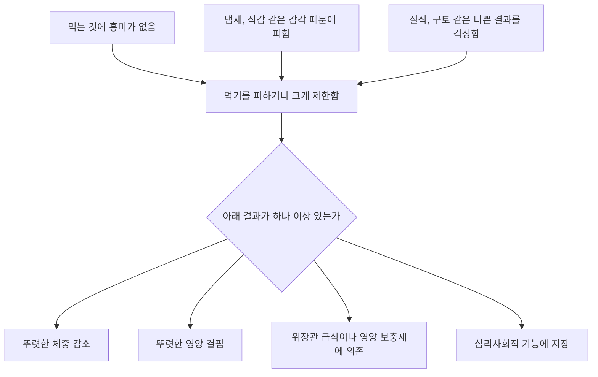



요약

음식의 냄새나 식감이 너무 싫거나, 먹다가 체한 기억 때문에 먹는 것이 두려워서, 먹기를 피하거나 몇 가지만 먹다가 몸이 상하는 장애다. 단순한 편식과 달리 체중이 줄고, 영양이 모자라고, 생활이 흔들린다. 살찌는 것이 두려워서 안 먹는 것이 아니라는 점이 신경성 식욕부진증과 다르다. 어린 시절에 시작해 성인까지 이어질 수 있다.

## 예시로 보기

아홉 살 GL은 세 살 때 떡을 먹다 목에 걸린 뒤로 덩어리진 음식을 거의 먹지 않는다. 흰죽, 요구르트, 특정 상표의 우유만 먹고, 급식 냄새가 싫어 식당에 들어가지 않는다. 체중이 또래 하위 1%로 떨어졌고, 소아과에서 영양 보충 음료를 처방받았다. GL은 "살찌는 게 무서운 건 아니고, 삼키는 게 무섭다"고 말한다[^s1].

- 음식 회피와 제한(질식의 부정적 경험, 냄새에 대한 예민함).
- 결과: 체중 감소, 영양 보충제에 의존.
- 체형이나 체중에 대한 걱정이 없다.

## 정의

심각한 체중 저하와 영양 결핍이 나타날 만큼 음식을 먹는 것을 피하고, 먹더라도 매우 제한적으로만 먹는다[^1].

원본 오류 의심

원문: "6세 이하의 아동이 지속적으로 먹지 않아 1개월 이상 심각한 체중감소를 나타냄"(p.44) / 문제점: DSM-IV의 "유아기 또는 초기 아동기의 급식장애" 기준(6세 이전 발병, 1개월 이상)이다. DSM-5부터 이 장애를 회피적·제한적 음식섭취 장애로 바꾸면서 나이 제한과 기간 기준을 없앴다. 슬라이드 스스로도 "성인기까지 지속될 수 있음"(p.44), "연령 제한적 진단은 아님"(p.2)이라고 적는다. / 수정안: 나이·기간 제한 없이, 먹기의 회피·제한이 아래 결과 가운데 하나 이상을 낳을 때 진단한다. / 근거: DSM-5-TR 회피적·제한적 음식섭취 장애 진단기준[^s2].

DSM-5-TR의 기준은 다음과 같다[^s2].

회피적·제한적 음식섭취 장애의 진단기준 (DSM-5-TR)

A. 먹는 것에 대한 흥미 부족, 음식의 감각적 특성 때문의 회피, 먹은 뒤 나쁜 결과(질식, 구토)에 대한 걱정 등으로 섭식이 흐트러지고, 다음 가운데 하나 이상이 나타난다.
1. 뚜렷한 체중 감소(아동은 기대만큼 자라지 못함)
2. 뚜렷한 영양 결핍
3. 위장관 급식이나 경구 영양 보충제에 의존
4. 심리사회적 기능에 뚜렷한 지장

B. 음식을 구할 수 없거나 문화적 관습 때문이 아니다. 
C. 신경성 식욕부진증이나 폭식증 동안에만 나타나지 않고, 체중이나 체형을 경험하는 방식에 이상이 없다. 
D. 다른 의학적 상태나 정신장애로 더 잘 설명되지 않는다.

위의 세 이유 가운데 무엇이든 먹기를 줄이고, 그 결과가 아래 넷 가운데 하나 이상으로 나타나야 한다. 체중이나 체형에 대한 걱정은 이 흐름에 들어 있지 않다(기준 C)[^s3].

## 임상적 특징[^1][^2]

- 음식의 모양, 색, 냄새, 식감, 온도, 맛에 대한 지나친 예민함과 음식의 질에 관한 감각적 특징 때문에 음식을 피하고 제한한다.
- 영유아기나 초기 아동기에 시작해 성인기까지 이어질 수 있다.
- 특정 상표의 음식만 먹거나, 다른 사람이 먹는 음식 냄새를 맡는 것도 거부한다.
- 먹는 동안 성급하고 통제하기 어렵거나, 무관심해 보이거나, 위축되어 있다.
- 심각한 체중 감소와 영양 부족이 나타나고, 위장관 급식이나 경구 영양 보충제에 의존한다.
- **위험요인:** 불안장애, 자폐스펙트럼장애, 강박장애, ADHD, 가족의 불안, 섭식장애가 있는 어머니, 위장 상태, 위식도 역류.

## 편식과의 구별[^3]

| | 편식 | 회피적·제한적 음식섭취 장애 |
|---|---|---|
| 정의 | 특정 음식만 고집하거나 싫어하는 식습관 | 영양 부족, 체중 감소, 기능 장애를 낳는 심각한 음식 회피·제한 |
| 원인 | 취향, 음식 선호, 식습관 | 감각 과민, 식사에 대한 불안, 질식 같은 부정적 경험에서 온 심리적 문제 |
| 치료 필요성 | 식욕과 전체 식사량이 충분해 성장에 무리가 없으며 진단이나 치료의 필요성이 낮다 | 전문적 진단과 치료가 필요하다 |

## 치료[^2]

- 부모 교육.
- 식사 환경 개선: 싫어하는 음식에 단계적으로 노출한다([노출치료와 체계적 둔감법](/Hongs_Blog/studies/abnormal-psychology/exposure-therapy/)).
- 감각통합치료.
- 의료적 개입.

## 연결

- 겉모습이 비슷한 장애: [신경성 식욕부진증](/Hongs_Blog/studies/abnormal-psychology/anorexia-nervosa/), [세 섭식장애 비교](/Hongs_Blog/studies/abnormal-psychology/eating-disorders-contrast/)
- 위험요인이 되는 장애: [강박장애](/Hongs_Blog/studies/abnormal-psychology/ocd/), 자폐스펙트럼장애와 ADHD(11회)

## 확인 문제

<b>C1</b> 두 아이가 모두 채소를 먹지 않는다. GM은 밥, 고기, 과일은 잘 먹고 성장이 정상이다. GN은 식감 때문에 먹을 수 있는 음식이 다섯 가지뿐이고 체중이 줄어 영양 보충 음료를 마신다. 각각 무엇인가?

**답:** GM은 편식: 전체 식사량이 충분하고 성장에 무리가 없어 진단·치료가 필요하지 않다. GN은 회피적·제한적 음식섭취 장애: 감각 과민으로 인한 제한이 체중 감소와 영양 보충제 의존을 낳았다.

<b>C2</b> 저체중인 열다섯 살 GO는 거의 먹지 않는다. 신경성 식욕부진증인지 회피적·제한적 음식섭취 장애인지 가르려면 무엇을 물어야 하는가?

**답:** 먹지 않는 이유가 살찌는 것에 대한 두려움과 체형 걱정인지를 묻는다. 체중 증가를 두려워하고 자기 몸을 뚱뚱하게 경험하면 신경성 식욕부진증이다. 체형 걱정 없이 냄새·식감에 대한 예민함이나 질식·구토에 대한 두려움 때문이면 회피적·제한적 음식섭취 장애다(DSM-5-TR 기준 C).

<b>C3</b> 슬라이드 p.44의 "6세 이하, 1개월 이상" 기준이 현재 진단기준과 어떻게 다른지, 그리고 DSM-5-TR이 요구하는 네 가지 결과를 쓰라.

**답:** "6세 이하, 1개월 이상"은 DSM-IV 급식장애의 기준이고, DSM-5-TR에는 나이와 기간 제한이 없다. 네 결과 가운데 하나 이상이 필요하다: 뚜렷한 체중 감소(또는 성장 부진), 뚜렷한 영양 결핍, 위장관 급식이나 경구 영양 보충제 의존, 심리사회적 기능의 뚜렷한 지장.

[^1]: 이상 심리학 8회 강의 자료 「급식 및 섭식장애, 수면-각성장애」, p.44
[^2]: 이상 심리학 8회 강의 자료 「급식 및 섭식장애, 수면-각성장애」, p.45
[^3]: 이상 심리학 8회 강의 자료 「급식 및 섭식장애, 수면-각성장애」, p.46
[^s1]: 보충 GL의 사례는 진단기준과 식욕부진증과의 차이를 보이려고 만든 가상 사례다.
[^s2]: 보충 DSM-5-TR 회피적·제한적 음식섭취 장애 진단기준 A~D를 요약했다. DSM-IV-TR의 "유아기 또는 초기 아동기의 급식장애"는 "6세 이전 발병", "적어도 1개월 동안 적절히 먹지 못해 체중이 늘지 않거나 줄어듦"을 요구했다.
[^s3]: 보충 다이어그램 1개는 원본에 없다. 'DSM-5-TR의 기준' 콜아웃의 기준 A와 C를 그렸다(p.44~45와 DSM-5-TR).

