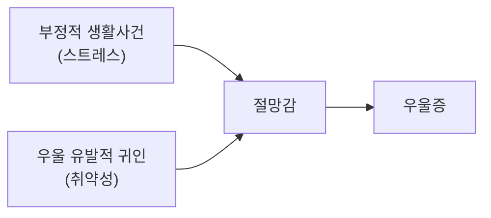



요약

사람은 나쁜 일을 겪으면 "왜 이런 일이 생겼지?"를 묻는다. 그 답을 "내 탓이고, 앞으로도 늘 그럴 것이고, 모든 일이 다 그렇다"로 내는 습관이 있는 사람은 나쁜 일 앞에서 절망하고 우울해진다. 같은 실패도 "이번엔 운이 없었고, 이 과목만 그렇다"고 설명하면 덜 무너진다. 설명 습관이 우울의 취약성이라는 것이 이 이론의 핵심이다.

## 예시로 보기

두 학생이 같은 시험에서 낙제했다[^s1].

| 차원 | 학생 AS의 설명 | 학생 AT의 설명 |
|---|---|---|
| 내부적-외부적 | "내가 멍청해서" (내부) | "시험이 유난히 어려웠어" (외부) |
| 안정적-불안정적 | "나는 원래 이래. 다음에도 떨어질 거야" (안정) | "이번에 컨디션이 나빴어" (불안정) |
| 전반적-특수적 | "나는 뭘 해도 안 돼" (전반) | "통계만 약한 거지" (특수) |

AS는 우울 유발적 귀인을 했다. 자존감이 무너지고(내부), 절망이 오래 가고(안정), 다른 일까지 손을 놓는다(전반). AT는 같은 낙제를 겪었지만 덜 흔들린다.

## 정의

사람은 다른 동물과 달리, 통제하기 어려운 상황을 만나면 그 상태가 무엇 때문인지 묻는 심리 과정을 거친다[^1]. 이 설명(귀인)에는 세 차원이 있고, 차원마다 우울의 다른 측면을 정한다[^1].

| 차원 | 우울에 미치는 영향 |
|---|---|
| 내부적-외부적 | 자존감 손상과 우울장애의 발생 |
| 안정적-불안정적 | 우울장애의 만성화 정도. 필기의 말로는 "잘 변화하는 요소에 귀인하는가?" |
| 전반적-특수적 | 우울장애의 일반화 정도 |

### 우울 유발적 귀인과 방어적 귀인[^2]

| | 부정적 결과 | 긍정적 결과 |
|---|---|---|
| 우울 유발적 귀인 | 내부적·안정적·전반적 | 외부적·불안정적·특수적 |
| 방어적 귀인 | 외부적·불안정적·특수적 | 내부적·안정적·전반적 |

필기는 우울 유발적 귀인에 해당하는 칸에 빨간 상자를 쳤다. 나쁜 일은 "내 탓, 늘, 모든 일"로, 좋은 일은 "운, 이번만, 이 일만"으로 설명하는 것이다[^2]. 좋은 일의 공은 버리고 나쁜 일의 탓은 떠안는 습관이다.

부정적 생활사건이 스트레스, 우울 유발적 귀인이 취약성 역할을 한다. 둘이 만나 절망감을 거쳐 우울이 된다[^2]. [취약성-스트레스 모델](/Hongs_Blog/studies/abnormal-psychology/vulnerability-stress-model/)의 한 사례이고, 절망감은 [자살](/Hongs_Blog/studies/abnormal-psychology/suicide/)의 가장 중요한 심리적 요인이기도 하다.

학습된 무기력 이론이 설명하지 못한 두 가지가 여기서 풀린다. 같은 사건에도 사람마다 반응이 다른 이유(귀인 습관의 차이), 통제할 수 없던 일에도 자신을 탓하는 이유(내부 귀인)다[^s2].

## 연결

- 출발점: [학습된 무기력 이론](/Hongs_Blog/studies/abnormal-psychology/learned-helplessness/)
- 비슷한 구조의 인지 이론: [우울증의 인지이론](/Hongs_Blog/studies/abnormal-psychology/beck-cognitive-theory/). 귀인 습관은 인지 도식이 드러나는 한 방식이다.
- 치료에서: 인지행동치료의 재귀인 훈련은 부정적 사건을 더 현실적인 원인으로 다시 설명하게 돕는다[^s3].

## 확인 문제

<b>C1</b> 귀인의 세 차원과 각 차원이 우울의 어떤 측면에 영향을 주는지 쓰라.

**답:** 내부적-외부적: 자존감 손상과 우울의 발생. 안정적-불안정적: 우울의 만성화. 전반적-특수적: 우울의 일반화.

<b>C2</b> 승진한 직장인 AU가 "운이 좋았을 뿐이고, 이번 한 번뿐이야"라고 말하고, 한 달 전 보고서가 반려됐을 때는 "나는 원래 일을 못 해"라고 했다. AU의 귀인 양식을 분석하라.

**답:** 우울 유발적 귀인 양식이다. 긍정적 결과(승진)는 외부적(운)·불안정적(이번 한 번)으로, 부정적 결과(반려)는 내부적(나)·안정적(원래)·전반적(일을 못 한다)으로 설명했다. 좋은 일의 공은 버리고 나쁜 일의 탓은 떠안는다.

<b>C3</b> 안정적 귀인이 우울을 "오래 가게" 만드는 이유를 쓰라.

**답:** 실패의 원인을 잘 변하지 않는 것(능력, 성격)에 두면, 앞으로도 같은 결과가 계속될 것이라고 예상하게 된다. 미래에 대한 기대가 사라지니 절망감이 이어지고, 우울이 만성화된다. 원인을 노력이나 운처럼 변하는 것에 두면 다음에는 다를 수 있다는 기대가 남는다.

[^1]: 이상 심리학 3회 강의 자료 「양극성장애와 우울장애」, p.27. "잘 변화하는 요소에 귀인하는가?"는 손글씨 필기다.
[^2]: 이상 심리학 3회 강의 자료 「양극성장애와 우울장애」, p.28 (방어적 귀인과 우울 유발적 귀인, 우울증의 귀인이론 도식). 빨간 상자와 "우울 유발적 귀인"은 손글씨 필기다.
[^s1]: 보충 두 학생의 비교 표는 세 차원을 보이려고 만든 가상 사례다.
[^s2]: 보충 Abramson, Seligman, Teasdale(1978)의 개정된 학습된 무기력 이론과, 절망감을 중심에 둔 Abramson, Metalsky, Alloy(1989)의 절망감 이론이 이 슬라이드의 모형과 같은 계열이다.
[^s3]: 보충 재귀인 훈련(reattribution training)은 인지치료의 표준 기법이다.

