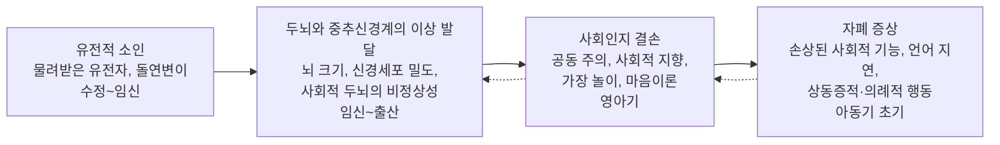


<div class="callout callout-summary" markdown="1">
<div class="callout-title callout-title--default" markdown="span">요약</div>

사람과 마음을 주고받는 일이 어렵고(눈 맞춤, 표정, 대화의 주고받기), 특정한 것에 좁게 몰두하며 같은 행동과 순서를 고집하는 장애다. 두 살 이전부터 드러나는 경우가 많다. 말을 거의 못 하고 지적장애가 함께 있는 사람부터, 지능이 높고 특정 분야에 뛰어난 사람까지 모습이 넓게 펼쳐져 있어 "스펙트럼"이라 부른다. 부모의 양육 방식이 원인이라는 생각은 틀렸고, 강한 유전적·신경생물학적 뿌리가 있다.

</div>


## 예시로 보기

네 살 JV는 이름을 불러도 돌아보지 않고, 엄마가 손가락으로 가리키는 곳을 함께 보지 않는다. 또래와 놀기보다 장난감 자동차를 몇 시간씩 한 줄로 세우고, 누가 하나를 옮기면 크게 울며 괴로워한다. 매일 같은 길로만 어린이집에 가야 하고, 청소기 소리에 귀를 막는다. 말은 "빠방" 몇 마디뿐이지만, 한번 본 자동차 이름은 모두 기억한다[^s1].

- 사회적 의사소통의 결함: 이름에 반응 없음, 합동 주시 결함, 또래 관계 형성의 어려움.
- 제한적·반복적 행동: 줄 세우기(반복), 같은 길 고집(동일성), 자동차에 몰두(제한된 흥미), 소리에 과민(감각).
- 언어 지연, 기계적 기억.

## 정의

<div class="callout callout-definition" markdown="1">
<div class="callout-title" markdown="span">자폐스펙트럼장애의 진단기준[^1]</div>

**사회적 의사소통과 상호작용의 지속적인 결함**
1. 사회적-감정적 상호성의 결함
2. 비언어적 의사소통 행동의 결함
3. 관계를 발전시키고 유지하고 이해하는 것의 결함

**제한적이고 반복적인 행동, 흥미, 활동**
1. 상동증적이거나 반복적인 동작, 물체 사용, 언어 사용
2. 동일성에 대한 고집, 일상적인 틀에 대한 융통성 없는 집착, 의식적인 행동 양상
3. 강도나 초점이 비정상적으로 제한되고 고정된 흥미
4. 감각 정보에 대한 과잉 또는 과소 반응, 감각에 대한 특이한 관심

</div>


DSM-5-TR은 앞의 3개를 모두, 뒤의 4개 가운데 2개 이상을 요구한다. 증상은 발달 초기에 나타나야 하고, 기능 손상이 있어야 하며, 지적장애로 더 잘 설명되지 않아야 한다. 심각도는 필요한 지원의 양에 따라 1~3단계로 나눈다[^s2].

"스펙트럼"은 장애의 심각도, 발달 수준, 나이, 젠더에 따라 드러나는 방식이 다르다는 뜻이다. 예전의 아스퍼거 장애와 고기능 자폐, 전형적 자폐가 이 하나의 스펙트럼에 들어간다[^2].

## 임상적 특징[^3][^4]

- **지적 손상과 언어 손상:** 지능이 평균이거나 높아도 능력이 고르지 않고, 지적 기능과 적응 기능의 차이가 큰 편이다.
- **합동 주시(joint attention)의 결함:** 다른 사람과 같은 대상에 함께 주의를 기울이지 못한다.
- **마음이론(theory of mind)의 결함:** 다른 사람의 생각, 믿음, 의도를 추론하기 어렵다.
- **운동 결함:** 기이한 걸음걸이, 서투름, 까치발.
- 자해와 파괴적·저항적 행동.
- 긴장증과 비슷한 운동 행동: 느리고 "얼어붙은" 듯한 중간 동작.
- 일부는 기계적 기억(rote memory)이 뛰어나고 파편적 기술(splinter skills)을 보인다.
- 유병률 1~2%로 아동과 성인이 비슷하다.

### 성별 차이와 여성 방어 효과[^5][^6]

- 남성이 여성보다 3배 많다.
- 여아는 증상이 더 심하고 지적장애도 심한 경향이 있다. 여성은 진단 나이가 더 늦다.
- 지적장애나 언어 지연이 없는 여성은 사회적 상호작용, 관심사 공유, 상황에 따른 행동 수정이 더 낫고 반복 행동이 덜 뚜렷해 놓치기 쉽다.
- **여성 방어 효과(female protective effect):** 자폐가 나타나는 데 필요한 유전적 역치가 여성이 남성보다 높다. 그래서 여성은 더 많은 유전적 부담이 쌓여야 발병하고, 발병한 여성은 증상이 더 심한 경향이 있다.

```
사람 수
  │        ╭───╮
  │      ╭╯     ╰╮
  │    ╭╯         ╰╮   │남성 역치 │여성 역치
  │  ╭╯             ╰──┼──────────┼──
  └──────────────────────────────────▶ 유전적 부담
       평균               ▓▓(남성 발병)  █(여성 발병)
```

같은 분포에서 여성의 문턱이 더 오른쪽에 있으므로, 문턱을 넘는 사람 수는 적고(3:1), 넘은 사람은 더 멀리 치우친 쪽(더 무거운 부담)에 있다[^s3].

## 발달과 경과[^7][^8][^9]

- 대부분 생후 2년 안에 알아챈다. 발달 지연이 심하면 12개월 이전, 증상이 미묘하면 24개월 이후.
- 최소 2년간 정상 발달한 뒤에 나타나는 발달적 퇴행은 가능하지만 매우 이례적이다.
- 첫 증상으로 언어 발달 지연이 흔하다. 대표적 예후 인자는 지능과 언어 발달이고, 5세에 기능적 언어가 가능하면 예후가 좋다.
- 생후 2년 동안 이상하고 반복적인 행동과 전형적인 놀이의 부재가 뚜렷해진다. 학령전기에 특정한 것을 강하게 좋아하고 반복을 즐기는 정상 발달 아동과는 행동의 유형, 빈도, 강도로 구별한다. 예: 매일 몇 시간씩 물건을 줄 세우고 하나라도 흐트러지면 괴로워하는 아동.
- **초기 징후:** 사회적 기능(얼굴 선호가 없음, 타인의 시선을 따라가지 않음, 까꿍놀이에 흥미 없음, 물건을 보여 주지 않음, 이름을 불러도 돌아보지 않음, 상징 놀이·가장 놀이를 거의 하지 않음), 의사소통 기능(발성과 몸짓이 거의 없음, 단어와 간단한 문장의 제한), 행동 기능(사람보다 물체에 주의, 일상의 변화에 극심한 저항, 반복적이고 상동증적인 행동). 시선 추적 연구에서 전형 발달 아동은 얼굴의 눈과 코를 보지만, 자폐 아동은 얼굴 바깥이나 입 주변을 본다.
- 아동기 초기와 초기 학령기에 가장 두드러진다.
- 평생 이어지는 발달장애이지만, 5% 이내는 독립적으로 생활하고 30% 정도는 부분적으로 독립 생활이 가능하다. 노년기에 대해서는 알려진 바가 거의 없다.

## 원인[^10][^11][^12]

유전적, 신경생물학적, 초기 환경적 요인이 함께 작용한다. 부모의 성격이나 양육 방식이 원인이라는 주장은 입증되지 못했다.

- **유전:** 강한 유전적 소인이 있다(일란성 쌍둥이의 일치율이 85~90%에 이르기도 한다). 특정 염색체의 유전 물질 결실이나 중복, 초기 뇌 성숙에 관여하는 유전자의 이상이나 돌연변이, 치료되지 않은 대사 질환이 관여한다. 출생 당시 부모의 나이가 많을수록 유전적 돌연변이 가능성이 늘고, 환경적 스트레스가 유전자의 발현 방식에 영향을 준다(후성유전학).
- **신경생물학적 요인:**
    - 성장 조절 이상 가설: 뇌의 비정상적인 성장과 연결 이상.
    - 소뇌, 변연계, 편도체의 이상: 주의 조절, 타인의 사회적 행동·언어·표정 단서를 관찰해 사회적 정보를 처리하는 데 어려움.
    - 언어와 운동 과제를 할 때 측두엽과 전두엽의 활동 감소.
    - 사람의 얼굴 정보를 처리할 때 활성화되는 오른쪽 방추이랑의 과소 활동.

**발달모델:**



유전적 소인이 뇌 발달의 차이를 낳고, 뇌의 이상이 영아기의 사회인지 발달을 방해하며, 아동기 초기에 사회인지 결손이 진단받을 만큼 심각해진다. 뒤 단계가 앞 단계에 다시 영향을 주는 되먹임도 있다.

## 치료[^13][^14]

- 완치할 수 있는 약물이나 특수 치료는 없다.
- 심리학자, 언어병리학자, 소아 정신과 의사 등 다학제 임상팀의 협조가 필요하다.
- **치료 목표:** 행동장애 감소, 언어 습득, 의사소통, 자립 기술 습득.
- 일차적 치료는 심리사회적 개입이다. 특수교육, 행동치료, 감각통합치료로 행동을 교정한다.
- 약물치료는 심리사회적 치료를 방해하는 정서적 흥분, 자해, 공격성을 줄이는 부차적 개입이다.
- **응용행동분석(ABA):** 학습과 행동과학을 행동 중재에 적용하는 치료로, 발달장애 아동에게 널리 쓰인다. 인지 능력, 의사소통 기술, 일상 적응 기술을 개선한다. 행동의 기능, 곧 그 행동을 하는 목적이나 이유를 평가하는 것을 중시한다. 사건(A, antecedent) → 행동(B, behavior) → 결과(C, consequence)의 틀로 분석한다.

## 스스로 설명해 보기

1. "자폐 아동은 이름을 불러도 돌아보지 않고, 가리키는 곳을 함께 보지 않는다."
   <details class="inline-fold" markdown="1"><summary markdown="span">근거</summary>
   합동 주시의 결함이다. 다른 사람과 같은 대상에 주의를 나누지 못하면, 말과 사회적 의미를 배우는 기본 통로가 막힌다. 발달모델에서 사회인지 결손(공동 주의)이 언어 지연과 손상된 사회적 기능으로 이어지는 이유다.
   </details>
2. "5세에 기능적 언어가 있으면 예후가 좋다."
   <details class="inline-fold" markdown="1"><summary markdown="span">근거</summary>
   지능과 언어 발달이 대표적 예후 인자다. 기능적 언어가 있으면 요구를 말로 표현하고 교육과 사회적 학습에 참여할 수 있어, 문제 행동이 줄고 적응 기술이 늘어난다.
   </details>
3. "ABA는 먼저 행동의 기능을 평가한다."
   <details class="inline-fold" markdown="1"><summary markdown="span">근거</summary>
   같은 머리 박기도 관심을 끌려는 것인지, 싫은 과제를 피하려는 것인지, 감각 자극을 얻으려는 것인지에 따라 결과(C)가 다르게 강화한다. 기능을 알아야 같은 목적을 이루는 적절한 대체 행동을 가르칠 수 있다.
   </details>

- 이 장애의 핵심 아이디어는?
  <details class="inline-fold" markdown="1"><summary markdown="span">답</summary>
  유전적 소인에서 시작된 뇌 발달의 차이가 사회인지(공동 주의, 마음이론)의 결손을 낳고, 그 결과 사회적 의사소통의 결함과 제한적·반복적 행동이 나타난다. 원인이 양육이 아니므로, 치료는 이른 시기부터 행동의 기능을 분석해 의사소통과 적응 기술을 가르치는 심리사회적 개입이 중심이다.
  </details>

## 자주 하는 오해

<div class="callout callout-misconception" markdown="1">
<div class="callout-title" markdown="span">"냉정하고 무관심한 부모가 아이를 자폐로 만든다"</div>

틀렸다. 한때 "냉장고 엄마" 가설처럼 부모의 차가운 양육이 원인이라는 주장이 있었고, 자폐 아동이 부모와 눈을 잘 맞추지 않아 관계가 차가워 보이니 그럴듯했다[^s4]. 그러나 부모의 성격이나 양육 방식이 원인이라는 주장은 입증되지 못했다. 자폐는 일란성 쌍둥이의 일치율이 매우 높은 강한 유전적 장애이고, 뇌의 성장과 연결, 사회적 정보를 처리하는 뇌 영역의 이상이 원인이다. 양육 결핍이 원인인 [반응성 애착장애](/Hongs_Blog/studies/abnormal-psychology/reactive-attachment-disorder/)와 달리, 자폐는 정상적인 양육을 받아도 나타난다.

</div>


## 확인 문제

<details markdown="1"><summary markdown="span"><b>C1</b> 자폐스펙트럼장애 진단기준의 두 영역과, 각 영역의 항목을 모두 쓰라. 각각 몇 개가 필요한가?</summary>


**답:** 사회적 의사소통과 상호작용의 결함(사회적-감정적 상호성, 비언어적 의사소통, 관계의 발전·유지·이해): 3개 모두. 제한적·반복적 행동·흥미·활동(상동증적·반복적 동작·물체·언어, 동일성 고집과 의례, 제한되고 고정된 흥미, 감각 과잉·과소 반응): 4개 가운데 2개 이상.

</details>

<details markdown="1"><summary markdown="span"><b>C2</b> 자폐는 남성이 3배 많은데, 진단받은 여아는 증상이 더 심하고 지적장애도 심한 경향이 있다. 여성 방어 효과로 설명하라.</summary>


**답:** 자폐가 나타나려면 유전적 부담이 역치를 넘어야 하는데, 여성의 역치가 남성보다 높다. 그래서 역치를 넘는 여성은 적고(남녀비 3:1), 넘은 여성은 더 많은 유전적 부담을 가진 사람들이라 증상과 동반 지적장애가 더 심한 경향이 있다.

</details>

<details markdown="1"><summary markdown="span"><b>C3</b> 자폐스펙트럼장애의 발달모델을 네 단계와 시기로 그리라. 되먹임 화살표는 어디에 있는가?</summary>


**답:** 유전적 소인(수정~임신) → 두뇌와 중추신경계의 이상 발달(임신~출산: 뇌 크기, 신경세포 밀도, 사회적 두뇌) → 사회인지 결손(영아기: 공동 주의, 사회적 지향, 가장 놀이, 마음이론) → 자폐 증상(아동기 초기: 사회적 기능 손상, 언어 지연, 상동증적 행동). 되먹임은 사회인지 결손에서 뇌 발달로, 자폐 증상에서 사회인지 결손으로 돌아간다.

</details>

<details markdown="1"><summary markdown="span"><b>C4</b> 다섯 살 KF는 수업 중 어려운 과제를 받으면 머리를 책상에 박고, 그러면 선생님이 과제를 치워 준다. ABA의 ABC로 분석하고, 대체 행동을 제안하라.</summary>


**답:** A(사건): 어려운 과제 제시. B(행동): 머리 박기. C(결과): 과제가 치워짐. 행동의 기능은 과제 회피이고, 과제가 사라지는 결과가 부적 강화로 머리 박기를 유지한다. 대체 행동으로 "도와주세요" 카드를 내거나 "쉬어요"라고 말하는 법을 가르치고, 그 행동에 짧은 휴식이나 도움을 주며, 머리 박기에는 과제를 치워 주지 않는다.

</details>

[^1]: 이상 심리학 11회 강의 자료 「신경발달장애, 신경인지장애」, p.23
[^2]: 이상 심리학 11회 강의 자료 「신경발달장애, 신경인지장애」, p.24 (Autistic Spectrum Conditions 그림)
[^3]: 이상 심리학 11회 강의 자료 「신경발달장애, 신경인지장애」, p.25
[^4]: 이상 심리학 11회 강의 자료 「신경발달장애, 신경인지장애」, p.26
[^5]: 이상 심리학 11회 강의 자료 「신경발달장애, 신경인지장애」, p.26. 여성 방어 효과 옆 "유전적 역치가 여성이 남성에 비해 더 높음"은 손글씨 필기다.
[^6]: 이상 심리학 11회 강의 자료 「신경발달장애, 신경인지장애」, p.27 (Werling & Geschwind, 2013의 역치 그림)
[^7]: 이상 심리학 11회 강의 자료 「신경발달장애, 신경인지장애」, p.28
[^8]: 이상 심리학 11회 강의 자료 「신경발달장애, 신경인지장애」, p.29 (초기 징후 그림, Sheldrick 등 2020, 시선 추적 그림)
[^9]: 이상 심리학 11회 강의 자료 「신경발달장애, 신경인지장애」, p.30
[^10]: 이상 심리학 11회 강의 자료 「신경발달장애, 신경인지장애」, p.31
[^11]: 이상 심리학 11회 강의 자료 「신경발달장애, 신경인지장애」, p.32
[^12]: 이상 심리학 11회 강의 자료 「신경발달장애, 신경인지장애」, p.33 (자폐스펙트럼장애의 발달모델 그림)
[^13]: 이상 심리학 11회 강의 자료 「신경발달장애, 신경인지장애」, p.34
[^14]: 이상 심리학 11회 강의 자료 「신경발달장애, 신경인지장애」, p.35
[^s1]: <span class="fn-tag" title="수업 자료에 없고 따로 보탠 내용">보충</span> JV의 사례는 두 영역의 증상을 보이려고 만든 가상 사례다.
[^s2]: <span class="fn-tag" title="수업 자료에 없고 따로 보탠 내용">보충</span> DSM-5-TR 자폐스펙트럼장애 기준 A(3개 모두), B(4개 중 2개 이상), C~E와 심각도 1~3단계(지원 필요, 상당한 지원 필요, 매우 상당한 지원 필요)를 보탰다.
[^s3]: <span class="fn-tag" title="수업 자료에 없고 따로 보탠 내용">보충</span> 역치 그림은 p.27 그림을 글자 그림으로 옮긴 것이다.
[^s4]: <span class="fn-tag" title="수업 자료에 없고 따로 보탠 내용">보충</span> "냉장고 엄마" 가설은 1940~60년대 카너(Kanner)와 베텔하임(Bettelheim)의 주장으로, 이후 연구로 기각되었다.

