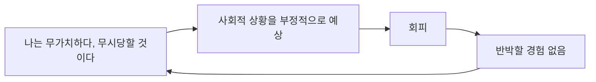



요약

사람과 가까워지고 싶지만, 거절당하고 창피당할까 봐 먼저 문을 닫는 사람이다. 자신은 무능하고 매력 없다고 믿어서, 상대가 좋아한다는 확신이 없으면 다가가지 않는다. 피할수록 "역시 나는 안 된다"는 믿음이 굳는다. 관계를 원한다는 점에서 조현성 성격장애와 다르고, 핵심 감정은 수치심이다.

## 예시로 보기

스물아홉 살 MD는 승진하면 팀을 이끌어야 한다는 이유로 승진 기회를 두 번 거절했다. 동료들이 점심을 함께하자고 해도 "나랑 먹으면 재미없을 것"이라며 핑계를 댄다. 대학 때 발표에서 웃음거리가 된 뒤로 새 모임에는 나가지 않는다. 친구를 사귀고 싶다고 말하지만, 상대가 자신을 좋아한다는 확신이 없으면 연락하지 못한다[^s1].

- 거절이 두려워 대인관계가 필요한 직업 활동을 피한다: 기준 1.
- 호감에 대한 확신이 없으면 만남을 피한다: 기준 2.
- 사회적으로 무능하고 열등하다고 생각한다: 기준 6.
- 당황할까 봐 새로운 활동을 피한다: 기준 7.

## 정의[^1]

핵심 특징은 사회적 불안과 부적절감, 부정적 평가에 대한 과민성, 사회적 상황의 회피다. 다음 가운데 4개 이상이다.

1. 비난, 꾸중, 거절이 두려워서 대인관계가 필요한 직업 활동을 피한다.
2. 호감을 주고 있다는 확신이 없으면 사람과의 만남을 피한다.
3. 창피나 조롱을 당할까 봐 친밀한 관계를 극히 제한한다.
4. 사회적 상황에서 비난받고 거부당하는 것에 사로잡혀 있다.
5. 부적절감 때문에 새로운 대인관계 상황에서 위축된다.
6. 자신이 사회적으로 무능하고 열등하다고 생각한다.
7. 당황하는 모습을 보일까 봐 새로운 활동에 참여하지 않는다.

## 임상적 특징[^2]

- 유병률은 일반 인구의 0.5~1%, 정신과 환자의 10%.
- 남녀 비율이 같다.
- 어린 시절부터 수줍음, 고립, 낯선 사람이나 새로운 상황을 피하는 성향이 있다.
- 사춘기와 청년기 초기에 증상이 악화되지만, 중년기가 되면 점차 완화되는 경향이 있다.

## 원인[^3][^4]

- **기질적 요인:** 타고난 기질로서의 수줍음과 억제 경향. 위험에 대한 생리적 민감성이 높고, 사소한 위협에도 교감신경계가 과도하게 활성화된다.
- **정신분석적 입장:** 주된 감정은 수치심이다.
    - 사회적 회피는 수치심이라는 불쾌한 감정에서 숨고 싶은 소망이다.
    - 자신에 대한 부정적 자아상.
    - 수치심과 죄의식을 일으키는 비판적이고 거부적인 부모의 양육 태도.
    - 많은 경우 아동기에 또래에게 창피를 당하거나 거절받은 경험이 있다.
- **인지적 입장:** 사회불안장애와 비슷한 신념 체계.
    - 자신은 무가치하고 타인에게 무시당할 것이라는 믿음.
    - 자기비판 경향 때문에 자기 행동을 부정적으로 평가한다.
    - 미래의 사회적 상황을 부정적으로 예상하고 피한다.
    - 인지적 오류는 흑백논리적 사고와 선택적 여과다.
    - 사회적 상황을 피하니 부정적 신념을 반박할 경험을 얻지 못해 신념이 더 강해진다.

회피와 부정적 신념은 서로를 키우는 고리를 이룬다[^s2].

## 치료[^5]

- **치료 관계:** 치료자의 거부를 두려워해 매우 소극적이다. 치료자는 인내심을 갖고 내담자가 위축되지 않도록 노력한다.
- **정신분석적 치료:** 지나친 수치심과 당혹감에 관련된 정서를 탐색하고 다룬다.
- **인지행동치료:**
    - 불편한 신념과 역기능적 사고를 바꿔 자기상을 높인다.
    - 사회적 상황에 점진적으로 노출한다.
    - 주장기술 훈련, 대인관계 기술 훈련으로 사회적 상호작용을 촉진한다.

## 연결

- 가장 헷갈리는 짝: [사회불안장애와 회피성 성격장애 비교](/Hongs_Blog/studies/abnormal-psychology/sad-vs-avoidant/)
- 관계를 원하지 않아서 혼자인 경우: [조현성 성격장애](/Hongs_Blog/studies/abnormal-psychology/schizoid-pd/)
- 관계에 매달리는 경우: [의존성 성격장애](/Hongs_Blog/studies/abnormal-psychology/dependent-pd/). 둘 다 부적절감이 있지만, 회피성은 관계에서 물러나고 의존성은 관계에 붙는다.

## 확인 문제

<b>C1</b> 회피성 성격장애의 핵심 특징 세 가지와 유병률, 성비, 나이에 따른 경과를 쓰라.

**답:** 사회적 불안과 부적절감, 부정적 평가에 대한 과민성, 사회적 상황의 회피. 일반 인구의 0.5~1%, 정신과 환자의 10%. 남녀 같음. 사춘기와 청년기 초기에 악화되고 중년기에 점차 완화.

<b>C2</b> 인지적 입장에서 회피가 회피성 성격장애를 유지시키는 이유를 설명하라.

**답:** 사회적 상황을 피하면 당장의 불안과 수치심은 줄지만, "사람들이 나를 무시할 것"이라는 예상이 틀렸음을 확인할 기회가 사라진다. 반박되지 않은 부정적 신념은 더 강해지고, 다음 상황을 더 부정적으로 예상해 또 피한다. 그래서 인지행동치료는 점진적 노출로 이 고리를 끊는다.

<b>C3</b> 회피성 성격장애와 조현성 성격장애는 둘 다 사회적으로 고립되어 있다. 무엇으로 가르는가?

**답:** 관계에 대한 욕구다. 회피성은 관계를 원하지만 거절과 창피가 두려워 피한다(불안 때문에 괴롭다). 조현성은 관계를 원하지도 즐기지도 않는다(무관심, 정서적 냉담). 그래서 회피성은 C군(불안), 조현성은 A군(기이함)이다.

[^1]: 4-1학기/이상 심리학/1.수업자료/12.성격장애.pdf, p.64
[^2]: 4-1학기/이상 심리학/1.수업자료/12.성격장애.pdf, p.65
[^3]: 4-1학기/이상 심리학/1.수업자료/12.성격장애.pdf, p.66
[^4]: 4-1학기/이상 심리학/1.수업자료/12.성격장애.pdf, p.67
[^5]: 4-1학기/이상 심리학/1.수업자료/12.성격장애.pdf, p.68
[^s1]: 에이전트 보충. MD의 사례는 진단기준을 보이려고 만든 가상 사례다.
[^s2]: 에이전트 보충. 순환 그림은 p.67의 인지적 입장 목록, 특히 마지막 줄 "사회적 상황 회피로 인한 부정적 신념 강화"를 고리로 이어 그렸다.

