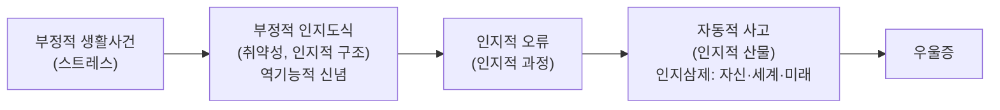



요약

우울한 사람은 나 자신, 세상, 앞날을 모두 어둡게 보는 생각이 저절로 떠오른다. 그 생각은 어린 시절부터 굳어진 "나는 사랑받지 못한다" 같은 깊은 믿음(도식)이 힘든 일을 만나 깨어나고, 흑백논리나 지나친 일반화 같은 생각의 오류를 거쳐 만들어진다. 이 이론 덕분에 생각을 찾아 따져 보는 인지치료가 생겼다. 다만 부정적 생각이 우울의 원인인지 결과인지는 연구마다 결론이 조금씩 다르다.

## 예시로 보기

대학생 AV가 동아리 발표를 마쳤는데 한 명이 하품을 했다[^s1].

| 층 | AV의 마음 | 이론의 이름 |
|---|---|---|
| 사건 | 발표 중 한 명이 하품했다 | 부정적 생활사건(스트레스) |
| 깊은 믿음 | "사람들이 나를 인정해야만 나는 가치가 있다" | 역기능적 신념, 부정적 인지도식(취약성) |
| 생각의 처리 | 스무 명 중 한 명의 하품만 기억한다. 한 번의 반응을 "모두가 지루해했다"로 넓힌다 | 인지적 오류: 정신적 여과, 과잉 일반화 |
| 떠오른 생각 | "나는 형편없다(자신). 사람들은 나를 무시한다(세상). 다시는 발표를 잘하지 못할 것이다(미래)" | 부정적 자동적 사고, 인지삼제 |
| 결과 | 우울하고, 다음 발표를 포기한다 | 우울 증상 |

사건은 작은데 결과는 크다. 사건과 결과 사이를 도식, 오류, 자동적 사고가 채우고 있기 때문이다.

## 정의

슬라이드의 모형은 세 층의 인지와 스트레스로 되어 있다[^1].

| 층 | 뜻 | 예 |
|---|---|---|
| 부정적 인지도식 (인지적 구조) | 경험을 해석하는 깊고 오래된 틀. 평소에는 잠잠하다가 비슷한 사건을 만나면 깨어난다. 그 내용이 역기능적 신념이다 | 사회적 의존성("모두에게 사랑받아야 한다"), 유능성("완벽하게 해내야 가치 있다"), 당위 진술("~해야만 한다")[^1] |
| 인지적 오류 (인지적 과정) | 정보를 처리하면서 생기는 체계적인 왜곡 | 아래 표 |
| 자동적 사고 (인지적 산물) | 상황에서 저절로, 빠르게 떠오르는 생각. 본인은 사실처럼 받아들인다 | 인지삼제: 자신("나는 무가치하다"), 세계("아무도 날 돕지 않는다"), 미래("나아질 리 없다") |

p.30은 같은 흐름을 한 줄로 줄인다. 부정적 생활사건 → 역기능적 신념 및 도식 → 인지적 오류 → 부정적 자동적 사고 → 우울 증상[^2].

### 인지적 오류

슬라이드의 아홉 가지 오류다[^1]. 뜻과 예는 벡과 번스의 표준 정리를 따랐다[^s2].

| 오류 | 뜻 | 예 |
|---|---|---|
| 흑백논리적 사고 | 중간 없이 둘 중 하나로 본다 | "A+가 아니면 실패다" |
| 과잉 일반화 | 한두 번의 일을 모든 경우로 넓힌다 | "이번에 떨어졌으니 난 늘 떨어질 거야" |
| 정신적 여과 | 부정적인 부분만 골라 보고 나머지를 버린다 | 칭찬 아홉 개는 잊고 비판 하나만 곱씹는다 |
| 의미 확대 및 축소 | 부정적인 것은 크게, 긍정적인 것은 작게 본다 | "실수 하나로 다 망쳤어", "합격은 운이었을 뿐" |
| 개인화 | 자기와 무관한 일을 자기 탓으로 돌린다 | "팀이 진 건 내가 응원을 안 가서야" |
| 잘못된 명명 | 한 행동으로 자신이나 남에게 부정적 딱지를 붙인다 | "실수했으니 나는 멍청이다" |
| 독심술 | 증거 없이 남의 생각을 안다고 단정한다 | "저 사람은 날 한심하게 생각해" |
| 예언자적 오류 | 증거 없이 미래를 나쁘게 단정한다 | "면접은 분명히 망칠 거야" |
| 감정적 추리 | 감정을 사실의 증거로 삼는다 | "불안하니까 뭔가 잘못될 게 분명해" |

### 설명하는 것과 설명하지 못하는 것

- **설명하는 것:** 같은 사건에 사람마다 다르게 반응하는 이유(도식의 차이), 작은 사건이 큰 우울로 번지는 이유(오류의 증폭), 우울한 사람의 생각이 한결같이 비관적인 이유(인지삼제). 또 치료의 표적(자동적 사고와 신념)을 분명히 준다.
- **설명하지 못하는 것:** 부정적 생각이 우울의 원인인지, 우울하면 생각이 어두워지는 것인지(결과)는 모형만으로 가려지지 않는다. 회복하면 부정적 생각도 줄어드는데, 이것은 두 방향 모두와 맞는다. 도식이 언제 어떻게 생기는지도 모형 밖의 문제다[^s3].
- **악순환:** 우울해지면 부정적인 기억과 해석이 더 쉽게 떠오르고, 이것이 자동적 사고를 더 어둡게 만든다. 치료가 이 고리를 끊으려는 이유다.

## 스스로 설명해 보기

1. "도식은 취약성, 생활사건은 스트레스다."
   

근거

   p.29의 괄호 표기다. 도식은 평소에 잠잠하다가 맞는 사건을 만나야 깨어난다. 도식만으로도, 사건만으로도 우울이 생기지 않으므로 취약성-스트레스 모델의 구조를 따른다.
   

2. "자동적 사고는 인지적 산물, 오류는 과정, 도식은 구조다."
   

근거

   도식(구조)이 정보를 처리하는 방식(과정)을 비틀고, 그 결과로 떠오르는 것이 자동적 사고(산물)다. 표면의 생각에서 깊은 믿음 쪽으로 내려갈수록 오래 가고 바꾸기 어렵다.
   

3. "치료는 자동적 사고에서 시작해 핵심 믿음으로 내려간다."
   

근거

   자동적 사고는 의식하기 쉬워 먼저 찾고 따져 볼 수 있다. 그 밑의 중간 믿음과 핵심 믿음(도식)을 바꿔야 재발을 막을 수 있다. p.36의 "자동적 사고 → 중간믿음 → 핵심믿음"이 이 순서다.
   

- 이 이론의 핵심 아이디어는?
  

답

  우울은 사건이 아니라 사건을 처리하는 인지 체계(도식 → 오류 → 자동적 사고)에서 생긴다. 그래서 인지를 바꾸면 우울이 바뀐다.
  

- 같은 틀을 쓸 수 있는 다른 상황은?
  

답

  불안(위험을 과대평가하는 자동적 사고, 4회 공황의 인지모델), 섭식장애(체중에 대한 역기능적 신념, 8회), 조증(획득과 성공의 자동적 사고, 양극성장애의 인지적 원인)에도 같은 구조를 쓴다.
  

## 자주 하는 오해

"인지치료는 긍정적으로 생각하라고 가르치는 것이다"

틀렸다. 부정적 생각을 바꾼다니 긍정적 생각으로 바꾸는 것처럼 들린다. 실제 목표는 긍정이 아니라 현실적인 생각이다. "나는 발표를 망쳤다"를 "나는 발표를 완벽하게 했다"로 바꾸는 것이 아니라, 증거를 따져 "한 명이 하품했지만 질문도 세 개 나왔다. 개선할 점과 잘한 점이 둘 다 있다"로 바꾼다. 무조건 긍정적인 생각은 오히려 조증의 인지 특징이다(양극성장애의 인지적 원인).

"자동적 사고는 본인이 일부러 하는 생각이다"

틀렸다. "사고"라서 의도적인 생각처럼 들린다. 자동적 사고는 이름 그대로 상황에서 저절로, 순식간에 떠올라 본인도 잘 알아차리지 못하고 사실처럼 받아들인다. 그래서 치료의 첫 단계가 기록으로 이 생각을 "잡아내는" 것이다.

## 확인 문제

<b>C1</b> 벡의 인지이론에서 인지의 세 층(구조, 과정, 산물)의 이름을 쓰고, 인지삼제의 세 대상을 쓰라.

**답:** 구조: 부정적 인지도식(역기능적 신념). 과정: 인지적 오류. 산물: 부정적 자동적 사고. 인지삼제: 자신, 세계, 미래.

<b>C2</b> 다음 생각은 어떤 인지적 오류인가? (a) "친구가 답장을 안 하는 건 나한테 화가 났기 때문이야" (b) "시험에서 한 문제 틀렸으니 이번 학기는 끝났어" (c) "칭찬은 다 예의상 한 말이고, 지적만 진심이야" (d) "우리 부서가 목표를 못 채운 건 전부 내 탓이야"

**답:** (a) 독심술: 증거 없이 남의 생각을 단정했다. (b) 흑백논리적 사고(또는 의미 확대): 한 문제로 전체를 실패로 봤다. (c) 의미 확대 및 축소(정신적 여과도 답이 된다): 긍정은 작게, 부정은 크게 본다. (d) 개인화: 여러 원인이 있는 일을 자기 탓으로 돌렸다. 
**주의:** 한 생각에 오류가 여럿 섞이는 경우가 많다. 가장 두드러진 것을 고르고 근거를 대면 된다.

<b>C3</b> 다음 사례를 벡의 모형(생활사건 → 도식 → 오류 → 자동적 사고 → 증상)에 옮겨 적으라. "연인과 헤어진 AW는 '나는 누구에게도 사랑받을 수 없는 사람이야, 앞으로도 혼자일 거야'라며 두 주째 울고 있다. AW는 어릴 때부터 '착하게 굴어야 사랑받는다'고 믿어 왔다."

**답:** 생활사건: 이별. 도식·역기능적 신념: "착하게 굴어야(조건을 채워야) 사랑받는다"(사회적 의존성). 오류: 과잉 일반화(한 번의 이별 → "누구에게도"), 예언자적 오류("앞으로도 혼자"). 자동적 사고: 자신("사랑받을 수 없는 사람"), 미래("앞으로도 혼자"). 증상: 두 주째 우울과 울음.

<b>C4</b> 우울한 사람의 부정적 생각이 "우울의 원인"이라는 주장을 확인하려면 어떤 자료가 필요한가? 우울한 사람과 아닌 사람의 생각을 한 번 비교한 연구만으로는 왜 부족한가?

**답:** 우울이 생기기 전에 부정적 도식과 역기능적 신념을 재고, 이후 스트레스를 겪었을 때 누가 우울해지는지 추적해야 한다. 한 번의 비교는 부정적 생각과 우울이 함께 있다는 것만 보여 준다. 우울 때문에 생각이 어두워졌을 수도 있어서, 어느 쪽이 먼저인지 가릴 수 없다.

[^1]: 이상 심리학 3회 강의 자료 「양극성장애와 우울장애」, p.29 (우울증의 인지이론 도식: 인지삼제, 역기능적 신념, 인지적 오류 목록)
[^2]: 이상 심리학 3회 강의 자료 「양극성장애와 우울장애」, p.30
[^s1]: 보충 AV의 사례는 모형의 층을 보이려고 만든 가상 사례다.
[^s2]: 보충 슬라이드는 오류의 이름만 든다. 뜻과 예는 A. T. Beck의 인지치료와 D. Burns의 인지 왜곡 목록에서 쓰는 표준 정의를 따랐다.
[^s3]: 보충 부정적 인지가 우울의 원인인지 결과인지에 대한 논쟁, 그리고 전향적 연구 설계의 필요성은 인지 취약성 연구의 표준 논점이다.

