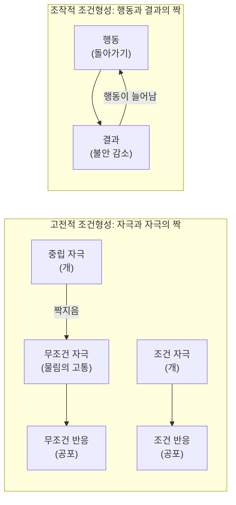



요약

사람의 행동은 모두 배운 것이고, 이상행동도 마찬가지로 잘못 배운 것이라고 본다. 짝지어 겪은 경험, 행동 뒤에 따라온 결과, 남을 보고 따라 한 것이 행동을 만든다. 배운 것이니 같은 원리로 지우고 새로 가르치면 된다는 점이 강점이다. 대신 겉으로 보이는 행동만 다루므로 생각이나 해석의 역할을 설명하지 못한다.

## 예시로 보기

개에게 물린 뒤로 개만 보면 심장이 뛰는 어린이 K를 세 학습 원리로 따라가 본다[^s1].

1. **고전적 조건형성:** 개(원래는 중립적 자극)가 물리는 고통(원래 공포를 일으키는 자극)과 한 번 짝지어졌다. 이제 개만 봐도 공포가 생긴다.
2. **조작적 조건형성:** K는 개가 보이면 길을 돌아간다. 돌아가면 불안이 줄어든다. 불쾌한 것이 사라지는 결과가 회피 행동을 강하게 만든다(부적 강화).
3. **사회적 학습:** K의 동생은 개에게 물린 적이 없지만, 형이 개를 보고 비명 지르는 모습을 보며 개를 무서워하게 되었다.

치료도 같은 원리를 거꾸로 쓴다. 긴장을 푼 상태에서 개 사진 → 멀리 있는 개 → 가까이 있는 순한 개 순서로 조금씩 마주하게 하면(체계적 둔감법), 개와 공포의 짝이 풀린다.

## 정의

### 기본 가정과 학습의 원리

행동주의는 사람의 모든 행동이 학습된 것이라고 가정한다. 학습은 세 원리로 일어난다[^1]. 슬라이드의 세 그림이 차례로 각 원리를 보여 준다. 파블로프의 개 실험 장치, 스키너 상자, 어른 행동을 따라 하는 아이 사진이다[^1].

| 원리 | 무엇과 무엇이 연결되나 | 대표 연구자 | 핵심 용어[^s2] |
|---|---|---|---|
| 고전적 조건형성 | 자극과 자극 | 파블로프(Pavlov) | 무조건 자극(US)과 반응(UR), 조건 자극(CS)과 반응(CR), 소거 |
| 조작적 조건형성 | 행동과 그 결과 | 스키너(Skinner) | 강화(행동이 늘어남), 처벌(행동이 줄어듦), 정적(무언가를 줌), 부적(무언가를 없앰) |
| 사회적 학습 | 남의 행동과 그 결과를 관찰 | 반두라(Bandura) | 관찰학습, 모방, 모델링, 대리 강화 |

조작적 조건형성의 네 경우는 "주느냐 없애느냐"와 "행동이 느느냐 주느냐"의 조합이다[^s2].

| | 행동이 늘어남 (강화) | 행동이 줄어듦 (처벌) |
|---|---|---|
| 무언가를 줌 (정적) | 정적 강화: 숙제하면 칭찬 | 정적 처벌: 떠들면 꾸중 |
| 무언가를 없앰 (부적) | 부적 강화: 약을 먹으면 두통이 사라짐 | 부적 처벌: 늦게 들어오면 용돈을 뺏음 |

### 원인론과 치료[^2]

- **원인론:** 부적응 행동과 이상행동도 학습된 것이다.
- **치료의 원리:** 학습 원리로 치료한다. 부적응 행동을 없애고 적응 행동을 새로 학습시킨다.
- **치료 방법:** 행동치료, 행동수정. 기법으로는 소거, 체계적 둔감법, 행동조성 등이 있다.

| 기법 | 쓰는 원리 | 하는 일[^s2] |
|---|---|---|
| 소거 | 고전적·조작적 | 짝이나 강화를 끊어 학습된 반응을 약하게 한다 |
| 체계적 둔감법 | 고전적 | 이완한 상태에서 약한 공포 자극부터 차례로 마주하게 해, 공포 대신 이완을 새로 짝짓는다 |
| 행동조성 | 조작적 | 목표 행동에 조금씩 가까워지는 행동을 차례로 강화한다 |

### 설명하는 것과 설명하지 못하는 것

- **설명하는 것:** 특정 대상에 대한 공포([특정공포증](/Hongs_Blog/studies/abnormal-psychology/specific-phobia/)), 회피가 오래 유지되는 이유([모러의 2요인 이론](/Hongs_Blog/studies/abnormal-psychology/two-factor-theory/)), 가족 안에서 공격 행동이 대물림되는 현상(10회 품행장애의 모방학습). 관찰할 수 있는 행동을 대상으로 하므로 치료 효과를 재기 쉽다.
- **설명하지 못하는 것:** 같은 경험을 해도 사람마다 다르게 반응하는 이유. 개에게 물린 사람이 모두 개를 무서워하지는 않는다. 해석과 생각의 차이를 설명하려면 인지적 요인이 필요하고, 이것이 [인지적 입장](/Hongs_Blog/studies/abnormal-psychology/cognitive-perspective/)과 인지행동치료로 이어졌다[^3].

## 스스로 설명해 보기

1. "개를 피해 돌아가는 행동은 부적 강화로 유지된다."
   

근거

   조작적 조건형성의 정의다. 돌아가면 불안(불쾌한 것)이 사라진다. 불쾌한 것을 없애는 결과가 행동을 늘리므로 부적 강화다.
   

2. "그런데 피할수록 공포는 사라지지 않는다."
   

근거

   고전적 조건형성의 소거는 조건 자극(개)이 무조건 자극(물림) 없이 여러 번 나타나야 일어난다. 피하면 개를 마주할 기회 자체가 없어 소거가 일어나지 않는다.
   

3. "그래서 치료는 피하지 않고 마주하게 한다."
   

근거

   마주해도 나쁜 일이 일어나지 않는 경험을 해야 소거가 일어나고, 회피 대신 다른 반응(이완)을 학습할 수 있다. 체계적 둔감법이 이 원리다.
   

- 이 입장의 핵심 아이디어는?
  

답

  행동은 환경과의 연결(자극-자극, 행동-결과, 관찰)로 만들어지므로, 연결을 바꾸면 행동이 바뀐다.
  

- 이 원리를 쓸 수 있는 다른 상황은?
  

답

  학교의 칭찬 스티커(정적 강화), 스마트폰 알림을 끄는 습관 만들기(자극 제거), 게임의 보상 설계. 모두 행동 뒤의 결과를 설계해 행동 빈도를 바꾼다.
  

## 자주 하는 오해

"부적 강화는 처벌이다"

틀렸다. "부적"이라는 말이 나쁜 것을 떠올리게 해서 그럴듯하다. 실제로 "부적"은 무언가를 없앤다는 뜻이고, "강화"는 행동이 늘어난다는 뜻이다. 부적 강화는 불쾌한 것을 없애 주어 행동을 늘리는 것이다. 처벌은 행동을 줄인다. 확인 방법: 결과 뒤에 그 행동이 늘어나는지 줄어드는지만 본다. 두통약을 먹는 행동은 두통이 사라져서 늘어나므로 부적 강화다.

"행동주의는 사람의 마음을 부정한다"

반만 맞다. 행동주의가 관찰할 수 있는 행동만 연구 대상으로 삼은 것은 맞다. 하지만 마음이 없다고 주장한다기보다, 과학적으로 재기 어려운 것을 설명에서 빼는 방법론적 선택이다. 이후 반두라의 사회적 학습은 관찰과 기대 같은 인지 과정을 받아들였고, 인지행동치료로 합쳐졌다[^3].

## 확인 문제

<b>C1</b> 행동주의의 세 가지 학습 원리를 쓰고, 각각 무엇과 무엇이 연결되는지와 대표 연구자를 쓰라.

**답:** 고전적 조건형성: 자극과 자극(파블로프). 조작적 조건형성: 행동과 결과(스키너). 사회적 학습: 남의 행동과 결과를 관찰(반두라).

<b>C2</b> 다음은 정적 강화, 부적 강화, 정적 처벌, 부적 처벌 중 무엇인가? (a) 아이가 울면 부모가 사탕을 주어 우는 일이 늘었다 (b) 발표를 피하면 불안이 줄어들어 발표 회피가 늘었다 (c) 게임 시간을 넘기면 다음 날 게임을 금지해 넘기는 일이 줄었다

**답:** (a) 정적 강화: 사탕을 주어 우는 행동이 늘었다. (b) 부적 강화: 불안을 없애 주어 회피가 늘었다. (c) 부적 처벌: 게임(좋은 것)을 빼앗아 행동이 줄었다. 
**흔한 오답:** (b)를 처벌로 쓰는 경우. 행동이 늘었으면 강화다.

<b>C3</b> 개에게 한 번 물린 뒤 개를 계속 피해 온 사람의 공포가 10년이 지나도 줄지 않는 이유를 학습 원리로 설명하라.

**답:** 공포는 고전적 조건형성으로 생겼고, 소거되려면 개를 마주했는데 물리지 않는 경험이 반복되어야 한다. 그런데 피하는 행동은 불안을 줄여 주므로 부적 강화로 계속 유지된다. 피하는 동안에는 소거의 기회가 없어서 공포가 그대로 남는다.

<b>C4</b> 체계적 둔감법이 하는 일을 한 문장으로 설명하라.

**답:** 이완한 상태에서 약한 공포 자극부터 차례로 마주하게 해, 공포 자극과 공포의 짝을 이완과의 새 짝으로 바꾸는 치료다.

[^1]: 이상 심리학 1회 강의 자료 「이상심리학」, p.48 (기본 가정, 학습의 원리, 파블로프의 개·스키너 상자·모방하는 아이 그림)
[^2]: 이상 심리학 1회 강의 자료 「이상심리학」, p.49
[^3]: 이상 심리학 1회 강의 자료 「이상심리학」, p.52 (행동주의적 입장과 인지적 입장의 통합, 인지행동치료)
[^s1]: 보충 개에게 물린 어린이 사례와 도식은 세 학습 원리를 한 사례로 보이려고 만든 가상 사례다.
[^s2]: 보충 슬라이드는 세 원리와 기법의 이름만 든다. 용어(US, CS, 강화·처벌의 네 경우)와 기법 설명은 학습심리학의 표준 설명이다. 체계적 둔감법은 울페(Wolpe)가 만들었다.

