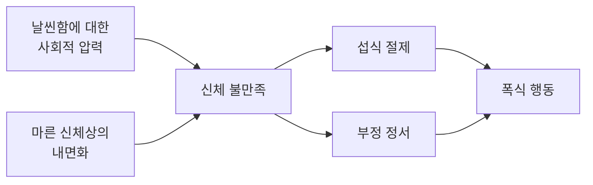



요약

멈출 수 없이 많이 먹는 폭식을 되풀이하지만, 신경성 폭식증과 달리 토하거나 굶는 보상행동은 하지 않는 장애다. 그래서 체중이 늘고, 먹고 나면 자신이 싫어진다. 엄격한 다이어트와 우울·스트레스가 폭식을 부르는 두 길이다. 보상행동이 없다고 가볍게 볼 문제가 아니다.

## 예시로 보기

30대 회사원 GA는 1년 전부터 다이어트를 하고 있다. 낮에는 샐러드만 먹다가, 상사에게 혼난 날 밤이면 배가 고프지 않아도 혼자 치킨 한 마리와 떡볶이를 빠르게 먹는다. 배가 아플 때까지 먹고, 다 먹고 나면 우울하고 자신이 한심하다. 토하지는 않는다. 일주일에 한두 번씩 반년째이고, 체중이 12kg 늘었다[^s1].

- 조절력을 잃은 폭식(A).
- 빨리 먹음, 불편할 때까지 먹음, 배고프지 않아도 먹음, 혼자 먹음, 먹고 나서 우울(B의 5개 모두).
- 고통스러워한다(C). 주 1회 이상 3개월 이상(D).
- 보상행동이 없다(E).
- 다이어트(섭식 절제)와 부정 정서가 함께 폭식을 부른다.

## 정의

폭식장애의 진단기준[^1][^2]

A. 폭식 삽화가 반복된다. 일정한 시간(예: 2시간 이내)에 보통 사람보다 분명히 많은 양을 먹고, 먹는 동안 조절력을 잃는다. 
B. 폭식 삽화는 다음 가운데 3가지 이상과 관련된다.
- 빨리 먹는다.
- 불편감을 느낄 때까지 먹는다.
- 배고프지 않을 때도 많이 먹는다.
- 당혹감을 피하려고 혼자 먹는다.
- 먹고 나서 혐오감, 우울감, 죄책감을 느낀다.

C. 폭식 행동에 대해 현저한 고통을 느낀다. 
D. 폭식이 평균 주 1회 이상, 3개월 동안 나타난다. 
E. 폭식이 부적절한 보상행동과 함께 나타나지 않는다.

E가 [신경성 폭식증](/Hongs_Blog/studies/abnormal-psychology/bulimia-nervosa/)과 가르는 기준이다[^2].

### 보상행동 없는 폭식을 왜 치료하는가[^3]

- 폭식이 반복되어 고통과 기능 저하가 이어진다면 분명히 치료가 필요한 임상적 문제다.
- 신체 건강에 장기적인 영향을 준다.
- 심리적 고통과 자존감 저하가 따른다.
- 나중에 보상행동이 생길 위험이 있다.
- 일찍 개입할수록 회복 확률이 높다.

## 원인

### 섭식 절제와 부정 정서[^4]

폭식 행동의 대표적 원인은 섭식 절제와 부정 정서다.

- **섭식 절제(잦은 다이어트):** 엄격한 절식에서 벗어나려 할 때 폭식이 나타난다. 엄격한 절식과 폭식이 반복되면 체중이 늘어난다.
- **부정 정서:** 음식은 부정 정서를 달래 주고, 싫은 자극에서 주의를 돌리게 한다. 실험으로 부정 정서를 일으키면 절식 중인 사람이 과식한다(Cools et al., 1992). 이를 정서적 섭식(emotional eating)이라 한다.

### 이중경로 모델(Stice, 2001)[^5]

신체 불만족에서 폭식까지 두 경로가 있다. 한 경로는 다이어트(섭식 절제)를 거치고, 다른 경로는 우울과 불안 같은 부정 정서를 거친다.

## 치료[^6]

- **인지행동치료:** 식사일지로 폭식을 일으키는 단서를 찾고 대처 방법을 익힌다. 필요하면 체중 감량을 위한 운동과 식이요법을 함께 한다. 부정 정서에 대한 다른 대처 방법을 익힌다.
- **대인관계 심리치료(IPT):** 대인관계 갈등과 폭식의 관계를 알아차린다. 갈등 영역을 탐색하고 대인관계 행동을 바꾼다.
- **약물치료:** 항우울제가 폭식을 줄이는 데 도움이 된다.

## 연결

- 보상행동이 있으면: [신경성 폭식증](/Hongs_Blog/studies/abnormal-psychology/bulimia-nervosa/)
- 세 장애의 기준표: [세 섭식장애 비교](/Hongs_Blog/studies/abnormal-psychology/eating-disorders-contrast/)
- 공통 핵심 병리와 CBT-E: [섭식장애의 초진단적 모델](/Hongs_Blog/studies/abnormal-psychology/transdiagnostic-eating-model/)

## 확인 문제

<b>C1</b> 폭식장애의 기준 B에서 폭식 삽화와 관련된 다섯 특징을 쓰라. 몇 개가 필요한가?

**답:** 빨리 먹음, 불편할 때까지 먹음, 배고프지 않아도 많이 먹음, 당혹감 때문에 혼자 먹음, 먹고 나서 혐오감·우울감·죄책감. 3가지 이상.

<b>C2</b> GB와 GC는 모두 주 2회씩 4개월째 폭식한다. GB는 폭식 뒤 이틀을 굶고 매일 세 시간씩 운동한다. GC는 폭식 뒤 괴로워하지만 굶거나 토하지 않는다. 둘 다 체중은 정상이다. 각각의 진단은?

**답:** GB는 신경성 폭식증: 금식과 과도한 운동이 보상행동이다. GC는 폭식장애: 보상행동이 없다(기준 E). 흔한 오답은 "토하지 않으니 GB도 폭식장애"라고 보는 것이다. 금식과 과도한 운동도 보상행동이다.

<b>C3</b> 스타이스의 이중경로 모델을 그림으로 그리고, 예시의 GA 사례에서 두 경로가 각각 무엇인지 쓰라.

**답:** 날씬함에 대한 사회적 압력과 마른 신체상의 내면화 → 신체 불만족 → (섭식 절제, 부정 정서) → 폭식. GA에게 섭식 절제 경로는 1년 동안의 다이어트(낮에 샐러드만 먹음)이고, 부정 정서 경로는 상사에게 혼난 날의 기분이다. 두 경로가 겹친 날 밤에 폭식이 일어난다.

[^1]: 4-1학기/이상 심리학/1.수업자료/08.급식 및 섭식장애, 수면-각성장애.pdf, p.29
[^2]: 4-1학기/이상 심리학/1.수업자료/08.급식 및 섭식장애, 수면-각성장애.pdf, p.30. 기준 E의 형광펜과 "신경성 폭식증과 다른 점!"은 손글씨 필기다.
[^3]: 4-1학기/이상 심리학/1.수업자료/08.급식 및 섭식장애, 수면-각성장애.pdf, p.31
[^4]: 4-1학기/이상 심리학/1.수업자료/08.급식 및 섭식장애, 수면-각성장애.pdf, p.32. 슬라이드는 "cools et al., 1992"로 적는다.
[^5]: 4-1학기/이상 심리학/1.수업자료/08.급식 및 섭식장애, 수면-각성장애.pdf, p.33
[^6]: 4-1학기/이상 심리학/1.수업자료/08.급식 및 섭식장애, 수면-각성장애.pdf, p.34
[^s1]: 에이전트 보충. GA의 사례는 진단기준과 이중경로 모델을 보이려고 만든 가상 사례다.

