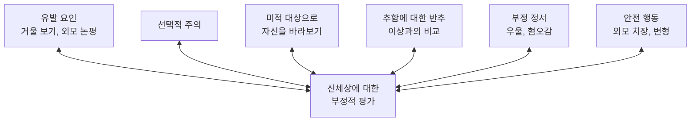



요약

남이 보기엔 거의 없거나 사소한 외모의 결함을 "끔찍하게 기형"이라 믿고 거기에 매달리는 장애다. 하루에도 몇 번씩 거울을 보고, 가리고, 꾸미고, 시술을 받지만 불만은 사라지지 않는다. 강박장애처럼 떨쳐지지 않는 생각과 반복 행동이 있지만, 그 대상이 외모 하나에 집중된다는 점이 다르다. 본인은 문제를 몸에서 찾기 때문에 성형외과와 피부과를 전전하고 심리치료는 거부하기 쉽다.

## 예시로 보기

20세 DB는 코가 "비뚤어지고 너무 커서" 사람들이 쳐다본다고 믿는다. 친구들은 전혀 모르겠다고 한다. DB는 하루 세 시간 거울로 코를 확인하고, 사진은 늘 한쪽 각도로만 찍으며, 마스크 없이는 외출하지 않는다. 코 수술을 두 번 받았지만 "여전히 이상하다"고 한다[^s1].

- 남이 보기엔 사소한 결함에 대한 집착.
- 반복 행동: 거울 확인, 가리기(안전행동), 반복 시술.
- 수술 뒤에도 불만이 이어진다.

## 정의

하나 이상의 신체 결함이나 특이함을 기형적이라고 걱정하며 집착하는 장애다[^1].

- 얼굴, 피부, 모발, 치아, 유방, 엉덩이, 성기, 손, 발 등 모든 신체 부위가 걱정의 대상이 될 수 있다.
- 외모의 결함에만 집중한다는 점에서 강박장애와 다르다.
- 체격이 너무 왜소하거나 근육이 부족하다는 믿음(근육이형증)이 함께 나타나기도 한다.
- 심한 열등감, 자신감 상실, 대인관계 위축이 생기고, 신체 결함 관찰, 외모 치장, 과도한 운동, 미용 시술에 시간을 쓴다. 사회적·직업적 영역에서 심각한 기능 손상이 온다.

DSM-5-TR은 외모 걱정에 대한 반응으로 반복 행동(거울 확인, 과도한 치장, 피부 뜯기, 안심 구하기)이나 정신 행위(남과 비교하기)가 있을 것을 요구하고, 병식의 정도를 명시하게 한다[^s2].

### 임상적 특징[^2]

- 평생 유병률 약 2%. 남녀 비율이 비슷하다.
- 15~20세 사춘기에 많이 시작한다. 갑자기 또는 서서히 시작하지만, 외모에 대한 남의 한마디가 계기가 되는 경향이 있다.
- 피부과나 성형외과를 자주 찾고, 수술 뒤에도 불만이 이어진다.

## 원인

- **정신분석적 입장[^3]:** 어린 시절 심리성적 발달의 특수한 경험으로 생긴 무의식적 갈등이 신체 부위에 대치된다.
- **인지행동적 입장[^3][^4][^5]:**
    - 건강염려증(질병)과 비슷한 특성을 외모(기형)에 대해 가진다.
    - 확신 과정: 외모에 대한 언급 → 신체 특징에 주목 → 선택적 주의 → 신체 특징의 과장된 해석 → 신체 기형에 대한 확신.
    - 과거 경험: 어려서 외모로 칭찬(강화)을 많이 받아 외모에 더 집착한다. 정서적 학대, 신체적으로 무시당한 경험, 신체적·성적 학대 경험.
    - 비합리적 신념: "내 외모에 결함이 있으면 나는 무가치한 사람이다"라는 핵심 신념.
    - 높은 미적 민감성: 얼굴 정보를 처리할 때 전체보다 지엽적이고 세부적인 특징을 잘 잡아낸다.

슬라이드 p.26의 모형은 한가운데 "신체상에 대한 부정적 평가"를 두고, 그 둘레의 요인들이 서로를 키운다고 그린다[^4].

## 치료[^6]

- 심리적 요인을 부정해서 심리치료에 저항하는 경우가 많다.
- **망상 수준의 신체이형장애:** 약물치료. 강박장애처럼 SSRI 계열 항우울제가 효과적이다.
- **망상이 아니거나 경미한 수준:** 인지행동치료. 강박장애처럼 노출 및 반응방지법이 효과적이다. 외모가 기형이라는 침투적 생각에 대한 확인·교정 행동을 금지하고, 노출, 인지 재구성, 편향된 주의를 바꾸는 지각 재훈련을 한다.

## 연결

- 같은 범주의 원형: [강박장애](/Hongs_Blog/studies/abnormal-psychology/ocd/)
- 치료 기법: [노출 및 반응방지법](/Hongs_Blog/studies/abnormal-psychology/erp/)
- 헷갈리는 장애: 섭식장애(8회)는 체중과 체형 걱정이 중심이고, 질병불안장애(7회)는 외모가 아니라 질병을 걱정한다.

## 확인 문제

<b>C1</b> 신체이형장애와 강박장애는 모두 떨쳐지지 않는 생각과 반복 행동이 있다. 둘을 가르는 기준은?

**답:** 신체이형장애는 집착의 대상이 외모의 결함 하나에 집중되고, 반복 행동도 거울 확인·가리기·치장·시술처럼 외모를 향한다. 강박장애는 오염, 해, 대칭 등 여러 주제의 강박사고가 있고 외모에 국한되지 않는다.

<b>C2</b> 신체이형장애 환자가 성형수술을 받아도 불만이 사라지지 않는 이유를 인지행동적 입장으로 설명하라.

**답:** 문제는 실제 외모가 아니라 "결함이 있으면 나는 무가치하다"는 핵심 신념과, 세부 특징에 쏠리는 선택적 주의다. 수술로 한 부위를 바꿔도 주의는 남은 작은 차이나 다른 부위로 옮겨 가고, 신념은 그대로라 다시 결함을 찾아낸다. 오히려 수술은 "외모를 바꿔야 한다"는 안전행동이 되어 집착을 강화한다.

<b>C3</b> 신체이형장애의 치료를 망상 수준과 비망상 수준으로 나눠 쓰라.

**답:** 망상 수준: 약물치료(SSRI). 비망상·경미한 수준: 인지행동치료. 노출 및 반응방지(확인·교정 행동 금지), 인지 재구성, 지각 재훈련.

[^1]: 이상 심리학 5회 강의 자료 「강박 관련 장애」, p.23
[^2]: 이상 심리학 5회 강의 자료 「강박 관련 장애」, p.24
[^3]: 이상 심리학 5회 강의 자료 「강박 관련 장애」, p.25
[^4]: 이상 심리학 5회 강의 자료 「강박 관련 장애」, p.26 (신체이형장애의 원인 모형 그림)
[^5]: 이상 심리학 5회 강의 자료 「강박 관련 장애」, p.27
[^6]: 이상 심리학 5회 강의 자료 「강박 관련 장애」, p.28
[^s1]: 보충 DB의 사례는 진단 특징을 보이려고 만든 가상 사례다.
[^s2]: 보충 DSM-5-TR 신체이형장애 진단기준(반복 행동 또는 정신 행위, 섭식장애와의 감별, 근육이형증과 병식 명시자)을 요약했다. 명시자는 같은 진단에 경과, 심한 정도, 특별한 양상 같은 특징을 덧붙여 적는 항목이다(DSM-5-TR 서문의 "Subtypes and Specifiers").

