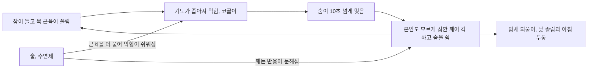



요약

잠자는 동안 숨이 막히거나 잠깐씩 멈춰서, 본인도 모르게 밤새 수십 번 깨는 장애다. 그 결과 오래 자도 개운하지 않고 낮에 졸리거나, 반대로 잠을 설친다. 가장 흔한 것은 목구멍의 기도가 좁아져 막히는 폐쇄성 수면 무호흡으로, 심하게 코를 골다 숨이 멎는 모습으로 드러난다. 체중을 줄이고 술과 수면제를 피하며, 자는 동안 공기를 불어 넣는 양압기를 쓴다.

## 예시로 보기

50대 HB는 코골이가 심하다. 아내는 HB가 코를 골다 갑자기 조용해지고, 10초 넘게 숨을 쉬지 않다가 컥 하며 다시 숨을 쉰다고 말한다. HB는 여덟 시간을 자도 아침에 머리가 아프고, 운전 중에 졸음이 쏟아진다. 과체중이고 자기 전에 술을 자주 마신다[^s1].

- 수면 중 호흡이 멈춘다(무호흡).
- 낮의 과도한 졸음.
- 위험 요인: 과체중, 음주.

## 정의

수면 중 호흡 장애 때문에 과도한 졸음이나 불면이 생겨 낮의 생활이 어렵다. 규칙적인 호흡이 어렵거나 한동안 멈춘다[^1].

| 종류 | 원인 |
|---|---|
| 폐쇄성(폐색성) 수면 무호흡 저호흡 | 수면 중 기도가 막혀 생기는 호흡 문제 |
| 중추성 수면 무호흡증 | 신경학적 질환이나 심장 질환으로 호흡이 멈춤 |
| 수면관련 환기저하 | 호흡 기능이 떨어져 혈액의 이산화탄소 농도가 올라감 |

폐쇄성은 숨을 쉬려는 노력은 있는데 기도가 막힌 것이고, 중추성은 뇌가 숨을 쉬라는 신호를 보내지 않아 노력 자체가 멈춘 것이다. DSM-5-TR은 수면다원검사에서 시간당 무호흡·저호흡 횟수로 폐쇄성 수면 무호흡을 진단한다[^s2].

## 치료[^2]

- 기저 질환 관리.
- 생활 습관 개선: 체중 조절.
- 금주, 수면제 사용하지 않기.
- 양압기 치료(CPAP): 자는 동안 코나 입에 쓴 마스크로 일정한 압력의 공기를 불어 넣어 기도가 닫히지 않게 한다[^s3].
- 수술.

술과 수면제는 목 근육을 더 풀어 기도를 쉽게 막히게 하고, 숨이 막혔을 때 깨어나는 반응도 둔하게 만든다. 그래서 수면무호흡이 있는 사람이 잠을 못 잔다고 수면제를 먹으면 오히려 위험하다[^s3].

고리를 한 바퀴 돌 때마다 잠이 끊긴다. 술과 수면제는 막힘을 쉽게 만들고, 숨이 막혔을 때 깨는 반응까지 늦춘다[^s4].

## 연결

- 낮 졸림이 주 증상인 다른 장애: [과다수면장애](/Hongs_Blog/studies/abnormal-psychology/hypersomnolence-disorder/). 과다수면을 진단하기 전에 호흡관련 수면장애를 먼저 배제한다.
- 잠을 설치는 다른 장애: [불면장애](/Hongs_Blog/studies/abnormal-psychology/insomnia-disorder/)
- 진단 검사: [수면과 수면 단계](/Hongs_Blog/studies/abnormal-psychology/sleep-stages/)의 수면다원검사

## 확인 문제

<b>C1</b> 호흡관련 수면장애의 세 종류와 각각의 원인을 쓰라.

**답:** 폐쇄성 수면 무호흡 저호흡(수면 중 기도가 막힘), 중추성 수면 무호흡증(신경학적 질환이나 심장 질환으로 호흡이 멈춤), 수면관련 환기저하(호흡 기능이 떨어져 혈중 이산화탄소가 올라감).

<b>C2</b> 예시의 HB가 "밤에 자꾸 깨서" 수면제를 처방해 달라고 한다. 왜 위험한지, 대신 무엇을 권하는지 쓰라.

**답:** HB가 자꾸 깨는 것은 숨이 막혔을 때 깨어나 호흡을 되찾는 반응이다. 수면제는 목 근육을 더 풀어 기도를 쉽게 막히게 하고, 이 깨어나는 반응도 둔하게 해 무호흡을 길고 위험하게 만든다. 대신 수면다원검사로 진단하고, 체중 조절, 금주, 양압기 치료를 권한다.

[^1]: 4-1학기/이상 심리학/1.수업자료/08.급식 및 섭식장애, 수면-각성장애.pdf, p.71
[^2]: 4-1학기/이상 심리학/1.수업자료/08.급식 및 섭식장애, 수면-각성장애.pdf, p.73
[^s1]: 에이전트 보충. HB의 사례는 폐쇄성 수면 무호흡의 전형적 모습을 보이려고 만든 가상 사례다.
[^s2]: 에이전트 보충. 폐쇄성과 중추성의 차이(호흡 노력의 유무)와 DSM-5-TR의 수면다원검사 기준(증상이 있으면 시간당 5회 이상, 증상과 무관하게 15회 이상)은 DSM-5-TR과 수면의학의 표준 설명이다.
[^s3]: 에이전트 보충. 양압기의 작동 원리와, 술·수면제가 무호흡을 악화시키는 이유는 수면의학의 일반적 설명이다. 원본은 "금주 및 수면제 비사용", "양압기 치료"라고만 적는다.
[^s4]: 에이전트 보충. 다이어그램 1개는 원본에 없다. '예시로 보기'의 HB 사례와 '치료' 아래 술·수면제 설명([^s3])을 고리로 그렸다.

