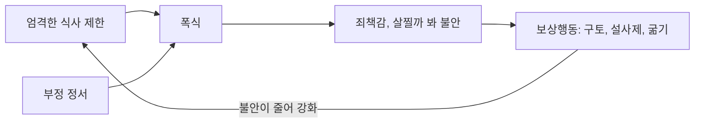



요약

멈출 수 없이 많이 먹고, 살찔까 봐 토하거나 설사제를 먹거나 굶는 일을 되풀이하는 장애다. 체중은 대개 정상이어서 겉으로 잘 드러나지 않고, 부끄러워서 가족도 몇 년씩 모르는 경우가 많다. 폭식은 우울이나 스트레스를 잠깐 달래 주지만, 곧 죄책감과 체중 걱정이 보상행동을 부르고, 보상행동이 다음 폭식을 부르는 고리가 생긴다.

## 예시로 보기

대학생 FZ는 시험 스트레스가 심한 밤이면 편의점에서 빵, 과자, 아이스크림을 잔뜩 사 와 한 시간 안에 다 먹는다. 먹는 동안은 멍하고 멈출 수가 없다. 다 먹고 나면 "또 망쳤다"는 생각에 화장실에서 토한다. 일주일에 두세 번씩 넉 달째다. 키 163cm에 55kg으로 체중은 정상이지만, FZ는 "살이 찌면 아무도 날 좋아하지 않을 것"이라 믿는다[^s1].

- 짧은 시간에 분명히 많은 양을 먹고, 조절력을 잃는다(A).
- 토하기라는 보상행동(B).
- 주 1회 이상, 3개월 이상(C).
- 체형과 체중이 자기 평가를 좌우한다(D).
- 부정 정서(시험 스트레스)가 폭식을 촉발한다.

## 정의

신경성 폭식증의 진단기준[^1]

A. 폭식 삽화가 반복된다. 폭식 삽화는 다음 두 특징을 가진다.
- 일정한 시간(예: 2시간 이내) 동안, 비슷한 상황에서 보통 사람이 먹는 것보다 분명히 많은 양을 먹는다.
- 폭식하는 동안 먹는 것을 조절하는 능력을 잃는다(멈출 수 없거나, 무엇을 얼마나 먹을지 조절할 수 없다는 느낌).

B. 체중을 줄이려고 구토, 설사제·이뇨제 같은 약물 남용, 금식, 과도한 운동 같은 보상행동을 한다. 
C. 폭식과 부적절한 보상행동이 주 1회 이상, 3개월 동안 나타난다. 
D. 체형과 체중이 자기 평가에 지나친 영향을 준다.

DSM-5-TR은 여기에 "신경성 식욕부진증 삽화 동안에만 나타나지 않는다"는 기준을 더한다. 저체중이면 식욕부진증 폭식/제거형으로 진단한다[^s2].

## 증상과 경과

### 핵심 증상[^2]

- 폭식과 보상행동의 반복.
- **폭식의 선행 사건:** 부정 정서가 가장 크다. 그 밖에 대인관계 스트레스, 음식 제한, 체중과 체형에 대한 부정적 느낌, 지루함이 폭식을 촉발한다.
- 폭식하는 동안 조절력을 잃는 느낌이 들고, 폭식 도중이나 뒤에 해리 상태를 보고하기도 한다.
- **보상행동의 흔적:** 손가락이나 도구로 구토를 유도해 손등에 굳은살과 상처가 생긴다(러셀 징후). 치아 법랑질이 손상되고 구강 건강이 나쁘다. 하제·이뇨제·관장제를 남용한다. 수분·전해질 장애, 위장관 손상, 면역 기능 손상이 생긴다.

### 임상적 특징[^3][^4]

- 청소년과 젊은 성인 여성의 1~3%. 90% 이상이 여성이다.
- 후기 청소년기나 초기 성인기에 시작한다.
- 신경성 식욕부진증보다 흔하다.
- 체중은 정상이나 과체중 범주다(성인 BMI 18.5~30).
- 식사 문제를 수치스럽게 여겨 몇 년 동안 가족도 모르는 경우가 많다.
- **우울증과 밀접하다.** 우울증의 한 형태라는 주장도 있다. 무기력감, 실패감, 자기 비하, 자해나 자살 시도가 흔하고, 성격 문제와 대인관계 곤란, 충동 통제 곤란이 따른다. 항우울제에 잘 반응한다. 그러나 섭식장애가 우울장애보다 먼저 오는 경우가 많아 인과관계는 논란 중이다.

### 식욕부진증과의 관계[^5][^6][^7]

- 식욕부진증 환자의 40~50%가 폭식 증세를 보인다(제한형 대 폭식/제거형).
- 식욕부진증이 시간이 지나 폭식증으로 바뀌기도 한다. 반대 방향은 거의 없다. 에디 등(Eddy et al., 2008)이 7년 동안 추적한 결과, 식욕부진증으로 시작한 사람 가운데 상당수가 폭식증으로 넘어갔지만, 폭식증으로 시작한 128명 가운데 식욕부진증으로 넘어간 경우는 드물었다.
- 성격도 다르다.

| | 신경성 식욕부진증 | 신경성 폭식증 |
|---|---|---|
| 자아 강도 | 강하다 | 약하다 |
| 초자아의 통제 | 강하다 | 느슨하다 |
| 전형적 모습 | 내성적이고 모범적이며 완벽주의적인 여자 청소년 | 충동 조절이 어렵고 자기파괴적 성관계, 약물 남용이 따르기도 한다 |
| 집단의 성격 | 비교적 균질하다 | 다양한 성격의 이질적 집단 |

## 원인

### 1. 정신분석적 입장[^8]

- 부모에 대한 무의식적 공격성과 분노를 음식에 대신 쏟는다(대치).
- 억압과 부인의 방어기제가 폭식 욕구에 밀려 무너지면 식욕부진증이 폭식증으로 바뀐다.
- **대상관계이론:** 어린 시절 부모와 분리하기 어려웠던 사람이 자기 몸을 전이대상(transitional object)으로 삼는다. 음식을 먹는 것은 엄마와 하나가 되고 싶은 소망이고, 토하는 것은 엄마와 분리되려는 노력이다. 어머니에게 버려질지 모른다는 무의식적 두려움에 대한 방어다.

### 2. 행동주의적 입장[^9]

- 체중 증가에 대한 **접근-회피 갈등**이다. 식욕부진증은 음식 회피가 압도적으로 우세한 상태이고, 폭식증은 음식 접근과 회피가 번갈아 반복되는 상태다.
- 보상행동이 강화된다. 토하면 살찔 것에 대한 불안이 줄어든다.

### 3. 기타[^9]

- 날씬한 몸을 이상적 미의 기준으로 삼는 사회문화적 분위기.
- 아동기 비만과 성조숙증이 위험을 높인다.

그림은 슬라이드의 선행 사건(음식 제한, 부정 정서)과 보상행동의 강화를 하나의 고리로 이은 것이다[^s3].

## 치료[^10][^11][^12]

- **치료 목표:** 폭식-보상행동의 악순환을 끊는다. 환자 개개인의 특성에 맞춰 계획을 세운다.
- **인지행동치료:**
    - 배출 행위 억제: 토하지 않아도 불안이 저절로 사라진다는 것을 배운다.
    - 인지적 재구성: 음식과 체중에 대한 잘못된 신념을 고친다.
    - 신체상 변화: 신체상 둔감화, 몸을 긍정적으로 평가하는 기법.
    - 영양 상담: 건강하고 균형 잡힌 식사를 이끈다.
- **노출 및 반응방지:** 특정 음식을 일정량 먹게 한 뒤 토하는 것을 막는다. 입원 환자는 치료자가 식사 동안 곁에 있다가 토하고 싶은 욕구가 사라질 때까지 함께 있다. 외래 환자는 폭식·구토 욕구와 삽화를 문자로 치료자에게 보고하고, 그날의 목표를 이룬 것에 대한 격려 메시지를 받는다([노출 및 반응방지법](/Hongs_Blog/studies/abnormal-psychology/erp/)).
- **마음챙김 인지치료:** 감정과 폭식의 관계, 신체상에 대한 부정적 자기 대화, 폭식과 관련된 욕구와 갈등을 알아차리게 한다. 먹기 명상, 호흡 명상.
- **공존장애 치료:** 우울증, 성격장애, 약물 남용.
- **가족치료:** 흔히 가족 문제와 얽혀 있다.

## 연결

- 앞선 장애와의 관계: [신경성 식욕부진증](/Hongs_Blog/studies/abnormal-psychology/anorexia-nervosa/)
- 보상행동이 없는 경우: [폭식장애](/Hongs_Blog/studies/abnormal-psychology/binge-eating-disorder/), [세 섭식장애 비교](/Hongs_Blog/studies/abnormal-psychology/eating-disorders-contrast/)
- 같은 치료 원리: [노출 및 반응방지법](/Hongs_Blog/studies/abnormal-psychology/erp/)
- 제3세대 치료: [제3세대 인지행동치료](/Hongs_Blog/studies/abnormal-psychology/third-wave-cbt/)

## 확인 문제

<b>C1</b> 신경성 폭식증의 진단기준 A(폭식 삽화의 두 특징), B, C, D를 쓰라.

**답:** A: 일정 시간(예: 2시간) 안에 보통 사람보다 분명히 많은 양을 먹음, 폭식 중 조절력 상실. B: 구토, 설사제·이뇨제, 금식, 과도한 운동 같은 보상행동. C: 폭식과 보상행동이 주 1회 이상, 3개월. D: 체형과 체중이 자기 평가에 지나친 영향.

<b>C2</b> 노출 및 반응방지에서 음식을 먹게 한 뒤 토하지 못하게 하는 이유를 강화의 원리로 설명하라.

**답:** 토하는 행동은 먹은 뒤의 불안(살찔 것 같은 두려움)을 줄여 부적 강화를 받는다. 이 강화가 폭식-보상 고리를 유지한다. 토하지 않고 불안 속에 머무르면, 보상행동 없이도 불안이 시간이 지나며 저절로 가라앉는다는 것을 배운다. 강박장애의 강박행동을 막는 것과 같은 원리다.

<b>C3</b> "식욕부진증과 폭식증은 서로 자주 오간다"는 말은 맞는가? 에디 등(2008)의 결과로 답하라.

**답:** 한 방향만 맞다. 식욕부진증(특히 제한형)에서 폭식/제거형이나 폭식증으로 넘어가는 경우는 흔하지만, 폭식증에서 식욕부진증으로 넘어가는 경우는 거의 없다. 정신분석은 억압과 부인의 방어가 폭식 욕구에 밀려 무너질 때 식욕부진증이 폭식증으로 바뀐다고 설명한다.

[^1]: 이상 심리학 8회 강의 자료 「급식 및 섭식장애, 수면-각성장애」, p.16
[^2]: 이상 심리학 8회 강의 자료 「급식 및 섭식장애, 수면-각성장애」, p.17
[^3]: 이상 심리학 8회 강의 자료 「급식 및 섭식장애, 수면-각성장애」, p.18
[^4]: 이상 심리학 8회 강의 자료 「급식 및 섭식장애, 수면-각성장애」, p.19
[^5]: 이상 심리학 8회 강의 자료 「급식 및 섭식장애, 수면-각성장애」, p.20
[^6]: 이상 심리학 8회 강의 자료 「급식 및 섭식장애, 수면-각성장애」, p.21 (Eddy et al., 2008의 7년 추적 그림: 제한형 식욕부진증 40명, 폭식/제거형 48명, 폭식증 128명)
[^7]: 이상 심리학 8회 강의 자료 「급식 및 섭식장애, 수면-각성장애」, p.22
[^8]: 이상 심리학 8회 강의 자료 「급식 및 섭식장애, 수면-각성장애」, p.23
[^9]: 이상 심리학 8회 강의 자료 「급식 및 섭식장애, 수면-각성장애」, p.24
[^10]: 이상 심리학 8회 강의 자료 「급식 및 섭식장애, 수면-각성장애」, p.25
[^11]: 이상 심리학 8회 강의 자료 「급식 및 섭식장애, 수면-각성장애」, p.26
[^12]: 이상 심리학 8회 강의 자료 「급식 및 섭식장애, 수면-각성장애」, p.27
[^s1]: 보충 FZ의 사례는 진단기준을 보이려고 만든 가상 사례다. BMI는 55 ÷ 1.63² ≈ 20.7로 정상 범위다.
[^s2]: 보충 DSM-5-TR 신경성 폭식증 기준 E를 보탰다.
[^s3]: 보충 폭식-보상 고리의 그림은 p.17의 선행 사건과 p.24의 보상행동 강화를 이은 해석이다.

