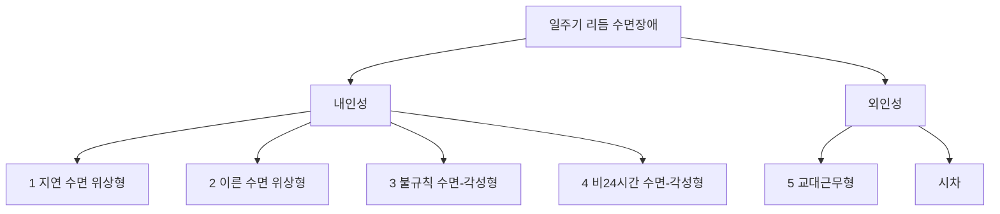



요약

잠의 양과 질은 괜찮은데, 몸속 시계가 사회의 시간표와 어긋나 원하는 시간에 잠들고 깨지 못하는 장애다. 새벽 4시에야 졸리는 올빼미형이 대표적이다. 사회 시간표에 억지로 맞추면 밤에는 잠이 안 오고(불면), 낮에는 졸리다(과다 졸음). 시계 자체를 옮겨야 하므로 일반 수면제는 별 도움이 안 되고, 알맞은 시각의 빛과 멜라토닌이 쓰인다.

## 예시로 보기

고등학생 HC는 새벽 3~4시가 되어야 졸리고, 그때 자면 오후 12시에 개운하게 깬다. 방학에는 문제가 없지만, 학기 중에 아침 7시에 일어나려면 밤 11시에 누워도 새벽까지 잠이 오지 않아, 수업 시간 내내 존다[^s1].

- 수면-각성 주기가 늦게 밀려 있다: 지연 수면 위상형(올빼미형).
- 제 시간표대로 자면 잠의 양과 질은 정상이다.
- 사회 시간표에 맞추면 불면과 낮 졸림이 생긴다.

## 정의

수면-각성 주기가 바뀌어 과도한 졸음과 불면이 생긴다[^1].

### 다섯 유형[^1][^2]

| 번호 | 유형 | 잠자는 시간대 |
|---|---|---|
| 1 | 지연 수면 위상형(올빼미형) | 정상보다 늦게 자고 늦게 일어난다 |
| 2 | 이른 수면 위상형(종달새형) | 정상보다 일찍 자고 일찍 일어난다 |
| 3 | 불규칙 수면-각성형 | 하루 동안 잠이 여러 토막으로 흩어진다 |
| 4 | 비24시간 수면-각성형 | 잠드는 시각이 날마다 조금씩 뒤로 밀린다 |
| 5 | 교대근무형 | 교대근무 일정 때문에 잠의 시간대가 어긋난다 |

1~4번은 몸속 시계 자체의 문제인 내인성(intrinsic type)이고, 교대근무와 시차(jet lag)는 바깥 일정이 시계를 어긋나게 하는 외인성(extrinsic type)이다[^2]. p.75의 그림은 정상 수면(자정~오전 8시 무렵)과 비교해 이른 위상은 저녁~새벽으로 당겨지고, 지연 위상은 새벽~정오로 밀리며, 비24시간형은 날마다 뒤로 조금씩 밀리는 모습을 보여 준다[^3].

## 치료[^4]

- 일반적인 수면제는 크게 도움이 되지 않는다.
- 사람마다의 수면 패턴에 따라 알맞은 시각에 광치료와 멜라토닌 복용.
- 교대근무와 시차: 수면 주기를 서서히 바꾼다.

"알맞은 시각"은 시계를 옮기려는 방향에 달려 있다. 지연 위상형은 시계를 앞당겨야 하므로 아침에 밝은 빛을 쬐고 저녁에 멜라토닌을 쓴다. 이른 위상형은 반대로 저녁에 빛을 쬔다[^s2].

## 연결

- 겉모습이 비슷한 장애: [불면장애](/Hongs_Blog/studies/abnormal-psychology/insomnia-disorder/)(제 시간표대로 자도 잠이 안 온다), [과다수면장애](/Hongs_Blog/studies/abnormal-psychology/hypersomnolence-disorder/)(충분히 자도 졸리다)

## 확인 문제

<b>C1</b> 일주기 리듬 수면-각성장애의 다섯 유형을 쓰고, 내인성과 외인성으로 나누라.

**답:** 내인성: 지연 수면 위상형(올빼미형), 이른 수면 위상형(종달새형), 불규칙 수면-각성형, 비24시간 수면-각성형. 외인성: 교대근무형(그림에는 시차도 외인성으로 들어 있다).

<b>C2</b> 두 사람이 모두 "밤 11시에 누우면 새벽 3시까지 잠이 안 온다"고 한다. HD는 새벽 3시에 자서 낮 11시까지 두면 개운하다. HE는 새벽 3시에 잠들어도 중간에 자꾸 깨고, 주말에 늦잠을 자도 피곤하다. 각각 무엇을 먼저 떠올리는가?

**답:** HD는 지연 수면 위상형: 잠의 시간대만 밀려 있고, 제 시간표대로 자면 양과 질이 정상이다. HE는 불면장애: 잘 기회가 있어도 잠들기와 유지가 어렵고 잠의 질이 나쁘다. 가르는 질문은 "원하는 시간대가 아니라서 못 자는가, 언제 자든 잘 못 자는가"다.

<b>C3</b> 예시의 HC에게 광치료를 한다면 아침과 저녁 가운데 언제 밝은 빛을 쬐게 하는가? 수면제가 도움이 되지 않는 이유와 함께 쓰라.

**답:** 아침. HC는 지연 위상형이라 시계를 앞당겨야 하고, 아침의 밝은 빛이 시계를 앞으로 당긴다(저녁 멜라토닌도 같은 방향으로 돕는다). 수면제는 잠을 억지로 들게 할 뿐 몸속 시계의 위치를 옮기지 못하므로, 약을 끊으면 다시 늦은 시계로 돌아간다.

[^1]: 4-1학기/이상 심리학/1.수업자료/08.급식 및 섭식장애, 수면-각성장애.pdf, p.74. 슬라이드 제목의 "Circardian"은 "Circadian"의 오타다.
[^2]: 4-1학기/이상 심리학/1.수업자료/08.급식 및 섭식장애, 수면-각성장애.pdf, p.74 (내인성·외인성 분류 그림). 유형 목록과 그림 상자에 ①~⑤를 맞춰 적은 것은 손글씨 필기다.
[^3]: 4-1학기/이상 심리학/1.수업자료/08.급식 및 섭식장애, 수면-각성장애.pdf, p.75 (수면 위상 그림). 비24시간형의 밀림을 따라 그은 화살표는 손글씨 필기다.
[^4]: 4-1학기/이상 심리학/1.수업자료/08.급식 및 섭식장애, 수면-각성장애.pdf, p.76
[^s1]: 에이전트 보충. HC의 사례는 지연 수면 위상형을 보이려고 만든 가상 사례다.
[^s2]: 에이전트 보충. 위상 방향에 따른 광치료·멜라토닌의 시각은 수면의학의 일반적 설명이다(빛은 아침에 위상을 앞당기고 저녁에 늦춘다).

