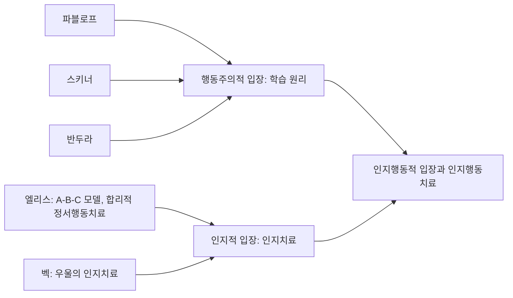



요약

같은 일을 겪어도 그 일을 어떻게 해석하느냐가 감정과 행동을 정한다고 본다. 마음의 병은 자신과 세상을 비현실적으로 부정적으로 보는 생각 습관에서 생기므로, 그 생각을 찾아 현실에 맞게 바꾸면 낫는다. 생각이라는 눈에 보이지 않는 과정을 다루면서도 검증할 수 있는 치료를 만들었다는 점이 강점이다. 다만 생각이 먼저인지 감정이 먼저인지, 부정적 생각이 원인인지 결과인지는 따로 확인해야 한다.

## 예시로 보기

두 학생이 같은 일을 겪는다. 단체 채팅방에 메시지를 올렸는데 아무도 답하지 않았다[^s1].

| | 학생 L | 학생 M |
|---|---|---|
| A: 사건 (Activating event) | 답이 없다 | 답이 없다 |
| B: 생각·신념 (Belief) | "다들 바쁜가 보다" | "역시 나를 싫어하는 거야. 나는 늘 무시당해" |
| C: 결과 (Consequence) | 별 감정 없이 다른 일을 한다 | 우울하고, 다음부터 말을 걸지 않는다 |

사건 A는 같은데 결과 C가 다르다. 차이를 만든 것은 B다. 슬라이드의 기본 가정 "사람은 사건 때문이 아니라 사건에 대한 견해 때문에 고통받는다"가 이 표다[^1]. M의 B에는 "늘", "다들"처럼 증거보다 크게 일반화한 인지적 왜곡이 들어 있다.

## 정의

### 기본 가정[^1]

- 사람은 세상을 심리적으로 구성하는 존재다.
- 인지(cognition)가 감정과 행동을 결정한다.
- 사람은 외부 사건이 아니라 그 사건에 대한 견해(view) 때문에 고통받는다[^s2].

### 원인론과 치료[^2]

- **원인론:** 정신장애는 부적응적 인지의 산물이다.
    - 자신과 세상에 대한 부정적 사고
    - 인지적 왜곡: 비현실적인 사고
    - 비합리적·역기능적 신념
- **치료 원리:** 부적응적 인지를 적응적 인지로 바꾼다. 현실적인 사고와 합리적인 신념으로 변화시킨다.

### 인지행동적 입장

행동주의적 입장과 인지적 입장을 합친 것이 인지행동적 입장이고, 그 치료가 **인지행동치료**(Cognitive Behavior Therapy, CBT)다[^3]. 슬라이드는 이 흐름의 인물로 파블로프, 스키너, 반두라, 엘리스(Ellis), 벡(Beck)을 든다[^3]. 앞의 셋은 [행동주의적 입장](/Hongs_Blog/studies/abnormal-psychology/behavioral-perspective/)의 학습 원리를, 뒤의 둘은 인지치료를 대표한다. 엘리스는 A-B-C 모델로 합리적 정서행동치료를, 벡은 우울의 인지치료를 만들었다[^s3].

행동주의가 "무엇을 겪었나(자극과 결과)"를 본다면, 인지적 입장은 그 사이에 "어떻게 받아들였나(해석)"를 끼워 넣는다. 같은 경험에도 사람마다 반응이 다른 이유, 곧 행동주의가 설명하지 못한 부분을 여기서 설명한다.

다섯 사람이 두 줄기로 모이고, 두 줄기가 합쳐 인지행동치료가 된다[^s4].

## 연결

- 앞선 입장과 통합: [행동주의적 입장](/Hongs_Blog/studies/abnormal-psychology/behavioral-perspective/)
- 역기능적 신념과 인지도식은 취약성의 일부다: [취약성-스트레스 모델](/Hongs_Blog/studies/abnormal-psychology/vulnerability-stress-model/)
- 방어기제와 비교: 둘 다 현실을 비틀어 받아들이지만, 방어기제는 무의식적 동기에서, 인지적 왜곡은 학습된 사고 습관에서 나온다고 본다([방어기제](/Hongs_Blog/studies/abnormal-psychology/defense-mechanisms/)).
- 3회에서 우울증의 인지이론(벡의 인지삼제)과 인지행동치료의 기법(ABC 기법, 하향화살표 기법)으로 이어진다.

## 확인 문제

<b>C1</b> 인지적 입장의 기본 가정 셋과, 정신장애를 일으킨다고 보는 부적응적 인지 세 가지를 쓰라.

**답:** 기본 가정: 사람은 세상을 심리적으로 구성한다. 인지가 감정과 행동을 결정한다. 사건이 아니라 사건에 대한 견해 때문에 고통받는다. 부적응적 인지: 자신과 세상에 대한 부정적 사고, 인지적 왜곡(비현실적 사고), 비합리적·역기능적 신념.

<b>C2</b> 시험에서 70점을 받은 학생 N이 "70점이면 나는 실패자다. 이 전공은 나와 안 맞는다"며 이틀 동안 방에서 나오지 않았다. A, B, C를 나누고, 인지적 입장의 치료가 바꾸려는 부분을 쓰라.

**답:** A: 70점을 받았다. B: "70점이면 실패자다", "전공이 안 맞는다". C: 우울과 은둔. 치료는 A가 아니라 B를 바꾼다. "한 번의 70점이 실패자라는 증거인가?", "다른 과목과 지난 시험은 어땠나?"처럼 증거를 따져 보고, "이번 시험은 기대보다 낮았고, 공부 방법을 점검할 필요가 있다" 같은 현실적인 생각으로 바꾸도록 돕는다.

<b>C3</b> 발표 공포를 행동주의적 입장과 인지적 입장은 각각 어떻게 설명하고 어떻게 치료하는가?

**답:** 행동주의: 예전에 발표하다 망신당한 경험(고전적 조건형성)으로 공포가 생겼고, 발표를 피하면 불안이 줄어 회피가 강화된다(부적 강화). 치료는 발표 상황에 단계적으로 노출해 소거한다. 인지적: "실수하면 모두가 나를 무능하다고 볼 것"이라는 역기능적 신념이 공포를 만든다. 치료는 그 신념의 증거를 따져 현실적인 생각으로 바꾼다. 
**가르는 질문:** 원인을 경험과 결과의 연결에서 찾는가, 그 경험에 대한 해석에서 찾는가.

[^1]: 이상 심리학 1회 강의 자료 「이상심리학」, p.50
[^2]: 이상 심리학 1회 강의 자료 「이상심리학」, p.51
[^3]: 이상 심리학 1회 강의 자료 「이상심리학」, p.52 (인지행동적 입장, 인물 사진)
[^s1]: 보충 단체 채팅방 사례와 A-B-C 표는 기본 가정을 보이려고 만든 가상 사례다.
[^s2]: 보충 이 가정은 스토아 철학자 에픽테토스의 말("사람을 괴롭히는 것은 사물이 아니라 사물에 대한 견해다")에서 왔고, 엘리스와 벡이 인지치료의 출발점으로 인용했다.
[^s3]: 보충 엘리스의 A-B-C 모델(사건-신념-결과)과 합리적 정서행동치료(REBT), 벡의 우울 인지치료는 인지치료의 역사에 대한 표준 설명이다. 3회 슬라이드가 "인지적 재구성: ABC 기법"을 다룬다.
[^s4]: 보충 다이어그램 1개는 원본에 없다. '인지행동적 입장' 절(슬라이드 p.52의 인물 목록)을 그렸다.

