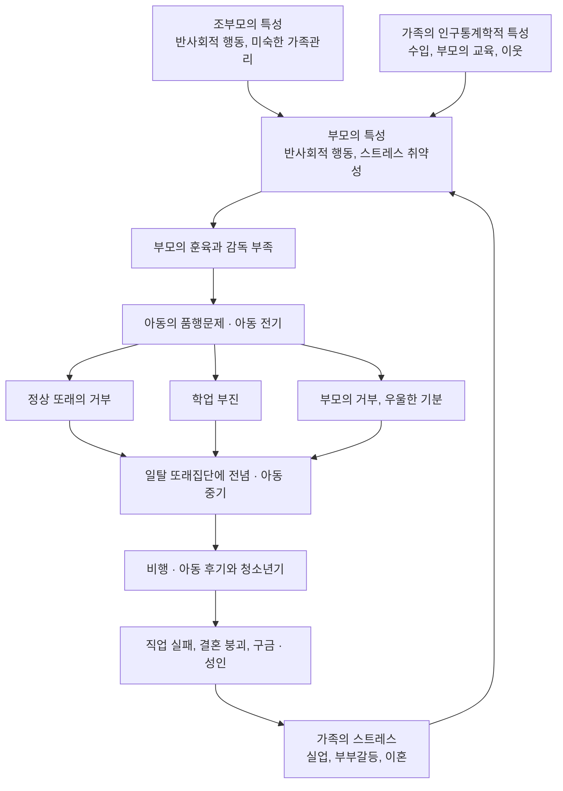



요약

남을 괴롭히고, 동물을 학대하고, 물건을 부수고, 훔치고, 가출하는 등 다른 사람의 기본 권리를 침해하고 나이에 맞는 규칙을 반복해서 어기는 아동·청소년의 장애다. 어른에게 반항하는 데 그치는 적대적 반항장애보다 훨씬 심각하다. 어릴 때의 ADHD에서 시작해 품행장애를 거쳐 성인의 반사회성 성격장애로 이어지는 경로가 있다. 다만 모두 그 길로 가지는 않고, 벌을 세게 줄수록 오히려 나빠진다.

## 예시로 보기

열다섯 살 IU는 1년 동안 후배를 협박해 돈을 빼앗고, 싸움에서 칼을 꺼낸 적이 있으며, 길고양이를 괴롭혔다. 열두 살 때부터 부모 몰래 밤늦게 들어오지 않았고, 두 번 가출했다. 들켜도 미안해하지 않고 "걔가 약해서 그런 거"라고 말한다. 아버지는 술을 마시면 IU를 때렸고, 어머니는 IU의 행동을 거의 모른다[^s1].

- 사람과 동물에 대한 공격성(협박, 무기, 동물 학대), 사기·절도(갈취), 중대한 규칙 위반(13세 이전 외박, 가출).
- 후회나 죄책감의 결여, 공감의 결여: "제한된 친사회적 정서" 명시자(같은 진단에 경과, 심한 정도, 특별한 양상 같은 특징을 덧붙여 적는 항목. 여러 개를 함께 붙일 수 있다) 후보.
- 가정환경: 폭력적 양육, 방임, 부모의 알코올 문제.

## 정의

다른 사람의 기본 권리를 침해하고 나이에 맞는 사회적 규범과 규칙을 어기는 행동이 지속적이고 반복적으로 나타난다[^1].

품행장애의 네 영역[^1]

**사람과 동물에 대한 공격성**
- 다른 사람을 못살게 굴거나 협박한다.
- 자주 싸움을 걸고, 심한 신체 손상을 줄 수 있는 무기를 쓴다.
- 사람이나 동물을 잔인하게 대한다.
- 다른 사람에게 성적 행동을 강요한다.

**재산 파괴**
- 심각한 손상을 입히려는 의도로 일부러 불을 지른다.
- 다른 사람의 재산을 고의로 파괴한다.

**사기 또는 절도**
- 남의 집, 건물, 자동차에 무단으로 침입한다.
- 자주 거짓말을 하거나 물건을 훔친다.

**중대한 규칙 위반**
- 부모의 금지에도 외박, 무단결석, 가출 등을 13세 이전부터 시작한다.

DSM-5-TR은 15개 증상 가운데 3개 이상이 지난 12개월 동안, 그 가운데 1개 이상이 지난 6개월 동안 있어야 한다고 정한다. 10세 이전에 증상이 하나라도 있으면 아동기 발병형, 없으면 청소년기 발병형으로 나눈다[^s2].

### 명시자: 제한된 친사회적 정서[^2]

품행장애와 함께 진단하는 명시자다. 12개월 이상 여러 대인관계와 사회적 장면에서 다음 가운데 2개 이상을 보인다.

- 후회나 죄책감의 결여
- 냉담(공감의 결여)
- 수행에 대한 무관심
- 피상적이거나 결여된 정서

## 임상적 특징[^3]

- 아동기와 청소년기에 흔하다. 18세 이하 남자의 6~16%, 여자의 2~9%로 추정된다. 남자가 4~12배 많다.
- 갑자기 생기지 않고 서서히 증상이 나타난다.
- 아동기 ADHD → 청소년기 품행장애 → 성인기 [반사회성 성격장애](/Hongs_Blog/studies/abnormal-psychology/antisocial-pd/)로 발전하는 경로가 있다.
- 지능이 정상이고, 가족 문제가 없고, 다른 정신장애가 없으면 예후가 좋다.
- 사회경제적 수준이 낮은 계층에 많다.

## 원인

### 기질적·유전적 요인[^4]

- 가족력, 까다롭고 요구가 많은 성격, 충동 조절력 부족, 좌절 인내력 결함, 도덕적 감수성 부족, 언어성 지능 저하.
- 핵심 유전적 취약성인 충동성, 낮은 인내력, 높은 보상추구 성향은 ADHD, 품행장애, 반사회성 성격장애에 공통된 위험요인이다.

### 가정환경[^5]

부모의 잘못된 양육과 열악한 가정환경: 강압적이고 폭력적인 양육, 무관심하고 방임적인 양육, 부모의 불화·가정폭력·아동학대·결손가정, 부모의 정신장애나 알코올 사용장애.

### 사회적 환경[^6]

- 또래의 거부, 일탈 또래와의 동조.
- 폭력적인 이웃 환경의 목격.
- 비행을 용인하는 문화적 분위기.
- 빈곤해서 정당한 방법으로 욕구를 채우기 어려움.
- 학업 실패와 발달 병리의 악순환: 저성과 → 학교 부적응 → 사회적 낙인 → 비행 강화.

### 정신분석과 학습이론[^7]

- 정신분석: 초자아 기능의 결함. 사회규범과 도덕 판단이 발달하지 못해 양심과 윤리의식이 결여된다.
- 학습이론: 모방학습과 강화.

### 발달경로모델(Capaldi & Patterson, 1994)[^8]

마지막 화살표가 다음 세대의 가족 스트레스로 돌아가, 품행 문제가 세대를 넘어 되풀이되는 고리가 된다.

## 치료[^9][^10]

- 한 가지 치료법으로는 효과를 기대하기 어렵다. 부모, 교사, 전문가가 협력하는 다각적 접근과 장기적·지속적 개입이 필요하다.
- **부모와 환경 개입:**
    - 부모의 인내심 있고 적극적인 참여가 필요하다.
    - 처벌 중심의 훈육은 효과가 없고 증상을 악화시킬 수 있다.
    - 부모-자녀 의사소통의 악순환을 끊는다. 부모의 비난, 실망, 분노 표현이 아이의 저항과 반발을 더 키운다.
    - 부모가 분노를 효과적으로 표현하고 욕구를 채우는 방법을 배우게 한다.
- **심리치료:** 목표는 자기조절 능력 향상과 적응 기술 습득이다.
    - 인지행동치료: 적대적 귀인 편향과 공격적 반응의 정당화를 고친다. 일관된 보상과 처벌의 규칙으로 긍정적 행동을 강화하고 반사회적 행동을 약화한다. 새로운 적응 기술과 좌절 인내력을 키운다. 궁극적으로 긍정적인 자아상을 되찾게 한다.
- **약물치료:** 공격 행동을 줄이고 공존질환을 완화하는 보조 역할이다.

## 스스로 설명해 보기

1. "처벌 중심의 훈육은 품행장애를 악화시킬 수 있다."
   

근거

   부모의 비난과 분노는 아이의 저항과 반발을 키우는 의사소통의 악순환을 만든다. 강압적·폭력적 양육 자체가 원인 요인이고, 아이는 폭력을 모방학습한다. 그래서 일관된 규칙과 긍정적 행동의 강화가 필요하다.
   

2. "학업 실패가 비행을 강화한다."
   

근거

   저성과 → 학교 부적응 → 사회적 낙인으로 정상 또래와 학교에서 밀려나면, 받아들여 주는 일탈 또래집단에 전념하게 되고 비행이 늘어난다(발달경로모델의 아동 중기).
   

3. "지능이 정상이고 가족 문제가 없으면 예후가 좋다."
   

근거

   위험요인이 겹칠수록 경로가 반사회성 성격장애로 이어지기 쉽다. 정상 지능과 안정된 가족은 학업 실패, 부모의 훈육 부족 같은 경로의 고리를 끊는 보호요인이다.
   

- 이 장애의 핵심 아이디어는?
  

답

  기질적 취약성(충동성, 보상추구)에 부모의 훈육 부족과 사회적 거부가 더해져, 규범 위반이 단계마다 강화되는 발달 경로다. 개입은 한 지점이 아니라 부모, 학교, 또래 여러 고리에서 동시에 해야 한다.
  

## 자주 하는 오해

"품행장애 아이는 엄하게 벌하면 고쳐진다"

틀렸다. 잘못한 만큼 벌을 주면 행동이 줄어들 것 같아 그럴듯하다. 하지만 처벌 중심의 훈육은 효과가 없고 증상을 악화시킬 수 있다[^9]. 강압적이고 폭력적인 양육은 그 자체가 품행장애의 원인 요인이고, 부모의 비난과 분노는 아이의 반발을 키운다. 효과가 있는 것은 일관되고 예측 가능한 규칙, 긍정적 행동에 대한 강화, 적대적 귀인 편향을 고치는 인지행동치료, 부모의 장기적 참여다.

## 확인 문제

<b>C1</b> 품행장애의 네 영역을 쓰고, 영역마다 증상을 하나씩 쓰라.

**답:** 사람과 동물에 대한 공격성(협박, 무기 사용, 동물 학대, 성적 강요), 재산 파괴(고의적 방화, 재산 파괴), 사기 또는 절도(무단 침입, 거짓말, 도둑질), 중대한 규칙 위반(13세 이전부터 외박, 무단결석, 가출).

<b>C2</b> "제한된 친사회적 정서" 명시자를 따로 붙이는 이유를, 네 특징과 연결해 추론하라.

**답:** 후회·죄책감의 결여, 냉담, 수행에 대한 무관심, 피상적 정서를 가진 아이들은 같은 품행장애 안에서도 더 심하고 오래 가며, 처벌이나 타인의 고통에 덜 반응한다. 이 하위집단을 구별하면 예후를 예측하고, 공감과 정서 반응을 겨냥한 치료를 계획할 수 있다. 성인기의 반사회성 성격장애로 이어질 위험을 가늠하는 데도 쓰인다[^s3].

<b>C3</b> 예시의 IU를 발달경로모델(Capaldi & Patterson)의 단계에 놓아 보라. IU는 지금 어느 단계이고, 앞으로 어떤 고리가 이어질 위험이 있는가?

**답:** 부모의 특성(아버지의 음주·폭력)과 부모의 훈육·감독 부족(어머니의 무관심) → 아동 전기의 품행문제 → 지금은 아동 후기·청소년기의 비행 단계(갈취, 무기, 가출)다. 이어서 성인기의 직업 실패, 결혼 붕괴, 구금으로 가고, 그것이 다음 세대의 가족 스트레스가 될 위험이 있다.

<b>C4</b> IU의 부모가 "더 세게 때려서라도 고치겠다"고 한다. 치료자로서 무엇을 권하는가?

**답:** 처벌 중심·폭력적 훈육은 효과가 없고 악화시킬 수 있다고 설명한다. 대신 일관되고 예측 가능한 규칙과 결과, 긍정적 행동에 대한 강화, 부모 자신의 분노 표현 방법 교육, 아버지의 음주 문제 치료를 권한다. IU에게는 적대적 귀인 편향과 공격의 정당화를 고치는 인지행동치료를, 학교와는 학업 지원을 함께 계획한다.

[^1]: 이상 심리학 10회 강의 자료 「파괴적, 충동조절 및 품행장애, 물질관련 및 중독장애」, p.20
[^2]: 이상 심리학 10회 강의 자료 「파괴적, 충동조절 및 품행장애, 물질관련 및 중독장애」, p.22. "품행장애와 함께 진단"은 손글씨 필기다.
[^3]: 이상 심리학 10회 강의 자료 「파괴적, 충동조절 및 품행장애, 물질관련 및 중독장애」, p.21
[^4]: 이상 심리학 10회 강의 자료 「파괴적, 충동조절 및 품행장애, 물질관련 및 중독장애」, p.23
[^5]: 이상 심리학 10회 강의 자료 「파괴적, 충동조절 및 품행장애, 물질관련 및 중독장애」, p.24
[^6]: 이상 심리학 10회 강의 자료 「파괴적, 충동조절 및 품행장애, 물질관련 및 중독장애」, p.25
[^7]: 이상 심리학 10회 강의 자료 「파괴적, 충동조절 및 품행장애, 물질관련 및 중독장애」, p.26
[^8]: 이상 심리학 10회 강의 자료 「파괴적, 충동조절 및 품행장애, 물질관련 및 중독장애」, p.27 (Capaldi와 Patterson, 1994의 발달경로모델 그림)
[^9]: 이상 심리학 10회 강의 자료 「파괴적, 충동조절 및 품행장애, 물질관련 및 중독장애」, p.28
[^10]: 이상 심리학 10회 강의 자료 「파괴적, 충동조절 및 품행장애, 물질관련 및 중독장애」, p.29
[^s1]: 보충 IU의 사례는 네 영역과 원인 요인을 보이려고 만든 가상 사례다.
[^s2]: 보충 DSM-5-TR 품행장애 기준 A의 개수 조건(15개 가운데 3개 이상, 12개월, 1개는 6개월 이내)과 발병 시기 하위유형을 보탰다.
[^s3]: 보충 제한된 친사회적 정서(냉담-무정서 특성)를 가진 품행장애가 더 심하고 지속적이며 처벌 단서에 덜 반응한다는 점은 DSM-5-TR과 관련 연구(Frick 등)의 설명이다.

