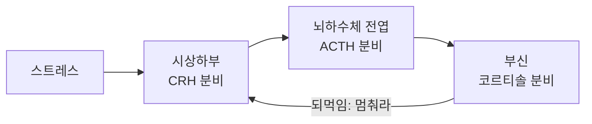
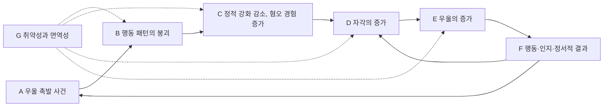



요약

우울은 한 가지 원인으로 생기지 않는다. 힘든 일(생활사건)은 중요한 방아쇠지만 그것만으로는 우울의 20%도 설명하지 못한다. 그 밑에 뇌의 화학물질과 스트레스 호르몬 체계, 생체시계의 이상, 상실에 대한 무의식적 반응, 보상이 줄어든 생활, 비관적인 설명 습관과 생각의 틀이 겹쳐 있다. 그래서 스트레스와 취약성, 그리고 이를 막아 주는 보호요인을 함께 본다.

## 예시로 보기

같은 해에 실직한 두 사람 AQ와 AR 가운데 AQ만 우울장애가 되었다. 각 입장은 차이를 다른 곳에서 찾는다[^s1].

| 입장         | AQ에게서 찾는 차이                                              |
| ---------- | -------------------------------------------------------- |
| 생물학적       | 우울증 가족력, 스트레스를 받으면 코르티솔이 잘 내려가지 않는 체질                    |
| 정신분석적      | 직장이라는 애정 대상을 잃은 분노가 자기에게로 향했다                            |
| 행동주의적      | 동료와의 대화, 성취감 같은 긍정적 강화가 한꺼번에 사라졌고, 새 강화를 얻을 사회적 기술이 부족하다 |
| 학습된 무기력·귀인 | "무엇을 해도 안 된다", "내가 무능해서다, 앞으로도 늘 그럴 것이다"                 |
| 인지적        | "나는 쓸모없다"는 오래된 도식이 실직으로 깨어났다                             |
| 사회환경적      | 가족과 친구의 지지가 적다                                           |

AR에게는 이 가운데 몇 가지가 없었다. 이것이 슬라이드의 결론 "현재 밝혀진 모든 요인이 상호작용해서 혹은 단 하나의 요인만으로 우울장애가 발생할 수도 있다"의 뜻이다[^1].

## 정의

### 생활사건과 취약성

- **부정적 생활사건:** 우울은 진공 상태에서 생기지 않는다. 주요 생활사건, 경미한 생활사건(일상의 사소한 스트레스), 사회적 지지의 부족이 관여한다. 그러나 생활사건은 필요하지만 충분하지 않다. 우울의 발생과 심각도를 20%도 설명하지 못한다[^2].
- **다면적 원인:** 단일한 요인은 밝혀지지 않았고, 사회·심리·생물 요인이 함께 연구된다[^1].
- **스트레스-취약성 모델과 보호요인:** 대부분의 정신장애처럼 우울도 [취약성-스트레스 모델](/Hongs_Blog/studies/abnormal-psychology/vulnerability-stress-model/)을 따른다. 여기에 사회적·심리적 자원 같은 보호요인을 함께 고려해야 한다[^3]. p.19의 그림은 취약성이 클수록 증상이 나타나는 데 필요한 스트레스가 작아지는 문턱 곡선이다.

### 1. 생물학적 원인

**유전[^4].** 특히 양극성 우울에서 유전의 영향이 크다. 주요우울장애 가운데서는 일찍 시작하고 재발하는 경우의 유전율이 더 높다. 뇌 연구는 기분장애에 신경생물학적 기초가 있음을 보여 주지만, 증상이 다양한 만큼 환자들이 모두 같은 이상을 보이리라 기대하기는 어렵다.

**신경전달물질[^5].** 노르에피네프린과 세로토닌이 부족하면 우울, 지나치면 조증이 된다고 추정했다. 초기에는 이 물질들의 결핍이 우울을 만든다고 보았고, 최근에는 조절의 실패에 초점을 둔다. 연구가 진행 중이다.

원본 오류 의심

원문: "Catecholamine 계열의 전달물질: Norepinephreine, Serotonin 등"(p.21), "Catecholamine 계열의 신경전달물질: Norepinephreine, Serotonin, Dopamin"(p.53) / 문제점: 세로토닌은 카테콜아민이 아니라 인돌아민이다. 카테콜아민은 도파민, 노르에피네프린, 에피네프린이다. 셋을 묶는 이름은 모노아민이다. 철자도 Norepinephrine, Dopamine이 맞다. / 수정안: "모노아민 계열의 신경전달물질: 노르에피네프린·도파민(카테콜아민)과 세로토닌(인돌아민)" / 근거: 신경전달물질의 화학 구조에 따른 표준 분류[^s2].

**HPA 축(시상하부-뇌하수체-부신 축)[^6].** 스트레스 호르몬을 만들고 분비를 조절하는 신경내분비 체계의 중심이다.

필기는 슬라이드의 세 문장에 번호를 붙였다[^6].
1. 우울한 사람은 코르티솔 수준이 높다.
2. HPA 축이 민감한 것이 우울의 위험요인일 수 있다.
3. 스트레스가 강하면 넘치는 코르티솔이 되먹임 고리를 망가뜨려 스트레스 반응이 끝나지 않는다. 그림의 설명대로, 우울에서는 되먹임 폐쇄가 실패해 만성 스트레스로 경험되는 만성적 활성화가 생긴다.

**생체리듬[^7].** 우울한 사람에게서 수면-각성 주기와 체온 조절 주기를 맞추는 생물학적 시계의 이상이 보고된다. 계절성 우울증(필기: 겨울에 특히)과 관련된다. 슬라이드의 그림은 일조량이 줄면 멜라토닌(수면 호르몬)이 늘어 의욕이 떨어지고 세로토닌이 줄어 부정적 감정을 잘 느끼게 된다고 설명한다. 멜라토닌의 이상은 밝은 빛을 쬐는 광치료로 다룬다. 실내 조명을 밝게 하고, 낮 활동을 늘리고, 일정한 시각에 자고 일어나는 것도 권한다[^7].

### 2. 심리적 원인

**정신분석적 입장[^8].**
- 프로이트: 우울은 애정 대상의 상실에 대한 무의식적 반응이다. 사랑하는 사람이 죽으면 처음에는 상실을 받아들이지 못한다. 필기는 여기에 "실직도 마찬가지"를 덧붙였다. 사랑하는 대상을 향한 슬픔과 분노가 섞인 감정이 자신을 향하면(분노의 내향화) 자기비난이 되고, 심하면 자살로 이어진다. 실제 상실이 아닌 상징적·상상의 상실에도 같은 기제가 작동한다.
- 스트리커(Striker)는 어린 시절 외상 경험이 되살아나는 것으로 보았다.

**행동주의적 입장: 긍정적 강화의 상실[^9].** 르윈손(Lewinsohn) 등은 우울을 강화의 문제로 본다.
- 부정적 생활사건이 긍정적 강화를 앗아간다.
- 긍정적 강화를 이끌어 낼 사회적 기술이 부족하다.
- 불쾌한 상황에 대처하는 기술이 미숙하다.

슬라이드의 모형(Lewinsohn, Hoberman, Teri & Hautzinger, 1985)은 A 우울 촉발 사건 → B 중요한 행동 패턴의 붕괴 → C 정적 강화의 감소와 혐오적 경험의 증가 → D 자각의 증가 → E 우울의 증가 → F 행동·인지·정서적 결과로 이어지고, G 취약성과 면역성(개인의 소인)이 모든 단계에 영향을 준다. F는 다시 A와 D로 되돌아가 악순환을 만든다[^9].

A에서 F까지 한 줄로 따라간 뒤, F에서 A와 D로 되돌아가는 두 화살표를 본다. 점선은 개인의 소인(G)이 중간 단계마다 끼어든다는 뜻이다[^s3].

**학습된 무기력과 귀인, 인지.** 따로 문서가 있다: [학습된 무기력 이론](/Hongs_Blog/studies/abnormal-psychology/learned-helplessness/), [우울증의 귀인이론](/Hongs_Blog/studies/abnormal-psychology/attribution-theory-depression/), [우울증의 인지이론](/Hongs_Blog/studies/abnormal-psychology/beck-cognitive-theory/).

### 3. 사회환경적 원인[^10]

사회경제적 조건, 지지 체계, 결혼 유무, 성별, 인종 등.

## 연결

- 원인을 한 지도에 모으면: [생물심리사회적 모델](/Hongs_Blog/studies/abnormal-psychology/biopsychosocial-model/)
- 생물학적 가설의 한계(약의 효과로 원인을 추론하는 문제): [생물의학적 입장](/Hongs_Blog/studies/abnormal-psychology/biomedical-perspective/)
- 원인별 치료: [주요우울장애](/Hongs_Blog/studies/abnormal-psychology/major-depressive-disorder/)의 치료

## 확인 문제

<b>C1</b> "부정적 생활사건은 우울에 중요하지만 충분조건은 아니다"는 슬라이드의 말을 수치를 들어 설명하고, 이것이 어떤 모델로 이어지는지 쓰라.

**답:** 생활사건은 우울의 발생과 심각도를 20%도 설명하지 못한다. 같은 사건을 겪어도 우울해지는 사람과 아닌 사람이 있다는 뜻이고, 그 차이를 취약성(유전, HPA 축의 민감성, 인지 도식 등)과 보호요인(지지, 심리적 자원)이 만든다. 그래서 스트레스-취약성 모델로 이어진다.

<b>C2</b> 우울의 생물학적 원인으로 슬라이드가 드는 네 가지를 쓰고, HPA 축에 대한 세 가지 주장을 쓰라.

**답:** 유전적 요인, 뇌의 신경전달물질(노르에피네프린·세로토닌의 결핍 또는 조절 실패), HPA 축의 문제, 생체리듬의 이상(계절성 우울, 멜라토닌). HPA 축: (1) 우울한 사람은 코르티솔 수준이 높다. (2) HPA 축의 민감성이 위험요인일 수 있다. (3) 강한 스트레스로 넘친 코르티솔이 되먹임 고리를 망가뜨려 스트레스 반응이 끝나지 않는다.

<b>C3</b> 실직 뒤의 우울을 정신분석적 입장과 행동주의적 입장(르윈손)은 각각 어떻게 설명하는가?

**답:** 정신분석: 직장이라는 애정 대상을 잃은 데 대한 무의식적 반응으로, 잃은 대상을 향한 분노가 자신에게로 향해(분노의 내향화) 자기비난과 우울이 된다. 행동주의: 직장이 주던 긍정적 강화(동료, 성취, 보수)가 사라졌고, 새 강화를 얻을 사회적 기술과 대처 기술이 부족해 활동이 줄고 우울이 깊어진다. 
**가르는 질문:** 원인을 무의식적 감정의 방향에서 찾는가, 환경이 주는 보상의 양에서 찾는가.

[^1]: 4-1학기/이상 심리학/1.수업자료/03.양극성장애와 우울장애.pdf, p.18 (Depression: Multifaceted 그림)
[^2]: 4-1학기/이상 심리학/1.수업자료/03.양극성장애와 우울장애.pdf, p.17
[^3]: 4-1학기/이상 심리학/1.수업자료/03.양극성장애와 우울장애.pdf, p.19 (The Diathesis–Stress Model 그림과 스트레스-취약성 문턱 그래프, Zubin & Spring, 1977)
[^4]: 4-1학기/이상 심리학/1.수업자료/03.양극성장애와 우울장애.pdf, p.20
[^5]: 4-1학기/이상 심리학/1.수업자료/03.양극성장애와 우울장애.pdf, p.21
[^6]: 4-1학기/이상 심리학/1.수업자료/03.양극성장애와 우울장애.pdf, p.22. 세 문장의 번호 ①②③은 손글씨 필기다. 되먹임 설명은 슬라이드의 그림 속 글이다.
[^7]: 4-1학기/이상 심리학/1.수업자료/03.양극성장애와 우울장애.pdf, p.23. "겨울에 특히"는 손글씨 필기다. 멜라토닌·세로토닌 설명과 우울감을 없애는 방법은 슬라이드의 그림 속 글이다.
[^8]: 4-1학기/이상 심리학/1.수업자료/03.양극성장애와 우울장애.pdf, p.24. "실직도 마찬가지"는 손글씨 필기다.
[^9]: 4-1학기/이상 심리학/1.수업자료/03.양극성장애와 우울장애.pdf, p.25 (Lewinsohn, Hoberman, Teri & Hautzinger, 1985의 그림)
[^10]: 4-1학기/이상 심리학/1.수업자료/03.양극성장애와 우울장애.pdf, p.31
[^s1]: 에이전트 보충. AQ와 AR의 비교 표는 각 입장의 원인론을 한 사례에 적용한 가상 사례다.
[^s2]: 에이전트 보충. 카테콜아민(도파민, 노르에피네프린, 에피네프린)과 인돌아민(세로토닌)을 합쳐 모노아민이라 부르는 것은 신경화학의 표준 분류다. 우울의 "모노아민 가설"이 이 이름을 쓴다.
[^s3]: 에이전트 보충. 다이어그램 1개는 원본에 없다. 이 문서 '행동주의적 입장'의 모형 설명과 p.25 Lewinsohn 외(1985) 그림을 근거로 그렸다.

