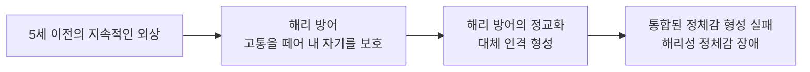


<div class="callout callout-summary" markdown="1">
<div class="callout-title callout-title--default" markdown="span">요약</div>

한 사람 안에 서로 다른 둘 이상의 인격이 번갈아 나타나고, 한 인격일 때의 일을 다른 인격은 기억하지 못하는 장애다. 예전에는 다중인격장애라고 불렀다. 어린 시절 견딜 수 없는 학대를 "그건 내가 아니라 다른 아이에게 일어난 일"로 떼어 내던 생존 방식이 굳어진 것으로 본다. 만 명에 한 명 이하로 매우 드물고, 치료의 목표는 인격들을 없애는 것이 아니라 하나로 통합하는 것이다.

</div>


## 예시로 보기

서른 살 EF는 가끔 옷장에서 자기가 산 기억이 없는 옷을 발견하고, 모르는 사람이 "지난주에 만났잖아"라며 다른 이름으로 부른다. 친구들은 EF가 갑자기 어린아이 말투로 변하거나, 전혀 다른 성격으로 화를 내는 모습을 본 적이 있다. EF는 어린 시절 오랫동안 학대를 받았다[^s1].

- 구별되는 성격 상태가 둘 이상이고, 바뀔 때 갑작스럽고 극적이다(A).
- 일상적 사건과 개인정보에 대한 기억 공백이 있다(B).
- 아동기의 지속적인 외상이 있다(외상 모델).

## 정의

<div class="callout callout-definition" markdown="1">
<div class="callout-title" markdown="span">해리성 정체감 장애의 진단기준</div>

A. 둘 이상의 성격 상태로 나타나는 정체감의 분열[^1]
- 빙의(possession) 경험으로 기술되기도 한다.
- 자기감의 연속성이 끊기고, 심리적 기능 전반이 달라진다.

B. 일상적 사건이나 중요한 개인정보에 대한 기억 공백이 반복된다. 보통의 망각으로 설명되지 않는다.<br>
C. 현저한 고통이나 사회적·직업적 기능 손상<br>
D. 널리 받아들여지는 문화적·종교적 관습의 일부가 아니다.

</div>


D가 있는 이유는 종교 의식이나 문화적 관습 속 빙의 체험을 병으로 보지 않기 위해서다[^s2].

### 임상적 특징[^2][^3]

- 2~10개 이상의 인격이 발달한다. 이를 하위 성격(subpersonalities) 또는 대체 성격(alternate personalities)이라 한다.
    - 주 인격(host personality)이 다른 인격보다 자주 나타난다.
    - 다른 인격으로 바뀔 때 갑작스럽고 극적이다.
    - 자신의 말과 행동을 관찰자처럼 바라보는 것 같다고 보고한다.
    - 평소와 다른 느낌: 아이가 된 것 같은, 반대 성이 된 것 같은, 거대하고 근육질의 몸이 된 것 같은 느낌.
    - 통제를 벗어난 느낌: 자아와 이질적이어서 당혹스럽게 경험한다.
- 매우 드물다(10,000명 중 1명 이하).
- 허구적인 장애라는 주장도 있다. 그러나 주변 사람이 하위 인격을 직접 목격한 사례가 드물게 보고된다.
- 만성적이고 재발하는 경향이 높다. 특히 심한 스트레스나 약물 남용 때 재발한다.

## 원인

### 1. 외상 모델(trauma model)[^4]

아동기 외상 경험과 해리 방어에 초점을 둔다.



삶의 초기의 해리는 정신적 붕괴를 막는 자기보호 기능, 곧 살아남기 위한 대처 방략이다. 그러나 이후 성장 과정에서 통합된 정체감을 형성하지 못하면 장애로 발전한다.

### 2. 4요인 모델(four factor model)[^5]

네 조건을 **모두** 갖췄을 때 해리성 정체감 장애로 발전한다.

| 요인 | 내용 |
|---|---|
| 해리 능력 | 지적 능력, 피암시성, 상상력 |
| 외상 경험 | 신체적·성적 학대 경험 |
| 응집력 있는 자아의 획득 실패 | 대체 인격의 증가와 발달 |
| 정서적으로 돌봐 주는 사람의 부재 | 위로와 진정 경험의 결핍 |

외상만으로는 부족하다. 해리할 능력이 있어야 하고, 외상 뒤 달래 줄 사람이 없어야 하며, 그 결과 자아가 하나로 뭉치지 못해야 한다[^s3].

### 3. 신해리이론(neo-dissociation theory)[^6]

마음은 여러 개의 인지체계로 나뉘어 있고, 각 체계는 자기 입력과 출력을 가진다. 그 위에서 **집행적 자아**(중앙통제장치)가 이 체계들을 통합하고 통제한다. 해리는 집행적 자아와 인지체계 사이가 세로로 갈라지는 수직분할이다. 한 인지체계가 집행적 자아의 통제에서 떨어져 나가 따로 작동하면, 그 체계의 경험은 의식에 통합되지 않는다[^s4].

```
            ┌─────────────────┐
            │   집행적 자아    │ ◀── 수직분할
            └──────┬──▲───────┘
┌──────────────────┼──┼────────────────────┐
│  인지체계 1  │   인지체계 2   │  인지체계 3  │
│  입력  출력  │   입력  출력   │  입력  출력  │
└──────────────────────────────────────────┘
```

## 치료[^7]

- 주된 치료법은 심리치료다.
- 치료 목적과 방향:
    1. 개인 안의 다른 인격이 있다는 것을 인식하고, 서로 교류하고 협동하게 한다.
    2. 외상 경험으로 생긴 심리적 상처를 치유한다.
    3. 여러 인격을 통합해 적응 기능을 높인다.
    4. 궁극적으로 가장 적응적이고 지배적인 인격을 중심으로 통합한다.

## 연결

- 해리의 뜻과 세 유형: [해리](/Hongs_Blog/studies/abnormal-psychology/dissociation/)
- 기억 공백(B)만 두드러질 때: [해리성 기억상실증](/Hongs_Blog/studies/abnormal-psychology/dissociative-amnesia/)
- 지속적인 아동기 외상의 다른 결과: [PTSD와 복합 PTSD 비교](/Hongs_Blog/studies/abnormal-psychology/ptsd-vs-cptsd/)
- 흔한 혼동: "다중인격"을 "정신분열"로 부르는 오해(아래)

## 자주 하는 오해

<div class="callout callout-misconception" markdown="1">
<div class="callout-title" markdown="span">"해리성 정체감 장애는 조현병이다. 둘 다 '분열'이니까."</div>

틀렸다. 조현병의 옛 이름 "정신분열병"의 분열은 사고, 정서, 행동이 서로 어긋나는 것을 뜻하지, 인격이 여럿으로 쪼개지는 것이 아니다. 조현병의 핵심은 망상과 환각으로 현실검증력이 무너지는 것이다([조현병](/Hongs_Blog/studies/abnormal-psychology/schizophrenia/)). 해리성 정체감 장애는 정체감과 기억의 통합이 끊기는 것이고, 각 인격 상태 안에서는 현실검증이 대체로 유지된다. 확인하는 방법은 "환청과 망상이 핵심인가, 인격 교체와 기억 공백이 핵심인가"를 묻는 것이다[^s5].

</div>


## 확인 문제

<details markdown="1"><summary markdown="span"><b>C1</b> 해리성 정체감 장애의 4요인 모델에서 네 요인을 쓰고, 각 요인의 구체적 내용을 하나씩 쓰라.</summary>


**답:** 해리 능력(지적 능력, 피암시성, 상상력), 외상 경험(신체적·성적 학대), 응집력 있는 자아의 획득 실패(대체 인격의 증가와 발달), 정서적으로 돌봐 주는 사람의 부재(위로와 진정 경험의 결핍). 네 가지가 모두 있어야 한다.

</details>

<details markdown="1"><summary markdown="span"><b>C2</b> 외상 모델은 아동기의 해리를 "살아남기 위한 대처 방략"이라 부른다. 그런데도 성인이 되어 장애가 되는 이유를 쓰라.</summary>


**답:** 5세 이전의 지속적인 외상 앞에서, 아이는 고통을 다른 인격의 일로 떼어 내 정신적 붕괴를 막는다. 그러나 이 방어가 반복되며 정교해지면 대체 인격들이 굳어지고, 통합된 자기정체감을 형성할 시기를 놓친다. 성인이 되면 외상은 끝났어도 기억 공백과 인격 교체가 일상 기능을 방해한다. 한때의 적응이 지금의 부적응이 된 것이다.

</details>

<details markdown="1"><summary markdown="span"><b>C3</b> 신해리이론의 그림(집행적 자아, 인지체계, 수직분할)을 말로 옮기고, 해리성 정체감 장애의 인격 교체를 이 그림으로 설명하라.</summary>


**답:** 마음은 입력과 출력을 가진 여러 인지체계로 이루어지고, 위의 집행적 자아가 이들을 통합하고 통제한다. 수직분할이 일어나면 어떤 인지체계가 집행적 자아에서 떨어져 나가 독자적으로 작동한다. 해리성 정체감 장애에서는 떨어져 나간 인지체계가 각자의 기억과 행동 방식을 가진 대체 인격처럼 작동하고, 그 체계의 경험은 주 인격의 의식에 통합되지 않아 기억 공백이 생긴다[^s4].

</details>

[^1]: 이상 심리학 6회 강의 자료 「외상 후 스트레스 장애 및 해리장애」, p.59
[^2]: 이상 심리학 6회 강의 자료 「외상 후 스트레스 장애 및 해리장애」, p.60
[^3]: 이상 심리학 6회 강의 자료 「외상 후 스트레스 장애 및 해리장애」, p.61
[^4]: 이상 심리학 6회 강의 자료 「외상 후 스트레스 장애 및 해리장애」, p.62
[^5]: 이상 심리학 6회 강의 자료 「외상 후 스트레스 장애 및 해리장애」, p.63 (네 요인 그림)
[^6]: 이상 심리학 6회 강의 자료 「외상 후 스트레스 장애 및 해리장애」, p.64 (집행적 자아와 인지체계 그림). 인지체계와 고등의식의 설명은 p.70에도 있다.
[^7]: 이상 심리학 6회 강의 자료 「외상 후 스트레스 장애 및 해리장애」, p.65
[^s1]: <span class="fn-tag" title="수업 자료에 없고 따로 보탠 내용">보충</span> EF의 사례는 진단기준을 보이려고 만든 가상 사례다.
[^s2]: <span class="fn-tag" title="수업 자료에 없고 따로 보탠 내용">보충</span> 기준 D의 취지(문화적·종교적 빙의 체험 제외)는 DSM-5-TR 설명을 요약했다.
[^s3]: <span class="fn-tag" title="수업 자료에 없고 따로 보탠 내용">보충</span> 네 요인이 모두 필요한 이유를 요인끼리의 관계로 풀어 쓴 해석이다. 원본은 "네 가지 조건을 모두 갖췄을 때"라고만 적는다.
[^s4]: <span class="fn-tag" title="수업 자료에 없고 따로 보탠 내용">보충</span> 수직분할의 뜻과 인격 교체에의 적용은 p.64 그림과 p.70의 "마음은 병렬적인 인지단위로 나뉘고 고등의식기능이 이를 통합·통제한다"는 설명(Hilgard의 신해리이론)을 이어 풀었다.
[^s5]: <span class="fn-tag" title="수업 자료에 없고 따로 보탠 내용">보충</span> 조현병과의 혼동은 대중적으로 흔한 오해로, 반박 형식으로 보탰다. 조현병의 핵심 증상은 2회 자료를 따른다.

