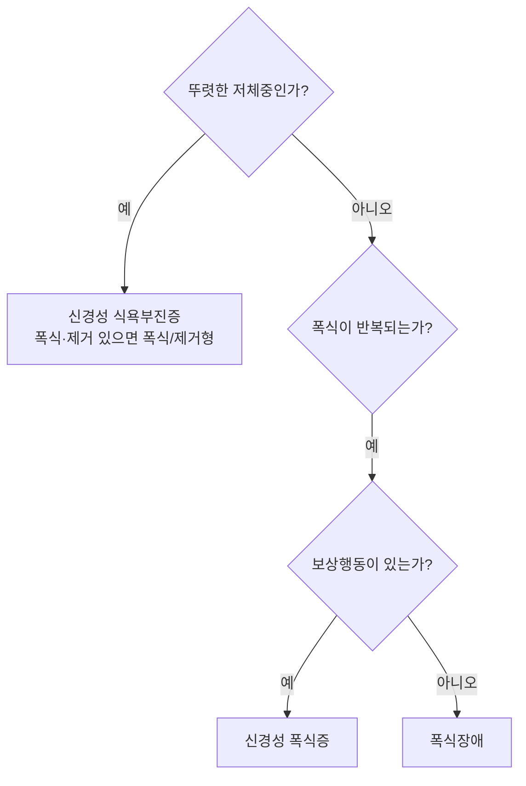


세 장애는 세 질문으로 순서대로 갈린다. 먼저 "체중이 뚜렷이 낮은가?" 그렇다면 폭식이나 구토가 있어도 신경성 식욕부진증이다. 아니라면 "폭식이 있는가?" 그리고 "폭식 뒤 토하기, 설사제, 굶기, 과도한 운동 같은 보상행동을 하는가?" 보상행동이 있으면 신경성 폭식증, 없으면 폭식장애다[^1][^2][^3].

## 어느 쪽일까

<b>C1</b> (a) 과체중인 GD는 주 2회 폭식하고 매번 죄책감에 시달리지만 다른 행동은 없다 (b) 정상 체중인 GE는 주 2회 폭식하고 매번 설사제를 먹는다 (c) 저체중인 GF는 주 2회 폭식하고 매번 토한다

**답:** (a) 폭식장애: 보상행동이 없다. (b) 신경성 폭식증: 설사제가 보상행동이다. (c) 신경성 식욕부진증 폭식/제거형: 저체중이면 폭식과 구토가 있어도 식욕부진증이 우선이다.

<b>C2</b> 요약표의 "자기평가의 초점" 행에서 세 장애 가운데 하나만 다르다. 어느 장애이고, 이 차이는 치료에 어떤 뜻이 있는가?

**답:** 폭식장애다. 식욕부진증과 폭식증은 체중과 체형이 자기 평가에 지나친 영향을 주는 것이 진단기준에 들어 있지만, 폭식장애는 이 기준이 없고 덜 중심적이다. 그래서 폭식장애 치료는 신체상보다 폭식 단서와 부정 정서에 대한 대처, 대인관계 갈등에 더 초점을 둔다.

## 결정적 차이

| 기준 | 신경성 식욕부진증 | 신경성 폭식증 | 폭식장애 |
|---|---|---|---|
| 핵심 특징 | 극단적 체중 감소, 통제 중심 | 폭식 + 보상행동 | 폭식, 보상행동 없음 |
| 체중 상태 | 저체중 | 정상~과체중 | 과체중~비만 |
| 폭식 여부 | 제한형 없음 / 폭식형 있음 | 있음 | 있음 |
| 보상행동 | 제한형 없음 / 폭식형 있음 | 있음 | 없음 |
| 자기평가의 초점 | 체중과 체형이 자기 평가에 지나친 영향 | 체중과 체형이 자기 평가에 지나친 영향 | 덜 중심적 |
| 심리 특성 | 완벽주의, 불안 | 충동성 | 정서적 섭식 |
| 건강 영향 | 전해질 이상, 무월경 | 치아 부식, 부종 | 비만, 대사질환 |

[^1]

선택을 바꾸는 행은 앞의 넷이다. 뒤의 셋(심리 특성, 건강 영향)은 전형적 모습일 뿐 진단기준이 아니다.

## 둘 다 아닐 때

- **체형 걱정 없이 냄새, 식감, 질식의 두려움 때문에 먹지 않아 체중이 줄 때:** [회피적·제한적 음식섭취 장애](/Hongs_Blog/studies/abnormal-psychology/arfid/). 식욕부진증과 달리 살찌는 것에 대한 두려움과 신체상 왜곡이 없다.
- **먹지 못할 것을 먹을 때:** [이식증](/Hongs_Blog/studies/abnormal-psychology/pica/).
- **먹은 것을 게워 되씹을 때:** [되새김장애](/Hongs_Blog/studies/abnormal-psychology/rumination-disorder/). 체중 조절 목적의 구토가 아니다.
- **우울증으로 식욕이 떨어지거나 늘 때:** [주요우울장애](/Hongs_Blog/studies/abnormal-psychology/major-depressive-disorder/)의 식욕 변화다. 폭식의 조절력 상실이나 체중 공포가 없다.
- **가끔 과식하는 것:** 조절력을 잃는 느낌, 빈도(주 1회 이상 3개월), 고통이 없으면 장애가 아니다.

[^1]: 4-1학기/이상 심리학/1.수업자료/08.급식 및 섭식장애, 수면-각성장애.pdf, p.35 (요약표). 표 왼쪽 위에 빨간 별표와 손글씨 "시험?"이 있다.
[^2]: 4-1학기/이상 심리학/1.수업자료/08.급식 및 섭식장애, 수면-각성장애.pdf, p.20 (식욕부진증의 제한형과 폭식/제거형)
[^3]: 4-1학기/이상 심리학/1.수업자료/08.급식 및 섭식장애, 수면-각성장애.pdf, p.30 (폭식장애 기준 E와 손글씨 "신경성 폭식증과 다른 점!")

