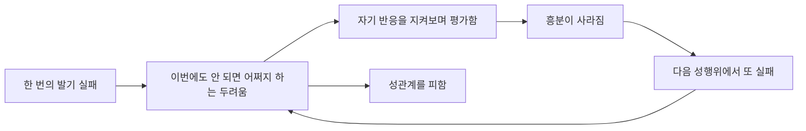



요약

성행위의 거의 모든 경우에 발기가 되지 않거나, 유지되지 않거나, 충분히 단단하지 않은 상태가 반년 넘게 이어져 괴로운 장애다. 가끔 한 번 안 되는 것은 누구에게나 있는 일이다. 나이가 들수록 크게 늘어 50세 이후에 흔하다. 자신감과 남성다움이 무너지는 느낌, 다음 성행위에 대한 두려움과 회피가 따라와 문제를 키운다.

## 예시로 보기

[성기능부전](/Hongs_Blog/studies/abnormal-psychology/sexual-dysfunctions/)의 예시인 HO가 발기장애의 사례다. 반년째 거의 매번 발기가 유지되지 않고, "이번에도 안 되면 어쩌지"라는 두려움 때문에 성관계를 피하기 시작했다. 한 번의 실패가 두려움을 낳고, 두려움이 다음 실패를 부르는 고리다[^s1].

실패가 두려움을 부르고, 두려움이 지켜보기를 거쳐 다시 실패를 부른다[^s2].

## 정의

발기장애의 진단기준[^1]

A. 성적 행위의 거의 모든 경우 또는 모든 경우(약 75~100%)에 다음 가운데 하나 이상을 겪는다.
1. 성적 행위 중 발기하는 데 심각한 어려움
2. 성적 행위를 끝낼 때까지 발기를 유지하는 데 심각한 어려움
3. 발기 강직도의 감소

B. 최소 6개월 이상. 
C. 본인에게 임상적으로 현저한 고통이 생긴다. 
   — 치료가 필요할 만큼 뚜렷하게 괴롭다.

## 임상적 특징[^2][^3]

- 낮은 자존감과 자신감, 남성다움이 줄어든 느낌, 우울한 기분.
- 죄책감, 자책감, 좌절감, 분노, 파트너를 실망시킬까 봐 하는 걱정.
- 앞으로의 성적 상황에 대한 두려움과 회피.
- 파트너의 성적 만족도와 욕구도 흔히 줄어든다.
- 불임 위험 증가, 관계 회피, 친밀감 감소, 성적 고통으로 대인관계와 심리 기능이 떨어질 수 있다.
- 유병률과 발병률은 나이와 크게 관련되고, 특히 50세 이후에 늘어난다.

| 나이 | 유병률 |
|---|---|
| 40세 미만 | 10% 미만 |
| 60대 | 약 20~40% |
| 70대 | 50~75% |

## 연결

- 원인과 치료(PDE5 억제제, 감각 초점 훈련): [성기능부전](/Hongs_Blog/studies/abnormal-psychology/sexual-dysfunctions/)
- 흔히 함께 나타나는 장애: [남성 성욕감퇴장애](/Hongs_Blog/studies/abnormal-psychology/male-hypoactive-desire/)

## 확인 문제

<b>C1</b> 발기장애의 기준 A의 세 증상과, 빈도·기간 조건을 쓰라.

**답:** 성적 행위 중 발기하기 어려움, 끝날 때까지 발기 유지가 어려움, 발기 강직도 감소 가운데 하나 이상. 거의 모든 경우(약 75~100%), 6개월 이상, 현저한 고통.

<b>C2</b> 발기장애에서 "향후 성적 상황에 대한 두려움과 회피"가 증상을 오래 가게 하는 이유를 설명하라.

**답:** 실패를 예상하는 두려움은 성행위 중 자기 반응을 지켜보는 관찰자적 역할과 수행불안을 키워 흥분을 방해한다. 회피하면 불안은 잠깐 줄지만 "성공할 수도 있다"는 경험을 할 기회가 사라진다. 그래서 신체 원인을 확인하면서 감각 초점 훈련처럼 수행의 압박을 줄이는 치료를 함께 한다.

[^1]: 이상 심리학 9회 강의 자료 「성 관련 장애」, p.10
[^2]: 이상 심리학 9회 강의 자료 「성 관련 장애」, p.11
[^3]: 이상 심리학 9회 강의 자료 「성 관련 장애」, p.12
[^s1]: 보충 예시는 성기능부전 문서의 가상 사례를 이어 쓴 것이다.
[^s2]: 보충 다이어그램 1개는 원본에 없다. '예시로 보기'의 고리와 '임상적 특징'의 두려움과 회피(p.11), 성기능부전 문서의 관찰자적 역할(p.29)을 이어 그렸다.

