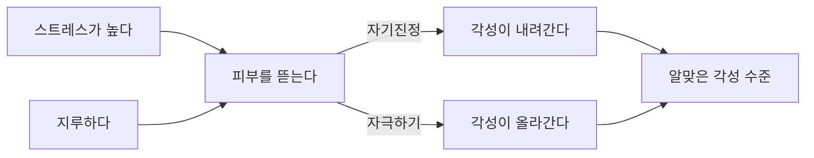



요약

피부를 반복해서 뜯거나 벗겨 상처가 나는데도 멈추지 못하는 장애다. 얼굴의 뾰루지, 입술 껍질, 손톱 주변을 뜯다가 다른 부위로 옮겨 간다. 스트레스가 높을 때는 마음을 가라앉히고, 지루할 때는 자극을 주는 두 가지 쓸모가 있어 습관으로 굳는다. 스스로도 괴로워하며 상처를 숨기고, 심하면 감염이나 흉터로 이어진다.

## 예시로 보기

직장인 DE는 회의가 길어지거나 마감이 다가오면 손톱 주변 피부를 뜯는다. 한가한 주말 오후에도 멍하니 있다 보면 어느새 뜯고 있다. 손끝에 늘 상처가 있어 밴드를 붙이고 다니며, 악수를 피한다[^s1].

- 스트레스 상황: 뜯으면 진정된다(자기진정).
- 지루한 상황: 뜯으면 각성된다(자극하기).
- 상처를 숨기고, 멈추려 해도 조절되지 않는다.

## 정의

피부를 뜯거나 벗겨 손상시키는 행동이다[^1].

- 얼굴, 팔, 다리, 입술, 허벅지, 손톱 주변 등을 뜯고, 신체 여러 곳으로 옮겨 간다.
- 스스로 심한 고통을 받지만 조절되지 않는다.
- 불안, 긴장, 스트레스가 높아지면 늘어난다.
- 피부 병변을 숨기려고 가린다.
- 신체적·심리적 고통이 따르고 자해 행동으로 이어질 수 있다.

### 임상적 특징[^2]

- 평생 유병률 3.1% 이상. 여성이 남성보다 3배 많다.
- 사춘기에 많이 나타난다(여드름이 계기가 된다).
- 청소년기 이후로는 30~45세에 주로 시작하고, 스트레스 사건이 촉발 요인이 된다.

## 원인[^3]

- **생물학적 입장:** 도파민 기능의 손상. 도파민 관련 약물은 피부에 벌레가 기어가는 듯한 가려움을 일으켜 뜯고 싶은 충동을 촉발하고, 도파민 억제 약물은 피부 뜯기를 줄인다.
- **정신분석적 입장:** 풀리지 않은 아동기의 정서적 문제, 권위적인 부모에 대한 억압된 분노의 표현.
- **인지행동적 입장:** 일종의 스트레스 대처 방식이다. 알맞은 각성 수준을 유지하는 기능이 있다. 스트레스를 줄이는 "자기진정" 효과와, 지루할 때 각성시키는 "자극하기" 효과다.

출발점은 정반대인 두 상황인데, 같은 행동 하나가 양쪽 모두를 알맞은 수준으로 돌려놓는다. 그래서 어느 상황에서든 뜯기가 늘어난다[^s3].

## 치료

털뽑기장애와 함께 다룬다. [신체중심 반복행동](/Hongs_Blog/studies/abnormal-psychology/bfrb/)의 습관 반전 훈련과 수용 증진 행동치료, 항우울제(SSRI).

## 연결

- 같은 계열: [털뽑기장애](/Hongs_Blog/studies/abnormal-psychology/trichotillomania/)
- 도파민과 가려움 충동: [도파민 가설](/Hongs_Blog/studies/abnormal-psychology/dopamine-hypothesis/)의 도파민 효능제 효과와 같은 방향의 관찰
- 신체이형장애에서도 외모 결함을 없애려고 피부를 뜯을 수 있다. 이때는 신체이형장애로 본다[^s2].

## 확인 문제

<b>C1</b> 인지행동적 입장은 피부 뜯기가 스트레스 받을 때와 지루할 때 모두 늘어나는 이유를 어떻게 설명하는가?

**답:** 피부 뜯기가 알맞은 각성 수준을 유지하는 기능을 하기 때문이다. 스트레스로 각성이 지나치면 뜯기가 진정시키고(자기진정), 지루해서 각성이 모자라면 뜯기가 자극을 준다(자극하기). 두 상황 모두에서 행동이 보상받으니 습관이 강해진다.

<b>C2</b> 피부뜯기장애의 생물학적 근거로 슬라이드가 드는 두 약물 관찰을 쓰라.

**답:** 도파민 관련 약물은 벌레가 기어가는 듯한 가려움을 일으켜 뜯는 충동을 촉발한다. 도파민 억제 약물은 피부 뜯기를 줄인다. 그래서 도파민 기능의 손상이 관여한다고 본다.

[^1]: 4-1학기/이상 심리학/1.수업자료/05.강박 관련 장애.pdf, p.40
[^2]: 4-1학기/이상 심리학/1.수업자료/05.강박 관련 장애.pdf, p.41
[^3]: 4-1학기/이상 심리학/1.수업자료/05.강박 관련 장애.pdf, p.42
[^s1]: 에이전트 보충. DE의 사례는 두 기능을 보이려고 만든 가상 사례다.
[^s2]: 에이전트 보충. DSM-5-TR은 신체이형장애의 외모 개선 목적 피부 뜯기를 피부뜯기장애의 배제 조건으로 둔다.
[^s3]: 에이전트 보충. 다이어그램 1개는 원본에 없다. 이 문서 `원인`의 인지행동적 입장(자기진정, 자극하기, 알맞은 각성 수준)을 근거로 그렸다. 슬라이드 p.42.

