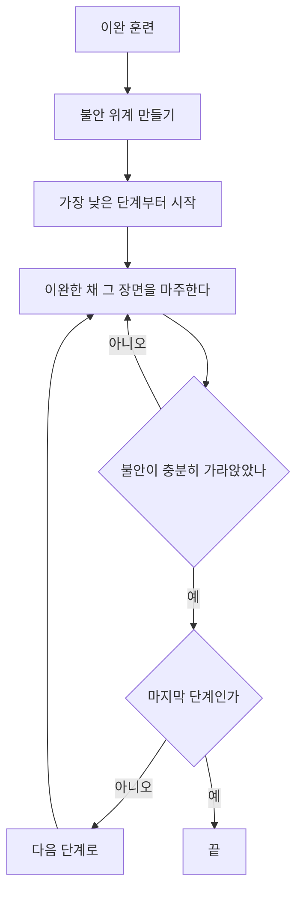



요약

두려워 피하던 대상을 일부러, 반복해서 마주하게 하는 치료다. 차가운 바닷물에 발부터 조금씩 담그면 결국 몸이 물에 익숙해지는 것과 같다. 마주한 채 버티면 "아무 일도 일어나지 않는다"는 것을 몸으로 배워, 피할수록 굳어지던 공포의 고리가 끊긴다. 공포증에 가장 효과적인 치료지만, 너무 급하게 하거나 안전행동으로 몰래 피하면 오히려 공포가 굳을 수 있다.

## 예시로 보기

엘리베이터 공포증이 있는 CB의 체계적 둔감법이다[^s1].

1. **이완 훈련:** 복식호흡과 근육 이완을 익힌다.
2. **불안 위계:** 두려운 장면을 불안 점수(0~100)로 줄 세운다.

| 단계 | 장면 | 불안 점수 |
|---|---|---|
| 1 | 엘리베이터 사진 보기 | 20 |
| 2 | 1층 엘리베이터 앞에 서 있기 | 35 |
| 3 | 문이 열린 엘리베이터 안에 한 발 넣기 | 50 |
| 4 | 치료자와 함께 한 층 올라가기 | 65 |
| 5 | 혼자 한 층 올라가기 | 80 |
| 6 | 혼자 10층까지 올라가기 | 95 |

{: start="3"}
3. **단계별 노출:** 이완한 상태로 1단계부터 마주한다. 불안이 충분히 가라앉을 때까지 머문 뒤 다음 단계로 간다.

두 개의 되돌이 고리를 본다. 불안이 가라앉기 전에는 같은 단계에 머물고, 가라앉아야 한 칸 올라간다[^s4].

4주 뒤 CB는 혼자 10층까지 올라갔다. 엘리베이터는 그대로인데, 엘리베이터와 공포의 짝이 풀렸다.

## 정의

### 노출치료[^1]

특정공포증을 일으키는 자극이나 상황에 직접 또는 상상으로 반복해서 노출하는 치료다. 두 축으로 나눈다.

| 축 | 한쪽 | 다른 쪽 |
|---|---|---|
| 무엇에 노출하나 | 실제적 노출: 실제 대상과 상황 | 상상적 노출: 머릿속으로 떠올린 장면 |
| 얼마나 빨리 | 점진적 노출: 약한 것부터 차례로 | 급진적 노출(홍수법): 가장 강한 자극에 곧바로 오래 |

### 체계적 둔감법[^1]

긴장을 이완시킨 상태에서 약한 공포부터 점차 강한 공포 자극에 노출하는 방법이다. 슬라이드는 이것을 "공포증에 가장 효과적인 치료법"이라 적는다. 필기는 "점진적 노출"에서 체계적 둔감법으로 화살표를 그었다[^1]. 체계적 둔감법은 점진적 노출에 이완을 더한 형태다.

울페(Wolpe)는 이완과 불안이 동시에 있을 수 없다는 상호억제 원리로 이 방법을 설명했다[^s2]. 공포 자극을 이완과 새로 짝지어 공포와의 짝을 대신하게 한다.

### 왜 효과가 있나

[모러의 2요인 이론](/Hongs_Blog/studies/abnormal-psychology/two-factor-theory/)에서 공포는 회피가 주는 안도로 유지된다. 노출은 회피를 막고 대상에 머무르게 해 두 가지를 일으킨다[^s2].
- **습관화·소거:** 자극이 나쁜 결과 없이 반복되면 공포 반응이 줄어든다.
- **예상의 반증:** "엘리베이터에 타면 갇혀 질식한다"는 예상이 틀렸다는 경험을 한다.

### 적용 조건과 알아보는 신호

- **적용 조건:** 두려움의 대상이나 단서를 정할 수 있어야 하고, 환자가 치료의 원리에 동의해야 한다. 실제 위험이 있는 대상(공격적인 개)에는 쓰지 않는다.
- **알아보는 신호:** 공포나 불안이 특정 대상·상황·신체감각에 묶여 있고, 그것을 피하는 행동이 공포를 유지하는 사례.

### 이 과목의 여러 장애에서

| 장애 | 노출의 모습 |
|---|---|
| 분리불안장애 | 점진적 노출, 모델링, 행동강화법[^2] |
| 선택적 함구증 | 둔감법: 이메일 → 채팅 → 대면 대화[^3] |
| 사회불안장애 | 사회적 상황에 반복 노출, 발표자와 청중 역할 연습, 비디오 피드백[^4] |
| 공황장애 | 공포 상황에 점진적 노출, 내부감각수용 노출(의자에서 돌아 어지러움을 일부러 일으킴)[^5] |
| 광장공포증 | 실제적 노출 필수, 점진적 노출[^6] |
| 강박장애(5회) | 노출 및 반응 방지 |

## 예제

대표 문제 두 개는 [노출치료 예제 사다리](/Hongs_Blog/studies/abnormal-psychology/exposure-ladder/)에 있다. 불안 위계를 세우는 문제와, 안전행동을 찾아 없애는 문제다.

## 스스로 설명해 보기

1. "노출은 회피의 고리를 끊는다."
   

근거

   2요인 이론에서 회피는 불안을 줄여 부적 강화되고, 공포가 소거될 기회를 막는다. 노출은 회피를 멈추게 해 강화를 끊고 소거의 기회를 준다.
   

2. "불안이 가라앉을 때까지 머물러야 한다."
   

근거

   불안이 가장 높을 때 빠져나오면, 빠져나오는 행동이 다시 불안 감소로 강화된다. 머물러 불안이 스스로 줄어드는 것을 겪어야 "피하지 않아도 괜찮다"를 배운다.
   

3. "체계적 둔감법은 약한 단계부터 시작한다."
   

근거

   이완과 불안은 동시에 있기 어렵다(상호억제). 약한 자극이라야 이완 상태를 유지한 채 마주할 수 있고, 한 단계의 성공이 다음 단계를 견딜 힘이 된다.
   

- 이 기법의 핵심 아이디어는?
  

답

  공포를 유지하는 것은 대상이 아니라 회피다. 회피를 막고 대상에 머무르게 하면, 나쁜 일이 일어나지 않는다는 새로운 학습이 공포를 대신한다.
  

## 자주 하는 오해

"노출치료는 무서운 것을 억지로 견디게 하는 고문이다"

틀렸다. 홍수법의 이미지 때문에 그럴듯하다. 실제로는 대부분 환자와 함께 불안 위계를 짜고, 환자가 동의한 약한 단계부터 시작한다(점진적 노출, 체계적 둔감법). 속도는 환자와 조율하고, 각 단계에서 불안이 가라앉는 것을 확인한 뒤 올라간다.

"노출할 때 마음이 놓이는 행동은 해도 괜찮다"

틀렸다. 엘리베이터 안에서 손잡이를 꽉 잡거나, 휴대전화로 계속 도움을 청할 준비를 하는 것은 편해 보이지만 안전행동이다. 안전행동을 하면 "손잡이 덕분에 무사했다"고 배워, "엘리베이터는 원래 안전하다"는 학습이 일어나지 않는다. 그래서 노출에서는 안전행동도 줄여 나간다[^s3].

## 확인 문제

<b>C1</b> 노출치료를 나누는 두 축(무엇에, 얼마나 빨리)과 각 축의 두 방식을 쓰고, 체계적 둔감법의 두 요소를 쓰라.

**답:** 무엇에: 실제적 노출과 상상적 노출. 얼마나 빨리: 점진적 노출과 급진적 노출(홍수법). 체계적 둔감법: 이완 훈련 + 약한 공포부터 강한 공포로 가는 불안 위계에 따른 단계적 노출.

<b>C2</b> 노출 중 불안이 최고조일 때 환자가 뛰쳐나오면 오히려 공포가 강해질 수 있다. 2요인 이론으로 설명하라.

**답:** 불안이 가장 높을 때 빠져나오면 불안이 급격히 줄어든다. 이 안도가 "빠져나오기(회피)"를 부적 강화해 회피가 더 강해진다. 동시에 대상을 견디면 불안이 스스로 줄어든다는 경험을 하지 못해 소거가 일어나지 않는다.

<b>C3</b> 발표 공포가 있는 대학생의 불안 위계를 다섯 단계로 짜 보라.

**답:** 예: (1) 거울 앞에서 발표문 읽기(20) → (2) 친한 친구 한 명 앞에서 발표(35) → (3) 친구 세 명 앞에서 발표(50) → (4) 스터디 모임 여덟 명 앞에서 발표하고 질문받기(70) → (5) 수업 시간에 30명 앞에서 발표(90). 점수는 본인이 매긴다. 각 단계는 불안이 충분히 줄어든 뒤 다음으로 간다.

<b>C4</b> 공황장애 치료의 내부감각수용 노출이 하는 일을 한 문장으로 설명하라.

**답:** 의자에서 빙빙 돌거나 빠르게 숨 쉬어 어지러움과 두근거림 같은 신체감각을 일부러 일으키고 그 감각에 머무르게 해, 신체감각이 위험하지 않다는 것을 배우게 하는 노출이다.

[^1]: 4-1학기/이상 심리학/1.수업자료/04.불안장애.pdf, p.25. "점진적 노출"의 밑줄과 체계적 둔감법으로 가는 화살표는 손글씨 필기다.
[^2]: 4-1학기/이상 심리학/1.수업자료/04.불안장애.pdf, p.11
[^3]: 4-1학기/이상 심리학/1.수업자료/04.불안장애.pdf, p.16
[^4]: 4-1학기/이상 심리학/1.수업자료/04.불안장애.pdf, p.34
[^5]: 4-1학기/이상 심리학/1.수업자료/04.불안장애.pdf, p.41
[^6]: 4-1학기/이상 심리학/1.수업자료/04.불안장애.pdf, p.47
[^s1]: 에이전트 보충. CB의 불안 위계는 가상 예다. 0~100의 주관적 불편감 척도(SUDS)는 노출치료에서 쓰는 표준 방식이다.
[^s2]: 에이전트 보충. 울페의 상호억제 원리와, 노출의 효과를 습관화·소거·예상의 반증으로 설명하는 것은 행동치료 교재의 표준 설명이다.
[^s3]: 에이전트 보충. 안전행동이 노출의 효과를 줄인다는 것은 불안장애 인지행동치료의 표준 설명이다. 사회불안장애 문서의 클라크와 웰스 모형에도 안전행동이 나온다.
[^s4]: 에이전트 보충. 다이어그램 1개는 원본에 없다. 이 문서 '예시로 보기'의 세 단계와 '체계적 둔감법' 절(슬라이드 p.25)을 근거로 그렸다.

