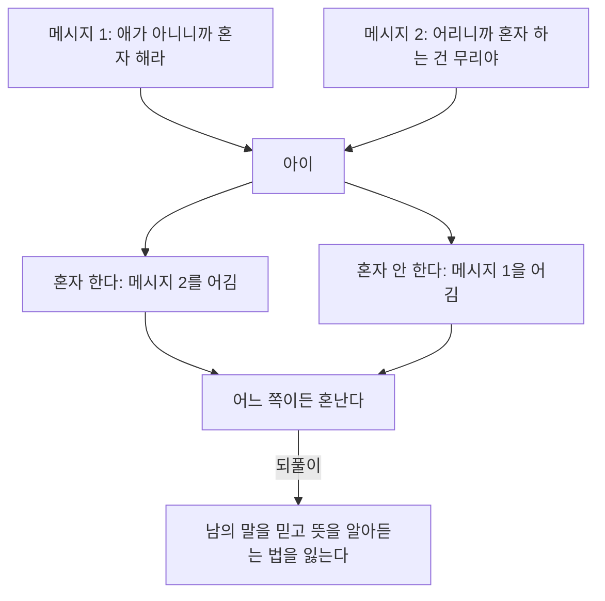



요약

"집안 분위기가 조현병과 상관이 있을까?"에 답하려던 이론 네 가지다. 차갑거나 지나치게 감싸는 엄마, 사이가 기울거나 갈라진 부모, 말과 행동이 어긋나는 부모, 환자를 탓하고 간섭하는 가족을 각각 원인으로 보았다. 앞의 이론들은 결국 부모 탓으로 몰고 가서 지금은 인정받지 못한다. 근거가 확실한 것은 마지막 하나뿐인데, 그마저도 병을 만드는 원인이 아니라 이미 앓는 사람의 병이 다시 도질 가능성을 높이는 요인이다.

## 예시로 보기

퇴원한 두 환자가 집에 돌아갔다[^s1].

- AA의 가족은 이렇게 말한다. "또 방에 처박혀 있니? 그러니까 병이 안 낫지." "넌 내가 없으면 아무것도 못 해." 탓하는 말과 간섭이 하루 종일 이어진다.
- AB의 가족은 병에 대해 배운 뒤로, 조용히 밥을 같이 먹고 작은 일에도 고맙다고 말한다.

9개월 뒤 AA는 다시 입원하고 AB는 집에서 지낸다. 두 집의 차이를 표현된 정서(EE)가 높다, 낮다고 한다. 이름 그대로, 가족이 환자 앞에서 감정을 얼마나 세게 드러내는지를 말한다[^s4]. 여기서 가족이 병을 만든 것은 아니다. 이미 병이 있는 사람이 다시 나빠질지를 바꿨을 뿐이다.

## 네 가지 이론

| 이론 | 무엇을 문제로 봤나 | 어떤 모습인가 |
|---|---|---|
| 조현병을 만드는 어머니 (프롬-라이히만) | 엄마가 아이를 대하는 방식 | 아이가 슬퍼해도 잘 알아채지 못하고, 아이가 다가오면 밀어낸다. 가까워지는 것 자체를 겁낸다. 반대로 아이를 지나치게 감싸고 자기를 다 바쳐 희생하는 엄마도 여기에 넣었다[^1] |
| 부모의 부부관계 | 엄마 아빠 사이 | 한쪽으로 기운 부부(편향적 부부관계): 한 사람이 다 쥐고 흔들고 다른 사람은 따르기만 한다. 따르기만 하는 쪽이 아이에게 매달린다. 갈라진 부부(분열적 부부관계): 서로 싸우는 부모가 아이를 자기 편으로 만들려고 다툰다[^1] |
| 이중구속이론 (베이트슨) | 부모가 말하는 방식 | 같은 일을 두고 서로 반대되는 말을 하거나, 말과 행동이 다르다. 필기에는 "비일관성"이라고 적었다[^2] |
| 표현된 정서 (EE) | 가족이 감정을 드러내는 방식 | 가족끼리 자주 다투고, 감정을 세게 드러내고, 지나치게 간섭한다. 환자를 탓하고, 적대적으로 대하고, 환자 일에 감정적으로 너무 깊이 끼어들면(정서적 과잉개입) 증상이 나빠진다[^3] |

### 이중구속의 예

이름은 영어 double bind를 옮긴 것으로, 두 겹으로 묶여 어느 쪽으로도 빠져나갈 수 없다는 뜻이다[^s4]. 슬라이드에 나온 두 예다[^2].
- 사랑한다고 말하면서, 아이가 다가오면 귀찮다고 밀어낸다. 말은 "사랑해"인데 행동은 "저리 가"다.
- "애가 아니니까 혼자 해라"라고 했다가, 다른 때는 "어리니까 혼자 하는 건 무리야"라고 한다. 같은 사람의 말이 그때그때 바뀐다.

이 이론에 따르면, 어느 쪽을 따라도 혼나는 일이 계속되면 아이는 남의 말을 믿고 뜻을 알아듣는 법을 잃어버린다[^s2].

두 메시지가 서로 반대라서 아이가 고를 수 있는 길이 모두 꾸중으로 끝난다. 이 막다른 길이 되풀이될 때 마지막 칸의 결과가 생긴다고 본다[^s5].

### 표현된 정서의 근거

- 화를 많이 드러내는 집(탓하기, 적대, 지나친 간섭)은 환자가 다시 나빠지는 비율이 58%였다. 그렇지 않은 집은 10%였다[^3]. 환자 열 명으로 치면 여섯 명 가까이와 한 명의 차이다.
- 정신장애에 걸리기 쉬운 사람은 탓하거나 간섭하는 말을 들을 때 뇌가 반응하는 모습이 다른 사람과 다르다[^3].

그래서 치료할 때 가족에게 말을 잘 주고받는 법과 감정을 건강하게 드러내는 법을 가르친다. 이것이 가족치료다[^4].

그럼 가족은 아무 감정도 드러내지 말아야 할까? 그렇지 않다. 문제가 되는 것은 탓하기, 적대, 지나친 간섭이다. 예시의 AB 가족처럼 고맙다고 말하는 것은 감정을 드러내는 건강한 방식이다[^s4].

## 연결

- 이 이론들이 들어가는 자리: [조현병](/Hongs_Blog/studies/abnormal-psychology/schizophrenia/)의 심리적 원인, 그리고 [취약성-스트레스 모델](/Hongs_Blog/studies/abnormal-psychology/vulnerability-stress-model/)에서 병에 걸리기 쉽게 만드는 바탕("부모의 양육방식")과 스트레스
- 가족이라는 주변 환경과 가족치료: [생물심리사회적 모델](/Hongs_Blog/studies/abnormal-psychology/biopsychosocial-model/)의 개인적 환경요인

## 자주 하는 오해

"조현병은 어머니의 잘못된 양육 때문에 생긴다"

틀렸다. "조현병을 만드는 어머니"라는 이름부터가 엄마가 원인이라고 말하는 것처럼 들려서 그럴듯하다. 하지만 슬라이드도 이 이론 제목 뒤에 물음표 두 개("??")를 붙였다[^1]. 이 이론은 뒷받침하는 연구 결과가 약하다. 오히려 가족에게 죄책감과 낙인만 남겼다는 비판을 받았다[^s3]. 조현병은 유전과 뇌 발달의 영향이 크다(일란성 쌍둥이 한쪽이 앓으면 다른 쪽도 앓을 확률 48%). 이 사실과도 맞지 않는다. 가족이 확실히 영향을 주는 것은 병이 생긴 뒤 다시 도지는 일이고, 그 통로가 표현된 정서다.

## 확인 문제

<b>C1</b> 조현병의 가족관계 이론 네 가지의 이름과 핵심을 한 줄씩 쓰라.

**답:** (1) 조현병을 만드는 어머니: 아이에게 차갑고 밀어내거나, 반대로 지나치게 감싸는 엄마. (2) 부모의 부부관계: 한쪽으로 기운 부부(한 명이 쥐고 흔들고 한 명은 따름) 또는 갈라진 부부(아이를 서로 차지하려 다툼). (3) 이중구속이론: 부모가 서로 반대되거나 애매한 말을 한다. (4) 표현된 정서: 가족이 탓하고, 적대적이고, 지나치게 간섭하면 증상이 나빠진다.

<b>C2</b> 다음은 이중구속인가, 높은 표현된 정서인가? (a) "넌 왜 그렇게 게으르니? 그러니까 병이 안 낫지" (b) "네가 알아서 결정해"라고 하고는, 결정하자 "왜 엄마랑 상의도 안 하니"라고 화낸다

**답:** (a) 높은 표현된 정서(탓하기, 적대). 하는 말 자체는 분명하다. (b) 이중구속. 어느 쪽을 따라도 혼나는, 서로 반대되는 말이다. 
**가르는 질문:** 문제가 감정이 얼마나 센지(탓하기·간섭)인가, 말끼리 서로 어긋나는지인가.

<b>C3</b> 표현된 정서 연구가 "가족이 조현병을 일으킨다"가 아니라 "가족 분위기가 재발을 좌우한다"고 결론 내리는 이유를 쓰라.

**답:** 이 연구는 이미 조현병을 앓던 사람이 퇴원한 뒤를 지켜봤다. 그 뒤 집 분위기에 따라 다시 나빠지는 비율이 58%와 10%로 달랐다. 병이 생기기 전의 가족을 본 것이 아니다. 그래서 병의 원인이 아니라, 다시 도지게 만드는 방아쇠를 보여 준다. 병에 걸리기 쉬운 사람에게 가족의 탓하기와 간섭이 스트레스로 작용한다고 해석한다.

[^1]: 이상 심리학 2회 강의 자료 「조현병 스펙트럼 장애」, p.28 (제목 "Schizophrenogenic Mother??")
[^2]: 이상 심리학 2회 강의 자료 「조현병 스펙트럼 장애」, p.29. "비일관성"은 손글씨 필기다.
[^3]: 이상 심리학 2회 강의 자료 「조현병 스펙트럼 장애」, p.30 ("분노표현이 높은 가정에서 재발률이 높음 (10% vs 58%)")
[^4]: 이상 심리학 2회 강의 자료 「조현병 스펙트럼 장애」, p.39 (가족치료)
[^s1]: 보충 두 가족의 사례는 표현된 정서를 보이려고 만든 가상 사례다. 9개월은 표현된 정서 연구에서 흔히 쓰는 추적 기간이다.
[^s2]: 보충 이중구속이 해석 능력을 잃게 한다는 요지는 베이트슨 등(1956)의 원래 주장을 요약한 것이다.
[^s3]: 보충 "조현병을 만드는 어머니" 개념이 경험적 지지를 얻지 못하고 가족에게 비난을 돌렸다는 평가는 이상심리학 교재의 표준 서술이다.
[^s4]: 보충 이름 풀이(표현된 정서, double bind)와 "감정을 숨겨야 하나"에 대한 답은 원본에 없다. 답은 슬라이드 p.30(문제는 비난·적대·과잉개입)과 p.39(건강한 감정 표현 방식을 가르친다)에 근거한 해석이다.
[^s5]: 보충 다이어그램 1개는 원본에 없다. '이중구속의 예'의 둘째 예(슬라이드 p.29)와 그 아래 문단([^s2]의 해석)을 그렸다.

