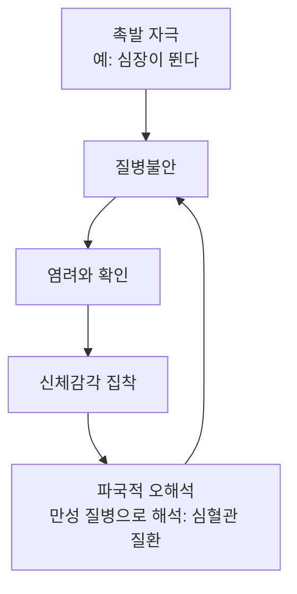



요약

몸에는 뚜렷한 증상이 없거나 아주 가벼운데, 심각한 병에 걸렸다는 생각에 사로잡혀 있는 장애다. 옛 이름은 건강염려증이다. 심장이 조금 빨리 뛰면 심장병을, 두통이 있으면 뇌종양을 떠올린다. 검사하고 확인해도 불안은 잠깐만 줄고, 걱정하는 병의 이름만 바뀌며 몇 년씩 이어진다.

## 예시로 보기

30대 EZ는 계단을 오르다 가슴이 두근거리자 "심장에 문제가 있는 게 틀림없다"고 생각했다. 그 뒤로 매일 맥박을 재고, 심장 질환을 검색하고, 1년에 네 번 심장 검사를 받았다. 검사는 모두 정상이었다. 요즘은 심장 대신 "혹시 위암일까" 걱정한다[^s1].

- 신체 증상은 가볍고(두근거림), 병에 걸렸다는 집착이 중심이다.
- 반복 확인(맥박, 검사)이라는 부적응적 행동, 진료 추구형.
- 걱정하는 병이 바뀐다(심장 → 위암).

## 정의

질병불안장애(건강염려증)의 진단기준[^1]

- 심각한 질병에 걸렸다는 생각에 과도하게 집착한다.
- 신체 증상이 없거나, 있더라도 경미하다.
- 자신의 건강 상태에 대한 관심과 불안이 높다.
- 건강과 관련된 부적응적 행동을 한다. 반복적 검사, 또는 회피 행동(의사와의 면담을 피함).
    - 진료 추구형: 반복해서 검사하고 병원을 찾는다.
    - 진료 회피형: 병원을 피한다. 병을 확인하게 될까 봐 지나치게 두려워서다.
- 질병 집착이 6개월 이상 이어진다. 집착하는 질병은 자주 바뀐다.

## 임상적 특징과 경과[^2][^3]

- 병원을 찾는 환자의 약 4~9%.
- 남녀 유병률이 비슷하다.
- 어느 나이에나 시작할 수 있지만 초기 청소년기에 가장 흔하다.
- 대개 만성적이고, 자주 재발하며, 좋아졌다 나빠졌다를 되풀이한다.
- 오래 이어지기 때문에 성격 특성의 일부라는 주장도 있다.
- **예후가 좋은 경우:** 불안이나 우울 증상이 함께 있을 때, 성격장애 요소가 없을 때, 어린 나이에 또는 갑자기 시작했을 때.

## 원인

### 1. 정신분석적 입장[^4]

- 프로이트: 성적 충동이 바깥 대상이 아니라 자기 자신에게 향한 결과다.
- 과거의 잘못에 대한 죄책감이나 속죄의 의미.
- 낮은 자기존중감과 무가치감에 대한 방어. "나는 형편없다"보다 "나는 아프다"가 견디기 쉽다[^s2].

### 2. 행동주의적 입장[^4]

이차적 이득과 강화.

### 3. 인지적 입장[^5]

인지적 입장이 질병불안장애를 가장 잘 설명한다. [공황의 인지모델](/Hongs_Blog/studies/abnormal-psychology/panic-cognitive-model/)과 비슷한 악순환 모델이다.

- 신체 증상을 심각한 만성 질병으로 잘못 해석하는 악순환이다.
- 질병과 관련된 신체 감각에 선택적으로 주의를 기울인다.
- 건강에 대한 경직된 신념: "건강이란 신체 증상이 하나도 없는 상태다."
- 같은 두근거림을 **당장 죽을 수 있는 응급 질병**(심장마비)으로 해석하면 공황장애가 되고, **서서히 진행하는 만성 질병**(심혈관 질환)으로 해석하면 질병불안장애가 된다.

## 치료[^6]

- 인지행동치료와 스트레스 관리 훈련.
- 인지행동치료의 세 요소:
    1. 신체 감각에 대한 질병 해석에 도전한다.
    2. 신체 부위에 집중해 비슷한 건강염려 증상을 직접 체험하게 한다. 공황통제치료의 내부감각 노출과 비슷하다.
    3. 병원 방문과 질병 확인 행동을 줄인다.
- 질병불안장애 환자의 76%가 호전되었다는 보고가 있다.
- 의사의 상세한 설명과 안심시키기.

## 연결

- 같은 구조의 모델: [공황의 인지모델](/Hongs_Blog/studies/abnormal-psychology/panic-cognitive-model/)
- 헷갈리는 장애: [신체증상장애와 질병불안장애 비교](/Hongs_Blog/studies/abnormal-psychology/ssd-vs-iad/)
- 확인 행동이 불안을 유지하는 원리: [강박장애](/Hongs_Blog/studies/abnormal-psychology/ocd/)의 강박행동

## 확인 문제

<b>C1</b> 질병불안장애의 진단기준(집착, 증상, 불안, 행동, 기간)을 쓰고, 부적응적 행동의 두 유형을 쓰라.

**답:** 심각한 질병에 걸렸다는 과도한 집착, 신체 증상이 없거나 경미함, 건강에 대한 높은 관심과 불안, 건강 관련 부적응적 행동, 6개월 이상(집착하는 병은 바뀔 수 있음). 행동 유형은 반복 검사하는 진료 추구형과 의사를 피하는 진료 회피형이다.

<b>C2</b> 두 사람이 모두 심장이 빨리 뛰는 것을 느꼈다. FA는 "지금 심장마비가 와서 죽을 것 같다"며 응급실로 달려갔다. FB는 "심장병이 서서히 진행 중인 것 같다"며 몇 달째 검사를 받는다. 각각 어떤 장애의 인지모델에 맞는가?

**답:** FA는 공황장애: 신체 감각을 당장의 응급 재앙으로 파국적으로 해석한다. FB는 질병불안장애: 같은 감각을 서서히 진행하는 만성 질병으로 해석한다. 두 모델은 "감각 → 파국적 해석 → 불안 → 감각에 집중"이라는 고리가 같고, 해석의 내용(응급 대 만성)만 다르다.

<b>C3</b> 검사 결과가 정상이라고 알려 줘도 질병불안이 몇 주 뒤 다시 커지는 이유를 인지모델로 설명하라.

**답:** 확인은 불안을 잠깐 줄여 확인 행동을 강화한다. 그러나 "건강하면 증상이 하나도 없어야 한다"는 경직된 신념과 선택적 주의는 그대로여서, 새로 느낀 작은 감각이 다시 질병의 증거로 해석된다. 그래서 치료는 안심만 주는 대신 해석에 도전하고, 확인 행동을 줄인다.

[^1]: 4-1학기/이상 심리학/1.수업자료/07.신체증상 및 관련 장애, 배설장애.pdf, p.23. "회피형" 밑줄과 "지나친 두려움에서 기인"은 손글씨 필기다.
[^2]: 4-1학기/이상 심리학/1.수업자료/07.신체증상 및 관련 장애, 배설장애.pdf, p.24
[^3]: 4-1학기/이상 심리학/1.수업자료/07.신체증상 및 관련 장애, 배설장애.pdf, p.25
[^4]: 4-1학기/이상 심리학/1.수업자료/07.신체증상 및 관련 장애, 배설장애.pdf, p.26
[^5]: 4-1학기/이상 심리학/1.수업자료/07.신체증상 및 관련 장애, 배설장애.pdf, p.27. "질병불안장애를 잘 설명", 그림의 "심장이 뛴다", "심장 마비", "심혈관질환"은 손글씨 필기다.
[^6]: 4-1학기/이상 심리학/1.수업자료/07.신체증상 및 관련 장애, 배설장애.pdf, p.28. "≒ 공황통제치료"는 손글씨 필기다.
[^s1]: 에이전트 보충. EZ의 사례는 진단기준을 보이려고 만든 가상 사례다.
[^s2]: 에이전트 보충. 무가치감에 대한 방어를 한 문장으로 풀어 쓴 해석이다.

