
> 교수: 김효정. 슬라이드 12개. 슬라이드 위 손글씨는 사용자 필기다(삼성 노트).

## 먼저 알아야 할 것
- [정규분포](/Hongs_Blog/studies/probability-statistics/normal-distribution/) (공학수학 확률과 통계) → 통계적 일탈 기준 ↔ 정규분포
- [독립](/Hongs_Blog/studies/probability-statistics/independence/) (공학수학 확률과 통계) → 도박사의 오류 ↔ 독립
- 심리학개론 수준의 용어(학습, 기억, 성격)를 알면 편하다. 모르는 용어는 1회 문서가 쉬운 말로 풀어 둔다.

## 1회 · 이상심리학의 기본적 이해

읽기 전에

1. 지능지수가 아주 높은 사람도 통계적으로는 드물다. 그렇다면 "이상"일까? → [이상행동의 기준](/Hongs_Blog/studies/abnormal-psychology/abnormality-criteria/)
2. 약을 먹고 증상이 나았다면, 그 병의 원인은 뇌의 화학적 이상이라고 말할 수 있을까? → [생물의학적 입장](/Hongs_Blog/studies/abnormal-psychology/biomedical-perspective/)
3. 같은 사람이 같은 스트레스를 겪었는데 누구는 병이 나고 누구는 멀쩡하다. 무엇이 다를까? → [취약성-스트레스 모델](/Hongs_Blog/studies/abnormal-psychology/vulnerability-stress-model/)

| 번호 | 개념 | 한 줄 | 개념 코드 | 연습 |
|---|---|---|---|---|
| 001 | [이상심리학](/Hongs_Blog/studies/abnormal-psychology/abnormal-psychology/) | 이상행동과 정신장애를 기술하고, 원인을 밝히고, 치료·예방하는 심리학 분야 | — | — |
| 002 | [이상행동의 기준](/Hongs_Blog/studies/abnormal-psychology/abnormality-criteria/) | 고통·통계적 일탈·규범 일탈·기능 저하. 하나만으로는 늘 틀리는 사례가 있어 함께 본다 (강조)[^1] | — | — |
| 003 | [통계적 일탈 기준 ↔ 정규분포](/Hongs_Blog/studies/abnormal-psychology/statistical-deviation--normal-distribution/) | 절단점은 꼬리 확률이다. 평균 − 2 표준편차면 약 2.3%가 이상으로 분류된다 | [검증](/Hongs_Blog/studies/abnormal-psychology/code/003_statistical-deviation--normal-distribution_verify/) | — |
| 004 | [정신장애와 DSM](/Hongs_Blog/studies/abnormal-psychology/mental-disorder-dsm/) | 정신장애는 증상이 묶인 증후군. DSM-5-TR은 22개 범주로 나눈 진단 목록 (강조)[^2] | — | — |
| 005 | [범주적 분류와 차원적 분류 비교](/Hongs_Blog/studies/abnormal-psychology/categorical-vs-dimensional/) | 가르는 질문: 있다/없다로 나누는가, 얼마나 심한지 재는가 | — | — |
| 006 | [진단 분류의 장단점](/Hongs_Blog/studies/abnormal-psychology/diagnostic-classification-evaluation/) | 소통·연구·치료 선택에 쓸모 있지만 낙인과 과잉 진단의 위험. 버리지 말고 한계를 알고 쓴다 | — | — |
| 007 | [이상심리학의 역사](/Hongs_Blog/studies/abnormal-psychology/history-of-abnormal-psychology/) | 귀신론 → 신체 원인론 → 귀신론 회귀 → 인도주의 치료 → 심리·학습·실험·검사·뇌과학 | — | — |
| 008 | [정신분석적 입장](/Hongs_Blog/studies/abnormal-psychology/psychoanalytic-perspective/) | 무의식의 갈등을 자아가 다스리지 못하면 증상. 치료는 무의식의 의식화 (강조)[^3] | — | — |
| 009 | [방어기제](/Hongs_Blog/studies/abnormal-psychology/defense-mechanisms/) | 불안을 줄이려 자아가 쓰는 무의식적 책략 11가지. 현실을 얼마나 왜곡하느냐가 관건 | — | — |
| 010 | [행동주의적 입장](/Hongs_Blog/studies/abnormal-psychology/behavioral-perspective/) | 이상행동도 학습된 것. 고전적·조작적 조건형성과 관찰 학습으로 생기고 같은 원리로 고친다 | — | — |
| 011 | [인지적 입장](/Hongs_Blog/studies/abnormal-psychology/cognitive-perspective/) | 사건이 아니라 사건에 대한 해석이 감정을 만든다. 부적응적 인지를 바꾸는 치료 | — | — |
| 012 | [생물의학적 입장](/Hongs_Blog/studies/abnormal-psychology/biomedical-perspective/) | 정신장애는 뇌의 이상. 유전·뇌 구조·신경화학을 약물과 물리적 치료로 다룬다 | — | — |
| 013 | [취약성-스트레스 모델](/Hongs_Blog/studies/abnormal-psychology/vulnerability-stress-model/) | 타고난·형성된 취약성에 스트레스가 겹칠 때 발병. 둘 중 하나만으로는 설명이 안 된다 | — | — |
| 014 | [생물심리사회적 모델](/Hongs_Blog/studies/abnormal-psychology/biopsychosocial-model/) | 생물·심리·사회 세 수준의 원인과 수준별 치료를 한 지도에 둔다 | — | [이론적 입장 적용 연습](/Hongs_Blog/studies/abnormal-psychology/perspectives-practice/) |

자료: 슬라이드
필기: 슬라이드 위 손글씨 p.11, 12, 13, 15, 16, 18, 19, 23, 24, 41, 42 (질문, 예시, 별표). 해당 문서의 각주에 반영했다.
떠올려 보기: 노트를 닫고 이상행동의 네 기준과 각각의 약점을 쓴 뒤, 네 이론적 입장(정신분석·행동주의·인지·생물의학)의 원인론과 치료법을 한 표로 채워 본다.

## 2회 · 조현병 스펙트럼 장애

읽기 전에

1. 어두운 방의 옷걸이를 사람으로 본 것과, 빈 벽에서 사람을 본 것은 같은 증상일까? → [정신병적 증상](/Hongs_Blog/studies/abnormal-psychology/psychotic-symptoms/)
2. 일란성 쌍둥이 중 한 명이 조현병이면, 다른 한 명이 조현병일 확률은 100%에 가까울까, 절반쯤일까? → [조현병](/Hongs_Blog/studies/abnormal-psychology/schizophrenia/)
3. 망상을 가진 사람에게 증거를 들이밀며 반박하면 믿음이 약해질까? → [망상장애](/Hongs_Blog/studies/abnormal-psychology/delusional-disorder/)

| 번호  | 개념                                                                | 한 줄                                                             | 개념 코드 | 연습                                                         |
| --- | ----------------------------------------------------------------- | --------------------------------------------------------------- | ----- | ---------------------------------------------------------- |
| 015 | [정신증과 조현병 스펙트럼](/Hongs_Blog/studies/abnormal-psychology/psychosis-spectrum/)           | 현실 판단력을 잃는 정신증. 증상의 심각도·기간으로 조현형 성격장애부터 조현병까지 한 줄에 놓는다 (강조)[^4] | —     | —                                                          |
| 016 | [정신병적 증상](/Hongs_Blog/studies/abnormal-psychology/psychotic-symptoms/)                       | 망상, 환각, 혼란스러운 언어, 혼란스러운 행동·긴장증, 음성 증상의 다섯 가지                    | —     | —                                                          |
| 017 | [양성 증상과 음성 증상 비교](/Hongs_Blog/studies/abnormal-psychology/positive-vs-negative-symptoms/)       | 가르는 질문: 정상에 없던 것이 더해졌나, 정상에 있던 것이 빠졌나                           | —     | —                                                          |
| 018 | [도파민 가설](/Hongs_Blog/studies/abnormal-psychology/dopamine-hypothesis/)                         | 도파민이 지나치면 양성 증상. 약의 작용과 각성제 정신병이 근거지만, 음성 증상은 설명 못 하는 가설        | —     | —                                                          |
| 019 | [조현병](/Hongs_Blog/studies/abnormal-psychology/schizophrenia/)                               | 핵심 증상 2개 이상이 1개월, 징후가 6개월 이상, 기능 저하. 여러 요인의 상호작용으로 생긴다 (강조)[^5] | —     | —                                                          |
| 020 | [조현병의 가족관계 이론](/Hongs_Blog/studies/abnormal-psychology/family-theories-schizophrenia/)             | 조현병을 만드는 어머니·부부관계·이중구속·표현된 정서. 재발과 가장 확실히 이어지는 것은 표현된 정서        | —     | —                                                          |
| 021 | [정형과 비정형 항정신병 약물 비교](/Hongs_Blog/studies/abnormal-psychology/typical-vs-atypical-antipsychotics/) | 가르는 질문: 도파민만 막는가, 세로토닌도 막는가. 음성 증상과 부작용의 차이                     | —     | —                                                          |
| 022 | [조현양상장애](/Hongs_Blog/studies/abnormal-psychology/schizophreniform-disorder/)                         | 조현병과 같은 증상이 1~6개월. 셋 중 둘은 조현병 등으로 진단이 바뀐다                       | —     | —                                                          |
| 023 | [단기 정신병적 장애](/Hongs_Blog/studies/abnormal-psychology/brief-psychotic-disorder/)                 | 정신병적 증상이 하루 이상 한 달 안에 끝나고 완전히 회복된다. 심한 스트레스 뒤에 흔하다              | —     | —                                                          |
| 024 | [정신병적 장애의 지속 기간 비교](/Hongs_Blog/studies/abnormal-psychology/psychotic-duration-contrast/)   | 가르는 질문: 증상이 얼마나 오래 갔나. 1일~1개월, 1~6개월, 6개월 이상 (강조)[^6]           | —     | —                                                          |
| 025 | [망상장애](/Hongs_Blog/studies/abnormal-psychology/delusional-disorder/)                             | 망상 하나 이상이 1개월 넘게, 그 밖의 생활은 멀쩡하다. 망상에 정면으로 도전하지 않는다              | —     | [조현병 스펙트럼 사례 연습](/Hongs_Blog/studies/abnormal-psychology/schizophrenia-spectrum-practice/) |
| 041 | [조현정동장애](/Hongs_Blog/studies/abnormal-psychology/schizoaffective-disorder/)                         | 조현병 증상과 기분 삽화가 겹치고, 기분 삽화 없이 망상·환각만 있는 기간이 2주 이상                | —     | [기분장애 사례 연습](/Hongs_Blog/studies/abnormal-psychology/mood-disorders-practice/)         |

강의 순서와 다른 점: 조현정동장애는 주요우울·조증 삽화(3회)를 먼저 알아야 해서 3회 개념 뒤에, 조현형 성격장애(p.54)는 성격장애 총론(12회) 뒤에 둔다. 약화된 정신병 증후군(p.55)은 정신증과 조현병 스펙트럼 문서 안에서 다룬다.

자료: 슬라이드
필기: 슬라이드 위 손글씨 p.5, 9, 10, 12, 13, 15, 22, 29, 33, 37, 44, 51 (기간을 잇는 빨간 화살표, 환각과 착각의 구분, 도파민 "가설" 동그라미, 망상 치료의 주의). 해당 문서의 각주에 반영했다.
떠올려 보기: 노트를 닫고 다섯 핵심 증상과 음성 증상의 종류를 쓴 뒤, 단기 정신병적 장애·조현양상장애·조현병을 기간 축 위에 그리고, 조현병의 원인을 생물·심리·사회·통합으로 나눠 한 줄씩 채워 본다.

## 3회 · 양극성장애와 우울장애

읽기 전에

1. 두 주째 슬프지는 않은데 아무것도 재미없고 잠만 늘었다. 이것도 우울증일 수 있을까? → [주요우울장애](/Hongs_Blog/studies/abnormal-psychology/major-depressive-disorder/)
2. 같은 시험에 떨어진 두 사람 중 한 사람만 우울해졌다. 둘은 떨어진 이유를 어떻게 다르게 설명했을까? → [우울증의 귀인이론](/Hongs_Blog/studies/abnormal-psychology/attribution-theory-depression/)
3. 며칠간 잠을 안 자도 기운이 넘치고 일도 잘됐다면, 그것도 병의 일부일 수 있을까? → [조증 삽화와 경조증 삽화 비교](/Hongs_Blog/studies/abnormal-psychology/mania-vs-hypomania/)

| 번호  | 개념                                                                  | 한 줄                                                                 | 개념 코드 | 연습                                                       |
| --- | ------------------------------------------------------------------- | ------------------------------------------------------------------- | ----- | -------------------------------------------------------- |
| 026 | [기분장애](/Hongs_Blog/studies/abnormal-psychology/mood-disorders/)                               | 오래 지속되는 기분의 문제. 아래로만 가는 우울장애와 위아래를 오가는 양극성장애                        | —     | —                                                        |
| 027 | [주요우울장애](/Hongs_Blog/studies/abnormal-psychology/major-depressive-disorder/)                           | 우울한 기분이나 흥미 상실을 포함한 9개 중 5개 증상이 2주 이상. 조증은 없었다 (강조)[^7]             | —     | —                                                        |
| 028 | [지속성 우울장애](/Hongs_Blog/studies/abnormal-psychology/persistent-depressive-disorder/)                       | 덜 심하지만 2년 넘게 이어지는 만성 우울. 치료가 더 어렵다                                  | —     | —                                                        |
| 029 | [주요우울장애와 지속성 우울장애 비교](/Hongs_Blog/studies/abnormal-psychology/mdd-vs-pdd/) | 가르는 질문: 삽화로 오는가, 만성으로 깔려 있는가 (강조)[^8]                               | —     | —                                                        |
| 030 | [파괴적 기분조절곤란 장애](/Hongs_Blog/studies/abnormal-psychology/dmdd/)             | 10세 전에 시작하는 만성 짜증과 잦은 분노 폭발(6세 미만은 진단 안 함). 아동 양극성 진단 남발을 막으려 만든 진단 | —     | —                                                        |
| 031 | [월경전불쾌감장애](/Hongs_Blog/studies/abnormal-psychology/pmdd/)                       | 월경 전 주에 시작해 월경 시작 무렵 사라지는 불쾌감·과민·우울                                 | —     | —                                                        |
| 032 | [우울장애의 원인](/Hongs_Blog/studies/abnormal-psychology/depression-causes/)                       | 생활사건만으로는 20%도 설명 못 한다. 신경전달물질, HPA 축, 생체리듬, 상실, 강화의 상실              | —     | —                                                        |
| 033 | [학습된 무기력 이론](/Hongs_Blog/studies/abnormal-psychology/learned-helplessness/)                   | 무엇을 해도 소용없는 경험을 되풀이하면 무기력을 배워 우울해진다                                 | —     | —                                                        |
| 034 | [우울증의 귀인이론](/Hongs_Blog/studies/abnormal-psychology/attribution-theory-depression/)                     | 나쁜 일을 내 탓·늘 그럴 것·모든 일이 그럴 것으로 설명하는 습관이 우울의 취약성                      | —     | —                                                        |
| 035 | [우울증의 인지이론](/Hongs_Blog/studies/abnormal-psychology/beck-cognitive-theory/)                     | 부정적 도식이 인지적 오류를 거쳐 자신·세상·미래에 대한 부정적 자동적 사고를 만든다                     | —     | —                                                        |
| 036 | [인지행동치료](/Hongs_Blog/studies/abnormal-psychology/cbt/)                           | 생각-감정-행동의 고리를 찾아 자동적 사고를 검토하고 바꾸며, 행동부터 움직인다                        | —     | [인지행동치료 예제 사다리](/Hongs_Blog/studies/abnormal-psychology/cbt-ladder/) |
| 037 | [제3세대 인지행동치료](/Hongs_Blog/studies/abnormal-psychology/third-wave-cbt/)                 | 생각을 바꾸기보다 생각과 거리를 두고 받아들인 뒤 가치 있는 행동을 한다. 마음챙김과 수용전념치료              | —     | —                                                        |
| 038 | [양극성장애](/Hongs_Blog/studies/abnormal-psychology/bipolar-disorder/)                             | 조증 또는 경조증과 우울이 오간다. 제1형은 조증, 제2형은 경조증과 주요우울 삽화                      | —     | —                                                        |
| 039 | [조증 삽화와 경조증 삽화 비교](/Hongs_Blog/studies/abnormal-psychology/mania-vs-hypomania/)       | 가르는 질문: 기능이 뚜렷하게 무너지거나 입원·정신병적 양상이 있는가. 7일 대 4일 (강조)[^9]            | —     | —                                                        |
| 040 | [순환성장애](/Hongs_Blog/studies/abnormal-psychology/cyclothymic-disorder/)                             | 기준에 못 미치는 가벼운 들뜸과 우울이 2년 넘게 번갈아 이어진다                                | —     | —                                                        |
| 042 | [자살](/Hongs_Blog/studies/abnormal-psychology/suicide/)                                   | 절망감이 핵심. 소속감 좌절과 짐이 된다는 지각이 욕구를, 자살 능력이 시도를 만든다                     | —     | —                                                        |
| 043 | [비자살적 자해](/Hongs_Blog/studies/abnormal-psychology/nssi/)                         | 죽으려는 뜻 없이 몸을 해치는 행동. 부정 정서를 줄이는 등의 기능이 있고 자살 위험을 높인다                | —     | —                                                        |

조현정동장애(041)는 2회 슬라이드에 나오지만 기분 삽화를 먼저 알아야 해서 3회 개념 뒤에 두었다.

자료: 슬라이드
필기: 슬라이드 위 손글씨 p.3, 5, 9, 12, 14, 22, 23, 24, 27, 28, 32, 34, 38, 39, 40, 44, 46, 58 (정동과 기분의 구분, "MDD와의 차이!", 우울 유발적 귀인의 빨간 상자, 항우울제의 시간 지연, 조증·경조증 "차이 잘 알아두기!"). 해당 문서의 각주에 반영했다.
떠올려 보기: 노트를 닫고 주요우울 삽화의 9개 증상과 조증 삽화의 7개 증상을 쓴 뒤, 우울장애 네 가지와 양극성장애 세 가지를 기간 기준과 함께 표로 정리하고, 우울의 원인을 생물·정신분석·행동·귀인·인지로 한 줄씩 채워 본다.

## 4회 · 불안장애

읽기 전에

1. 개에게 물린 사람이 개를 계속 피하면 공포는 점점 줄어들까, 그대로일까? → [모러의 2요인 이론](/Hongs_Blog/studies/abnormal-psychology/two-factor-theory/)
2. 엘리베이터를 피하는 두 사람 중 한 사람만 광장공포증이다. 무엇이 다를까? → [특정공포증과 광장공포증 비교](/Hongs_Blog/studies/abnormal-psychology/specific-phobia-vs-agoraphobia/)
3. 심장이 빨리 뛰는 것만으로 사람이 죽을 것 같은 공포에 빠질 수 있을까? 무엇이 공포를 키울까? → [공황의 인지모델](/Hongs_Blog/studies/abnormal-psychology/panic-cognitive-model/)

| 번호 | 개념 | 한 줄 | 개념 코드 | 연습 |
|---|---|---|---|---|
| 044 | [불안과 공포](/Hongs_Blog/studies/abnormal-psychology/anxiety-and-fear/) | 공포는 눈앞의 구체적 위험, 불안은 막연한 위험에 대한 반응. 비현실적·과도·지속적이면 병적 | — | — |
| 045 | [애착](/Hongs_Blog/studies/abnormal-psychology/attachment/) | 양육자와의 지속적인 정서적 유대. 일관되고 민감한 양육이 안정 애착을 만든다 | — | — |
| 046 | [분리불안장애](/Hongs_Blog/studies/abnormal-psychology/separation-anxiety-disorder/) | 애착 대상과 떨어지는 것에 발달 수준보다 지나친 불안. 아동 4주, 성인 6개월 | — | — |
| 047 | [선택적 함구증](/Hongs_Blog/studies/abnormal-psychology/selective-mutism/) | 말할 수 있는데도 학교처럼 말이 기대되는 곳에서 1개월 넘게 말하지 않는다 | — | — |
| 048 | [특정공포증](/Hongs_Blog/studies/abnormal-psychology/specific-phobia/) | 특정 대상·상황에만 국한된 극심한 공포와 회피가 6개월 이상. 상황·자연환경·혈액·동물형 | — | — |
| 049 | [모러의 2요인 이론](/Hongs_Blog/studies/abnormal-psychology/two-factor-theory/) | 공포는 고전적 조건형성으로 생기고, 회피가 주는 안도(조작적 조건형성)로 유지된다 | — | — |
| 050 | [노출치료와 체계적 둔감법](/Hongs_Blog/studies/abnormal-psychology/exposure-therapy/) | 피하던 자극을 반복해서 마주해 회피의 고리를 끊는다. 점진적·급진적, 실제·상상 노출 (강조)[^10] | — | [노출치료 예제 사다리](/Hongs_Blog/studies/abnormal-psychology/exposure-ladder/) |
| 051 | [사회불안장애](/Hongs_Blog/studies/abnormal-psychology/social-anxiety-disorder/) | 남에게 관찰·평가되는 상황에서 부정적 평가를 두려워해 피한다. 안전행동과 자기초점적 주의가 유지시킨다 | — | — |
| 052 | [공황장애](/Hongs_Blog/studies/abnormal-psychology/panic-disorder/) | 예기치 못한 공황발작이 반복되고, 그 뒤 1개월 이상 또 올까 걱정하거나 행동을 바꾼다 | — | — |
| 053 | [공황의 인지모델](/Hongs_Blog/studies/abnormal-psychology/panic-cognitive-model/) | 두근거림 같은 신체감각을 죽을 징조로 파국적으로 오해석해 공포가 불어나는 악순환 | — | — |
| 054 | [광장공포증](/Hongs_Blog/studies/abnormal-psychology/agoraphobia/) | 공황 같은 증상이 나면 피하거나 도움받기 어려운 장소 두 가지 이상을 두려워해 피한다 | — | — |
| 055 | [특정공포증과 광장공포증 비교](/Hongs_Blog/studies/abnormal-psychology/specific-phobia-vs-agoraphobia/) | 가르는 질문: 대상 자체가 무서운가, 거기서 증상이 나면 못 빠져나올까 봐 무서운가 (강조)[^11] | — | — |
| 056 | [범불안장애](/Hongs_Blog/studies/abnormal-psychology/generalized-anxiety-disorder/) | 여러 일에 대한 통제하기 어려운 걱정이 6개월 넘게 절반 이상의 날. 걱정이 회피의 수단이 된다 | — | [불안장애 사례 연습](/Hongs_Blog/studies/abnormal-psychology/anxiety-disorders-practice/) |

자료: 슬라이드
필기: 슬라이드 위 손글씨 p.5, 9, 22, 24, 25, 27, 31, 36, 39, 43, 54 (특정공포증과 광장공포증의 차이, 공황 모형의 "세분화", 안전행동, "빈말이겠지", 준비성). 해당 문서의 각주에 반영했다.
떠올려 보기: 노트를 닫고 일곱 불안장애를 "무엇을, 왜 두려워하나"와 기간 기준으로 표에 채운 뒤, 2요인 이론·공황의 인지모델·클라크와 웰스 모형을 각각 화살표 그림으로 그려 본다.

## 5회 · 강박 관련 장애

읽기 전에

1. "칼을 보니 누굴 찌를 것 같다"는 생각이 스친 사람은 위험한 사람일까? 무엇이 이 생각을 강박으로 만들까? → [강박장애의 인지모델](/Hongs_Blog/studies/abnormal-psychology/ocd-cognitive-models/)
2. 손을 씻으면 불안이 줄어드는데, 왜 씻을수록 더 씻고 싶어질까? → [강박장애](/Hongs_Blog/studies/abnormal-psychology/ocd/)
3. 머리카락을 뽑는 사람과 손을 씻는 사람의 반복 행동은 같은 원리일까? → [신체중심 반복행동](/Hongs_Blog/studies/abnormal-psychology/bfrb/)

| 번호 | 개념 | 한 줄 | 개념 코드 | 연습 |
|---|---|---|---|---|
| 057 | [강박장애](/Hongs_Blog/studies/abnormal-psychology/ocd/) | 원치 않는 생각(강박사고)이 떠오르고, 그 불안을 줄이려 반복 행동(강박행동)을 한다 | — | — |
| 058 | [강박장애의 인지모델](/Hongs_Blog/studies/abnormal-psychology/ocd-cognitive-models/) | 침투적 사고는 누구나 한다. 그 생각에 과도한 의미와 책임을 붙이는 해석이 강박을 만든다 | — | — |
| 059 | [노출 및 반응방지법](/Hongs_Blog/studies/abnormal-psychology/erp/) | 두려운 자극에 노출하되 강박행동을 못 하게 해, 행동 없이도 불안이 가라앉음을 배우게 한다 | — | — |
| 060 | [신체이형장애](/Hongs_Blog/studies/abnormal-psychology/body-dysmorphic-disorder/) | 남이 보기엔 사소하거나 없는 외모 결함에 집착하고, 거울 확인·치장·시술을 반복한다 | — | — |
| 061 | [저장장애](/Hongs_Blog/studies/abnormal-psychology/hoarding-disorder/) | 가치와 상관없이 물건을 버리지 못해 생활 공간이 막힌다. 버리는 것 자체가 고통이다 | — | — |
| 062 | [털뽑기장애](/Hongs_Blog/studies/abnormal-psychology/trichotillomania/) | 자기 털을 반복해서 뽑아 탈모가 생기고 멈추려 해도 안 된다. 뽑고 나면 안도감 | — | — |
| 063 | [피부뜯기장애](/Hongs_Blog/studies/abnormal-psychology/excoriation-disorder/) | 피부를 반복해서 뜯어 상처가 생긴다. 스트레스를 달래거나 지루함을 깨는 기능이 있다 | — | — |
| 064 | [신체중심 반복행동](/Hongs_Blog/studies/abnormal-psychology/bfrb/) | 침투사고-중화가 아니라 감각-긴장-행동-해소의 고리. 습관 반전 훈련으로 다룬다 | — | [강박 관련 장애 사례 연습](/Hongs_Blog/studies/abnormal-psychology/ocd-related-practice/) |

자료: 슬라이드
필기: 슬라이드 위 손글씨 p.6, 11, 12, 15, 16, 19, 21, 26, 44 (살코브스키스 모형의 칼 예시, 도덕성 융합의 예, 치료 기법의 뜻, 습관 반전 훈련의 전조). 해당 문서의 각주에 반영했다.
떠올려 보기: 노트를 닫고 강박 관련 장애 다섯 가지를 "무엇을 반복하나, 출발점은 무엇인가"로 표에 채운 뒤, 살코브스키스 모형을 그리고, 노출 및 반응방지법이 그 고리의 어디를 끊는지 표시해 본다.

## 6회 · 외상 후 스트레스 장애와 해리장애

읽기 전에

1. 끔찍한 사고를 겪은 사람은 모두 PTSD가 될까? 무엇이 증상을 오래 가게 할까? → [외상 후 스트레스 장애의 심리적 이론](/Hongs_Blog/studies/abnormal-psychology/ptsd-theories/)
2. 사고 2주 뒤에 나타난 증상과 2달 뒤에도 이어지는 증상은 같은 장애일까? → [급성 스트레스 장애](/Hongs_Blog/studies/abnormal-psychology/acute-stress-disorder/)
3. 어린 시절 학대를 견딘 아이가 여러 "다른 사람"이 되는 것은 어떤 원리일까? → [해리성 정체감 장애](/Hongs_Blog/studies/abnormal-psychology/dissociative-identity-disorder/)

| 번호 | 개념 | 한 줄 | 개념 코드 | 연습 |
|---|---|---|---|---|
| 065 | [외상과 스트레스 관련 장애](/Hongs_Blog/studies/abnormal-psychology/trauma-and-stressor/) | 외부의 충격적 사건이 남긴 심리적 상처. 원인 사건을 진단기준에 적는 드문 범주 | — | — |
| 066 | [외상 후 스트레스 장애](/Hongs_Blog/studies/abnormal-psychology/ptsd/) | 외상 뒤 침투·회피·부정적 인지와 감정·과각성이 1개월 넘게 이어진다 | — | — |
| 067 | [외상 후 스트레스 장애의 심리적 이론](/Hongs_Blog/studies/abnormal-psychology/ptsd-theories/) | 외상 정보가 기존 신념에 통합되지 못해 침투가 이어진다. 처리 단계·가정 붕괴·공포 구조·이중 표상·인지모델 | — | — |
| 068 | [PTSD와 복합 PTSD 비교](/Hongs_Blog/studies/abnormal-psychology/ptsd-vs-cptsd/) | 가르는 질문: 한 번의 사건인가, 오래 반복된 외상인가. 자기·관계·정서 조절까지 무너졌는가 (강조)[^12] | — | — |
| 069 | [외상 후 성장](/Hongs_Blog/studies/abnormal-psychology/posttraumatic-growth/) | 외상 전 수준으로 돌아오는 것을 넘어 자기·관계·인생관이 긍정적으로 바뀌는 과정 | — | — |
| 070 | [급성 스트레스 장애](/Hongs_Blog/studies/abnormal-psychology/acute-stress-disorder/) | 외상 직후 PTSD와 비슷한 증상과 해리가 3일~1개월. 1개월을 넘기면 약 절반이 PTSD로 | — | — |
| 071 | [적응장애](/Hongs_Blog/studies/abnormal-psychology/adjustment-disorder/) | 분명한 스트레스 뒤 3개월 안에 지나친 정서·행동 증상. 다른 장애 기준에 안 맞고 스트레스 끝나면 6개월 안에 사라진다 (강조)[^13] | — | — |
| 072 | [지속성 비탄 장애](/Hongs_Blog/studies/abnormal-psychology/prolonged-grief-disorder/) | 사별 뒤 12개월(아동 6개월)이 지나도 그리움과 집착이 거의 매일, 문화가 기대하는 애도를 넘어선다 | — | — |
| 073 | [반응성 애착장애](/Hongs_Blog/studies/abnormal-psychology/reactive-attachment-disorder/) | 극단적 양육 결핍 뒤 보호자에게도 위안을 구하지 않고 정서적으로 위축된다 | — | — |
| 074 | [탈억제성 사회적 유대감 장애](/Hongs_Blog/studies/abnormal-psychology/dsed/) | 극단적 양육 결핍 뒤 낯선 어른에게 경계 없이 다가가고 따라간다 | — | — |
| 075 | [반응성 애착장애와 탈억제성 사회적 유대감 장애 비교](/Hongs_Blog/studies/abnormal-psychology/rad-vs-dsed/) | 가르는 질문: 애착을 거두어 움츠러드는가, 아무에게나 무분별하게 다가가는가 | — | — |
| 076 | [해리](/Hongs_Blog/studies/abnormal-psychology/dissociation/) | 의식·기억·행동·정체감의 통합이 끊기는 현상. 책에 몰두하는 정상부터 다중 인격까지 | — | — |
| 077 | [해리성 정체감 장애](/Hongs_Blog/studies/abnormal-psychology/dissociative-identity-disorder/) | 둘 이상의 구별되는 성격 상태와 기억 공백. 어린 시절 외상에서 살아남으려던 해리가 굳었다고 본다 | — | — |
| 078 | [해리성 기억상실증](/Hongs_Blog/studies/abnormal-psychology/dissociative-amnesia/) | 외상과 관련된 중요한 자서전적 기억을 잃는다. 신경학적 원인 없이, 흔히 국소적 | — | — |
| 079 | [이인증·비현실감 장애](/Hongs_Blog/studies/abnormal-psychology/depersonalization-derealization/) | 나 자신이나 주변이 낯설고 비현실적으로 느껴지지만 현실검증은 유지된다 | — | [외상과 해리 사례 연습](/Hongs_Blog/studies/abnormal-psychology/trauma-dissociation-practice/) |

자료: 슬라이드
필기: 슬라이드 위 손글씨 p.2, 5, 6, 11, 12, 16, 19, 22, 29, 32, 33, 42, 43, 63, 64, 67, 74 (PTSD 기준 A의 핵심어, 복합 PTSD 별표, 급성 스트레스 장애 쪽의 "오류" 표시, 적응장애 사례형 문제 예고, 사별의 환경 요인, 자서전적 정보의 뜻, 이인증 기준 C~E). 해당 문서의 각주에 반영했다.
떠올려 보기: 노트를 닫고 외상과 스트레스 관련 장애를 "무슨 일을 겪은 뒤, 언제, 무엇이 핵심 증상인가"로 표에 채운 뒤, 해리장애 세 유형이 의식·기억·정체감 가운데 무엇을 잃는지 적어 본다.

## 7회 · 신체증상 및 관련 장애, 배설장애

읽기 전에

1. 검사에서 아무 이상이 없는데 계속 아프다고 하면 꾀병일까? → [신체증상장애](/Hongs_Blog/studies/abnormal-psychology/somatic-symptom-disorder/)
2. 두근거림을 "심장마비"로 해석하는 사람과 "심장병"으로 해석하는 사람은 어떤 장애로 갈릴까? → [질병불안장애](/Hongs_Blog/studies/abnormal-psychology/illness-anxiety-disorder/)
3. 얻는 것이 아무것도 없는데 일부러 병을 만드는 사람은 무엇을 원하는 걸까? → [인위성장애](/Hongs_Blog/studies/abnormal-psychology/factitious-disorder/)

| 번호 | 개념 | 한 줄 | 개념 코드 | 연습 |
|---|---|---|---|---|
| 080 | [신체증상 및 관련 장애](/Hongs_Blog/studies/abnormal-psychology/somatic-symptom-related/) | 몸의 증상이 주인공인데 의학적 손상이 없거나 그에 비해 걱정과 고통이 지나친 장애들 | — | — |
| 081 | [신체증상장애](/Hongs_Blog/studies/abnormal-psychology/somatic-symptom-disorder/) | 실제로 아픈 증상에 대한 걱정과 시간 투자가 지나쳐 6개월 넘게 삶을 지배한다. 꾀병이 아니다 | — | — |
| 082 | [기능성 신경학적 증상장애](/Hongs_Blog/studies/abnormal-psychology/conversion-disorder/) | 마비·감각 상실·발작 같은 신경 증상이 있는데 의학적 소견과 맞지 않는다. 옛 이름 전환장애 | — | — |
| 083 | [질병불안장애](/Hongs_Blog/studies/abnormal-psychology/illness-anxiety-disorder/) | 증상은 없거나 가벼운데 심각한 병에 걸렸다는 생각에 6개월 넘게 사로잡힌다. 옛 이름 건강염려증 | — | — |
| 084 | [신체증상장애와 질병불안장애 비교](/Hongs_Blog/studies/abnormal-psychology/ssd-vs-iad/) | 가르는 질문: 괴로운 신체 증상 자체가 중심인가, 증상은 가벼운데 병에 걸렸다는 불안이 중심인가 | — | — |
| 085 | [인위성장애](/Hongs_Blog/studies/abnormal-psychology/factitious-disorder/) | 외적 보상이 없는데도 환자 역할을 하려고 증상을 일부러 만들거나 꾸민다 | — | — |
| 086 | [인위성장애와 꾀병 비교](/Hongs_Blog/studies/abnormal-psychology/factitious-vs-malingering/) | 가르는 질문: 일부러 꾸민 목적이 환자 역할 자체인가, 돈·징집 회피 같은 외적 이득인가 (강조)[^14] | — | [신체증상 관련 장애 사례 연습](/Hongs_Blog/studies/abnormal-psychology/somatic-practice/) |
| 087 | [배설장애](/Hongs_Blog/studies/abnormal-psychology/elimination-disorders/) | 가릴 나이가 지났는데 소변(5세 이후)이나 대변(4세 이후)을 반복해서 부적절한 곳에 본다 | — | — |

자료: 슬라이드
필기: 슬라이드 위 손글씨 p.2, 3, 4, 9, 13, 14, 20, 23, 27, 28, 30, 31 (몸과 마음은 하나인가, 탈신체화, 부모의 과잉 반응, 신체화 표현의 예, 안나 O의 도식, 회피형의 뜻, 질병불안 인지모델의 예, 공황통제치료, 꾀병과의 차이). 해당 문서의 각주에 반영했다.
떠올려 보기: 노트를 닫고 신체증상 관련 네 장애와 꾀병을 "증상이 실제로 있는가, 일부러 만드는가, 외적 보상이 목적인가" 세 칸의 표로 채운 뒤, 소변 경보기를 고전적 조건형성의 네 요소로 적어 본다.

## 8회 · 급식 및 섭식장애, 수면-각성장애

읽기 전에

1. 폭식하고 토하는 저체중 환자는 신경성 폭식증일까, 식욕부진증일까? → [세 섭식장애 비교](/Hongs_Blog/studies/abnormal-psychology/eating-disorders-contrast/)
2. 잠이 안 올 때 침대에 누워 버티는 것은 불면을 줄일까, 늘릴까? → [불면증 인지행동치료](/Hongs_Blog/studies/abnormal-psychology/cbt-i/)
3. 자다가 꿈속 행동을 실제로 하는 사람과 몽유병 아이는 밤의 어느 때에 그러는가? → [사건수면](/Hongs_Blog/studies/abnormal-psychology/parasomnias/)

| 번호 | 개념 | 한 줄 | 개념 코드 | 연습 |
|---|---|---|---|---|
| 088 | [급식 및 섭식장애](/Hongs_Blog/studies/abnormal-psychology/feeding-eating-disorders/) | 먹는 행동이 무너진 장애들. 급식장애는 주로 아이에게 먹이는 과정, 섭식장애는 스스로 먹는 행동의 문제 | — | — |
| 089 | [신경성 식욕부진증](/Hongs_Blog/studies/abnormal-psychology/anorexia-nervosa/) | 뚜렷한 저체중인데도 살찌는 것을 극도로 두려워해 먹기를 제한한다. 정신장애 가운데 사망률이 가장 높다 | [검증](/Hongs_Blog/studies/abnormal-psychology/code/089_anorexia-nervosa_verify/) | — |
| 090 | [신경성 폭식증](/Hongs_Blog/studies/abnormal-psychology/bulimia-nervosa/) | 통제를 잃은 폭식과 구토·설사제·굶기 같은 보상행동이 주 1회 이상 3개월 반복된다. 체중은 정상 범위 | — | — |
| 091 | [폭식장애](/Hongs_Blog/studies/abnormal-psychology/binge-eating-disorder/) | 통제를 잃은 폭식이 주 1회 이상 3개월 반복되지만 보상행동이 없다. 섭식 절제와 부정 정서가 폭식을 부른다 | — | — |
| 092 | [세 섭식장애 비교](/Hongs_Blog/studies/abnormal-psychology/eating-disorders-contrast/) | 가르는 질문: 체중이 뚜렷이 낮은가, 폭식이 있는가, 폭식 뒤 보상행동을 하는가 (강조)[^15] | — | — |
| 093 | [섭식장애의 초진단적 모델](/Hongs_Blog/studies/abnormal-psychology/transdiagnostic-eating-model/) | 세 섭식장애의 공통 핵심은 체중·체형으로 자기를 평가하는 역기능적 신념. 이를 겨냥한 치료가 CBT-E | — | — |
| 094 | [이식증](/Hongs_Blog/studies/abnormal-psychology/pica/) | 흙, 종이, 머리카락처럼 영양이 없는 것을 1개월 넘게 먹는다. 2세 이상에서 진단 | — | — |
| 095 | [되새김장애](/Hongs_Blog/studies/abnormal-psychology/rumination-disorder/) | 먹은 음식을 1개월 넘게 반복해서 게워 내 다시 씹거나 뱉는다. 의학적 원인이 아니다 | — | — |
| 096 | [회피적·제한적 음식섭취 장애](/Hongs_Blog/studies/abnormal-psychology/arfid/) | 냄새·식감에 대한 예민함이나 먹는 것에 대한 두려움으로 먹기를 피해 체중 감소와 영양 결핍이 생긴다. 체형 걱정은 없다 | — | [섭식장애 사례 연습](/Hongs_Blog/studies/abnormal-psychology/eating-practice/) |
| 097 | [수면과 수면 단계](/Hongs_Blog/studies/abnormal-psychology/sleep-stages/) | 잠은 얕은 잠(N1, N2), 깊은 잠(N3), 꿈꾸는 REM 수면이 약 90분 주기로 여러 번 돌아가는 과정 | — | — |
| 098 | [수면-각성장애](/Hongs_Blog/studies/abnormal-psychology/sleep-wake-disorders/) | 잠의 양·질·시간대가 흐트러져 낮에 고통과 기능 손상이 생기는 장애들 | — | — |
| 099 | [불면장애](/Hongs_Blog/studies/abnormal-psychology/insomnia-disorder/) | 잘 기회가 있는데도 잠들기·유지·새벽 각성이 어려워 주 3일 이상, 3개월 넘게 낮 기능이 무너진다 | — | — |
| 100 | [불면증 인지행동치료](/Hongs_Blog/studies/abnormal-psychology/cbt-i/) | 수면제보다 먼저 권하는 치료. 수면제한·자극통제·수면 위생·이완·인지 재구성으로 침대와 잠을 다시 잇는다 | [검증](/Hongs_Blog/studies/abnormal-psychology/code/100_cbt-i_verify/) | — |
| 101 | [과다수면장애](/Hongs_Blog/studies/abnormal-psychology/hypersomnolence-disorder/) | 7시간 넘게 자도 낮에 과도하게 졸린 상태가 주 3일 이상, 3개월 넘게 이어진다 | — | — |
| 102 | [기면증](/Hongs_Blog/studies/abnormal-psychology/narcolepsy/) | 참을 수 없는 졸음으로 갑자기 잠에 빠지고, 웃거나 흥분하면 힘이 빠지는 탈력발작이 온다 | — | — |
| 103 | [호흡관련 수면장애](/Hongs_Blog/studies/abnormal-psychology/breathing-related-sleep/) | 잠자는 동안 호흡이 막히거나 멈춰 잠이 깨지고 낮에 졸리다. 가장 흔한 것은 폐쇄성 수면 무호흡 | — | — |
| 104 | [일주기 리듬 수면-각성장애](/Hongs_Blog/studies/abnormal-psychology/circadian-rhythm-sleep/) | 몸의 시계가 사회생활의 시간표와 어긋나 원하는 시간에 자고 깨지 못한다. 빛과 멜라토닌으로 시계를 옮긴다 | — | — |
| 105 | [사건수면](/Hongs_Blog/studies/abnormal-psychology/parasomnias/) | 잠자는 동안의 이상 행동. 깊은 잠에서 걷고 비명 지르는 NREM 각성장애, 꿈을 몸으로 옮기는 REM 수면 행동장애 등 | — | [수면-각성장애 사례 연습](/Hongs_Blog/studies/abnormal-psychology/sleep-practice/) |

자료: 슬라이드
필기: 슬라이드 위 손글씨 p.10, 30, 35, 36, 62, 68, 69, 74, 75, 77 ("모"의 뜻, 폭식증과 폭식장애의 차이, 요약표의 "시험?" 별표, 초진단적 모델의 한국어 풀이, 자극통제, 입면·탈면시 환각, 2역치 그림의 분포, 일주기 유형 번호, 몽유병). 해당 문서의 각주에 반영했다.
떠올려 보기: 노트를 닫고 세 섭식장애를 "저체중 → 폭식 → 보상행동"의 결정 나무로 그린 뒤, 수면 단계 그림에 NREM 각성장애와 REM 수면 행동장애가 일어나는 때를 표시해 본다.

## 9회 · 성 관련 장애

읽기 전에

1. 성기능부전은 성반응주기의 어느 단계에서 생길까? 해소 단계의 장애는 왜 없을까? → [성기능부전](/Hongs_Blog/studies/abnormal-psychology/sexual-dysfunctions/)
2. 특이한 성적 관심이 있으면 모두 성도착장애일까? 무엇이 더 있어야 장애가 될까? → [성도착과 성도착장애 비교](/Hongs_Blog/studies/abnormal-psychology/paraphilia-vs-disorder/)
3. 다른 성별의 옷을 입는 두 사람이 서로 전혀 다른 진단을 받는다면, 무엇이 둘을 가를까? → [복장도착장애와 성별 불쾌감 비교](/Hongs_Blog/studies/abnormal-psychology/transvestic-vs-gender-dysphoria/)

| 번호 | 개념 | 한 줄 | 개념 코드 | 연습 |
|---|---|---|---|---|
| 106 | [성 관련 장애](/Hongs_Blog/studies/abnormal-psychology/sex-related-disorders/) | 생물학적 성과 사회적 성에 관련된 장애. 성기능부전, 성도착장애, 성별 불쾌감의 세 무리 | — | — |
| 107 | [성기능부전](/Hongs_Blog/studies/abnormal-psychology/sexual-dysfunctions/) | 성반응주기의 욕구·흥분·절정 단계에서 반응이나 즐거움을 경험하는 능력이 6개월 넘게 뚜렷이 손상된 장애들 | — | — |
| 108 | [남성 성욕감퇴장애](/Hongs_Blog/studies/abnormal-psychology/male-hypoactive-desire/) | 성적 사고·환상과 성행위 욕구가 6개월 넘게 지속적으로 결여되어 고통이 생긴다. 파트너와의 욕구 차이만으로는 진단하지 않는다 | — | — |
| 109 | [발기장애](/Hongs_Blog/studies/abnormal-psychology/erectile-disorder/) | 성행위의 거의 모든 경우(75~100%)에 발기하거나 유지하기 어려운 상태가 6개월 넘게 이어진다. 50세 이후 급증 | — | — |
| 110 | [조기사정](/Hongs_Blog/studies/abnormal-psychology/premature-ejaculation/) | 삽입 후 대략 1분 안에 원하지 않는 사정이 거의 모든 경우 6개월 넘게 반복된다 | — | — |
| 111 | [사정지연](/Hongs_Blog/studies/abnormal-psychology/delayed-ejaculation/) | 원하지 않는데도 거의 모든 경우 사정이 현저히 늦거나 없다. "지연"의 정확한 경계는 없다 | — | — |
| 112 | [여성 성적 관심·흥분장애](/Hongs_Blog/studies/abnormal-psychology/female-interest-arousal/) | 성적 관심과 흥분의 결핍이나 감소가 여섯 가지 가운데 3가지 이상, 6개월 넘게 나타나 고통이 생긴다 | — | — |
| 113 | [성기-골반 통증·삽입장애](/Hongs_Blog/studies/abnormal-psychology/genito-pelvic-pain/) | 삽입 때의 통증, 통증에 대한 두려움, 골반저근의 긴장이 6개월 넘게 반복된다. 공포 반응과 비슷하다 | — | — |
| 114 | [여성 극치감장애](/Hongs_Blog/studies/abnormal-psychology/female-orgasmic/) | 거의 모든 성행위에서 극치감이 현저히 늦거나 없거나 약해진 상태가 6개월 넘게 이어져 고통이 생긴다 | — | — |
| 115 | [성도착장애](/Hongs_Blog/studies/abnormal-psychology/paraphilic-disorders/) | 부적절한 대상이나 방식에 대한 강렬한 성적 흥분이 6개월 넘게 이어지고, 고통·손상을 낳거나 동의하지 않은 사람에게 행동으로 옮긴다 | — | — |
| 116 | [성도착과 성도착장애 비교](/Hongs_Blog/studies/abnormal-psychology/paraphilia-vs-disorder/) | 가르는 질문: 특이한 성적 관심이 있을 뿐인가, 본인의 고통·기능 손상이나 동의하지 않은 타인에 대한 행동이 있는가 (강조)[^16] | — | — |
| 117 | [관음장애](/Hongs_Blog/studies/abnormal-psychology/voyeuristic-disorder/) | 눈치채지 못한 사람이 옷을 벗거나 성행위하는 모습을 몰래 보는 것으로 성적 흥분. 18세 이상에서 진단 | — | — |
| 118 | [노출장애](/Hongs_Blog/studies/abnormal-psychology/exhibitionistic-disorder/) | 눈치채지 못한 낯선 사람에게 성기를 노출하는 것으로 성적 흥분. 진단 최소 연령 기준이 없다 | — | — |
| 119 | [마찰도착장애](/Hongs_Blog/studies/abnormal-psychology/frotteuristic-disorder/) | 동의하지 않은 사람에게 몸을 대거나 문지르는 것으로 성적 흥분. 혼잡한 곳에서 흔하다 | — | — |
| 120 | [성적 피학·가학 장애](/Hongs_Blog/studies/abnormal-psychology/masochism-sadism/) | 굴욕·고통을 당하거나(피학) 남에게 가하는 것(가학)으로 성적 흥분. 합의된 관심만으로는 장애가 아니다 | — | — |
| 121 | [소아성애장애](/Hongs_Blog/studies/abnormal-psychology/pedophilic-disorder/) | 사춘기 이전 아동에 대한 성적 흥분이 6개월 넘게 이어진다. 16세 이상이고 아동보다 5세 이상 많아야 진단 | — | — |
| 122 | [물품음란장애](/Hongs_Blog/studies/abnormal-psychology/fetishistic-disorder/) | 무생물이나 성기 아닌 특정 신체 부위에 대한 강한 집착으로 성적 흥분. 선호 물품이 없으면 성기능 장애가 생기기도 한다 | — | — |
| 123 | [복장도착장애](/Hongs_Blog/studies/abnormal-psychology/transvestic-disorder/) | 이성의 옷을 입는 것으로 강렬한 성적 흥분이 생기고 고통이나 손상이 따른다. 거의 전부 이성애자 남성 | — | — |
| 124 | [성도착장애의 원인 이론](/Hongs_Blog/studies/abnormal-psychology/paraphilia-theories/) | 거세불안과 외상의 극복 시도, 우연한 조건형성, 부족한 대인관계 기술, 왜곡된 러브맵, 취약성과 상황의 통합 이론 | — | — |
| 125 | [성별 불쾌감](/Hongs_Blog/studies/abnormal-psychology/gender-dysphoria/) | 출생 때 할당된 성별과 스스로 경험하는 성별의 뚜렷한 불일치로 6개월 넘게 고통이나 손상을 겪는다 | — | — |
| 126 | [복장도착장애와 성별 불쾌감 비교](/Hongs_Blog/studies/abnormal-psychology/transvestic-vs-gender-dysphoria/) | 가르는 질문: 옷 바꿔 입기가 성적 흥분의 수단인가, 경험하는 성별로 살고 싶은 정체성의 문제인가 | — | [성 관련 장애 사례 연습](/Hongs_Blog/studies/abnormal-psychology/sex-related-practice/) |

자료: 슬라이드
필기: 슬라이드 위 손글씨 p.17, 35, 36, 39, 43 ("지연" 경계 없음, 외설언어증의 뜻, 관음장애의 18세 기준, 노출장애의 최소 나이 없음, 질식기호증의 뜻). 해당 문서의 각주에 반영했다.
떠올려 보기: 노트를 닫고 성기능부전 일곱 가지를 성반응주기 단계에 놓은 뒤, 성도착장애 여덟 유형을 "나이 기준, 동의 없는 타인에 대한 행동이 B에 들어가는가"로 표에 채워 본다.

## 10회 · 파괴적, 충동조절 및 품행장애와 물질관련 및 중독장애

읽기 전에

1. 어른에게 대드는 아이와 남의 물건을 훔치고 동물을 괴롭히는 아이는 같은 장애의 정도 차이일까? → [적대적 반항장애와 품행장애 비교](/Hongs_Blog/studies/abnormal-psychology/odd-vs-cd/)
2. 술을 마신 다음 날 손이 떨리는 것과, 1년째 술을 끊지 못하는 것은 같은 진단일까? → [알코올 관련 장애](/Hongs_Blog/studies/abnormal-psychology/alcohol-related-disorders/)
3. 동전이 뒷면으로 다섯 번 연속 나왔다. 다음에 앞면이 나올 확률은 1/2보다 클까? → [도박사의 오류 ↔ 독립](/Hongs_Blog/studies/abnormal-psychology/gamblers-fallacy--independence/)

| 번호 | 개념 | 한 줄 | 개념 코드 | 연습 |
|---|---|---|---|---|
| 127 | [파괴적, 충동조절 및 품행장애](/Hongs_Blog/studies/abnormal-psychology/disruptive-impulse-conduct/) | 정서와 행동을 스스로 다스리지 못해 남의 권리를 침해하거나 사회 규범을 어기는 장애들 | — | — |
| 128 | [적대적 반항장애](/Hongs_Blog/studies/abnormal-psychology/odd/) | 분노·과민한 기분, 어른과의 논쟁과 반항, 앙심이 6개월 넘게 이어진다. 대개 8세 이전에 시작 | — | — |
| 129 | [간헐적 폭발장애](/Hongs_Blog/studies/abnormal-psychology/intermittent-explosive/) | 계획 없이 사소한 자극에 과도한 언어적·신체적 공격이 폭발한다. 6세 이상, 흔히 분노조절장애로 부른다 | — | — |
| 130 | [품행장애](/Hongs_Blog/studies/abnormal-psychology/conduct-disorder/) | 남의 기본 권리를 침해하고 나이에 맞는 규범을 반복해서 어긴다. ADHD → 품행장애 → 반사회성 성격장애의 경로 (강조)[^17] | — | — |
| 131 | [적대적 반항장애와 품행장애 비교](/Hongs_Blog/studies/abnormal-psychology/odd-vs-cd/) | 가르는 질문: 어른에게 따지고 반항하는 데 그치는가, 사람·동물·재산을 해치고 중대한 규칙을 어기는가 | — | — |
| 132 | [병적 방화](/Hongs_Blog/studies/abnormal-psychology/pyromania/) | 이득이나 복수 때문이 아니라, 불에 매혹되어 긴장을 풀려고 일부러 여러 번 불을 지른다 | — | — |
| 133 | [병적 도벽](/Hongs_Blog/studies/abnormal-psychology/kleptomania/) | 쓸모도 값어치도 없는 물건을 훔치려는 충동을 반복해서 참지 못한다. 훔치기 전 긴장, 훔친 뒤 안도 | — | [파괴적 행동과 충동조절 사례 연습](/Hongs_Blog/studies/abnormal-psychology/disruptive-practice/) |
| 134 | [물질관련 및 중독 장애](/Hongs_Blog/studies/abnormal-psychology/substance-related-addictive/) | 열 가지 물질의 사용장애·중독·금단·유도성 장애와, 도박 같은 비물질 중독을 묶은 범주 | — | — |
| 135 | [알코올 관련 장애](/Hongs_Blog/studies/abnormal-psychology/alcohol-related-disorders/) | 문제가 생기는데도 술을 계속 마신다. 11개 기준 가운데 2개 이상, 개수로 심각도를 나눈다 | — | — |
| 136 | [도박장애](/Hongs_Blog/studies/abnormal-psychology/gambling-disorder/) | 손실을 만회하려 더 걸고, 숨기고, 빌리는 문제성 도박이 12개월 동안 9개 가운데 4개 이상 | — | — |
| 137 | [도박사의 오류 ↔ 독립](/Hongs_Blog/studies/abnormal-psychology/gamblers-fallacy--independence/) | "계속 잃었으니 이제 딸 차례"는 독립 시행에 기억이 있다고 믿는 오류다. 다음 판의 확률은 그대로다 | [검증](/Hongs_Blog/studies/abnormal-psychology/code/137_gamblers-fallacy--independence_verify/) | — |
| 138 | [인터넷 게임 장애](/Hongs_Blog/studies/abnormal-psychology/internet-gaming-disorder/) | 게임에 몰두하고 조절하지 못해 12개월 동안 9개 가운데 5개 이상. DSM-5-TR의 추가 연구가 필요한 진단 | — | [중독 사례 연습](/Hongs_Blog/studies/abnormal-psychology/addiction-practice/) |

자료: 슬라이드
필기: 슬라이드 위 손글씨 p.6, 13, 22, 46, 74, 81 (권위적 인물의 예, 분노조절장애라는 별칭, 친사회적 정서 명시자의 쓰임, 물질 중독의 "단기적"과 Addiction 오타 수정, 어릴수록 치료율이 낮은 이유, CBT-IA의 뜻). 해당 문서의 각주에 반영했다.
떠올려 보기: 노트를 닫고 파괴적·충동조절 장애 다섯 가지를 "누구를 향하는가, 계획·목적이 있는가" 두 칸으로 표에 채운 뒤, 알코올 사용장애 11개 기준을 떠올려 심각도 구간과 함께 적어 본다.

## 11회 · 신경발달장애와 신경인지장애

읽기 전에

1. 지능지수가 같은 두 아이에게 필요한 도움의 양이 다를 수 있을까? 무엇이 그 차이를 보여 줄까? → [지적장애](/Hongs_Blog/studies/abnormal-psychology/intellectual-disability/)
2. 자폐는 남자아이에게 세 배 많은데, 자폐 진단을 받은 여자아이는 증상이 더 심한 경향이 있다. 왜일까? → [자폐스펙트럼장애](/Hongs_Blog/studies/abnormal-psychology/autism-spectrum-disorder/)
3. 입원한 할머니가 이틀 사이에 가족을 못 알아보게 되었다. 치매가 갑자기 시작된 것일까? → [섬망과 치매 비교](/Hongs_Blog/studies/abnormal-psychology/delirium-vs-dementia/)

| 번호 | 개념 | 한 줄 | 개념 코드 | 연습 |
|---|---|---|---|---|
| 139 | [신경발달장애](/Hongs_Blog/studies/abnormal-psychology/neurodevelopmental-disorders/) | 뇌의 발달 지연이나 손상으로 발달기에 시작되는 장애들. 여러 장애가 함께 나타나는 경우가 흔하다 | — | — |
| 140 | [지적장애](/Hongs_Blog/studies/abnormal-psychology/intellectual-disability/) | 발달기에 시작된 지적 기능과 적응 기능의 결함. 지능지수만이 아니라 일상 적응을 함께 본다 | — | — |
| 141 | [의사소통장애](/Hongs_Blog/studies/abnormal-psychology/communication-disorders/) | 언어, 말하기, 의사소통의 발달과 사용에 결함이 있는 장애들. 언어·말소리·유창성·사회적 의사소통 | — | — |
| 142 | [언어장애](/Hongs_Blog/studies/abnormal-psychology/language-disorder/) | 어휘, 문장 구조, 대화 능력의 발달이 늦어 언어를 이해하고 표현하기 어렵다. 수용 언어의 결함이 예후가 나쁘다 | — | — |
| 143 | [말소리장애](/Hongs_Blog/studies/abnormal-psychology/speech-sound-disorder/) | 나이에 맞게 말소리를 또렷이 내지 못한다. 신체·청력 손상 때문이 아니고, 대부분 치료로 좋아진다 | — | — |
| 144 | [아동기 발병 유창성장애](/Hongs_Blog/studies/abnormal-psychology/stuttering/) | 말더듬. 소리 반복, 길게 끌기, 막힘으로 말의 흐름이 끊긴다. 부담이 크면 심해지고 노래할 때는 없다 | — | — |
| 145 | [사회적 의사소통장애](/Hongs_Blog/studies/abnormal-psychology/social-communication-disorder/) | 인사, 맥락에 맞게 말 바꾸기, 대화 규칙, 숨은 뜻 이해 같은 언어의 사회적 사용이 서툴다 | — | — |
| 146 | [자폐스펙트럼장애](/Hongs_Blog/studies/abnormal-psychology/autism-spectrum-disorder/) | 사회적 의사소통의 결함과 제한적·반복적 행동이 발달 초기부터 나타난다. 심각도와 모습이 스펙트럼으로 다양하다 | — | — |
| 147 | [자폐스펙트럼장애와 사회적 의사소통장애 비교](/Hongs_Blog/studies/abnormal-psychology/asd-vs-scd/) | 가르는 질문: 사회적 의사소통의 결함에 더해 제한적이고 반복적인 행동·흥미가 있는가 | — | — |
| 148 | [주의력결핍 과잉행동장애](/Hongs_Blog/studies/abnormal-psychology/adhd/) | 부주의와 과잉행동·충동성이 12세 이전부터 두 곳 이상의 환경에서 나타난다. 성인까지 이어지기도 한다 | — | — |
| 149 | [특정학습장애](/Hongs_Blog/studies/abnormal-psychology/specific-learning-disorder/) | 지능과 교육 기회에 비해 읽기, 쓰기, 산술 가운데 특정 학습 기술을 익히기 어렵다 | — | — |
| 150 | [발달성 협응장애](/Hongs_Blog/studies/abnormal-psychology/developmental-coordination/) | 나이에 비해 운동 협응이 서툴고 느려 일상 활동에 지장이 있다 | — | — |
| 151 | [상동증적 운동장애](/Hongs_Blog/studies/abnormal-psychology/stereotypic-movement/) | 손 흔들기, 몸 흔들기처럼 목적 없어 보이는 반복 동작이 3세 이전부터 나타나 활동을 방해한다 | — | — |
| 152 | [틱장애](/Hongs_Blog/studies/abnormal-psychology/tic-disorders/) | 갑작스럽고 빠른 반복 동작이나 소리. 기간과 종류로 투렛·지속성·일시성을 가르고, 습관 반전 훈련으로 다룬다 | — | — |
| 153 | [틱장애와 상동증적 운동장애 비교](/Hongs_Blog/studies/abnormal-psychology/tic-vs-stereotypic/) | 가르는 질문: 전조 충동이 있고 모습이 계속 바뀌는가, 이른 나이부터 고정된 율동적 동작인가 | — | [신경발달장애 사례 연습](/Hongs_Blog/studies/abnormal-psychology/neurodevelopmental-practice/) |
| 154 | [신경인지장애](/Hongs_Blog/studies/abnormal-psychology/neurocognitive-disorders/) | 후천적으로 인지 기능이 떨어진 장애. 독립적 생활이 어려우면 주요, 가능하면 경도, 일시적 의식 장애면 섬망 | — | — |
| 155 | [섬망](/Hongs_Blog/studies/abnormal-psychology/delirium/) | 몇 시간에서 며칠 사이에 생기는 주의와 의식의 장해. 하루에도 오락가락하고 원인이 풀리면 돌아온다 | — | — |
| 156 | [섬망과 치매 비교](/Hongs_Blog/studies/abnormal-psychology/delirium-vs-dementia/) | 가르는 질문: 급성이고 의식이 흐리며 되돌아오는가, 서서히 시작해 의식은 맑은 채 진행하는가 (강조)[^18] | — | — |
| 157 | [알츠하이머병](/Hongs_Blog/studies/abnormal-psychology/alzheimers-disease/) | 주요 신경인지장애의 가장 흔한 원인. 최근 기억부터 무너져 서서히 진행하고, 아밀로이드반과 신경섬유다발이 쌓인다 | — | [신경인지장애 사례 연습](/Hongs_Blog/studies/abnormal-psychology/neurocognitive-practice/) |

자료: 슬라이드
필기: 슬라이드 위 손글씨 p.6, 26, 45, 48, 61, 63, 64, 65, 66 (지적 기능과 적응 기능의 ①②, 여성의 유전적 역치가 더 높다는 설명, 단순화된 원인·치료는 다른 장애와 통합해 출제, 인지 영역 표는 "시험에는 X, 한 번 읽어보기!", 섬망은 "다시 원래 상태로 돌아온다는 점에서 차이", 주요·경도 기준 B의 "독립적 X"/"독립적", 섬망 vs 치매 표 "한 번 읽어보기!"). p.45에는 12회 성격장애의 출제 안내가 적혀 있어 12회 메모에 옮겼다. 해당 문서의 각주에 반영했다.
떠올려 보기: 노트를 닫고 신경발달장애 여섯 무리와 각 대표 장애를 쓴 뒤, 자폐스펙트럼장애의 두 핵심 영역(3+4 기준)과 ADHD의 두 증상 영역을 적고, 주요·경도 신경인지장애와 섬망을 "시간 경과, 의식, 독립성" 세 칸으로 채워 본다.

## 12회 · 성격장애

읽기 전에

1. 정리를 좋아하고 완벽주의인 사람은 강박장애일까? 강박장애 환자와 무엇이 다를까? → [강박장애와 강박성 성격장애 비교](/Hongs_Blog/studies/abnormal-psychology/ocd-vs-ocpd/)
2. 자신감이 넘쳐 보이는 사람이 작은 비판 하나에 몇 주를 괴로워한다. 어떻게 가능할까? → [자기애성 성격장애](/Hongs_Blog/studies/abnormal-psychology/narcissistic-pd/)
3. 성격장애를 "있다/없다"가 아니라 눈금으로 잰다면 무엇을 재야 할까? → [성격장애의 대안 모델](/Hongs_Blog/studies/abnormal-psychology/alternative-pd-model/)

| 번호 | 개념 | 한 줄 | 개념 코드 | 연습 |
|---|---|---|---|---|
| 158 | [성격장애](/Hongs_Blog/studies/abnormal-psychology/personality-disorders/) | 생각, 감정, 대인관계, 충동 조절의 방식이 문화의 기대에서 크게 벗어나 굳어진 장애. 세 군집, 열 가지 (강조)[^19] | — | — |
| 159 | [편집성 성격장애](/Hongs_Blog/studies/abnormal-psychology/paranoid-pd/) | 남이 자신을 속이고 해칠 것이라는 뿌리 깊은 불신과 의심. 망상 수준에는 이르지 않는다 | — | — |
| 160 | [조현성 성격장애](/Hongs_Blog/studies/abnormal-psychology/schizoid-pd/) | 친밀한 관계를 원하지도 즐기지도 않고 감정 표현이 메마른 고립된 삶 | — | — |
| 161 | [조현형 성격장애](/Hongs_Blog/studies/abnormal-psychology/schizotypal-pd/) | 관계에 대한 불안, 마술적 사고와 기이한 지각·행동. 조현병 스펙트럼의 가장 가벼운 끝 | — | — |
| 162 | [조현성과 조현형 성격장애 비교](/Hongs_Blog/studies/abnormal-psychology/schizoid-vs-schizotypal/) | 가르는 질문: 관계에 관심이 없어서 혼자인가, 관계가 불안하고 생각과 지각이 기이한가 | — | — |
| 163 | [반사회성 성격장애](/Hongs_Blog/studies/abnormal-psychology/antisocial-pd/) | 법과 타인의 권리를 무시하고 속이며 자책이 없다. 15세 이전의 품행장애가 있어야 하고 18세 이상에게만 진단 | — | — |
| 164 | [연극성 성격장애](/Hongs_Blog/studies/abnormal-psychology/histrionic-pd/) | 관심의 중심이 되려는 과도한 욕구, 빠르게 바뀌는 피상적인 감정과 과장된 표현 | — | — |
| 165 | [자기애성 성격장애](/Hongs_Blog/studies/abnormal-psychology/narcissistic-pd/) | 부풀려진 자기상과 찬사 요구, 특권의식, 공감 결여. 겉의 웅대성 아래 취약한 자존감 | — | — |
| 166 | [경계선 성격장애](/Hongs_Blog/studies/abnormal-psychology/borderline-pd/) | 대인관계, 자아상, 감정이 모두 불안정하고 충동적이다. 버림받음에 대한 필사적 두려움, 자해. 변증법적 행동치료 | — | — |
| 167 | [강박성 성격장애](/Hongs_Blog/studies/abnormal-psychology/ocpd/) | 완벽주의, 세부와 규칙에 대한 집착, 일 중독, 인색함과 완고함 | — | — |
| 168 | [강박장애와 강박성 성격장애 비교](/Hongs_Blog/studies/abnormal-psychology/ocd-vs-ocpd/) | 가르는 질문: 원치 않는 강박사고와 강박행동이 있는가, 완벽주의가 성격 전반에 자연스럽게 배어 있는가 | — | — |
| 169 | [의존성 성격장애](/Hongs_Blog/studies/abnormal-psychology/dependent-pd/) | 보호받으려는 과도한 욕구로 스스로 결정하지 못하고 매달린다. 치료 목표는 독립이 아니라 자율 | — | — |
| 170 | [회피성 성격장애](/Hongs_Blog/studies/abnormal-psychology/avoidant-pd/) | 거절과 비난이 두려워 관계를 피하고 스스로 부적절하다고 느낀다. 핵심 감정은 수치심 | — | — |
| 171 | [사회불안장애와 회피성 성격장애 비교](/Hongs_Blog/studies/abnormal-psychology/sad-vs-avoidant/) | 가르는 질문: 특정 사회적 상황의 불안인가, 자기상 전체에 배어 있는 부적절감과 관계 회피인가 | — | — |
| 172 | [성격장애의 대안 모델](/Hongs_Blog/studies/abnormal-psychology/alternative-pd-model/) | 성격장애 = 성격 기능(자기, 대인관계)의 손상 + 병리적 성격 특질. 범주와 차원을 섞은 혼용 모델 (강조)[^20] | — | [성격장애 사례 연습](/Hongs_Blog/studies/abnormal-psychology/personality-disorders-practice/) |

출제 안내(11회 p.45 손글씨): 성격장애 전반과 대안적 모델은 객관식, 성격장애 하나를 골라 핵심 증상·원인·치료·진단기준을 쓰는 서술형. 조현형 성격장애는 2회 p.54에도 나온다.

자료: 슬라이드
필기: 슬라이드 위 손글씨 p.5, 40, 41, 50, 54, 55, 74 (대안 모델 치료 목표의 체크, 자기애의 웅대성 vs 취약성, Freud의 "이차적 자기애로 넘어가지 못함", DBT 기술의 ①~④와 마음챙김 "(기본)", 강박장애에만 강박사고·강박행동, "지기회의" → "자기회의"와 반사회성의 초자아 발달 실패, 기준 A와 B를 잇는 괄호). 해당 문서의 각주에 반영했다.
떠올려 보기: 노트를 닫고 세 군집과 열 가지 성격장애를 쓴 뒤, 하나를 골라 핵심 증상, 진단기준(개수 포함), 원인(이론별), 치료를 서술형 답안처럼 써 보고, 대안 모델의 기준 A 네 요소와 기준 B 다섯 영역을 채워 본다.

## 다른 과목과의 연결
- [통계적 일탈 기준 ↔ 정규분포](/Hongs_Blog/studies/abnormal-psychology/statistical-deviation--normal-distribution/) (공학수학 확률과 통계): 절단점은 꼬리 확률이다. 평균 − 2 표준편차면 약 2.3%가 이상으로 분류된다
- [도박사의 오류 ↔ 독립](/Hongs_Blog/studies/abnormal-psychology/gamblers-fallacy--independence/) (공학수학 확률과 통계): "계속 잃었으니 이제 딸 차례"는 독립 시행에 기억이 있다고 믿는 오류다. 다음 판의 확률은 그대로다

## 흐름
회차별로 묶었다. 점선 테두리는 아직 작성하지 않은 개념이다.

```mermaid
graph TD
  subgraph L1["1회"]
    n001["001 이상심리학"]
    n002["002 이상행동의 기준"]
    n003["003 통계적 일탈 기준 ↔ 정규분포"]
    n004["004 정신장애와 DSM"]
    n005["005 범주적 분류와 차원적 분류 비교"]
    n006["006 진단 분류의 장단점"]
    n007["007 이상심리학의 역사"]
    n008["008 정신분석적 입장"]
    n009["009 방어기제"]
    n010["010 행동주의적 입장"]
    n011["011 인지적 입장"]
    n012["012 생물의학적 입장"]
    n013["013 취약성-스트레스 모델"]
    n014["014 생물심리사회적 모델"]
  end
  subgraph L2["2회"]
    n015["015 정신증과 조현병 스펙트럼"]
    n016["016 정신병적 증상"]
    n017["017 양성 증상과 음성 증상 비교"]
    n018["018 도파민 가설"]
    n019["019 조현병"]
    n020["020 조현병의 가족관계 이론"]
    n021["021 정형과 비정형 항정신병 약물 비교"]
    n022["022 조현양상장애"]
    n023["023 단기 정신병적 장애"]
    n024["024 정신병적 장애의 지속 기간 비교"]
    n025["025 망상장애"]
    n041["041 조현정동장애"]
  end
  subgraph L3["3회"]
    n026["026 기분장애"]
    n027["027 주요우울장애"]
    n028["028 지속성 우울장애"]
    n029["029 주요우울장애와 지속성 우울장애 비교"]
    n030["030 파괴적 기분조절곤란 장애"]
    n031["031 월경전불쾌감장애"]
    n032["032 우울장애의 원인"]
    n033["033 학습된 무기력 이론"]
    n034["034 우울증의 귀인이론"]
    n035["035 우울증의 인지이론"]
    n036["036 인지행동치료"]
    n037["037 제3세대 인지행동치료"]
    n038["038 양극성장애"]
    n039["039 조증 삽화와 경조증 삽화 비교"]
    n040["040 순환성장애"]
    n042["042 자살"]
    n043["043 비자살적 자해"]
  end
  subgraph L4["4회"]
    n044["044 불안과 공포"]
    n045["045 애착"]
    n046["046 분리불안장애"]
    n047["047 선택적 함구증"]
    n048["048 특정공포증"]
    n049["049 모러의 2요인 이론"]
    n050["050 노출치료와 체계적 둔감법"]
    n051["051 사회불안장애"]
    n052["052 공황장애"]
    n053["053 공황의 인지모델"]
    n054["054 광장공포증"]
    n055["055 특정공포증과 광장공포증 비교"]
    n056["056 범불안장애"]
  end
  subgraph L5["5회"]
    n057["057 강박장애"]
    n058["058 강박장애의 인지모델"]
    n059["059 노출 및 반응방지법"]
    n060["060 신체이형장애"]
    n061["061 저장장애"]
    n062["062 털뽑기장애"]
    n063["063 피부뜯기장애"]
    n064["064 신체중심 반복행동"]
  end
  subgraph L6["6회"]
    n065["065 외상과 스트레스 관련 장애"]
    n066["066 외상 후 스트레스 장애"]
    n067["067 외상 후 스트레스 장애의 심리적 이론"]
    n068["068 PTSD와 복합 PTSD 비교"]
    n069["069 외상 후 성장"]
    n070["070 급성 스트레스 장애"]
    n071["071 적응장애"]
    n072["072 지속성 비탄 장애"]
    n073["073 반응성 애착장애"]
    n074["074 탈억제성 사회적 유대감 장애"]
    n075["075 반응성 애착장애와 탈억제성 사회적 유대감 장애 비교"]
    n076["076 해리"]
    n077["077 해리성 정체감 장애"]
    n078["078 해리성 기억상실증"]
    n079["079 이인증·비현실감 장애"]
  end
  subgraph L7["7회"]
    n080["080 신체증상 및 관련 장애"]
    n081["081 신체증상장애"]
    n082["082 기능성 신경학적 증상장애"]
    n083["083 질병불안장애"]
    n084["084 신체증상장애와 질병불안장애 비교"]
    n085["085 인위성장애"]
    n086["086 인위성장애와 꾀병 비교"]
    n087["087 배설장애"]
  end
  subgraph L8["8회"]
    n088["088 급식 및 섭식장애"]
    n089["089 신경성 식욕부진증"]
    n090["090 신경성 폭식증"]
    n091["091 폭식장애"]
    n092["092 세 섭식장애 비교"]
    n093["093 섭식장애의 초진단적 모델"]
    n094["094 이식증"]
    n095["095 되새김장애"]
    n096["096 회피적·제한적 음식섭취 장애"]
    n097["097 수면과 수면 단계"]
    n098["098 수면-각성장애"]
    n099["099 불면장애"]
    n100["100 불면증 인지행동치료"]
    n101["101 과다수면장애"]
    n102["102 기면증"]
    n103["103 호흡관련 수면장애"]
    n104["104 일주기 리듬 수면-각성장애"]
    n105["105 사건수면"]
  end
  subgraph L9["9회"]
    n106["106 성 관련 장애"]
    n107["107 성기능부전"]
    n108["108 남성 성욕감퇴장애"]
    n109["109 발기장애"]
    n110["110 조기사정"]
    n111["111 사정지연"]
    n112["112 여성 성적 관심·흥분장애"]
    n113["113 성기-골반 통증·삽입장애"]
    n114["114 여성 극치감장애"]
    n115["115 성도착장애"]
    n116["116 성도착과 성도착장애 비교"]
    n117["117 관음장애"]
    n118["118 노출장애"]
    n119["119 마찰도착장애"]
    n120["120 성적 피학·가학 장애"]
    n121["121 소아성애장애"]
    n122["122 물품음란장애"]
    n123["123 복장도착장애"]
    n124["124 성도착장애의 원인 이론"]
    n125["125 성별 불쾌감"]
    n126["126 복장도착장애와 성별 불쾌감 비교"]
  end
  subgraph L10["10회"]
    n127["127 파괴적, 충동조절 및 품행장애"]
    n128["128 적대적 반항장애"]
    n129["129 간헐적 폭발장애"]
    n130["130 품행장애"]
    n131["131 적대적 반항장애와 품행장애 비교"]
    n132["132 병적 방화"]
    n133["133 병적 도벽"]
    n134["134 물질관련 및 중독 장애"]
    n135["135 알코올 관련 장애"]
    n136["136 도박장애"]
    n137["137 도박사의 오류 ↔ 독립"]
    n138["138 인터넷 게임 장애"]
  end
  subgraph L11["11회"]
    n139["139 신경발달장애"]
    n140["140 지적장애"]
    n141["141 의사소통장애"]
    n142["142 언어장애"]
    n143["143 말소리장애"]
    n144["144 아동기 발병 유창성장애"]
    n145["145 사회적 의사소통장애"]
    n146["146 자폐스펙트럼장애"]
    n147["147 자폐스펙트럼장애와 사회적 의사소통장애 비교"]
    n148["148 주의력결핍 과잉행동장애"]
    n149["149 특정학습장애"]
    n150["150 발달성 협응장애"]
    n151["151 상동증적 운동장애"]
    n152["152 틱장애"]
    n153["153 틱장애와 상동증적 운동장애 비교"]
    n154["154 신경인지장애"]
    n155["155 섬망"]
    n156["156 섬망과 치매 비교"]
    n157["157 알츠하이머병"]
  end
  subgraph L12["12회"]
    n158["158 성격장애"]
    n159["159 편집성 성격장애"]
    n160["160 조현성 성격장애"]
    n161["161 조현형 성격장애"]
    n162["162 조현성과 조현형 성격장애 비교"]
    n163["163 반사회성 성격장애"]
    n164["164 연극성 성격장애"]
    n165["165 자기애성 성격장애"]
    n166["166 경계선 성격장애"]
    n167["167 강박성 성격장애"]
    n168["168 강박장애와 강박성 성격장애 비교"]
    n169["169 의존성 성격장애"]
    n170["170 회피성 성격장애"]
    n171["171 사회불안장애와 회피성 성격장애 비교"]
    n172["172 성격장애의 대안 모델"]
  end
  n001 --> n002
  n002 --> n003
  n002 --> n004
  n004 --> n005
  n004 --> n006
  n001 --> n007
  n001 --> n008
  n008 --> n009
  n001 --> n010
  n010 --> n011
  n001 --> n012
  n012 --> n013
  n011 --> n013
  n008 --> n014
  n010 --> n014
  n011 --> n014
  n012 --> n014
  n004 --> n015
  n005 --> n015
  n015 --> n016
  n016 --> n017
  n016 --> n018
  n012 --> n018
  n016 --> n019
  n013 --> n019
  n018 --> n019
  n019 --> n020
  n018 --> n021
  n019 --> n021
  n019 --> n022
  n019 --> n023
  n019 --> n024
  n022 --> n024
  n023 --> n024
  n019 --> n025
  n004 --> n026
  n026 --> n027
  n027 --> n028
  n027 --> n029
  n028 --> n029
  n027 --> n030
  n026 --> n031
  n027 --> n032
  n013 --> n032
  n012 --> n032
  n010 --> n033
  n027 --> n033
  n033 --> n034
  n011 --> n035
  n027 --> n035
  n035 --> n036
  n036 --> n037
  n027 --> n038
  n038 --> n039
  n038 --> n040
  n019 --> n041
  n038 --> n041
  n027 --> n042
  n042 --> n043
  n004 --> n044
  n008 --> n045
  n044 --> n046
  n045 --> n046
  n044 --> n047
  n044 --> n048
  n010 --> n048
  n048 --> n049
  n049 --> n050
  n044 --> n051
  n035 --> n051
  n044 --> n052
  n052 --> n053
  n035 --> n053
  n052 --> n054
  n048 --> n054
  n048 --> n055
  n054 --> n055
  n044 --> n056
  n035 --> n056
  n049 --> n057
  n057 --> n058
  n035 --> n058
  n050 --> n059
  n057 --> n059
  n057 --> n060
  n057 --> n061
  n057 --> n062
  n057 --> n063
  n062 --> n064
  n063 --> n064
  n004 --> n065
  n065 --> n066
  n049 --> n066
  n066 --> n067
  n066 --> n068
  n066 --> n069
  n066 --> n070
  n065 --> n071
  n065 --> n072
  n045 --> n072
  n045 --> n073
  n065 --> n073
  n045 --> n074
  n065 --> n074
  n073 --> n075
  n074 --> n075
  n004 --> n076
  n076 --> n077
  n066 --> n077
  n076 --> n078
  n076 --> n079
  n004 --> n080
  n080 --> n081
  n009 --> n081
  n081 --> n082
  n080 --> n083
  n053 --> n083
  n081 --> n084
  n083 --> n084
  n080 --> n085
  n085 --> n086
  n004 --> n087
  n010 --> n087
  n004 --> n088
  n088 --> n089
  n089 --> n090
  n090 --> n091
  n089 --> n092
  n090 --> n092
  n091 --> n092
  n090 --> n093
  n091 --> n093
  n036 --> n093
  n088 --> n094
  n088 --> n095
  n088 --> n096
  n097 --> n098
  n004 --> n098
  n098 --> n099
  n013 --> n099
  n099 --> n100
  n036 --> n100
  n098 --> n101
  n101 --> n102
  n013 --> n102
  n098 --> n103
  n098 --> n104
  n098 --> n105
  n004 --> n106
  n106 --> n107
  n107 --> n108
  n107 --> n109
  n107 --> n110
  n107 --> n111
  n107 --> n112
  n107 --> n113
  n107 --> n114
  n106 --> n115
  n115 --> n116
  n115 --> n117
  n115 --> n118
  n115 --> n119
  n115 --> n120
  n115 --> n121
  n115 --> n122
  n115 --> n123
  n115 --> n124
  n008 --> n124
  n010 --> n124
  n106 --> n125
  n123 --> n126
  n125 --> n126
  n004 --> n127
  n127 --> n128
  n127 --> n129
  n128 --> n130
  n128 --> n131
  n130 --> n131
  n127 --> n132
  n127 --> n133
  n004 --> n134
  n134 --> n135
  n010 --> n135
  n134 --> n136
  n136 --> n137
  n136 --> n138
  n004 --> n139
  n139 --> n140
  n139 --> n141
  n141 --> n142
  n141 --> n143
  n141 --> n144
  n141 --> n145
  n139 --> n146
  n145 --> n147
  n146 --> n147
  n139 --> n148
  n139 --> n149
  n139 --> n150
  n139 --> n151
  n139 --> n152
  n064 --> n152
  n151 --> n153
  n152 --> n153
  n004 --> n154
  n154 --> n155
  n155 --> n156
  n154 --> n157
  n004 --> n158
  n158 --> n159
  n158 --> n160
  n158 --> n161
  n015 --> n161
  n160 --> n162
  n161 --> n162
  n158 --> n163
  n130 --> n163
  n158 --> n164
  n158 --> n165
  n158 --> n166
  n158 --> n167
  n057 --> n168
  n167 --> n168
  n158 --> n169
  n158 --> n170
  n051 --> n171
  n170 --> n171
  n158 --> n172
  n005 --> n172
  classDef todo stroke-dasharray: 4 3
```

## 시험 대비
- 아직 없다. `시험대비 이상 심리학`으로 만든다.

[^1]: 01.이상심리학.pdf p.10~16의 일곱 장이 이 주제이고, p.16에 요약 그림과 형광펜 필기("단일한 절대적 기준은 없으며, 여러 기준을 종합적으로 고려")가 있다.
[^2]: 01.이상심리학.pdf p.24 제목에 별표와 손글씨 "큰 그림 이해하기!"가 있다.
[^3]: 01.이상심리학.pdf p.39~47의 아홉 장이 이 주제로, 이론적 입장 가운데 가장 길다.
[^4]: 02.조현병 스펙트럼 장애.pdf의 경증-중증 스펙트럼 그림이 p.6, 41, 48, 53에 네 번 반복된다.
[^5]: 02.조현병 스펙트럼 장애.pdf p.7~39의 33장이 조현병 하나를 다룬다.
[^6]: 02.조현병 스펙트럼 장애.pdf p.5에서 손글씨 빨간 화살표가 조현병·조현양상장애·단기 정신병적 장애의 기간을 잇는다.
[^7]: 03.양극성장애와 우울장애.pdf p.9의 핵심 증상에 형광펜이 있고, "가장 흔한 정신장애"(p.10)로 소개된다.
[^8]: 03.양극성장애와 우울장애.pdf p.12에 손글씨 "MDD와의 차이!"가 있다.
[^9]: 03.양극성장애와 우울장애.pdf p.46에 별표와 손글씨 "차이 잘 알아두기!"가 있다.
[^10]: 04.불안장애.pdf p.25가 체계적 둔감법을 "공포증에 가장 효과적인 치료법"으로 적고, 이후 불안장애 치료마다 노출이 반복된다(p.11, 34, 41, 47).
[^11]: 04.불안장애.pdf p.43의 "Cf. 특정공포증 상황형과 구별되는 지점"에 손글씨로 두 차이가 적혀 있다.
[^12]: 06.외상 후 스트레스 장애 및 해리장애.pdf p.11 제목에 별표가 있다.
[^13]: 06.외상 후 스트레스 장애 및 해리장애.pdf p.32에 손글씨 "사례를 주고, 진단하라는 문제 나올 수도...?"가 있다.
[^14]: 07.신체증상 및 관련 장애, 배설장애.pdf p.30에 손글씨 "꾀병은 징집 회피, 보험금 등의 외적 보상을 얻기 위한 목적이 있음"이, p.31에 꾀병과의 구분을 묶은 빨간 괄호가 있다.
[^15]: 08.급식 및 섭식장애, 수면-각성장애.pdf p.35 요약표에 빨간 별표와 손글씨 "시험?"이 있다.
[^16]: 09.성 관련 장애.pdf의 성도착장애 유형마다 "관심 O, 장애로 진단 X" 조건이 되풀이된다(p.37, 39, 41, 43, 45, 49).
[^17]: 10.파괴적, 충동조절 및 품행장애, 물질관련 및 중독장애.pdf의 ADHD → 품행장애 → 반사회성 성격장애 경로가 p.8 그림, p.21, p.27 그림에 세 번 나온다.
[^18]: 11.신경발달장애, 신경인지장애.pdf p.66 섬망 vs 치매 표에 손글씨 "한 번 읽어보기!"가 있고, p.63에 섬망이 "다시 원래 상태로 돌아온다는 점에서 차이"라는 필기가 있다.
[^19]: 11.신경발달장애, 신경인지장애.pdf p.45에 손글씨 출제 안내가 있다: "<성격 장애 파트에서 나오는 문제> 1. 성격장애 전반과 대안적 모델 - 객관적 2. 핵심 증상, 원인, 치료, 진단기준 - 서술형 (성격 장애 중 좋아하는 거 골라서)".
[^20]: 12.성격장애.pdf p.5 대안모델 줄에 빨간 체크, p.74 기준 A와 B를 잇는 빨간 괄호가 있고, 11회 p.45 출제 안내에 "대안적 모델 - 객관적"이 있다.

