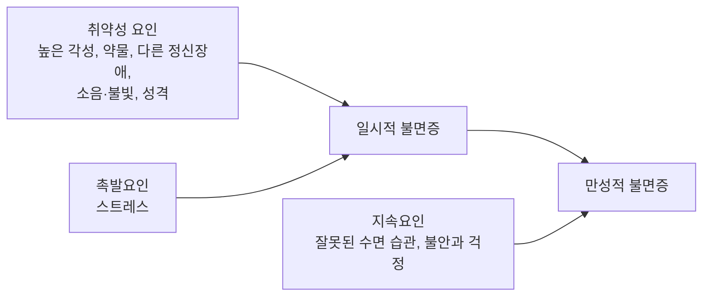



요약

잘 수 있는 환경과 시간이 있는데도 잠들지 못하거나, 자주 깨거나, 새벽에 너무 일찍 깨서 낮 생활이 무너지는 장애다. 대개 스트레스로 며칠 못 자는 일시적 불면에서 시작한다. 그런데 "오늘도 못 자면 어떡하지" 하는 걱정과 누워서 뒤척이는 습관이 쌓이면, 스트레스가 사라진 뒤에도 불면이 혼자 굴러간다. 그래서 치료는 수면제보다 이 굴러가는 습관과 생각을 먼저 겨냥한다.

## 예시로 보기

직장인 GT는 반년 전 이직 준비로 스트레스가 심할 때부터 잠이 안 왔다. 이직은 끝났지만 지금도 일주일에 네다섯 밤은 누워서 한 시간 넘게 잠들지 못한다. 잠이 안 오면 침대에서 휴대폰을 보고, 주말에는 부족한 잠을 채우려고 낮 12시까지 잔다. 잠자리에 들 때마다 "내일 또 망치겠다"는 생각에 심장이 뛴다. 낮에는 멍하고 실수가 잦다[^s1].

- 수면 시작 불면증(30분 넘게 잠들지 못함).
- 주 3일 이상, 3개월 이상. 잘 기회는 충분하다.
- 낮의 기능 손상.
- 촉발요인(이직 스트레스)이 사라진 뒤에도 지속요인(침대에서 휴대폰, 주말 늦잠, 불면 걱정)이 불면을 유지한다.

## 정의

불면장애의 진단기준[^1]

A. 수면의 양이나 질에 대한 불만족이 다음 가운데 하나 이상으로 나타난다.
1. 잠들기가 어렵다: 수면 시작 불면증(sleep onset insomnia)
2. 자주 깨거나 깬 뒤 다시 잠들기 어렵다: 수면 유지 불면증(sleep maintenance insomnia)
3. 새벽에 일찍 깨서 다시 잠들기 어렵다: 수면 종료 불면증(sleep terminal insomnia)

B. 불면과 피로 때문에 일상생활이 곤란하고 고통스럽다.  
C. 수면 문제가 적어도 주 3일 이상 나타난다.  
D. 수면 문제가 3개월 이상 이어진다.  
E. 충분히 잘 기회가 있는데도 수면의 어려움이 생긴다.

E가 있는 이유는, 야근이나 육아로 잘 시간 자체가 없는 수면 부족을 불면장애와 구별하기 위해서다[^s2].

## 임상적 특징[^2]

- 성인의 30~40%가 한 해에 한 번 이상 불면을 겪고, 그 가운데 10~15%는 한 달 넘게 겪는다.
- **수면 시작 불면증:** 보통 사람은 10~15분 만에 잠든다. 30분 넘게 잠이 오지 않으면 불면이다.
- **수면 유지 불면증:** 자는 도중 자꾸 깨어 깨어 있는 시간이 30분 이상이다.
- **수면 종료 불면증:** 예정한 기상 시간보다 일찍 깨서 다시 잠들지 못한다.
- 초기 성인에게는 수면 시작 불면증이 흔하고, 중·노년기에는 수면 유지와 수면 종료 불면증이 많다.

## 원인

### 높은 각성 수준[^3]

불면장애의 취약 요인은 높은 각성 수준이다.

| 각성 | 내용 |
|---|---|
| 생리적 각성 | 자율신경계가 지나치게 활성화된 신체적 흥분. 빠른 심장박동, 근육 긴장, 높은 체온. 흥분제 복용, 과도한 운동이나 피로 |
| 인지적 각성 | 끝내지 못한 과제, 걱정이나 복잡한 생각. 불면 때문에 과제를 망칠까 봐 하는 걱정 |
| 정서적 각성 | 정서적으로 고양되거나 흥분된 상태. 충분히 풀리지 않은 불쾌한 감정 |

### 인지행동모델[^4][^5]

일시적 불면이 만성 불면이 되는 과정을 세 요인으로 설명한다.

p.62의 그림은 같은 생각을 시간에 따라 보여 준다. 병전기에는 취약성(선행요인)만 있어 역치 아래다. 스트레스(유발요인)가 더해지면 역치를 넘어 급성 불면이 시작된다. 시간이 지나 스트레스가 줄어도, 잘못된 습관과 걱정(지속요인)과 과다각성이 그 자리를 채워 만성 불면이 이어진다. 불면증 인지행동치료가 겨냥하는 것이 이 지속요인이다[^5].

이 모델은 [취약성-스트레스 모델](/Hongs_Blog/studies/abnormal-psychology/vulnerability-stress-model/)에 "무엇이 불면을 유지하는가"를 더한 것이다[^s3].

## 치료[^6]

- **미국수면의학회와 유럽수면의학회의 지침:** 불면증 인지행동치료(CBT-I)를 강하게 권고한다. 효과가 없거나 CBT-I를 할 수 없을 때만 약을 단기간 쓰는 것이 원칙이다.
- **약물치료:** 항불안제, 수면제 등. 약물 의존을 피하려고 단기간만 쓴다.
- CBT-I의 구성은 [불면증 인지행동치료](/Hongs_Blog/studies/abnormal-psychology/cbt-i/)에 있다.

## 연결

- 치료: [불면증 인지행동치료](/Hongs_Blog/studies/abnormal-psychology/cbt-i/)
- 높은 인지적 각성을 공유하는 장애: [범불안장애](/Hongs_Blog/studies/abnormal-psychology/generalized-anxiety-disorder/)의 걱정
- 새벽에 일찍 깨는 불면이 흔한 장애: [주요우울장애](/Hongs_Blog/studies/abnormal-psychology/major-depressive-disorder/)

## 확인 문제

<b>C1</b> 불면장애의 세 유형을 쓰고, 빈도·기간 기준과 기준 E를 쓰라.

**답:** 수면 시작 불면증(잠들기 어려움), 수면 유지 불면증(자주 깨거나 다시 잠들기 어려움), 수면 종료 불면증(새벽에 일찍 깨서 다시 못 잠). 주 3일 이상, 3개월 이상. 기준 E: 충분히 잘 기회가 있는데도 어려움이 생긴다.

<b>C2</b> 예시의 GT 사례를 인지행동모델의 세 요인(취약성, 촉발, 지속)으로 옮기고, 이직이 끝났는데도 불면이 이어지는 이유를 쓰라.

**답:** 취약성: 잠자리에 들 때 심장이 뛰는 높은 각성. 촉발: 이직 준비 스트레스. 지속: 침대에서 휴대폰 보기, 주말 늦잠(잘못된 수면 습관), "내일 또 망치겠다"는 걱정. 촉발요인이 사라져도 지속요인이 남아 불면을 굴러가게 하므로 만성 불면이 된다.

<b>C3</b> 예순다섯 살 GU는 밤 10시에 쉽게 잠들지만 새벽 3시에 깨서 다시 잠들지 못한다. 넉 달째 주 5일이다. 어떤 유형의 불면이고, 나이와 관련해 어떤 점이 전형적인가? 진단 전에 무엇을 더 확인해야 하는가?

**답:** 수면 종료 불면증. 중·노년기에는 수면 유지와 수면 종료 불면증이 많다는 점에서 전형적이다. 진단 전에 낮의 고통이나 기능 손상이 있는지(기준 B), 새벽에 일찍 깨고 기분이 가라앉는 우울증의 증상은 아닌지, 노화에 따른 수면 변화의 범위는 아닌지 확인한다.

[^1]: 4-1학기/이상 심리학/1.수업자료/08.급식 및 섭식장애, 수면-각성장애.pdf, p.57
[^2]: 4-1학기/이상 심리학/1.수업자료/08.급식 및 섭식장애, 수면-각성장애.pdf, p.58
[^3]: 4-1학기/이상 심리학/1.수업자료/08.급식 및 섭식장애, 수면-각성장애.pdf, p.59
[^4]: 4-1학기/이상 심리학/1.수업자료/08.급식 및 섭식장애, 수면-각성장애.pdf, p.60
[^5]: 4-1학기/이상 심리학/1.수업자료/08.급식 및 섭식장애, 수면-각성장애.pdf, p.62 (시간 경과에 따른 불면증 그림: 선행·유발·지속요인과 과다각성, 역치, "불면증의 CBT 치료대상")
[^6]: 4-1학기/이상 심리학/1.수업자료/08.급식 및 섭식장애, 수면-각성장애.pdf, p.61
[^s1]: 에이전트 보충. GT의 사례는 진단기준과 인지행동모델을 보이려고 만든 가상 사례다.
[^s2]: 에이전트 보충. 기준 E의 취지(수면 기회 부족과의 구별)는 DSM-5-TR의 설명이다. DSM-5-TR은 다른 수면장애, 물질, 다른 정신장애나 의학적 상태로 충분히 설명되지 않는다는 조건도 둔다.
[^s3]: 에이전트 보충. 이 모델은 스필만(Spielman)의 3P 모델로 알려져 있다. 취약성-스트레스 모델과의 관계는 해석이다.

