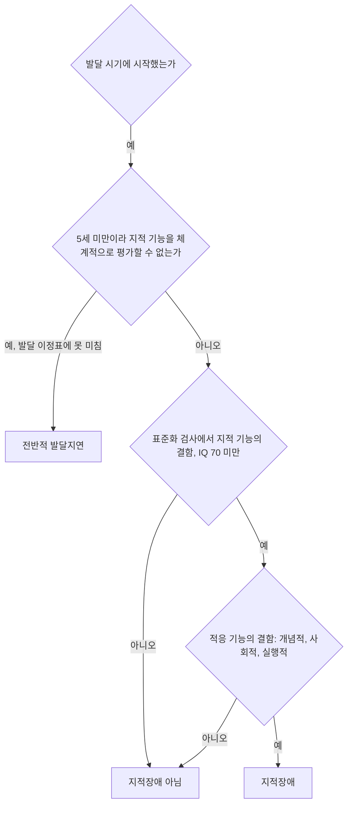



요약

발달기부터 생각하고 배우는 능력(지적 기능)이 또래보다 전반적으로 낮고, 그 때문에 혼자 생활하는 능력(적응 기능)도 부족한 장애다. 두 가지가 모두 있어야 한다. 지능지수가 낮다는 것만으로는 부족하고, 실제로 의사소통, 학업, 대인관계, 일상 기술에 어려움이 있어야 한다. 평생 이어지지만, 일찍 찾아 꾸준히 도우면 적응 수준이 크게 달라진다.

## 예시로 보기

일곱 살 JT는 지능검사에서 지능지수 62가 나왔다. 초등학교 1학년 수업을 따라가기 어렵고, 혼자 옷 입기, 돈 계산, 친구와의 규칙 있는 놀이에 도움이 필요하다. 친구가 "이거 주면 같이 놀아 줄게"라고 하면 쉽게 자기 물건을 준다[^s1].

- 지적 기능의 결함(지능지수 70 미만, 평균에서 약 2 표준편차 아래).
- 적응 기능의 결함: 개념적(돈 계산), 사회적(규칙 놀이, 쉽게 이용당함), 실행적(옷 입기).
- 발달기에 시작.

## 정의[^1][^2]

발달 시기에 시작되는 ① 지적 기능과 ② 적응 기능의 결함이다.

- **지적 기능:** 추론, 문제해결, 계획, 추상적 사고, 판단, 경험을 통한 학습, 실질적인 이해. 지능지수(IQ) 70 미만이 기준이다.
- **적응 기능:** 개념적·사회적·실행적 영역에서 얼마나 잘 기능하느냐. 의사소통, 학업 적응, 대인관계, 직업 기술 같은 일상생활 적응에 심각한 장애가 있다.
- 진단하려면 지능과 적응 기능에 대한 표준화된 검사 결과가 있어야 한다.
- 성별, 나이, 사회문화적 배경이 같은 또래와 비교한다.

지능지수 70은 평균 100, 표준편차 15인 검사에서 평균보다 2 표준편차 아래로, 인구의 약 2.2%가 이 아래에 놓인다([통계적 일탈 기준 ↔ 정규분포](/Hongs_Blog/studies/abnormal-psychology/statistical-deviation--normal-distribution/))[^1].

### 네 등급[^1]

| 등급 | 지능지수 | 도달 수준 |
|---|---|---|
| 경도(mild) | 69~50 | 초등학교 고학년 수준 |
| 중등도(moderate) | 50~35 | 초등학교 저학년 수준 |
| 고도(severe) | 35~20 | 초보적 언어와 자기 돌봄 |
| 최고도(profound) | 20 이하 | 자기 돌봄의 한계 |

지능지수로 등급을 나누는 방식은 DSM-IV의 방식이다. DSM-5부터는 심각도를 지능지수가 아니라 개념적·사회적·실행적 영역의 적응 기능 수준으로 정한다. 지능지수는 측정 오차가 있고, 실제로 필요한 도움의 양은 적응 기능이 더 잘 보여 주기 때문이다[^s2].

### 전반적 발달지연[^2]

지적 기능의 여러 영역에서 기대되는 발달 이정표에 도달하지 못했지만, 지적 기능을 체계적으로 평가할 수 없는 5세 미만의 아동에게 쓰는 진단이다.

두 결함 가운데 하나라도 없으면 지적장애가 아니다. 다섯 살이 안 되어 검사를 할 수 없으면 전반적 발달지연을 쓴다[^s3].

## 임상적 특징[^3]

- 사회적 판단, 위험 평가, 행동·감정·대인관계의 자기 조절, 학교나 직장에서의 동기에 어려움이 있다. 의도치 않게 범죄에 연루되거나 남에게 착취당하고 희생될 수 있다.
- 유병률 1%. 남성에게 더 많다.
- 발달기에 시작해, 심각도는 시간에 따라 달라질 수 있지만 대개 평생 이어진다.
- 일찍 시작해 꾸준히 개입하는 것이 중요하다. 영유아를 평가할 때는 적절한 개입을 제공한 뒤로 진단을 미룬다.

## 원인과 치료[^4]

- **원인:** 유전자 이상, 임신 중 태내 환경의 이상, 임신과 출산 과정의 이상, 후천적 아동기 질환, 열악한 환경.
- **치료:** 지적장애의 수준에 따른 대책. 일상에 필요한 기본적 적응 기술을 배우고 유지하며, 현실의 실제적인 문제에 대책을 세운다. 가능한 한 빨리 확인해 조기에 집중적으로 교육하는 것이 효과적이다.

## 연결

- 지능지수 절단점의 통계적 의미: [통계적 일탈 기준 ↔ 정규분포](/Hongs_Blog/studies/abnormal-psychology/statistical-deviation--normal-distribution/)
- 전반이 아닌 특정 학습 기술만 어려울 때: [특정학습장애](/Hongs_Blog/studies/abnormal-psychology/specific-learning-disorder/)
- 자주 함께 나타나는 장애: [자폐스펙트럼장애](/Hongs_Blog/studies/abnormal-psychology/autism-spectrum-disorder/)

## 확인 문제

<b>C1</b> 지적장애 진단에 필요한 두 결함과 시작 시기를 쓰고, 적응 기능의 세 영역을 쓰라.

**답:** 지적 기능의 결함과 적응 기능의 결함, 발달 시기에 시작. 적응 기능의 영역은 개념적, 사회적, 실행적 영역이다.

<b>C2</b> 지능지수가 68인데도 일상생활을 혼자 잘 해내는 사람에게 지적장애를 진단하지 않는 이유와, DSM-5가 심각도를 적응 기능으로 정하는 이유를 쓰라.

**답:** 진단에는 지적 기능과 적응 기능의 결함이 모두 필요하므로, 적응 기능이 괜찮으면 진단하지 않는다. 지능지수에는 측정 오차가 있어 70 근처의 점수 차이는 의미가 작고, 실제로 얼마나 도움이 필요한지는 적응 기능이 더 잘 보여 준다. 그래서 DSM-5는 심각도를 적응 기능으로 정한다.

<b>C3</b> 세 살 JZ는 말, 운동, 놀이 발달이 전반적으로 늦지만 아직 표준화된 지능검사를 할 수 없다. 어떤 진단을 쓰는가?

**답:** 전반적 발달지연. 5세 미만이라 지적 기능을 체계적으로 평가할 수 없을 때 쓰고, 개입을 제공하며 나중에 다시 평가한다. 흔한 오답은 곧바로 지적장애로 진단하는 것이다.

[^1]: 4-1학기/이상 심리학/1.수업자료/11.신경발달장애, 신경인지장애.pdf, p.6 (정규분포 그림에서 70 아래 2.2%). "지적 기능"과 "적응 기능"에 매긴 ①②와 형광펜은 손글씨 필기다.
[^2]: 4-1학기/이상 심리학/1.수업자료/11.신경발달장애, 신경인지장애.pdf, p.7
[^3]: 4-1학기/이상 심리학/1.수업자료/11.신경발달장애, 신경인지장애.pdf, p.8
[^4]: 4-1학기/이상 심리학/1.수업자료/11.신경발달장애, 신경인지장애.pdf, p.9
[^s1]: 에이전트 보충. JT의 사례는 두 결함과 세 영역을 보이려고 만든 가상 사례다.
[^s2]: 에이전트 보충. DSM-5-TR은 지적발달장애의 심각도를 개념적·사회적·실행적 영역의 적응 기능으로 경도·중등도·고도·최고도로 정한다. 슬라이드의 지능지수 구간은 DSM-IV-TR 방식이다.
[^s3]: 에이전트 보충. 다이어그램 1개는 원본에 없다. '정의'의 두 결함과 시작 시기(p.6), '전반적 발달지연'(p.7)을 순서도로 옮겼다.

