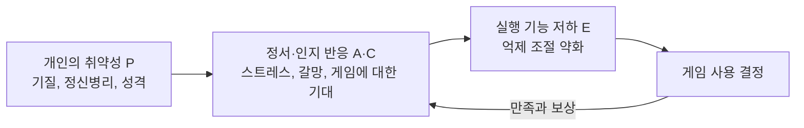



요약

온라인 게임에 몰두해 스스로 조절하지 못하고, 그 때문에 학업, 일, 관계가 무너지는 상태다. 게임을 못 하게 하면 짜증과 불안이 오고(금단), 점점 더 오래 해야 만족하는(내성) 등 도박장애와 구조가 닮았다. 다만 DSM-5-TR에서는 아직 정식 진단이 아니라 "추가 연구가 필요한 진단"이다. 게임을 많이 한다는 것만으로는 해당하지 않고, 업무나 사교를 위한 인터넷 사용도 제외한다.

## 예시로 보기

고등학생 JK는 1년째 하루 8시간 넘게 온라인 게임을 한다. 부모가 컴퓨터를 치우자 소리를 지르고 방에 틀어박혔다. 게임 시간을 줄이겠다고 몇 번 약속했지만 지키지 못했고, 좋아하던 축구도 그만두었다. 부모에게는 공부했다고 거짓말하고, 우울할 때마다 게임에 접속한다. 성적이 크게 떨어져 진학이 위태롭다[^s1].

- 몰두(1), 금단(2), 조절 실패(4), 다른 흥미 감소(5), 속이기(7), 부정적 기분에서 벗어나려 함(8), 학업 기회의 위태로움(9): 9개 가운데 7개.
- 12개월, 현저한 손상.

## 정의

인터넷 게임 장애의 진단기준(잠정적)[^1]

게임을 하려고, 흔히 다른 사용자들과 함께 게임을 하려고 인터넷을 지속적·반복적으로 쓰는 행동이 임상적으로 현저한 손상이나 고통을 낳고, 12개월 동안 다음 가운데 5가지 이상이 나타난다.
1. 인터넷 게임에 대한 몰두
2. 게임을 못 하게 하면 나타나는 금단 증상(전형적으로 과민성, 불안, 슬픔. 약리학적 금단의 신체 징후는 없다)
3. 내성: 더 오랜 시간 게임을 하려는 욕구
4. 게임 참여를 통제하려는 시도의 실패
5. 게임 말고 이전의 취미와 오락에 대한 흥미 감소
6. 정신사회적 문제를 알면서도 과도하게 게임을 계속함
7. 가족, 치료자, 다른 사람에게 게임한 시간을 속임
8. 무력감, 죄책감, 불안 같은 부정적 기분에서 벗어나거나 이를 달래려고 게임을 함
9. 게임 때문에 중요한 대인관계, 직업, 학업, 진로 기회를 위태롭게 하거나 잃음

제외: 인터넷 도박(도박장애로 진단), 업무나 직업상 필요한 인터넷 사용, 기분 전환이나 사회적 목적의 인터넷 사용, 성적인 인터넷 사이트 사용[^2].

## 임상적 특징[^3]

- 1년 평균 유병률은 4.7%로 추정된다.
- 남성이 더 많다. 남성은 액션, 싸움, 전략, 역할놀이 게임을, 여성은 퍼즐, 음악, 사회적·교육적 주제의 게임을 한다.

## 원인[^4]

- **유전적·기질적 요인:** 중독에 취약한 유전적 기질과 신경생리적 결함, 다른 정신장애의 공존.
- **심리적 요인:** 미성숙, 감각추구 성향, 정서 불안정, 낮은 자존감, 충동성과 낮은 자기조절 능력.
- **환경적 요인:** 인터넷에 접속할 수 있는 컴퓨터가 있는 환경, 갈등이 많은 환경, 애정과 의사소통이 부족한 가정, 학교 성적 부진, 열악한 사회적 환경.
- **통합적 모델: I-PACE 모델(Brand et al., 2014, 2016, 2019).** 인터넷 중독 행동이 생기고 유지되는 기전을 설명한다. 개인의 취약성(Person), 상황에 대한 정서적 반응(Affect)과 인지적 반응(Cognition), 인터넷을 마주한 상황에서 실행 기능이 떨어져 내리는 결정(Execution)이 상호작용한 결과로 본다.

사용 뒤의 만족과 보상이 다시 정서·인지 반응을 키워 고리가 굳어진다는 것이 이 모델의 요점이다[^s2].

## 치료[^5]

- **약물치료:** 공존질환 치료(항우울제, ADHD 치료제 등).
- **가족치료:** 가족의 관계와 소통을 늘리는 데 초점을 둔다.
- **인지행동치료 CBT-IA(Internet Addiction, Young, 1999):** (1) 행동 수정 → (2) 인지적 재구성 → (3) 위해 감소의 세 단계.

## 연결

- 구조가 닮은 정식 행위 중독: [도박장애](/Hongs_Blog/studies/abnormal-psychology/gambling-disorder/)
- 범주: [물질관련 및 중독 장애](/Hongs_Blog/studies/abnormal-psychology/substance-related-addictive/)
- I-PACE의 틀인 취약성과 상황의 상호작용: [취약성-스트레스 모델](/Hongs_Blog/studies/abnormal-psychology/vulnerability-stress-model/)

## 확인 문제

<b>C1</b> 다음 가운데 인터넷 게임 장애의 대상이 되는 경우는? (a) 온라인 카지노에서 매일 베팅한다 (b) 게임 회사 QA 직원으로 하루 10시간 게임을 한다 (c) 친구들과 메신저로 수다를 떨며 하루 5시간을 보낸다 (d) 1년째 온라인 게임을 조절하지 못해 학업을 포기할 지경이다

**답:** (d)만. (a)는 인터넷 도박이라 도박장애로 진단한다. (b)는 업무상 필요한 사용, (c)는 사회적 목적의 인터넷 사용이라 제외한다.

<b>C2</b> 인터넷 게임 장애의 "금단"이 알코올 금단과 다른 점과, 그래도 금단이라고 부르는 이유를 쓰라.

**답:** 알코올 금단은 손 떨림, 발한, 경련 같은 약리학적 신체 징후가 있지만, 게임의 금단은 과민성, 불안, 슬픔 같은 정서 반응뿐이고 신체 징후가 없다. 그래도 "하던 행동을 멈추면 불쾌한 상태가 오고, 그 상태를 피하려고 다시 하게 된다"는 구조가 같아서 금단이라 부른다. 행위 중독이 물질 중독과 같은 범주에 들어가는 근거다.

[^1]: 4-1학기/이상 심리학/1.수업자료/10.파괴적, 충동조절 및 품행장애, 물질관련 및 중독장애.pdf, p.77. 원문의 "홍미"는 "흥미"로 읽었다.
[^2]: 4-1학기/이상 심리학/1.수업자료/10.파괴적, 충동조절 및 품행장애, 물질관련 및 중독장애.pdf, p.78
[^3]: 4-1학기/이상 심리학/1.수업자료/10.파괴적, 충동조절 및 품행장애, 물질관련 및 중독장애.pdf, p.79
[^4]: 4-1학기/이상 심리학/1.수업자료/10.파괴적, 충동조절 및 품행장애, 물질관련 및 중독장애.pdf, p.80
[^5]: 4-1학기/이상 심리학/1.수업자료/10.파괴적, 충동조절 및 품행장애, 물질관련 및 중독장애.pdf, p.81. CBT-IA 아래 "Internet Addiction"은 손글씨 필기다.
[^s1]: 에이전트 보충. JK의 사례는 기준 번호를 짚으려고 만든 가상 사례다.
[^s2]: 에이전트 보충. I-PACE 그림의 되먹임(만족과 보상이 정서·인지 반응을 강화)은 Brand 등(2016)의 모델을 단순화했다. 원본은 네 요소의 이름과 상호작용만 적는다.

