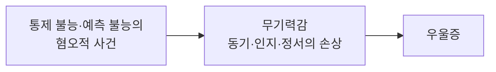



요약

무엇을 해도 나쁜 일을 피할 수 없는 경험을 되풀이하면, "내 행동은 결과를 바꾸지 못한다"는 것을 배워 버린다는 이론이다. 그렇게 배운 무력감이 의욕·생각·감정을 무너뜨려 우울이 된다. 동물 실험에서 출발해 우울의 행동적 모습을 잘 설명한다. 하지만 사람이 왜 그 실패를 자기 탓으로 돌리고 자존감까지 잃는지는 설명하지 못해, 뒤에 귀인이론으로 고쳐졌다.

## 예시로 보기

셀리그먼의 개 실험을 간추리면 이렇다[^1][^s1].

| 단계 | 통제 가능 집단 | 통제 불가능 집단 |
|---|---|---|
| 1단계 | 전기충격을 받지만 판을 누르면 멈춘다 | 같은 양의 충격을 받지만 무엇을 해도 멈추지 않는다 |
| 2단계(셔틀 박스) | 낮은 칸막이를 넘어 충격을 피하는 법을 금세 배운다 | 칸막이만 넘으면 되는데도 엎드려 충격을 견딘다 |

두 집단이 받은 충격의 양은 같았다. 차이는 충격을 "통제할 수 있었는가"뿐이다. 통제 불가능 집단은 2단계에서 피할 수 있게 되었는데도 시도하지 않았다. 무기력을 배운 것이다.

사람에게 옮기면: 아무리 공부해도 성적이 오르지 않는 경험을 되풀이한 학생이, 쉬운 과목에서도 공부를 시도하지 않는 모습이다.

## 정의

셀리그먼(Seligman, 1975)이 동물 실험을 근거로 발전시킨 이론이다. 반복된 좌절 경험으로, 자기 행동과 상관없이 절망적인 결과가 돌아올 것이라는 무력감을 학습하고, 이것이 우울을 일으킨다[^1].

무기력감이 망가뜨리는 세 가지는 이렇다[^1][^s1].
- **동기:** 시도해 봤자 소용없으니 시도하지 않는다.
- **인지:** 나중에 통제할 수 있는 상황이 와도 그 사실을 알아보지 못한다.
- **정서:** 무력감과 슬픔이 따라온다.

슬라이드는 이 이론을 행동주의적 입장에 둔다. 행동과 결과의 관계(수반성)를 배우는 것이 핵심이기 때문이다[^1].

### 설명하는 것과 설명하지 못하는 것

- **설명하는 것:** 우울한 사람의 수동성, 시도하지 않음, 쉽게 포기함.
- **설명하지 못하는 것:** 통제할 수 없는 일을 겪고도 우울해지지 않는 사람이 많다. 또 통제할 수 없었다면 자기 잘못이 아닌데, 우울한 사람은 오히려 자신을 탓하고 자존감을 잃는다. 이 두 문제를 풀려고 "그 일이 왜 일어났다고 설명하느냐"를 더한 것이 [우울증의 귀인이론](/Hongs_Blog/studies/abnormal-psychology/attribution-theory-depression/)이다[^s2].

## 연결

- 바탕이 된 학습 원리: [행동주의적 입장](/Hongs_Blog/studies/abnormal-psychology/behavioral-perspective/)
- 수정판: [우울증의 귀인이론](/Hongs_Blog/studies/abnormal-psychology/attribution-theory-depression/)
- 다른 원인과의 관계: [우울장애의 원인](/Hongs_Blog/studies/abnormal-psychology/depression-causes/)

## 확인 문제

<b>C1</b> 학습된 무기력 이론의 세 단계(사건 → 상태 → 결과)를 쓰고, 무기력감이 손상시키는 세 영역을 쓰라.

**답:** 통제 불능·예측 불능의 혐오적 사건 → 무기력감 → 우울증. 무기력감은 동기, 인지, 정서를 손상시킨다.

<b>C2</b> 셀리그먼의 실험에서 두 집단이 받은 충격의 양을 같게 맞춘 이유는 무엇인가? 이 설계가 보여 주는 핵심은?

**답:** 충격의 양이 같아야, 2단계에서 나타난 차이가 고통의 크기가 아니라 "통제할 수 있었는가"에서 왔다고 말할 수 있다. 핵심은 나쁜 일 자체가 아니라, 자기 행동이 결과를 바꾸지 못한다는 경험(통제 불가능성)이 무기력을 만든다는 것이다.

<b>C3</b> 학습된 무기력 이론만으로는 설명하기 어려운 사례를 하나 만들고, 이론의 어느 한계에 해당하는지 쓰라.

**답:** 태풍으로 가게를 잃은 두 상인 중 한 사람은 "천재지변이니 다시 하면 된다"며 우울해지지 않고, 다른 사람은 "내가 무능해서 모든 걸 잃었다"며 우울해진다. 둘 다 통제 불가능한 사건을 겪었는데 결과가 다르고, 우울해진 쪽은 통제할 수 없던 일을 자기 탓으로 돌렸다. 이론은 개인차와 자기비난을 설명하지 못한다. 이 한계를 귀인이론이 보완한다.

[^1]: 4-1학기/이상 심리학/1.수업자료/03.양극성장애와 우울장애.pdf, p.26 (학습된 무기력 이론, 셔틀 박스 그림, 이론 도식)
[^s1]: 에이전트 보충. 실험 설계(통제 가능·불가능 집단, 셔틀 박스 2단계)는 Seligman과 Maier(1967)의 고전적 실험을 간추린 것이다. 세 영역의 풀이는 이론의 표준 설명이다.
[^s2]: 에이전트 보충. Abramson, Seligman, Teasdale(1978)이 귀인 개념을 더해 학습된 무기력 이론을 수정했다.

