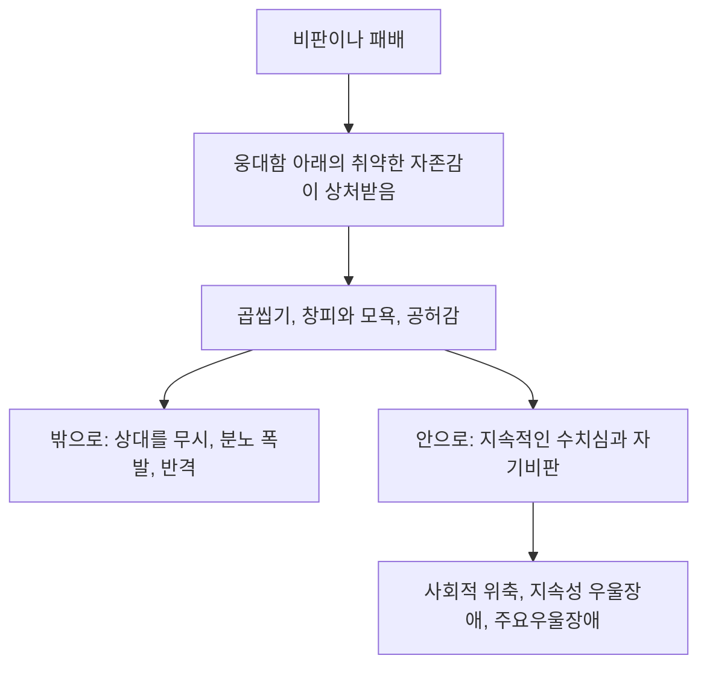



요약

겉은 단단한 성처럼 보이지만 속은 얇은 유리 같은 자존감이다. 자신이 특별하고 우월하다고 믿어 찬사와 특별대우를 당연히 요구하고, 남의 감정에는 공감하지 못한다. 그런데 작은 비판에도 깊이 상처받아 분노하거나 우울해진다. 사회적으로 성공한 사람에게 흔하지만, 자기 약점을 보지 않으려 해 치료가 어렵다.

## 예시로 보기

서른여덟 살 LX는 팀장 회의에서 "이 회사에서 나를 제대로 이해하는 건 대표뿐"이라고 말한다. 부하 직원의 성과를 자기 것으로 발표하고, 직원이 가족 일로 휴가를 내자 "프로 의식이 없다"고 비난한다. 승진에서 밀리자 몇 주 동안 그 결정을 곱씹으며 동료들을 무시했고, 이후 잠을 못 이루고 공허감을 호소하며 상담을 찾았다[^s1].

- 과장된 자기 중요성, 특별한 사람만 자신을 이해한다고 믿음: 기준 1, 3.
- 착취적 대인관계, 공감 결여: 기준 6, 7.
- 패배에 대한 민감성, 곱씹기, 우울: 웅대성 아래의 취약성.

## 정의[^1]

핵심 특징은 공상이나 행동에서의 웅대성, 찬사에 대한 욕구, 자기중심성, 공감 능력의 결여다. 다음 가운데 5개 이상이다.

1. 자신의 중요성을 과장되게 지각한다.
2. 무한한 성공, 탁월함, 아름다움에 대한 공상에 집착한다.
3. 자신이 특별하고 독특한 존재라고 믿는다.
4. 과도한 찬사를 요구한다.
5. 특권의식을 지닌다.
6. 대인관계가 착취적이다.
7. 공감 능력이 결여되어 있다.
8. 타인을 질투하거나 자신이 질투받는다고 믿는다.
9. 거만하고 방자한 행동이나 태도를 보인다.

## 임상적 특징[^2]

- 자기 지각이 부풀려져 있고 특권의식이 과도하다.
- 사회적으로 성공한 사람들에게 흔하다.
- 그러나 대인관계에서 심각한 갈등을 겪는다.
- **웅대성 대 취약성:** 실제 자존감은 취약해서 비판이나 패배로 인한 상처에 매우 민감하다.
    - 비판을 계속 곱씹고, 창피와 모욕, 공허감을 느끼며, 상대를 무시하거나 분노를 터뜨리거나 반격한다.
    - 지속적인 수치심과 모욕감에 따르는 자기비판은 사회적 위축, 우울, 지속성 우울장애, 주요우울장애를 일으키기도 한다.
- 유병률은 일반 인구의 1%, 정신과 환자의 2~15%. 자기애성 성격장애의 50~75%가 남자다.

같은 상처가 밖으로 향하면 분노와 반격이 되고, 안으로 향하면 우울이 된다[^s3].

## 원인[^3]

**정신분석적 입장.** 어린 시절 냉담하고 거부적인 부모가 바탕에 있다. 세 학자의 설명이 다르다.

| 학자 | 설명 |
|---|---|
| Freud | 유아기의 일차적 자기애에 고착되었다. 타인을 배려하고 자신의 부족함을 받아들이는 다음 단계로 넘어가지 못했다[^s2] |
| Kohut | 웅대한 자기애가 적절히 좌절되지 않았거나, 반대로 지나치게 좌절되었다. 이 자기애적 손상(narcissistic injury)이 병적인 자기애로 이어진다 |
| Kernberg | 부모의 특별대우와 칭찬 때문에 이상적 자기상과 현실적 자기상을 혼동한다 |

**인지적 입장.** "나는 매우 특별한 사람이다", "나는 우월하므로 특별대우와 특권을 누려야 한다", "인정, 칭찬, 존경을 받는 것은 매우 중요한 일이다", "나 정도의 탁월한 사람만이 나를 이해할 수 있다".

## 치료[^4]

- **치료의 어려움:** 자신의 취약점을 인식하기 어렵고, 타인의 평가나 피드백을 받아들이지 않으려 한다.
- **정신분석적 치료:** 근본적인 취약성과 그것을 가리는 방어를 인식하고 통찰하게 돕는다.
- **인지행동치료:**
    1. 웅대한 자기상과 관련된 비현실적 신념을 자각하고 바꾼다.
    2. 타인의 평가에 대한 과도한 관심과 감정 반응을 조절한다.
    3. 타인의 생각과 감정에 대한 공감 능력을 키운다.

## 연결

- 관심 자체를 원하고 감정을 과장하면: [연극성 성격장애](/Hongs_Blog/studies/abnormal-psychology/histrionic-pd/)
- 수치심과 자기비판이 낳는 우울: [지속성 우울장애](/Hongs_Blog/studies/abnormal-psychology/persistent-depressive-disorder/)
- 자기애와 방어: [정신분석적 입장](/Hongs_Blog/studies/abnormal-psychology/psychoanalytic-perspective/)

## 확인 문제

<b>C1</b> 자기애성 성격장애의 핵심 특징 네 가지와 유병률, 성비를 쓰라.

**답:** 공상이나 행동에서의 웅대성, 찬사에 대한 욕구, 자기중심성, 공감 능력의 결여. 일반 인구의 1%, 정신과 환자의 2~15%. 50~75%가 남자.

<b>C2</b> 자신감이 넘쳐 보이는 자기애성 성격장애 환자가 우울증에 잘 걸리는 이유를 "웅대성 대 취약성"으로 설명하라.

**답:** 겉의 웅대한 자기상은 실제로는 취약한 자존감을 가리는 것이다. 그래서 비판이나 패배가 자기상을 크게 위협하고, 그 상처를 곱씹으며 창피, 모욕, 공허감을 느낀다. 이어지는 수치심과 자기비판이 사회적 위축과 우울(지속성 우울장애, 주요우울장애)로 이어진다.

<b>C3</b> 자기애성 성격장애의 원인에 대한 Kohut과 Kernberg의 설명을 구별하라.

**답:** Kohut은 웅대한 자기애가 적절히 좌절되지 않았거나 지나치게 좌절된 자기애적 손상을 원인으로 본다(좌절의 양이 문제). Kernberg는 부모의 특별대우와 칭찬 때문에 이상적 자기상과 현실적 자기상이 혼동된 것을 원인으로 본다(자기상의 혼동이 문제).

[^1]: 4-1학기/이상 심리학/1.수업자료/12.성격장애.pdf, p.39
[^2]: 4-1학기/이상 심리학/1.수업자료/12.성격장애.pdf, p.40. "웅대성"과 "취약성"에 빨간 동그라미 손글씨 필기가 있다.
[^3]: 4-1학기/이상 심리학/1.수업자료/12.성격장애.pdf, p.41. Freud 줄 옆에 "→ 이차적 자기애로 넘어가지 못함 (타인에 대한 배려, 자신의 부족함)"이라는 손글씨 필기가 있다.
[^4]: 4-1학기/이상 심리학/1.수업자료/12.성격장애.pdf, p.42
[^s1]: 에이전트 보충. LX의 사례는 진단기준과 웅대성·취약성을 보이려고 만든 가상 사례다.
[^s2]: 에이전트 보충. 필기는 이 다음 단계를 "이차적 자기애"라고 부른다. Freud의 1914년 논문 「나르시시즘 서론」에서 이차적 자기애는 대상에게 향했던 리비도가 다시 자기에게 돌아온 상태를 말하고, 타인을 사랑하는 건강한 다음 단계는 보통 대상애(object love)라고 부른다. 본문에는 필기가 설명한 내용(타인에 대한 배려, 자신의 부족함)을 적고, 용어는 강의에서 어떻게 썼는지 확인이 필요하다 [확인필요].
[^s3]: 에이전트 보충. 다이어그램 1개는 원본에 없다. '임상적 특징'의 웅대성 대 취약성(p.40)을 흐름도로 옮겼다.

