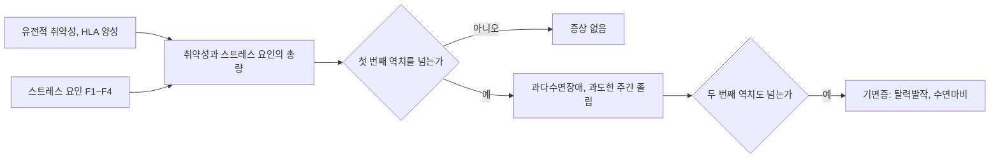



요약

참을 수 없는 졸음이 파도처럼 덮쳐 회의 중이나 운전 중에도 갑자기 잠들어 버리는 장애다. 크게 웃거나 흥분하면 갑자기 몸에 힘이 빠져 주저앉는 탈력발작이 특징이다. 잠든 몸이 움직이지 않도록 근육을 풀어 두는 REM 수면의 장치가 깨어 있을 때 끼어드는 것으로 이해할 수 있다. 의지로 참을 수 있는 졸음이 아니므로, 약으로 깨어 있게 돕고 규칙적인 짧은 낮잠으로 졸음을 다룬다.

## 예시로 보기

20대 HA는 하루에 서너 번, 수업이나 대화 도중 갑자기 잠들어 10분쯤 자고 깬다. 친구의 농담에 크게 웃으면 무릎에 힘이 빠져 주저앉는데, 의식은 또렷하다. 잠들 때 방 안에 누가 서 있는 환각을 보고, 깨어날 때 몸이 움직이지 않는 가위눌림도 자주 겪는다[^s1].

- 참을 수 없는 졸음으로 갑자기 잠에 빠진다(수면발작, A).
- 웃을 때 근육 긴장이 사라진다(탈력발작, B1).
- 가위눌림(수면마비), 입면시 환각.

## 정의

기면증의 진단기준[^1]

A. 저항할 수 없는 졸음으로 갑자기 잠에 빠지는 수면발작(sleep attack)을 반복해서 겪는다. 
B. 다음 가운데 하나 이상:
1. 탈력발작(cataplexy): 웃거나 감정이 격해질 때 갑자기 근육 긴장이 사라진다.
2. 뇌척수액의 히포크레틴 결핍.
3. 수면 잠복기 반복 검사(MSLT)의 이상.

DSM-5-TR은 A가 지난 3개월 동안 주 3회 이상 나타나야 한다고 적는다. 히포크레틴(오렉신)은 깨어 있는 상태를 유지하는 뇌의 신경전달물질이다[^s2].

## 임상적 특징[^2]

- 탈력발작과 수면발작은 불가항력이다. 운전, 회의, 대화, 성관계 도중처럼 잠들기에 부적절한 상황에서도 잠든다.
- 한 번에 5~20분 자고, 하루 2~6회 겪을 수 있다.
- 많은 경우 수면마비(가위눌림)가 따른다.
- 잠에서 깨어날 때 REM 수면이 반복해서 나타나고, 입면시 환각(잠에 들 때)과 탈면시 환각(잠에서 깰 때)이 흔하다.

### 왜 REM 수면의 증상인가

[수면과 수면 단계](/Hongs_Blog/studies/abnormal-psychology/sleep-stages/)에서 REM 수면은 생생한 꿈과 근육 이완이 함께 일어나는 단계다. 기면증의 부수 증상은 이 두 요소가 깨어 있는 때에 끼어든 것으로 정리된다[^s3].

| 증상 | 끼어든 REM 요소 |
|---|---|
| 탈력발작 | 근육 이완이 깨어 있을 때 갑자기 나타남 |
| 수면마비 | 깨어났는데 근육 이완이 아직 남아 있음 |
| 입면시·탈면시 환각 | 꿈이 잠드는 순간이나 깨는 순간의 의식에 섞임 |

기면증 환자는 잠들자마자 곧바로 REM 수면에 들어가는 경우가 많다. 보통은 잠든 뒤 약 90분이 지나야 첫 REM이 온다[^s3].

## 원인: 2역치 다중요인 모델[^3]

[취약성-스트레스 모델](/Hongs_Blog/studies/abnormal-psychology/vulnerability-stress-model/)의 한 형태다. 유전적 취약성(HLA 단백질)에 스트레스의 총량이 더해져 역치를 넘으면 증상이 나타난다.

- **첫 번째 역치:** 과다수면장애, 과도한 주간 졸림이 생긴다.
- **두 번째 역치:** 기면증. 탈력발작과 수면마비 같은 증상이 따른다.

왼쪽 두 상자를 더한 총량이 역치를 하나 넘으면 과다수면장애, 둘 다 넘으면 기면증이다[^s4].

p.69의 그림은 사람들의 분포를 두 곡선으로 그린다. 유전적 취약성이 없는 사람들(HLA 음성, 정상인 분포)의 큰 곡선과, 취약성이 있는 사람들(HLA 양성)의 작은 곡선이다. 취약성이 있는 곡선은 오른쪽, 곧 역치 가까이 치우쳐 있다. 그래서 같은 양의 스트레스 요인(F1~F4)이 더해져도 이 사람들이 먼저 첫 번째 역치(과도한 주간 졸림)와 두 번째 역치(기면증)를 넘는다[^3].

## 치료[^4]

각성 유지에 힘쓴다.

- **약물치료:** 모다피닐(modafinil), 아르모다피닐(armodafinil)로 낮의 졸음을 조절한다. 항우울제로 탈력발작과 REM 수면 관련 증상을 조절한다.
- **생활습관 교정:** 낮에 15~20분씩 규칙적으로 낮잠을 잔다. 규칙적인 수면-각성 주기를 지킨다. 카페인 섭취를 제한한다.

## 연결

- 첫 번째 역치의 장애: [과다수면장애](/Hongs_Blog/studies/abnormal-psychology/hypersomnolence-disorder/)
- REM 수면의 생리: [수면과 수면 단계](/Hongs_Blog/studies/abnormal-psychology/sleep-stages/)
- REM 근육 이완이 반대로 사라지는 장애: [사건수면](/Hongs_Blog/studies/abnormal-psychology/parasomnias/)의 REM 수면 행동장애

## 확인 문제

<b>C1</b> 기면증의 진단기준 A와 B의 세 항목을 쓰라.

**답:** A: 저항할 수 없는 졸음으로 갑자기 잠에 빠지는 수면발작의 반복. B(하나 이상): 탈력발작(웃거나 감정이 격해질 때 근육 긴장 소실), 뇌척수액 히포크레틴 결핍, 수면 잠복기 반복 검사의 이상.

<b>C2</b> 탈력발작, 수면마비, 입면시 환각이 모두 "REM 수면이 깨어 있을 때 끼어든 것"이라고 하는 이유를 쓰라.

**답:** REM 수면의 두 요소는 생생한 꿈과 근육 이완이다. 탈력발작은 깨어 있을 때 근육 이완이 갑자기 나타난 것이고, 수면마비는 깨어났는데 근육 이완이 남아 있는 것이며, 입면시·탈면시 환각은 잠드는 순간이나 깨는 순간에 꿈이 의식에 섞인 것이다.

<b>C3</b> 2역치 다중요인 모델을 말로 옮기라. 같은 스트레스를 받은 두 사람 가운데 HLA 양성인 사람이 먼저 기면증에 이르는 이유는?

**답:** 유전적 취약성과 스트레스 요인의 총량이 합쳐져 첫 번째 역치를 넘으면 과도한 주간 졸림(과다수면), 더 커져 두 번째 역치를 넘으면 기면증이 된다. HLA 양성인 사람은 출발점(분포)이 이미 역치 가까이 치우쳐 있어서, 같은 양의 스트레스 요인이 더해져도 먼저 역치를 넘는다.

[^1]: 이상 심리학 8회 강의 자료 「급식 및 섭식장애, 수면-각성장애」, p.67
[^2]: 이상 심리학 8회 강의 자료 「급식 및 섭식장애, 수면-각성장애」, p.68. 입면시 환각 아래 "잠에 들 때", 탈면시 환각 아래 "잠에서 깰 때"는 손글씨 필기다.
[^3]: 이상 심리학 8회 강의 자료 「급식 및 섭식장애, 수면-각성장애」, p.69. 그림의 "정상인 분포", "취약성 x", "유전적 취약성 o"는 손글씨 필기다.
[^4]: 이상 심리학 8회 강의 자료 「급식 및 섭식장애, 수면-각성장애」, p.70
[^s1]: 보충 HA의 사례는 진단기준과 부수 증상을 보이려고 만든 가상 사례다.
[^s2]: 보충 DSM-5-TR 기면증 기준 A의 빈도(지난 3개월 동안 주 3회 이상)와 히포크레틴의 기능을 보탰다.
[^s3]: 보충 부수 증상을 REM 수면 요소의 침범으로 정리한 표와 입면기 REM(sleep-onset REM period)은 수면의학의 표준 설명이다. 슬라이드의 "잠에서 깨어날 때 REM수면이 반복적으로 나타나며"는 깨어나는 순간에 REM 요소가 섞이는 현상으로 읽었다.
[^s4]: 보충 다이어그램 1개는 원본에 없다. '원인: 2역치 다중요인 모델'의 목록과 p.69 그림 설명을 순서도로 옮겼다.

