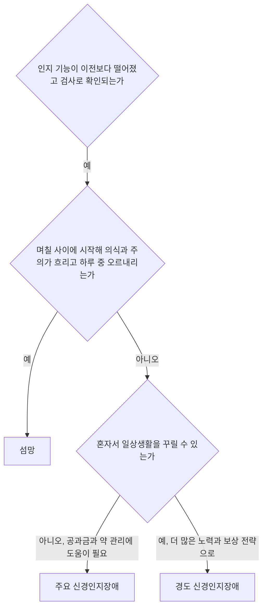



요약

멀쩡하던 기억력, 언어, 판단력이 뇌의 병 때문에 나중에 떨어져 일상생활을 제대로 못 하게 되는 장애다. 예전의 "치매"를 넓힌 이름으로, 나이 든 사람에게만 생기는 것이 아님을 담았다. 혼자 힘으로 생활할 수 있느냐로 주요와 경도를 가르고, 며칠 사이에 의식이 흐려졌다가 돌아오는 것은 섬망으로 따로 본다. 원래 능력이 떨어진 것이므로, 처음부터 발달이 늦은 지적장애와 다르다.

## 예시로 보기

일흔여덟 살 KW는 2년 전부터 약속을 자주 잊고 같은 질문을 되풀이했다. 처음에는 메모와 달력으로 버텼지만, 지금은 공과금 내는 날과 약 먹을 시간을 스스로 챙기지 못해 딸이 대신 관리한다. 의식은 맑고, 하루 중 상태가 크게 오락가락하지 않는다[^s1].

- 이전보다 현저히 떨어진 인지 기능(기억).
- 공과금 납부와 약 관리 같은 복잡한 도구적 일상 활동에 도움이 필요하다: 독립성 상실 → 주요 신경인지장애.
- 메모와 달력으로 버티던 2년 전은 경도 신경인지장애에 가깝다.
- 의식이 맑고 서서히 진행 → 섬망이 아니다.

## 정의

**이름이 바뀐 까닭.** DSM-IV의 치매(dementia)가 DSM-5에서 신경인지장애가 되었다. 발달상의 장애가 아니라 후천적 장애이고, 인지 손상이 핵심 증상임을 드러낸다. 치매는 노인의 퇴행성 장애에 관습적으로 쓰는 말이고, 신경인지장애는 더 젊은 사람의 상태까지 포괄하는 넓은 말이다[^1].

**핵심 증상.** 기억 상실을 비롯한 인지적 결함과 사회적·직업적 기능의 손상이다. 평가하는 인지 영역은 여섯 가지다[^2].

| 인지 영역 | 예 |
|---|---|
| 복합적 주의 | 주의 지속, 분할 주의, 선택적 주의, 처리 속도 |
| 집행 기능 | 계획, 의사결정, 작업기억, 오류 수정, 억제, 인지적 유연성 |
| 학습과 기억 | 즉각기억, 최신기억, 장기기억, 암묵적(절차적) 학습 |
| 언어 | 표현성 언어, 수용성 언어 |
| 지각-운동 | 시지각, 시각 구조, 지각-운동 통합, 실행(praxis), 인식(gnosis) |
| 사회인지 | 정서 인식, 마음이론 |

**세 진단.** 주요 신경인지장애, 경도 신경인지장애, 섬망이다[^3].

| | 주요 신경인지장애 | 경도 신경인지장애 |
|---|---|---|
| A. 인지 저하 | 하나 이상의 인지 영역에서 이전보다 **현저히** 떨어짐 | 하나 이상의 인지 영역에서 이전보다 **경미하게** 떨어짐 |
| A의 근거 | 본인, 잘 아는 정보 제공자, 임상가의 걱정 + 표준화된 신경심리검사(없으면 다른 정량적 임상 평가)로 입증 | 같음 |
| B. 일상 독립성 | 방해된다. 최소한 공과금 납부나 약 관리 같은 복잡한 도구적 활동에 도움이 필요하다 | 방해되지 않는다. 복잡한 도구적 활동은 보존되지만 더 많은 노력, 보상 전략, 조정이 필요할 수 있다 |

두 진단을 가르는 것은 B의 독립성이다[^4].

섬망을 먼저 가려낸 뒤, 남은 경우를 일상의 독립성으로 주요와 경도로 나눈다[^s2].

**병인에 따른 아형.** 알츠하이머병, 혈관성, 루이소체, 파킨슨병, 전두측두엽, 외상성 뇌손상, HIV 감염, 물질/치료약물, 헌팅턴병, 프라이온병, 다른 의학적 상태, 다중 병인, 미상의 병인[^3].

## 임상적 특징[^5]

- 65세 이상 인구의 1~6%, 80세 이상 인구의 10~20%.
- 65세 이상에서는 나이가 5세 많아질 때마다 발병률이 2배가 된다.
- 치매의 종류별 비율: 알츠하이머병 55~70%, 혈관성 치매 15~20%, 루이소체 치매 10~25%, 나머지는 기타 치매.
- 정상 노화와 치매는 초기에 구분하기 어려운 단계가 있다. 인지 저하가 일상생활에 지장을 주기 시작하는 지점부터 치매로 본다.

## 연결

- 일시적인 의식 장해: [섬망](/Hongs_Blog/studies/abnormal-psychology/delirium/), [섬망과 치매 비교](/Hongs_Blog/studies/abnormal-psychology/delirium-vs-dementia/)
- 가장 흔한 원인: [알츠하이머병](/Hongs_Blog/studies/abnormal-psychology/alzheimers-disease/)
- 처음부터 발달이 늦은 경우: [지적장애](/Hongs_Blog/studies/abnormal-psychology/intellectual-disability/). 신경발달장애는 발달기에 시작하고, 신경인지장애는 한번 도달한 수준에서 떨어진다.

## 자주 하는 오해

"나이 들어 깜빡하는 것은 다 치매의 시작이다"

틀렸다. 정상 노화에서도 기억력은 조금씩 떨어진다. 신경인지장애는 이전 수준에 비해 뚜렷이 떨어지고 표준화된 검사로 확인되어야 한다. 주요 신경인지장애라면 혼자서 일상생활을 꾸리기 어려워야 한다. 확인할 때는 "예전보다 얼마나 떨어졌나"와 "공과금과 약을 스스로 챙기나"를 함께 본다.

## 확인 문제

<b>C1</b> 두 노인 모두 신경심리검사에서 기억 저하가 확인되었다. KX는 약 먹는 시간을 스마트폰 알림으로 챙기며 혼자 산다. KY는 공과금을 몇 달째 내지 못해 아들이 대신 낸다. 각각의 진단은?

**답:** KX는 경도 신경인지장애, KY는 주요 신경인지장애. 가르는 기준은 인지 저하가 일상 활동의 독립성을 방해하는지다. KX는 보상 전략(알림)을 쓰며 독립성을 유지하고, KY는 복잡한 도구적 활동에 도움이 필요하다.

<b>C2</b> DSM-5가 "치매"를 "신경인지장애"로 바꾼 이유 두 가지는?

**답:** 첫째, 발달상의 장애가 아니라 후천적 장애이고 인지 손상이 핵심 증상임을 명시하려고. 둘째, 치매는 노인의 퇴행성 장애에 관습적으로 쓰는 말이라, 외상성 뇌손상이나 HIV 감염처럼 젊은 사람에게도 생기는 상태까지 포괄하는 더 넓은 용어가 필요했다.

<b>C3</b> 신경인지장애의 유병률과 연령에 따른 발병률 변화, 치매의 종류별 비율을 쓰라.

**답:** 65세 이상의 1~6%, 80세 이상의 10~20%. 65세 이상에서 5세마다 발병률 2배. 알츠하이머병 55~70%, 혈관성 15~20%, 루이소체 10~25%.

[^1]: 이상 심리학 11회 강의 자료 「신경발달장애, 신경인지장애」, p.60
[^2]: 이상 심리학 11회 강의 자료 「신경발달장애, 신경인지장애」, p.61~62. p.61의 표 위에 "시험에는 X, 한 번 읽어보기!"라는 손글씨 필기가 있다.
[^3]: 이상 심리학 11회 강의 자료 「신경발달장애, 신경인지장애」, p.63
[^4]: 이상 심리학 11회 강의 자료 「신경발달장애, 신경인지장애」, p.64~65. p.64 기준 B 옆에 "독립적 X", p.65 기준 B 옆에 "독립적"이라는 손글씨 필기가 있다.
[^5]: 이상 심리학 11회 강의 자료 「신경발달장애, 신경인지장애」, p.68~69
[^s1]: 보충 KW의 사례는 주요 신경인지장애와 경도 신경인지장애의 경계를 보이려고 만든 가상 사례다.
[^s2]: 보충 다이어그램 1개는 원본에 없다. '세 진단'의 표(p.63~65)와 요약의 섬망 구별을 순서도로 옮겼다. 판단의 순서는 설명을 위한 배치다.

