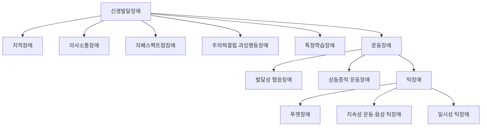



요약

뇌가 자라는 과정이 늦어지거나 손상되어 어린 시절부터 나타나는 장애들이다. 전반적인 지적 능력, 말과 언어, 사회적 소통, 주의와 활동 조절, 학습, 운동 가운데 어디가 걸렸느냐에 따라 나뉜다. 결함은 한 영역에 좁게 머물기도 하고 전반에 걸치기도 한다. 한 아이가 여러 장애를 함께 가지는 경우가 흔해서, 한 가지만 보고 판단하면 놓치기 쉽다.

## 예시로 보기

어린이 발달센터를 찾은 아이들이다[^s1].

| 아이 | 모습 | 장애 |
|---|---|---|
| 일곱 살 JT | 또래보다 이해와 판단이 전반적으로 늦고, 혼자 옷 입기와 돈 계산이 어렵다 | 지적장애 |
| 다섯 살 JU | 이해는 되는데 단어가 적고 문장을 만들지 못한다 | 의사소통장애(언어장애) |
| 네 살 JV | 눈을 맞추지 않고, 이름을 불러도 돌아보지 않으며, 장난감을 줄 세우는 데만 몰두한다 | 자폐스펙트럼장애 |
| 여덟 살 JW | 수업 중 자리를 뜨고, 숙제를 끝까지 못 하며, 차례를 기다리지 못한다 | 주의력결핍 과잉행동장애 |
| 아홉 살 JX | 지능은 평균인데 글자를 읽는 것만 유독 어렵다 | 특정학습장애 |
| 열 살 JY | 눈을 깜빡이고 킁킁 소리를 내는 일이 1년째 이어진다 | 틱장애(운동장애) |

## 정의[^1]

- 중추신경계, 곧 뇌의 발달 지연이나 뇌 손상과 관련된 정신장애다.
- 발달기에 시작되는 장애들의 집합이다.
- DSM-IV에서는 "아동·청소년기에 시작되는 장애"로 분류되다가 DSM-5에서 새로운 진단 범주로 묶였다.
- 발달 결함의 범위는 제한적인 손상부터 전반적인 손상까지 다양하다.
- 동반 질환이 흔하다.

### 여섯 장애 (DSM-5-TR)[^2]

| 장애 | 특징 |
|---|---|
| [지적장애(지적발달장애)](/Hongs_Blog/studies/abnormal-psychology/intellectual-disability/) | 전반적 정신 기능의 결함으로 부적응이 생긴다 |
| [의사소통장애](/Hongs_Blog/studies/abnormal-psychology/communication-disorders/) | 언어의 발달과 사용에서의 결함 |
| [자폐스펙트럼장애](/Hongs_Blog/studies/abnormal-psychology/autism-spectrum-disorder/) | 여러 상황에서 지속되는 사회적 의사소통과 사회적 상호작용의 결함 |
| [주의력결핍 과잉행동장애](/Hongs_Blog/studies/abnormal-psychology/adhd/) | 부주의, 체계적이지 못함, 과잉행동-충동성의 문제 |
| [특정학습장애](/Hongs_Blog/studies/abnormal-psychology/specific-learning-disorder/) | 정보를 효율적이고 정확하게 인지하고 처리하는 능력의 특정한 결함 |
| 운동장애 | 운동 기능의 문제 |

### 운동장애[^3]

나이나 발달 단계에 맞지 않는 운동 능력의 문제다. [발달성 협응장애](/Hongs_Blog/studies/abnormal-psychology/developmental-coordination/), [상동증적 운동장애](/Hongs_Blog/studies/abnormal-psychology/stereotypic-movement/), [틱장애](/Hongs_Blog/studies/abnormal-psychology/tic-disorders/)(투렛장애, 지속성 운동·음성 틱장애, 일시성 틱장애)가 있다.

운동장애는 그 자체로 세 장애를 묶은 무리이고, 틱장애는 다시 세 진단으로 나뉜다[^s2].

## 연결

- 반대로, 발달이 끝난 뒤 후천적으로 인지가 떨어지는 장애: [신경인지장애](/Hongs_Blog/studies/abnormal-psychology/neurocognitive-disorders/)
- 가장 헷갈리는 쌍: [자폐스펙트럼장애와 사회적 의사소통장애 비교](/Hongs_Blog/studies/abnormal-psychology/asd-vs-scd/), [틱장애와 상동증적 운동장애 비교](/Hongs_Blog/studies/abnormal-psychology/tic-vs-stereotypic/)

## 확인 문제

<b>C1</b> DSM-5-TR 신경발달장애의 여섯 무리를 쓰고, 운동장애에 드는 세 장애를 쓰라.

**답:** 지적장애, 의사소통장애, 자폐스펙트럼장애, 주의력결핍 과잉행동장애, 특정학습장애, 운동장애. 운동장애에는 발달성 협응장애, 상동증적 운동장애, 틱장애가 있다.

<b>C2</b> 신경발달장애와 신경인지장애는 모두 인지 기능의 문제를 다룬다. 둘을 가르는 기준은?

**답:** 시작 시기와 경과다. 신경발달장애는 뇌가 자라는 발달기에 시작되어 기대만큼 발달하지 못하는 것이고, 신경인지장애는 한때 정상이던 인지 기능이 후천적으로 떨어지는 것이다. 신경인지장애의 기준은 "이전의 수행 수준에 비해" 저하되었다고 적는다.

[^1]: 4-1학기/이상 심리학/1.수업자료/11.신경발달장애, 신경인지장애.pdf, p.3
[^2]: 4-1학기/이상 심리학/1.수업자료/11.신경발달장애, 신경인지장애.pdf, p.4
[^3]: 4-1학기/이상 심리학/1.수업자료/11.신경발달장애, 신경인지장애.pdf, p.50
[^s1]: 에이전트 보충. 여섯 아이의 사례는 무리를 가르려고 만든 가상 예다.
[^s2]: 에이전트 보충. 다이어그램 1개는 원본에 없다. '여섯 장애' 표(p.4)와 '운동장애'(p.50)를 한 분류 나무로 그렸다.

