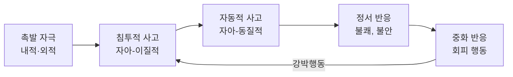



요약

"칼을 보니 누굴 찌를 것 같다" 같은 엉뚱한 생각(침투적 사고)은 누구에게나 스쳐 간다. 대부분은 "별 이상한 생각이네" 하고 흘려보낸다. 강박장애를 가진 사람은 그 생각에 "이런 생각을 하다니 나는 위험한 사람이다, 막지 않으면 내 책임이다"라는 무거운 의미를 붙인다. 그래서 생각을 누르고 없애려 애쓰는데, 누를수록 생각은 더 자주 떠오른다. 문제는 생각이 아니라 생각에 대한 해석이다.

## 예시로 보기

필기가 살코브스키스 모형에 적어 둔 예를 따라가면 이렇다[^1].

| 단계 | 내용 |
|---|---|
| 촉발 자극 | 칼 |
| 침투적 사고 (자아-이질적) | "내가 찌를지도 몰라" |
| 자동적 사고 (자아-동질적) | "이런 생각을 하는 건 나쁜 거야. 절대로 떠오르지 않게 해야 해" |
| 정서 반응 | 불쾌, 불안, 죄책감 |
| 중화 반응, 회피 행동 | 날카로운 물건 피하기 |

필기는 자동적 사고에 동그라미와 화살표를 그렸다. 문제가 시작되는 곳이 침투적 사고가 아니라 그 사고에 대한 자동적 사고라는 뜻이다.

## 정의

### 살코브스키스(Salkovskis, 1985): 침투적 사고와 자동적 사고[^1]

- **침투적 사고**는 원치 않고 나답지 않다고 느끼는(자아-이질적) 생각이다. 누구나 경험한다.
- **자동적 사고**는 그 침투적 사고를 평가하는, 나다운(자아-동질적) 생각이다. "이 생각은 위험하고 내 책임이다"라는 평가가 불안을 만든다.
- **중화 반응**은 불안을 없애려는 행동이고, 이것이 강박행동이다. 중화가 불안을 잠깐 줄여 다시 침투적 사고로 돌아가는 고리를 만든다.

### 강박장애의 인지적 특성[^2]

- **위협과 책임감의 과대평가:** 침투적 사고가 위험하고, 나쁜 결과를 막는 것이 자기 책임이라고 지나치게 평가한다.
- **침투적 사고의 중요성 과대 인식.** 여기에 **사고-행위 융합**이라는 인지적 오류가 끼어든다. 생각한 것이 곧 행위한 것과 다르지 않다는 믿음이다.
    - 도덕성 융합: 나쁜 생각을 하는 것은 그 행동을 한 것만큼 부도덕하다. 필기의 예 "칼로 찌르는 건 부도덕한 거야"처럼, 찌르는 생각만으로도 부도덕하다고 느낀다[^2].
    - 발생가능성 융합: 어떤 일을 생각하면 그 일이 일어날 가능성이 커진다.
- **완벽함, 완전함의 추구:** 불확실성과 불완전함(실수, 오류)을 참지 못한다. 나쁜 결과가 일어나지 않을 것이라는 절대적 확신이 필요하고, 그런 확신이 가능하다고 믿는다.

### 그 밖의 인지적 설명

| 이론 | 핵심[^3][^4] |
|---|---|
| 라크만(Rachman, 1998) | 침투사고를 파국적으로 해석하는 것이 핵심이다. 파국적으로 해석할수록 침투사고가 더 중요해지고, 더 자주 떠오르고, 통제가 어려워진다 |
| 오코너 등(O'Connor et al., 2009): 추론융합 | 상상한 가능성과 현실적 가능성을 혼동해, 상상한 가능성에 근거해 행동한다. 일차적 추론(침투사고) → 파국적인 이차적 추론 → 심한 불안과 강박행동 |
| 웨그너(Wegner, 1987): 사고억제의 역설적 효과 | "북극곰(흰곰)을 생각하지 마세요"라고 하면 오히려 더 떠오른다. 강박장애 환자는 침투적 사고에 과도한 책임을 느껴 누르려 하지만, 누를수록 더 자주 떠오른다 |

### 불완전감과 2차원 모델[^5][^6]

**불완전감:** 어떤 행위를 했을 때 100% 만족스럽지 않다는 불충분함의 느낌, 기대에 딱 맞아떨어지지 않는 미흡함의 경험("Not Just Right Experience")이다. 강박장애 환자는 이 불완전감을 해소하려고 강박행동을 하는 경우가 많다. 좌우 균형이 맞지 않아 느끼는 불완전감 때문에 정돈하거나 대칭을 맞추는 행동이 예다.

**서머펠트 등(Summerfeldt et al., 2004)의 2차원 모델:**

| | 위험회피 차원 | 불완전감 차원 |
|---|---|---|
| 주요 내용 | 남이나 자신에게 해를 끼칠까 두려워 위험을 예방하려는 강박 | 내부의 긴장감과 불편감을 해소하려고 완벽한 상태를 추구 |
| 강박 증상 | 불쾌한 강박사고, 위험을 피하려는 확인행동 | 대칭과 정렬을 위한 강박행동, 우유부단한 행동 |
| 발병 연령 | 비교적 늦음(20대 이후) | 비교적 빠름(아동기·청소년기) |
| 성격 특질 | 다양함 | 강박적 성격 특질 |
| 공병 장애 | 불안장애에 한정 | 틱장애를 비롯해 다양 |
| 치료 | 인지적 재구성 | 행동적 둔감화 |

두 차원은 "왜 행동하나"가 다르다. 위험회피 차원은 나쁜 일을 막으려고, 불완전감 차원은 "딱 맞지 않는" 느낌을 없애려고 행동한다.

## 연결

- 이 모델이 설명하는 장애: [강박장애](/Hongs_Blog/studies/abnormal-psychology/ocd/)
- 치료에서: 침투적 사고는 위험하지도 중요하지도 않은 정상적 경험이라고 교육하고, 과도한 책임감을 만드는 자동적 사고를 바꾼다([노출 및 반응방지법](/Hongs_Blog/studies/abnormal-psychology/erp/)의 인지치료)
- 비슷한 구조: 범불안장애의 사고-사건 융합([범불안장애](/Hongs_Blog/studies/abnormal-psychology/generalized-anxiety-disorder/)), 공황의 파국적 오해석([공황의 인지모델](/Hongs_Blog/studies/abnormal-psychology/panic-cognitive-model/))

## 확인 문제

<b>C1</b> 다음 사례를 살코브스키스 모형의 다섯 칸(촉발 자극, 침투적 사고, 자동적 사고, 정서 반응, 중화 반응)에 배치하라. "아기를 목욕시키던 CZ에게 '물에 빠뜨리면 어쩌지'라는 장면이 스쳤다. CZ는 '이런 생각을 하다니 나는 끔찍한 엄마야, 이 생각이 현실이 될 수도 있어'라고 여겼고, 죄책감과 불안에 휩싸여 이후 목욕을 남편에게만 맡긴다."

**답:** 촉발 자극: 아기 목욕. 침투적 사고: "물에 빠뜨리면 어쩌지"(자아-이질적 심상). 자동적 사고: "이런 생각을 하다니 끔찍한 엄마야(도덕성 융합), 현실이 될 수도 있어(발생가능성 융합)". 정서 반응: 죄책감, 불안. 중화 반응·회피: 목욕을 남편에게만 맡김.

<b>C2</b> 강박장애 환자에게 "그 생각을 하지 마세요"라고 조언하면 왜 역효과가 나는가?

**답:** 웨그너의 사고억제의 역설적 효과 때문이다. 어떤 생각을 억누르려 하면 억누르는 과정에서 그 생각을 계속 점검하게 되어 오히려 더 자주 떠오른다. 게다가 억누르려는 노력은 "이 생각은 위험하고 막아야 한다"는 평가(자동적 사고)를 강화해 침투적 사고를 더 중요하게 만든다.

<b>C3</b> 서머펠트의 2차원 모델에서 다음은 어느 차원인가? (a) 책상 위 연필이 딱 맞게 놓일 때까지 계속 다시 놓는다. 이유는 "그냥 불편해서" (b) 가스 불을 다섯 번 확인한다. 이유는 "불이 나면 가족이 죽을까 봐"

**답:** (a) 불완전감 차원: 해를 막으려는 것이 아니라 "딱 맞지 않는" 내적 불편감을 해소하려 한다. 행동적 둔감화가 맞다. (b) 위험회피 차원: 해(화재)를 막으려는 확인행동이다. 인지적 재구성이 맞다.

[^1]: 이상 심리학 5회 강의 자료 「강박 관련 장애」, p.11 (살코브스키스 모형). 칼 예시와 자동적 사고의 동그라미·화살표, "죄책감", "날카로운 물건 피하기"는 손글씨 필기다.
[^2]: 이상 심리학 5회 강의 자료 「강박 관련 장애」, p.12. 도덕성 융합 옆의 "칼로 찌르는 건 부도덕한 거야"는 손글씨 필기다.
[^3]: 이상 심리학 5회 강의 자료 「강박 관련 장애」, p.13
[^4]: 이상 심리학 5회 강의 자료 「강박 관련 장애」, p.14
[^5]: 이상 심리학 5회 강의 자료 「강박 관련 장애」, p.15. "불안전감"을 "불완전감"으로 고친 교정은 손글씨 필기다.
[^6]: 이상 심리학 5회 강의 자료 「강박 관련 장애」, p.16

