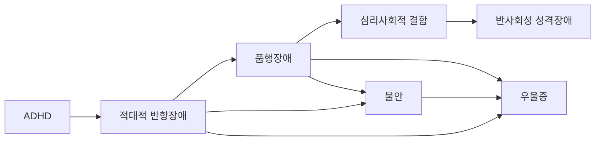



요약

부모나 선생님 같은 어른에게 걸핏하면 화내고, 따지고, 시키는 일을 일부러 거부하며, 앙심을 품는 행동이 반년 넘게 이어지는 장애다. 대개 여덟 살 이전에 시작한다. 남을 때리거나 물건을 부수는 데까지는 가지 않는다는 점에서 품행장애보다 가볍지만, 일부는 품행장애로 이어진다. 반항으로 원하는 것을 얻는 경험이 행동을 강화하므로, 치료의 중심은 아이보다 부모의 훈육 방식을 바꾸는 데 있다.

## 예시로 보기

여덟 살 IS는 1년째 엄마가 "숙제하자"고 하면 "왜 내가 해야 돼?"라며 소리 지르고 드러눕는다. 선생님의 지시도 일부러 무시하고, 친구를 일부러 귀찮게 한 뒤 "쟤가 먼저 그랬어"라고 한다. 혼나면 몇 주 동안 "두고 보자"고 한다. 결국 엄마는 숙제를 포기한다. 사람을 때리거나 물건을 훔친 적은 없다[^s1].

- 분노·과민한 기분: 자주 욱하고 화낸다.
- 논쟁적·반항적 행동: 권위자와 논쟁, 규칙 거부, 일부러 귀찮게 함, 남 탓.
- 복수심: 앙심을 품는다.
- 엄마가 숙제를 포기하는 것이 반항을 강화한다.

## 정의

어른에게 거부적이고 적대적이며 반항적인 행동을 지속적으로 보이는 경우다. 분노·과민한 기분, 논쟁적·반항적 행동, 복수심이 최소 6개월 이상 이어진다[^1].

적대적 반항장애의 증상[^1]

**분노·과민한 기분**
- 자주 욱하고 화를 낸다.
- 자주 기분이 상하거나 쉽게 짜증을 낸다.
- 자주 화내고 분개한다.

**논쟁적·반항적 행동**
- 자주 권위적인 인물(예: 부모, 선생님)과 논쟁한다.
- 자주 적극적으로 권위자의 요구나 규칙을 무시하거나 거절한다.
- 자주 고의적으로 남을 귀찮게 한다.
- 자주 자신의 실수나 잘못된 행동을 남의 탓으로 돌린다.

**복수심**
- 지난 6개월 동안 적어도 2번 이상 악의에 차 있거나 앙심을 품었다.

DSM-5-TR은 이 8개 증상 가운데 4개 이상이 형제자매가 아닌 사람과의 상호작용에서 6개월 이상 나타나야 한다고 정한다[^s2].

## 임상적 특징[^2]

- 평균 유병률 3.3%.
- 3세 무렵부터 시작할 수 있지만 대개 8세 이전에 시작한다. 첫 증상은 보통 취학 전에 나타나고, 청소년기 이후의 발병은 매우 드물다.
- 청소년기에 알코올·담배·약물 남용, 품행장애, 기분장애로 발전하기도 한다.
- 자라면서 저절로 사라지기도 하지만, 부모·교사와의 관계를 악화시키고 교우관계와 학업성취를 떨어뜨린다.
- 대부분 좌절되어 있고 우울하며, 열등감이 있고 참을성이 적다.

## 원인[^3][^4]

### 기질적·유전적 요인

- 정서조절의 어려움: 높은 정서적 반응성, 낮은 좌절 인내력.
- 보상 단서에는 민감하고 처벌 단서에는 둔감하다.
- ADHD. ADHD에서 반사회성 성격장애에 이르는 발달경로(Burke et al., 2005)에서 적대적 반항장애는 ADHD 다음 단계에 놓인다. 여기서 품행장애로 가는 길과, 불안과 우울증으로 가는 길이 갈라진다.

### 심리적 요인

- **정신분석적 입장:** 배변 훈련 과정에서 부모와 자녀가 힘겨루기를 하는 일종의 항문기적 문제다.
- **학습이론:** 모방학습으로 배우고 조작적 조건형성으로 강화된다. 집요한 반항이나 논쟁으로 자기 요구를 관철하거나 부모가 요구를 거두는 보상을 얻으면 행동이 강화된다.
- **부모-자녀 갈등:** 지배적인 부모와 기질적으로 자기주장과 독립성이 강한 아이의 충돌, 일관성 없는 훈육, 심각한 가정불화.

## 치료[^5][^6][^7]

- 치료자는 아이와 좋은 치료적 관계를 맺고 아이의 욕구불만과 분노를 잘 받아 준다.
- **부모 관리 훈련(Parent Management Training, PMT):** 부모 훈련 중심의 개입이 핵심이다.
    - 양육기술 교육: 일관된 반응, 안정적인 훈육 태도.
    - 아이의 정서 반응 이해와 적절한 반응 훈련: 긍정적 강화, 문제 행동에 예측 가능한 결과 주기, 감정적으로 반응하지 않는 기법.
    - 의사소통 개선 → 부모-자녀 관계 회복.
- **행동치료:** 좌절 인내력과 충동 억제력을 높이는 훈련, 적응적 행동 기술의 학습.
- **약물치료:** 적대적 반항장애 자체를 치료하는 약은 없다. ADHD, 우울, 불안 같은 공존질환이 있으면 효과적일 수 있다. 공격성, 충동성, 격렬한 분노를 조절해야 할 때 드물게 기분안정제나 항정신병제를 쓴다.

## 연결

- 더 심한 규범 위반으로의 진행: [품행장애](/Hongs_Blog/studies/abnormal-psychology/conduct-disorder/), [적대적 반항장애와 품행장애 비교](/Hongs_Blog/studies/abnormal-psychology/odd-vs-cd/)
- 짜증과 분노 폭발이 기분의 문제일 때: [파괴적 기분조절곤란 장애](/Hongs_Blog/studies/abnormal-psychology/dmdd/)
- 강화의 원리: [행동주의적 입장](/Hongs_Blog/studies/abnormal-psychology/behavioral-perspective/)

## 확인 문제

<b>C1</b> 적대적 반항장애의 세 증상 묶음을 쓰고, 각 묶음의 증상을 하나 이상 쓰라. 기간 기준은?

**답:** 분노·과민한 기분(자주 욱하고 화냄, 쉽게 짜증, 분개), 논쟁적·반항적 행동(권위자와 논쟁, 규칙 거부, 일부러 귀찮게 함, 남 탓), 복수심(6개월 동안 2번 이상 앙심). 최소 6개월.

<b>C2</b> 예시에서 엄마가 숙제를 포기하는 것이 반항을 늘리는 이유를 조작적 조건형성으로 설명하고, 부모 관리 훈련이 이를 어떻게 바꾸는지 쓰라.

**답:** 아이가 드러눕고 소리 지르면 싫은 숙제가 사라진다. 반항이 원하는 결과(부모의 요구 철회)를 얻어 강화되므로 다음에도 반항한다. 부모 관리 훈련은 일관된 반응과 예측 가능한 결과로 반항이 보상받지 못하게 하고, 감정적으로 맞서지 않으며, 협조 행동에는 긍정적 강화를 준다.

[^1]: 이상 심리학 10회 강의 자료 「파괴적, 충동조절 및 품행장애, 물질관련 및 중독장애」, p.6. 권위적인 인물 옆 "ex. 부모, 선생"은 손글씨 필기다.
[^2]: 이상 심리학 10회 강의 자료 「파괴적, 충동조절 및 품행장애, 물질관련 및 중독장애」, p.7
[^3]: 이상 심리학 10회 강의 자료 「파괴적, 충동조절 및 품행장애, 물질관련 및 중독장애」, p.8 (Burke 등, 2005의 발달경로 그림)
[^4]: 이상 심리학 10회 강의 자료 「파괴적, 충동조절 및 품행장애, 물질관련 및 중독장애」, p.9
[^5]: 이상 심리학 10회 강의 자료 「파괴적, 충동조절 및 품행장애, 물질관련 및 중독장애」, p.10
[^6]: 이상 심리학 10회 강의 자료 「파괴적, 충동조절 및 품행장애, 물질관련 및 중독장애」, p.11
[^7]: 이상 심리학 10회 강의 자료 「파괴적, 충동조절 및 품행장애, 물질관련 및 중독장애」, p.12
[^s1]: 보충 IS의 사례는 증상 묶음과 강화 과정을 보이려고 만든 가상 사례다.
[^s2]: 보충 DSM-5-TR 적대적 반항장애 기준 A의 개수(8개 가운데 4개 이상)와 "형제자매가 아닌 사람과의 상호작용" 조건을 보탰다.

