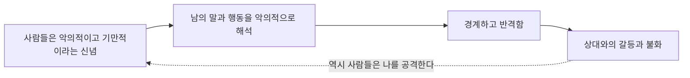



요약

늘 색안경을 끼고 사람을 보는 것과 같다. 남의 친절에서도 속셈을 찾고, 작은 실수도 자신을 깎아내리려는 의도로 읽으며, 한번 받은 상처는 잊지 않고 되갚는다. 이 경계심은 스스로를 지키려는 것이지만, 결국 모든 관계를 갈등과 불화로 만든다. 확신이 흔들리지 않는 망상 수준에는 이르지 않는다는 점에서 망상장애와 다르다.

## 예시로 보기

마흔 살 LM은 동료가 "보고서 잘 봤어요"라고 하자 "내 실수를 찾았다는 뜻"이라고 받아들였다. 10년 전 자신을 비판한 선배와는 지금도 말을 섞지 않는다. 아내가 늦게 들어오면 휴대폰을 확인하려 들고, 비밀을 털어놓으면 언젠가 약점으로 쓰일 거라며 누구에게도 속을 보이지 않는다[^s1].

- 칭찬 속에서 자신을 비하하는 숨은 의미를 찾는다: 기준 4.
- 원한을 오래 품는다: 기준 5.
- 배우자의 정절을 의심한다: 기준 7.
- 정보가 악의적으로 이용될까 두려워한다: 기준 3.

## 정의[^1]

핵심 특징은 타인에 대한 강한 불신과 의심, 적대적인 태도, 타인과의 지속적인 갈등과 불화다. 다음 가운데 4개 이상이다.

1. 타인이 자신을 착취하고 속인다고 의심한다.
2. 타인의 성실성이나 신용에 대한 부당한 의심에 집착한다.
3. 자신이 악의적으로 이용될 것이라는 부당한 공포를 지닌다.
4. 타인의 말에서 자신을 비하하는 숨겨진 의미를 잘 포착한다.
5. 자신에 대한 모욕, 손상, 경멸을 용서하지 않으며 원한을 오랫동안 품고 보복한다.
6. 자신의 인격이나 명성이 공격당했다고 인식하고 반격한다.
7. 배우자나 성적 상대자의 정절을 의심한다.

## 임상적 특징[^2]

- 주요 특징은 불신과 의심이며, 타인의 동기를 악의적으로 해석한다.
- 스트레스를 받으면 짧은 급성 정신병적 삽화를 겪기도 한다.
- 망상장애나 조현병의 병전 전구기 증상으로 편집성 성격이 나타날 수 있다.

## 원인[^3]

| 입장 | 설명 |
|---|---|
| 정신분석적 | 어린 시절 부모에게 가학적으로 양육된 경험. 자신과 타인에 대한 가학적 태도를 내면화한다 |
| 인지적 | 독특한 역기능적 신념과 사고 과정: "사람들은 악의적이고 기만적이다", "그들은 기회만 있으면 공격할 것이다", "긴장하고 경계해야만 나에게 피해가 없을 것이다" |

경계는 스스로를 지키려는 것이지만, 그 결과인 갈등이 처음의 신념을 다시 확인해 준다(점선)[^s2].

## 치료[^4]

- 보통 성격 문제가 아니라 우울증이나 불안장애 때문에 치료자를 찾는다.
- 치료자와 신뢰 관계를 맺기 어렵다. 어릴 때 부모와의 관계에서 기본 신뢰가 형성되지 않았기 때문이다.
- 내담자의 분노 같은 부정적 감정을 수용하는 것이 중요하다.
- 견고한 신뢰 관계를 먼저 만든 뒤, 내면의 갈등을 공감적으로 탐색하고 지금 직면한 문제를 해결한다.
- **인지적 접근:** 다른 사람의 말과 행동을 왜곡하지 않고 객관적이고 현실적으로 해석하도록 돕는다. 다른 사람의 관점을 인식하고 받아들이게 한다.

## 연결

- 의심이 흔들리지 않는 확신이 되면: [망상장애](/Hongs_Blog/studies/abnormal-psychology/delusional-disorder/)
- 전구기로서의 편집성 성격: [조현병](/Hongs_Blog/studies/abnormal-psychology/schizophrenia/)
- 같은 A군에서 의심과 함께 기이한 사고·지각이 있을 때: [조현형 성격장애](/Hongs_Blog/studies/abnormal-psychology/schizotypal-pd/)

## 확인 문제

<b>C1</b> 편집성 성격장애의 핵심 특징과 진단기준 7개를 쓰라. 몇 개 이상이어야 하는가?

**답:** 핵심 특징: 타인에 대한 강한 불신과 의심, 적대적 태도, 지속적 갈등과 불화. 기준: 착취·속임 의심, 성실성·신용 의심에 집착, 악의적으로 이용될 공포, 말에서 비하하는 숨은 의미 포착, 원한을 품고 보복, 인격·명성 공격으로 인식하고 반격, 배우자의 정절 의심. 4개 이상.

<b>C2</b> 편집성 성격장애를 치료할 때 문제 해결보다 신뢰 관계 형성을 먼저 하는 이유는?

**답:** 핵심 문제가 타인에 대한 불신이고, 그 뿌리는 어린 시절 부모와의 관계에서 기본 신뢰가 형성되지 않은 데 있다. 치료자도 의심의 대상이 되므로, 신뢰가 없으면 내면의 갈등을 탐색하거나 해석을 바꾸는 개입을 "공격"으로 받아들인다. 그래서 분노를 수용하며 관계를 먼저 굳힌다.

<b>C3</b> LN은 이웃이 자신을 독살하려고 수돗물에 약을 탄다고 확신해 경찰에 여러 번 신고했고, 반대 증거를 보여 줘도 믿음이 전혀 흔들리지 않는다. 편집성 성격장애인가?

**답:** 아니다. 반대 증거에도 흔들리지 않는 확고한 믿음은 망상이다. 망상장애(피해형)를 먼저 본다. 편집성 성격장애의 의심은 성격 전반에 퍼진 불신이지만 망상 수준에는 이르지 않는다.

[^1]: 이상 심리학 12회 강의 자료 「성격장애」, p.9
[^2]: 이상 심리학 12회 강의 자료 「성격장애」, p.10
[^3]: 이상 심리학 12회 강의 자료 「성격장애」, p.11
[^4]: 이상 심리학 12회 강의 자료 「성격장애」, p.12
[^s1]: 보충 LM의 사례는 진단기준을 보이려고 만든 가상 사례다.
[^s2]: 보충 다이어그램 1개는 원본에 없다. '원인'의 인지적 신념(p.11), '정의'의 핵심 특징과 기준 4·6(p.9)을 고리로 이었다. 갈등이 신념을 확인해 준다는 점선은 해석이다.

