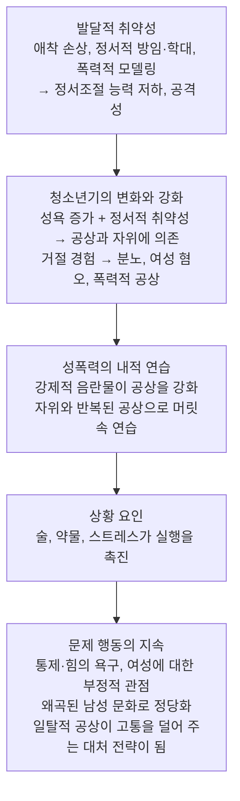



요약

왜 어떤 사람은 일반적이지 않은 대상이나 방식에 성적으로 끌리는가에 대한 다섯 가지 설명이다. 정신분석은 어린 시절의 성적 상처를 이겨 내려는 시도로, 행동주의는 우연히 짝지어진 조건형성으로, 사회심리적 입장은 대인관계 기술의 부족으로 본다. 머니의 러브맵은 마음속 성적 청사진이 어릴 때 비틀린 것으로, 마셜과 바버리의 통합 이론은 여러 취약성과 상황이 겹친 결과로 본다. 어느 하나로 모든 경우를 설명하지 못해 최근에는 통합적 설명이 쓰인다.

## 예시로 보기

한 사람의 물품음란증을 다섯 이론으로 설명해 본다[^s1].

> IH는 어린 시절 엄격한 부모 아래서 자랐고, 사춘기에 우연히 여성 구두를 만지며 처음 성적 흥분을 느낀 뒤 구두에 집착하게 되었다. 여성과 대화하는 것을 어려워한다.

| 이론 | IH를 보는 방식 |
|---|---|
| 정신분석 | 위협적인 여성 대신 통제할 수 있는 물건에 욕구를 돌려 거세불안을 이긴다 |
| 행동주의 | 구두와 성적 흥분이 우연히 짝지어져 조건형성되었다 |
| 사회심리 | 대인관계 기술이 부족해 정상적인 관계 대신 물건으로 욕구를 채운다 |
| 러브맵 | 사춘기 전후의 경험으로 구두가 성적 청사진에 새겨졌다 |
| 통합 이론 | 엄격한 양육(발달적 취약성), 사춘기의 경험과 강화, 부족한 관계 기술이 겹쳤다 |

## 다섯 이론

### 1. 정신분석적 입장[^1]

유아기 성적 발달 단계에 고착된 결과로, 오이디푸스 콤플렉스와 거세불안이 중심이다. 성도착의 핵심은 어린 시절의 외상을 성인기의 승리로 바꾸려는 시도이고, 부모가 준 모욕에 복수하려는 환상이다.

| 유형 | 정신분석의 해석 |
|---|---|
| 관음장애 | 부모의 성교 장면을 목격한 충격(거세불안)을 엿보기를 통해 능동적으로 이겨 내려는 시도 |
| 노출장애 | 자신이 거세되지 않았음을 확인하려는 무의식적 동기 |
| 성적피학장애 | 어린 시절의 성적 외상을 반복한다. 거세를 당하는 대신 희생물이 되어 덜 가혹한 불행을 받아들이려는 시도 |
| 성적가학장애 | 어린 시절의 성적 외상을 남에게 가해 복수하고 외상을 이겨 내려는 시도 |
| 물품음란장애 | 덜 위협적인 비인격적 대상에 성적 욕구를 투사해, 통제할 수 있는 대상으로 거세불안을 이긴다 |

### 2. 행동주의적 입장[^2]

고전적 조건형성으로 배운 성적 행동이다. 우연히 성적 자극과 부적절한 대상이 짝지어져 도착으로 발전한다. 예를 들어 어린 시절 여성의 슬리퍼가 성기에 닿아 성적 흥분이 조건형성된다.

**라크먼(Rachman)의 실험(1966):** 여성의 누드 사진과 부츠 사진을 반복해서 함께 보여 주자, 나중에는 부츠 사진만으로 성적 흥분이 일어났다. 이렇게 배운 반응은 혐오적 조건형성으로 없애고, 성적 공상의 대상을 정상적인 대상으로 바꿀 수 있다.

### 3. 사회심리적 원인[^3]

- 대인관계 기술이 부족하다. 미숙하고 자기주장을 못 해 사회적으로 고립된 경우가 많다.
- 정상적인 이성관계로 성적 욕구를 풀지 못한다.
- 아동, 동물, 물건처럼 통제할 수 있는 대상을 통해 좌절된 지배 욕구를 채우려 한다.
- 그래서 사회기술훈련과 자기주장훈련을 한다.

### 4. 러브맵 이론(Money, 1980)[^4]

- **러브맵(lovemap):** 한 사람이 가진 성적 자극과 환상, 애정 표현 방식, 흥분 조건에 대한 심리적 청사진이다. 이상적인 사랑의 대상과 이상적인 성행위에 대한 마음속의 표상이나 틀이다.
- 어린 시절부터 사춘기 사이에 만들어지고, 이후의 성적 흥분과 행동 양식을 계속 지배한다.
- **정상적인 발달:** 따뜻하고 안정적인 대인관계, 적절한 성 정보, 건강한 성적 자극 경험 → 정상적인 러브맵.
- **왜곡된 발달:** 아동기 성적 외상, 이른 성적 자극, 부적절한 경험으로 비정상적인 이미지나 상황이 흥분과 연결된다.

### 5. 통합 이론(Marshall & Barbaree, 1990)[^5]

한 요인이 아니라 취약성, 상황 요인, 부정적 발달 경험이 복합적으로 상호작용한 결과로 본다. 주로 성범죄를 설명하려고 만든 이론이다.

- 일탈적 성적 공상과 자위가 취약한 사람의 정서적 불안과 고통을 덜어 주는 대처 전략이 되면서 행동이 유지된다.

## 연결

- 통합 이론의 틀: [취약성-스트레스 모델](/Hongs_Blog/studies/abnormal-psychology/vulnerability-stress-model/)
- 발달적 취약성의 뿌리: [애착](/Hongs_Blog/studies/abnormal-psychology/attachment/)
- 이론에서 나온 치료(혐오 조건형성, 사회기술훈련, 정신분석적 치료): [성도착장애](/Hongs_Blog/studies/abnormal-psychology/paraphilic-disorders/)

## 확인 문제

<b>C1</b> 성도착장애의 원인에 대한 다섯 이론을 쓰고, 각각의 핵심을 한 구절로 쓰라.

**답:** 정신분석(유아기 고착, 거세불안, 외상을 승리로 바꾸려는 시도), 행동주의(성적 자극과 부적절한 대상의 우연한 조건형성), 사회심리(부족한 대인관계 기술, 통제 가능한 대상으로 지배 욕구 충족), 러브맵(어린 시절에 비틀린 성적 청사진), 통합 이론(발달적 취약성, 청소년기의 강화, 내적 연습, 상황 요인의 상호작용).

<b>C2</b> 라크먼(1966)의 실험을 고전적 조건형성의 네 요소(US, UR, CS, CR)로 옮기고, 이 원리를 뒤집은 치료를 쓰라.

**답:** US는 여성의 누드 사진, UR은 성적 흥분, CS는 부츠 사진, CR은 부츠 사진만으로 일어나는 성적 흥분이다. 뒤집은 치료는 혐오적 조건형성으로, 도착 대상(CS)을 불쾌한 자극과 짝지어 흥분을 없애고 성적 공상의 대상을 정상적인 대상으로 바꾼다.

<b>C3</b> 통합 이론에서 일탈적 성적 공상이 "대처 전략"이 된다는 것은 무슨 뜻이고, 왜 행동을 유지시키는가?

**답:** 정서조절 능력이 낮은 취약한 사람이 불안이나 고통을 느낄 때 일탈적 공상과 자위로 기분을 달랜다는 뜻이다. 불쾌한 정서가 줄어드는 결과가 부적 강화로 작용해, 스트레스를 받을 때마다 공상에 기대는 습관이 굳어진다. 반복된 공상은 머릿속 연습이 되어 실제 행동의 문턱도 낮춘다.

[^1]: 이상 심리학 9회 강의 자료 「성 관련 장애」, p.56
[^2]: 이상 심리학 9회 강의 자료 「성 관련 장애」, p.57
[^3]: 이상 심리학 9회 강의 자료 「성 관련 장애」, p.58
[^4]: 이상 심리학 9회 강의 자료 「성 관련 장애」, p.59
[^5]: 이상 심리학 9회 강의 자료 「성 관련 장애」, p.60
[^s1]: 보충 IH의 사례와 이론별 해석은 다섯 이론을 비교하려고 만든 가상 예다.

