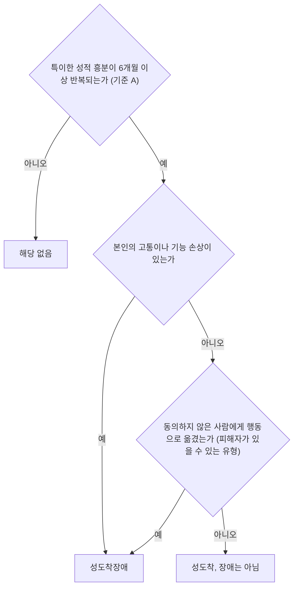



요약

성적으로 흥분하는 대상이나 방식이 일반적이지 않은 상태가 성도착(변태성욕)이고, 그것이 본인을 괴롭히거나 생활을 무너뜨리거나 동의하지 않은 사람을 해칠 때 성도착장애가 된다. 특이한 성적 관심을 가졌다는 것만으로는 장애가 아니라는 점이 핵심이다. 대부분 남성이고, 행동이 범죄가 되는 경우가 많다. 본인은 문제로 여기지 않고 법원 명령으로 치료에 오는 경우가 많아 치료가 매우 어렵다.

## 예시로 보기

유형에 따라 "누구를 향하는가"가 다르다[^s1].

| 무리 | 유형 | 흥분의 대상·방식 | 피해자 |
|---|---|---|---|
| 동의 없는 타인을 향함 | 관음, 노출, 마찰도착 | 몰래 보기, 노출하기, 몸 대기 | 있다 |
| 고통과 굴욕 | 성적 피학, 성적 가학 | 고통을 당하거나 가하기 | 가학에서 동의 없는 상대면 있다 |
| 대상 자체가 특이함 | 소아성애, 물품음란, 복장도착 | 사춘기 이전 아동, 물건, 이성의 옷 | 소아성애에서 있다 |

## 정의[^1]

- 변태(perversion), 성적 왜곡(sexual deviation), 성도착(paraphilia)이라는 말을 써 왔다.
- 성적 욕구를 채우는 대상이나 방식에서 나타나는 이상행동이다.
    - 부적절한 대상이나 목표에 강렬한 성적 욕망을 느끼고 성적 상상이나 행위를 반복한다.
    - 자신이나 상대가 고통이나 굴욕감을 느끼게 하는 성행위 방식.
- 6개월 이상 이어지고, 심각한 고통을 받거나 직업적·사회적 부적응을 보일 때 진단한다.

DSM-5-TR의 진단기준은 대부분 두 부분으로 되어 있다. A는 특이한 성적 흥분이 6개월 이상 반복되는 것이고, B는 그 충동으로 본인이 고통이나 손상을 겪거나, 동의하지 않은 사람에게 행동으로 옮긴 것이다. 피해자가 있을 수 있는 유형(관음, 노출, 마찰도착, 가학, 소아성애)에서는 동의 없는 사람에게 행동한 것만으로도 B를 채운다[^s2].

기준 B로 들어가는 문은 두 개다. 하나라도 열리면 장애이고, 둘 다 닫혀 있으면 특이한 관심일 뿐이다[^s4].

### DSM-5-TR의 여덟 유형[^2]

| 유형 | 성적 흥분의 대상·방식 |
|---|---|
| [관음장애](/Hongs_Blog/studies/abnormal-psychology/voyeuristic-disorder/) | 다른 사람이 옷을 벗고 있는 모습을 몰래 훔쳐봄 |
| [노출장애](/Hongs_Blog/studies/abnormal-psychology/exhibitionistic-disorder/) | 성기를 노출하는 행위 |
| [마찰도착장애](/Hongs_Blog/studies/abnormal-psychology/frotteuristic-disorder/) | 동의하지 않은 사람에게 성기나 신체 일부를 대거나 문지름 |
| [성적피학장애](/Hongs_Blog/studies/abnormal-psychology/masochism-sadism/) | 굴욕이나 고통을 당하는 행위 |
| [성적가학장애](/Hongs_Blog/studies/abnormal-psychology/masochism-sadism/) | 상대가 고통이나 굴욕감을 느끼게 함 |
| [소아성애장애](/Hongs_Blog/studies/abnormal-psychology/pedophilic-disorder/) | 사춘기 이전의 아동 |
| [물품음란장애](/Hongs_Blog/studies/abnormal-psychology/fetishistic-disorder/) | 무생물인 물건에 대한 집착 |
| [복장도착장애](/Hongs_Blog/studies/abnormal-psychology/transvestic-disorder/) | 이성의 옷으로 바꿔 입음 |

그 밖에도 동물애증, 외설언어증(외설적인 말을 내뱉는 것에서 흥분), 전화외설증, 시체애증, 분뇨·관장·방뇨성애증 등 다양한 성도착이 있다[^3].

## 임상적 특징[^1]

- 대개 남성에게 흔하다.
- 성욕과 성적 호기심이 강한 20대 전후에 흔히 나타나고, 나이가 들수록 줄어든다.
- 대개 법적 처벌의 대상이 된다.
- 다른 성도착장애와 함께 나타나는 경우가 많다.

## 치료[^4][^5]

- **치료가 매우 어렵다.** 자신의 성도착을 병이 아니라 독특한 성적 취향으로 여기고, 스스로 치료받으려는 동기가 부족하다. 대부분 법적 문제로 강제 의뢰된다.
- 특정한 효과적 치료법은 없고, 개인 특성에 맞춘 통합적 치료가 필요하다.
- **치료 목표:** 자신의 성도착 행동을 장애로 인정하기, 피해자의 고통에 공감하기(조망수용능력), 사회적 고립과 부적절한 대인관계를 개선해 정상적인 이성관계 형성하기.
- **약물치료:** 과도한 성욕에는 성욕감퇴 약물, 정신질환이 함께 있으면 향정신성 약물을 쓴다. 성욕과 성적 충동은 줄이지만 성격이나 범죄 성향을 근본적으로 바꾸지는 못한다. 화학적 거세에 대한 논란이 있다.
- **정신분석적 치료:** 어린 시절의 성적 충격과 거세불안 같은 심리적 갈등을 자각하게 한다.
- **행동치료:** 혐오 조건형성 치료, 성적 공상 교정, 사회기술훈련, 자기주장훈련.
- **위험성-욕구-반응성 원칙(Risk–Need–Responsivity, RNR):** 성범죄자 치료의 효과를 높이는 세 원칙이다. 재범 위험이 높을수록 치료 강도를 높이고(위험성), 재범과 직접 관련된 요인을 겨냥하며(욕구), 대상자의 학습 방식과 능력에 맞춰 전달한다(반응성)[^s3].

## 연결

- 장애와 관심을 가르는 기준: [성도착과 성도착장애 비교](/Hongs_Blog/studies/abnormal-psychology/paraphilia-vs-disorder/)
- 원인: [성도착장애의 원인 이론](/Hongs_Blog/studies/abnormal-psychology/paraphilia-theories/)
- 혐오 조건형성의 원리: [행동주의적 입장](/Hongs_Blog/studies/abnormal-psychology/behavioral-perspective/)

## 확인 문제

<b>C1</b> DSM-5-TR 성도착장애 여덟 유형을 쓰라.

**답:** 관음장애, 노출장애, 마찰도착장애, 성적피학장애, 성적가학장애, 소아성애장애, 물품음란장애, 복장도착장애.

<b>C2</b> 성도착장애의 치료가 매우 어려운 이유 세 가지와, 약물치료의 한계를 쓰라.

**답:** 자신의 성도착을 병이 아닌 취향으로 여기고, 자발적 치료 동기가 부족하며, 대부분 법적 강제로 의뢰된다. 약물은 성욕과 충동을 줄이지만 성격이나 범죄 성향을 근본적으로 바꾸지 못하고, 화학적 거세의 윤리적 논란이 있다. 그래서 피해자에 대한 공감, 대인관계 기술, 재범 위험 요인을 함께 다루는 통합적 치료가 필요하다.

[^1]: 이상 심리학 9회 강의 자료 「성 관련 장애」, p.33
[^2]: 이상 심리학 9회 강의 자료 「성 관련 장애」, p.34
[^3]: 이상 심리학 9회 강의 자료 「성 관련 장애」, p.35. 외설언어증 옆 "외설적 언어를 내뱉는 것에 흥분을 느낌"은 손글씨 필기다.
[^4]: 이상 심리학 9회 강의 자료 「성 관련 장애」, p.61
[^5]: 이상 심리학 9회 강의 자료 「성 관련 장애」, p.62
[^s1]: 보충 여덟 유형을 세 무리로 묶은 표는 DSM-5의 분류(구애 행동의 왜곡, 고통·굴욕 관련, 비정형적 대상)를 쉬운 말로 옮겼다.
[^s2]: 보충 DSM-5-TR 진단기준 B의 "동의하지 않은 사람에게 이 충동을 행동으로 옮긴 적이 있다"는 부분은 슬라이드의 진단기준에는 없고, 유형별 설명(p.37, 39, 41, 45의 "성적 충동에 따라 행동하지 않는다는 것이 시사될 경우 진단 X")에 간접적으로만 나온다.
[^s3]: 보충 RNR 원칙의 세 요소는 앤드루스와 본타(Andrews & Bonta)의 범죄자 재활 모델을 요약했다. 원본은 원칙의 이름만 적는다.
[^s4]: 보충 다이어그램 1개는 원본에 없다. '정의'의 진단 조건(p.33)과 DSM-5-TR 기준 B의 두 갈래([^s2])를 순서도로 옮겼다.

