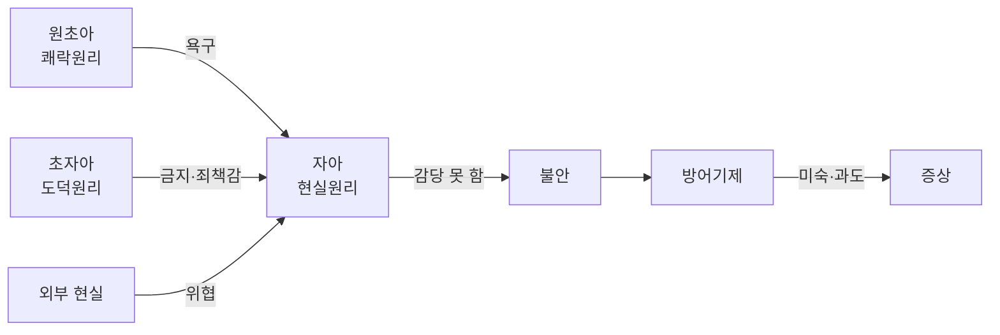



요약

마음을 욕구를 밀어붙이는 쪽, 양심으로 누르는 쪽, 현실에 맞춰 둘을 조정하는 쪽의 줄다리기로 본다. 줄다리기는 대부분 스스로 알아차리지 못하는 곳(무의식)에서 벌어지고, 조정자가 약하거나 서툰 방법을 쓰면 증상이 생긴다. 이상행동을 심리적 원인으로 설명한 최초의 체계적 이론이지만, 무의식은 직접 관찰할 수 없어 과학적으로 검증하기 어렵다.

## 예시로 보기

시험 전날 밤, 대학생 H의 마음속에서 세 목소리가 부딪친다[^s1].

| 목소리 | H의 마음속 말 | 구조 | 작동 원리 |
|---|---|---|---|
| "지금 당장 게임하고 싶다" | 참지 않고 바로 즐거움을 원한다 | 원초아(id) | 쾌락원리 |
| "공부 안 하면 넌 부모님을 실망시키는 나쁜 자식이야" | 내면화된 부모의 기준으로 꾸짖는다 | 초자아(superego) | 도덕원리 |
| "두 시간 공부하고 30분만 하자" | 현실을 따져 욕구를 미루고 행동을 통제한다 | 자아(ego) | 현실원리 |

자아가 둘 사이를 잘 조정하면 H는 공부도 하고 쉰다. 자아가 감당하지 못하면 불안이 커지고, 자아는 불안을 줄이려 [방어기제](/Hongs_Blog/studies/abnormal-psychology/defense-mechanisms/)를 쓴다. 방어가 서툴거나 지나치면 증상이 된다.

## 정의

### 기본 가정

프로이트(Sigmund Freud)의 정신분석은 이상행동을 심리적 원인으로 설명한 최초의 체계적 이론이다[^1]. 네 가지를 가정한다[^2].

1. **심리적 결정론**(psychic determinism): 사람의 행동은 원인 없이 일어나지 않는다. 모든 심리 현상은 앞선 원인이 결정한다.
2. **무의식**(unconsciousness): 자각되지 않는 정신 현상이 있고, 사람은 의식보다 무의식의 영향을 훨씬 강하게 받는다.
3. **성적 추동**(sexual drive): 성적 욕구는 가장 기본적인 욕구이고 무의식의 주된 내용이다. 사회의 도덕 기준과 어긋나므로 무의식에 억압되어 행동에 큰 영향을 준다. 공격적 욕구도 함께 든다[^1].
4. **어린 시절 경험의 중요성:** 어린 시절, 특히 부모와 주고받은 경험이 성격의 기초가 된다. 성인의 행동은 그때 만들어진 무의식적 성격 구조가 드러난 것이다.

### 지형학적 모델

마음을 의식되는 정도에 따라 세 층으로 나눈다[^3].

| 수준 | 내용 |
|---|---|
| 의식 | 항상 자각하고 있는 지각, 사고, 정서 경험 |
| 전의식 | 평소에는 의식하지 못하지만 노력하면 떠올릴 수 있는 기억과 경험 |
| 무의식 | 쉽게 의식되지 않는 경험. 받아들이기 어려운 성적 욕구, 폭력적 동기, 부도덕한 충동, 비합리적 소망, 수치스러운 경험. 불안을 일으키므로 무의식에 머문다 |

### 성격의 삼원구조이론

마음을 하는 일에 따라 세 구조로 나눈다[^4].

- **원초아**(id): 쾌락원리에 따라 움직인다. 자기중심적이고 비논리적인 원시적 사고(일차과정)를 한다.
- **자아**(ego): 현실원리에 따라 움직인다. 현실 여건을 따져 욕구 충족을 미루고 행동을 통제한다(이차과정).
- **초자아**(superego): 도덕원리에 따라 움직인다. 내면화된 사회 규범과 가치관이다.

두 모델은 마음을 다른 방향으로 자른다. 필기는 지형학적 모델 옆에 "수직적", 삼원구조 그림 옆에 "추상적"이라고 적었다[^3][^4]. 지형학적 모델은 깊이에 따른 층이고, 삼원구조는 기능에 따라 나눈 가설적 구조라 뇌의 특정 위치에 있지 않다[^s2]. 두 모델을 겹치면, 원초아는 전부 무의식에 있고 자아와 초자아는 세 층에 걸쳐 있다[^4].

### 세 가지 불안

자아가 느끼는 불안은 위협이 어디서 오느냐에 따라 셋이다[^5].

| 불안 | 위협의 출처 | 뜻 |
|---|---|---|
| 현실 불안 | 외부 현실 | 실제 위협에 대한 불안. 위험 요소를 없애면 사라진다 |
| 신경증적 불안 | 원초아 | 원초적 욕구를 지나치게 억압해 무의식의 원초아가 강해지고, 자아가 이를 통제하지 못할 것 같은 두려움 |
| 도덕적 불안 | 초자아 | 도덕 규범이나 부모의 가치를 어기는 것에 대한 불안 |

자아는 내적 갈등에서 오는 불안을 줄이려고 방어기제를 발달시킨다[^5].

### 심리성적 발달이론

쾌락과 만족을 주면서 부모와의 상호작용이 일어나는 신체 부위에 초점을 둔다. 만족을 주는 부위는 발달하면서 차례로 바뀐다. 각 단계에서 욕구가 지나치게 좌절되거나 지나치게 충족되면 그 단계에 **고착**(fixation)된다[^6].

| 단계 | 대략의 나이[^s3] | 쾌락의 초점 |
|---|---|---|
| 구강기 | 0~1.5세 | 입(빨기, 먹기) |
| 항문기 | 1.5~3세 | 항문(배변과 배변 훈련) |
| 남근기 | 3~6세 | 성기. 오이디푸스 갈등 |
| 잠복기 | 6세~사춘기 | 성적 관심이 가라앉고 학업·또래 관계에 몰두 |
| 성기기 | 사춘기 이후 | 성숙한 이성 관계 |

### 원인론과 치료[^7]

- **원인론:** 무의식적 갈등이 이상행동을 일으킨다. 성장 과정의 갈등과 성격 구조의 문제, 약해진 자아 기능, 미숙한 방어기제가 원인이다.
- **치료의 원리:** 무의식을 의식화하고 자아를 강화한다. "원초아가 있던 곳에 자아가 있게 하라."
- **치료 기법:** 자유연상, 꿈 분석, 전이 분석, 저항 분석.

### 이후의 흐름[^8]

- **현대의 정신분석:** 자아 심리학, 대상관계이론, 자기 심리학 등
- **신프로이트 학파:** 융(Jung)의 분석심리학, 아들러(Adler)의 개인심리학, 호나이(Horney), 설리번(Sullivan) 등

### 설명하는 것과 설명하지 못하는 것

- **설명하는 것:** 본인도 이유를 모르는 증상(왜 그러는지 모르는데 반복하는 행동), 어린 시절 관계가 성인기 관계에 되풀이되는 현상, 같은 사건에 사람마다 다른 방어로 반응하는 현상.
- **설명하지 못하는 것:** 무의식은 직접 관찰할 수 없어서 어떤 결과가 나와도 사후에 설명할 수 있다. 틀렸다고 확인할 방법이 약하다는 비판(반증 가능성의 문제)을 받는다. 성적 추동을 지나치게 강조하고, 소수 사례 관찰에 기대어 일반화했다는 비판도 있다[^s4].

## 스스로 설명해 보기

1. "무의식의 내용은 불안을 일으키기 때문에 무의식에 머문다."
   

근거

   지형학적 모델의 무의식 설명(p.41의 "← 불안을 유발하기 때문")이다. 받아들이기 어려운 욕구가 의식에 떠오르면 불안이 생기므로, 자아가 억압으로 막아 둔다.
   

2. "원초아를 지나치게 억압하면 오히려 신경증적 불안이 커진다."
   

근거

   세 불안 중 신경증적 불안의 정의다. 억압된 욕구는 사라지지 않고 무의식에서 세력이 커져, 자아가 통제하지 못할 것 같은 두려움을 만든다.
   

3. "치료는 무의식을 의식화한다."
   

근거

   원인론이 "무의식적 갈등"이므로, 갈등을 의식으로 끌어올려야 자아가 현실원리로 다룰 수 있다. "원초아가 있던 곳에 자아가 있게 하라"가 이 뜻이다.
   

- 이 이론의 핵심 아이디어는?
  

답

  증상은 무의식적 갈등을 다루려는 자아의 타협물이다. 그래서 증상을 없애기보다 그 밑의 갈등을 의식화하고 자아를 강하게 만들려 한다.
  

- 이 방식으로 볼 수 있는 다른 상황은?
  

답

  말실수, 꿈, 잊어버린 약속처럼 사소한 일상 행동도 무의식의 소망이 드러난 것으로 읽을 수 있다. 심리결정론에 따르면 이런 행동에도 원인이 있다.
  

## 자주 하는 오해

"자아(ego)는 '나'라는 자기 인식이다"

틀렸다. 일상어의 "자아"는 자기 자신에 대한 생각이라 그럴듯하다. 정신분석의 자아는 원초아의 욕구, 초자아의 금지, 외부 현실 사이를 조정하는 마음의 기능(현실원리, 이차과정)이다. 자아의 상당 부분은 무의식에서 작동하므로 본인이 알아차리지 못한다. 방어기제가 자아의 기능인데도 무의식적인 것이 그 증거다. 확인 방법: 예시 표에서 자아의 말 "두 시간 공부하고 30분만 하자"는 자기 인식이 아니라 욕구와 현실의 타협이다.

"무의식은 기절하거나 잠든 상태다"

틀렸다. 의학의 "의식 없음"과 이름이 같아서 헷갈린다. 정신분석의 무의식은 깨어 있는 동안에도 작동하면서 스스로 알아차리지 못하는 정신 내용과 과정이다.

## 확인 문제

<b>C1</b> 원초아, 자아, 초자아가 각각 어떤 원리에 따라 움직이고 어떤 사고 과정을 쓰는지 쓰라.

**답:** 원초아: 쾌락원리, 일차과정(자기중심적·비논리적 원시적 사고). 자아: 현실원리, 이차과정(현실을 따져 욕구 충족을 미루고 행동을 통제). 초자아: 도덕원리, 내면화된 사회 규범과 가치관.

<b>C2</b> 다음은 세 불안 중 무엇인가? (a) 밤길에 낯선 사람이 따라와 불안하다 (b) 컨닝을 생각만 했는데도 스스로 몹쓸 사람 같아 불안하다 (c) 화를 너무 오래 참아 와서, 언젠가 폭발해 누군가를 해칠 것 같아 불안하다

**답:** (a) 현실 불안: 외부의 실제 위협. (b) 도덕적 불안: 초자아의 기준을 어기는 것. (c) 신경증적 불안: 억압된 원초아의 충동을 자아가 통제하지 못할 것 같은 두려움. 
**가르는 질문:** 위협이 바깥 현실, 초자아, 원초아 중 어디서 오는가.

<b>C3</b> 지형학적 모델(의식·전의식·무의식)과 삼원구조(원초아·자아·초자아)를 한 그림으로 겹쳐 그린다면, 각 구조는 어느 층에 놓이는가?

**답:** 원초아는 전부 무의식에 있다. 자아와 초자아는 의식, 전의식, 무의식 세 층에 모두 걸쳐 있다. 빙산 그림에서 물 위(의식)와 바로 아래(전의식)에는 자아와 초자아의 일부만 있고, 가장 깊은 곳에 원초아가 있다. 
**이유:** 지형학적 모델은 "얼마나 의식되나"로, 삼원구조는 "무슨 일을 하나"로 나눈다. 기준이 달라서 한 구조가 여러 층에 걸칠 수 있다.

<b>C4</b> 정신분석 치료가 증상을 직접 없애기보다 "무의식의 의식화"를 목표로 하는 이유를 원인론과 이어 설명하라.

**답:** 정신분석은 증상이 무의식적 갈등을 다루려는 자아의 타협물이라고 본다. 갈등이 무의식에 남아 있으면 증상 하나를 없애도 갈등이 다른 증상으로 나타난다. 갈등을 의식으로 끌어올려야 자아가 현실원리로 다룰 수 있으므로, 치료는 자유연상, 꿈 분석, 전이·저항 분석으로 무의식에 다가간다.

<b>C5</b> 배변 훈련을 지나치게 엄격하게 받은 사람이 성인이 되어 병적으로 깔끔하고 인색해졌다. 심리성적 발달이론으로 설명하라.

**답:** 항문기(약 1.5~3세)에 배변 훈련을 둘러싼 욕구가 지나치게 좌절되어 그 단계에 고착되었다고 본다. 고착은 성인기 성격에 흔적을 남기므로, 통제와 보유에 대한 집착이 깔끔함과 인색함으로 나타난다. 
**주의:** 이것은 이론의 설명 방식이고, 경험적으로 확인된 인과관계는 아니다.

[^1]: 4-1학기/이상 심리학/1.수업자료/01.이상심리학.pdf, p.39
[^2]: 4-1학기/이상 심리학/1.수업자료/01.이상심리학.pdf, p.40
[^3]: 4-1학기/이상 심리학/1.수업자료/01.이상심리학.pdf, p.41. 삼각형 그림 옆에 손글씨 "수직적"이 있다.
[^4]: 4-1학기/이상 심리학/1.수업자료/01.이상심리학.pdf, p.42. 빙산 그림(성격의 삼원구조 모델) 옆에 손글씨 "추상적"이 있다. 그림은 자아·초자아가 의식에서 무의식까지 걸치고 원초아가 무의식에 있게 그렸다.
[^5]: 4-1학기/이상 심리학/1.수업자료/01.이상심리학.pdf, p.43
[^6]: 4-1학기/이상 심리학/1.수업자료/01.이상심리학.pdf, p.45
[^7]: 4-1학기/이상 심리학/1.수업자료/01.이상심리학.pdf, p.46
[^8]: 4-1학기/이상 심리학/1.수업자료/01.이상심리학.pdf, p.47
[^s1]: 에이전트 보충. 시험 전날의 세 목소리와 도식은 삼원구조와 불안·방어의 관계를 보이려고 만든 가상 사례다.
[^s2]: 에이전트 보충. "수직적", "추상적" 필기를 이렇게 풀었다. 지형학적 모델은 층(깊이)으로, 구조 모델은 기능으로 나눈다는 것은 정신분석 교재의 표준 설명이다.
[^s3]: 에이전트 보충. 슬라이드는 다섯 단계의 이름만 든다. 나이와 초점은 프로이트 이론의 표준 설명이고, 나이는 대략의 범위다.
[^s4]: 에이전트 보충. 반증 가능성 비판(Popper)과 성적 추동의 과잉 강조, 사례 연구 중심이라는 비판은 정신분석에 대한 표준적 비판이다.

