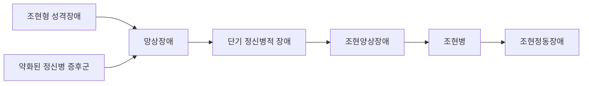



요약

정신증은 현실과 접촉이 끊겨, 무엇이 실제이고 무엇이 머릿속 일인지 가리는 힘을 잃은 상태다. 같은 정신증이라도 얼마나 심하고 얼마나 오래가는지가 사람마다 달라서, 가벼운 조현형 성격장애부터 가장 무거운 조현병까지 한 줄 위에 늘어놓는다. 이 줄이 조현병 스펙트럼이다. 다만 줄 위의 자리는 대략적인 심각도일 뿐, 가벼운 쪽에 있다고 반드시 무거운 쪽으로 옮겨 가지는 않는다.

## 예시로 보기

두 사람이 모두 "요즘 이상하다"며 병원에 왔다[^s1].

- V는 시험 걱정으로 잠을 못 자고 가슴이 두근거린다. "제가 너무 예민한 것 같아요"라고 말한다. 자기 상태가 지나치다는 것을 안다.
- W는 옆집 사람들이 벽 너머로 자기 생각을 읽어 방송한다고 확신한다. 가족이 아니라고 해도 "너희도 한편"이라며 믿지 않는다. 자기가 아프다고 생각하지 않는다.

V는 현실 판단력이 멀쩡하고 병식(자기 상태가 병적이라는 앎)이 있다. W는 현실 판단력이 뚜렷이 손상되었고 병식이 없다. V는 신경증, W는 정신증의 모습이다.

## 정의

### 신경증과 정신증

조현 스펙트럼 장애는 현실과의 접촉을 잃고 현실 판단력이 떨어진 상태로, 흔히 정신증(psychosis)이라 부른다[^1]. 신경증과는 다섯 가지가 다르다[^1].

| | 신경증 | 정신증 |
|---|---|---|
| 현실 판단력 | 정상 | 뚜렷한 손상 |
| 사회적 적응 수준 | 경미한 부적응 | 심각한 부적응 |
| 자기통찰(병식, 病識) | 있음 | 없음 |
| 대표적 장애 | 우울증, 불안장애 | 조현병, 양극성장애 |
| 치료 방식 | 외래, 방문치료 | 입원치료 |

표의 "대표적 장애"는 전형적인 예다. 우울증도 심하면 망상 같은 정신병적 증상을 동반할 수 있고(정신병적 양상을 동반한 우울), 양극성장애도 정신병적 증상 없이 지나갈 수 있다[^s2].

### 이름의 역사[^2]

- **크레펠린**(Kraepelin)은 이 병을 **조발성 치매**(dementia praecox)라 불렀다. 이른 나이에 시작해 오랫동안 나빠지는 경과를 강조한 이름이다.
- **블로일러**(Bleuler)는 그리스어 schizo(쪼갬)와 phren(마음)을 합쳐 **schizophrenia**라 불렀다. 사고 과정의 혼란, 생각과 감정의 불일치, 현실감의 상실을 "마음의 균열"로 본 이름이고, 우리말로 정신분열증이 되었다.
- **2011년 대한신경정신의학회**는 "정신분열증"이 편견과 낙인을 부추긴다며 **조현병**(調絃病)으로 이름을 바꿨다. 현악기의 줄을 고르듯, 신경계의 조율이 잘 되지 않아 생기는 병이라는 뜻이다.

### 조현병 스펙트럼

같은 정신증이라도 증상의 심각성, 지속 기간, 기능 저하에 따라 스펙트럼 위의 여러 장애로 나눈다[^3]. DSM-5-TR의 이 범주에는 일곱 장애가 있다[^3][^4].

| 장애 | 특징 | 문서 |
|---|---|---|
| 조현병 | 망상, 환각, 와해된 언어, 와해된 행동 같은 정신병적 증상이 6개월 이상 | [조현병](/Hongs_Blog/studies/abnormal-psychology/schizophrenia/) |
| 조현정동장애 | 조현병의 증상과 주요우울 또는 조증 삽화가 섞여 6개월 이상 | [조현정동장애](/Hongs_Blog/studies/abnormal-psychology/schizoaffective-disorder/) |
| 조현양상장애 | 조현병과 같은 증상이 1~6개월 | [조현양상장애](/Hongs_Blog/studies/abnormal-psychology/schizophreniform-disorder/) |
| 단기 정신병적 장애 | 정신병적 증상이 1일 이상 1개월 이내 | [단기 정신병적 장애](/Hongs_Blog/studies/abnormal-psychology/brief-psychotic-disorder/) |
| 망상장애 | 한 가지 이상의 망상이 1개월 이상(색정형, 과대형, 질투형, 피해형, 신체형) | [망상장애](/Hongs_Blog/studies/abnormal-psychology/delusional-disorder/) |
| 조현형 성격장애 | 친밀한 관계를 피하고, 인지·지각이 왜곡되고, 기이하게 행동하는 성격장애. 성격장애 범주에도 들어간다 | [조현형 성격장애](/Hongs_Blog/studies/abnormal-psychology/schizotypal-pd/) |
| 약화된 정신병 증후군 | 조현병 증상 한 가지 이상이 약한 형태로 나타난다 | 아래 |

슬라이드는 이 일곱을 경증에서 중증으로 늘어놓은 그림을 네 번 되풀이한다[^5].

왼쪽이 경증, 오른쪽이 중증이다. 슬라이드는 조현병에 테두리를 둘러 가장 무거운 장애로 표시하고, 조현정동장애를 그 옆에 둔다. 조현정동장애는 조현병과 함께 이 범주에서 심각도와 부적응이 가장 심하다[^5].

### 약화된 정신병 증후군

조현병 증상 한 가지 이상이 약한 형태로 나타나는 상태다. 현실 검증력은 비교적 괜찮지만 임상적 주의가 필요하다. 조현병으로 발전할 수 있는 초기 증후군에 일찍 개입하자는 취지로 DSM-5에 새로 들어왔다. 조현병이 생기기 전에 약하게 나타나는 증상들로 여겨지지만, 반드시 조현병으로 발전하지는 않는다[^6].

## 연결

- 스펙트럼이라는 생각: [범주적 분류와 차원적 분류 비교](/Hongs_Blog/studies/abnormal-psychology/categorical-vs-dimensional/)의 "둘 다 아닐 때"
- 이 범주의 증상: [정신병적 증상](/Hongs_Blog/studies/abnormal-psychology/psychotic-symptoms/)
- 기간으로 가르는 세 장애: [정신병적 장애의 지속 기간 비교](/Hongs_Blog/studies/abnormal-psychology/psychotic-duration-contrast/)

## 확인 문제

<b>C1</b> 신경증과 정신증을 가르는 기준 다섯 가지를 쓰라. 그중 어느 둘이 진단 면담에서 가장 먼저 드러나는가?

**답:** 현실 판단력(정상/뚜렷한 손상), 사회적 적응 수준(경미한/심각한 부적응), 병식(있음/없음), 대표적 장애(우울증·불안장애/조현병·양극성장애), 치료 방식(외래/입원). 면담에서는 현실 판단력과 병식이 먼저 드러난다. "그 믿음이 틀렸을 수도 있나요?", "지금 상태가 병적이라고 생각하나요?"에 대한 답에서 보인다.

<b>C2</b> 조현병 스펙트럼 및 기타 정신병적 장애의 일곱 장애를 쓰고, 슬라이드 그림에서 가장 가벼운 쪽과 가장 무거운 쪽에 놓인 장애를 쓰라.

**답:** 조현병, 조현정동장애, 조현양상장애, 단기 정신병적 장애, 망상장애, 조현형 성격장애, 약화된 정신병 증후군. 가장 가벼운 쪽: 조현형 성격장애와 약화된 정신병 증후군. 가장 무거운 쪽: 조현병과 조현정동장애.

<b>C3</b> 2011년에 "정신분열증"을 "조현병"으로 바꾼 이유와, 새 이름에 담긴 병에 대한 관점을 쓰라.

**답:** "정신분열증"이 "정신이 분열된 사람"이라는 편견과 낙인을 부추겼기 때문이다. 조현(調絃)은 현악기의 줄을 고른다는 뜻으로, 신경계의 조율이 잘 되지 않아 생기는 병, 곧 조율하면 나아질 수 있는 병이라는 관점을 담았다.

[^1]: 이상 심리학 2회 강의 자료 「조현병 스펙트럼 장애」, p.2
[^2]: 이상 심리학 2회 강의 자료 「조현병 스펙트럼 장애」, p.3
[^3]: 이상 심리학 2회 강의 자료 「조현병 스펙트럼 장애」, p.4
[^4]: 이상 심리학 2회 강의 자료 「조현병 스펙트럼 장애」, p.5 (유형과 특징 표), p.54 (조현형 성격장애: "조현병 스펙트럼 장애와 성격장애의 양쪽에 모두 포함")
[^5]: 이상 심리학 2회 강의 자료 「조현병 스펙트럼 장애」, p.6. 같은 그림이 p.41, 48, 53에 다시 나온다. 조현정동장애의 심각도는 p.42.
[^6]: 이상 심리학 2회 강의 자료 「조현병 스펙트럼 장애」, p.55
[^s1]: 보충 V와 W는 신경증과 정신증을 대비하려고 만든 가상 사례다.
[^s2]: 보충 DSM-5-TR은 주요우울장애와 양극성장애에 "정신병적 양상 동반" 명시자(같은 진단에 경과, 심한 정도, 특별한 양상 같은 특징을 덧붙여 적는 항목. 여러 개를 함께 붙일 수 있다)를 둔다. 신경증·정신증 표의 대표적 장애는 전형적인 예라는 점을 밝히려고 보탰다.

