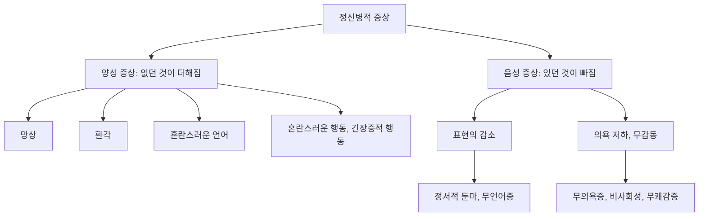



요약

조현병의 증상은 다섯 가지다. 틀린 믿음을 증거에도 굽히지 않는 망상, 없는 것을 보고 듣는 환각, 앞뒤가 끊긴 말, 상황에 맞지 않거나 굳어 버린 행동, 그리고 감정·말·의욕이 사라지는 음성 증상이다. 앞의 넷은 보통 사람에게 없던 것이 더해진 증상이고, 마지막은 있던 것이 빠진 증상이다. 한 증상만으로 조현병이라 하지 않고, 믿음이나 경험이 그 문화에서 받아들여지는 것인지도 따져야 한다.

## 예시로 보기

조현병을 앓는 X의 하루에서 다섯 증상을 찾는다[^s1].

| X의 모습 | 증상 |
|---|---|
| "TV 뉴스 앵커가 나에게 신호를 보낸다. 정보기관이 나를 없애려 한다." 가족이 증거를 보여 줘도 믿음이 흔들리지 않는다 | 망상(관계망상 + 피해망상) |
| 아무도 없는 방에서 "넌 쓸모없어"라는 목소리를 듣고 대꾸한다 | 환각(환청) |
| "밥을 먹었는데 하늘이 초록이라서 전화가 나를 다리로 만들었다" | 혼란스러운 언어 |
| 슬픈 이야기를 하다가 뜬금없이 킥킥 웃는다. 몇 시간째 한 자세로 굳어 있다 | 혼란스러운 행동, 긴장증적 행동 |
| 표정 변화가 거의 없고, 묻는 말에 "네", "몰라요"로만 답하며, 씻지도 나가지도 않는다 | 음성 증상(정서적 둔마, 무언어증, 무의욕증) |

첫 줄에서 관계망상과 피해망상이 함께 나온다. 필기에도 관계망상 옆에 "피해망상과 주로 함께 나타남"이라고 적혀 있다[^1].

## 정의

### 1. 망상(delusion)[^2]

강하게 믿는 잘못된 신념이다. 외부 세계에 대해 잘못 추론한 결과이고, 분명한 반증이 있어도 굳게 유지된다. 내용에 따라 나눈다[^1].

| 유형 | 내용 |
|---|---|
| 피해망상 (persecutory) | 남에게 피해를 받고 있다 |
| 과대망상 (grandiose) | 위대한 재능이나 통찰력을 지녔다 |
| 관계망상 (reference) | 남의 행동, 여러 대상과 사건에 특별하고 개인적인 의미를 붙여 자기와 연관 짓는다. 피해망상과 흔히 함께 나타난다 |
| 애정망상 (erotic) | 특정한 타인(주로 유명인)과 사랑하는 사이다 |
| 질투망상 | 배우자나 연인이 부정을 저질렀다 |
| 신체망상 (somatic) | 몸에 결함이나 병이 있다 |
| 혼합형 | 두 가지 이상이 섞였다 |
| 불특정형 | 내용이 불분명하거나 어느 유형에도 들지 않는다 |

### 2. 환각(hallucination)[^3]

현저하게 왜곡된 비현실적 지각이다. 외부 현실과 내면 경험의 구분을 잃은 상태이고, 현실검증(reality testing)이 심하게 손상된 것이다. 필기의 말로는 "아무것도 없는데 경험하는 것"이다.

- **종류:** 환청, 환시, 환후(냄새), 환촉(촉감), 환미(맛). 필기는 이 순서에 화살표를 긋고 "이쪽으로 갈수록 덜 나타나는 증상"이라고 적었다. 조현병에서는 환청이 가장 흔하다[^3].
- **착각(illusion)과의 차이:** 착각은 "무언가 있긴 한데 잘못 생각한 것"이다[^3]. 어두운 방의 옷걸이를 사람으로 본 것은 착각이고, 빈 벽에서 사람을 본 것은 환각이다.

### 3. 혼란스러운 언어(disorganized speech)[^4]

비논리적이고 앞뒤가 이어지지 않는(지리멸렬) 말이다. 생각의 흐름이 무너진 사고장애에서 나온다. 슬라이드의 예를 풀면 다음과 같다[^s2].

- **우원증**(circumstantial): 쓸데없는 곁가지를 한참 돌다가 결국 요점에 닿는다.
- **사고이탈**(tangential): 곁가지로 빠진 뒤 요점으로 돌아오지 못한다.
- **말비빔**(word salad): 단어들이 문법도 뜻도 없이 뒤섞인다.
- **반향언어**(echolalia): 상대의 말을 앵무새처럼 되풀이한다.

### 4. 심하게 혼란스러운 행동과 긴장증적 행동[^5]

- **심하게 혼란된 행동:** 목표를 향한 행동을 이어 가지 못하고, 상황에 맞지 않는 엉뚱한 행동을 한다. 예: 의미 없는 웃음(silly smile), 곧 상황에 맞지 않는 웃음[^5].
- **긴장증적 행동**(catatonic behavior): 환경에 대한 반응이 크게 줄어든 행동이다. 슬라이드 p.13의 사진처럼 기이한 자세로 굳어 오래 버티거나, 바깥 자극에 반응하지 않는다[^6][^s3].

### 5. 음성 증상(negative symptoms)[^7]

보통 사람에게 있는 적응적 기능이 없는 상태다.

| 증상 | 뜻 |
|---|---|
| 정서적 둔마 (affective flattening) | 자극에 대한 감정 반응이 둔해져 무표정하고 무감각하다 |
| 무언어증 (alogia) | 말이 빈곤하다. 짧고 간단하며 공허하다 |
| 무의욕증 (avolition) | 아무 행동도 하지 않고 사회 활동에도 무관심하다 |
| 무쾌감증 (anhedonia) | 즐거움을 느끼지 못한다 |
| 비사회성 (asociality) | 사람과 어울리려는 동기가 없다 |

뒤의 둘은 p.15의 목록과 그림에 나온다. 그림은 음성 증상을 두 묶음으로 나눈다. 정서적 둔마와 무언어증은 "표현의 감소", 무의욕증·비사회성·무쾌감증은 "의욕 저하·무감동"이다[^8].

### 동치인 다른 정리 방식

다섯 증상을 두 묶음으로 나누기도 한다. 1~4는 보통 사람에게 없는 것이 더해진 **양성 증상**, 5는 있던 것이 빠진 **음성 증상**이다[^8]. 둘의 차이는 [양성 증상과 음성 증상 비교](/Hongs_Blog/studies/abnormal-psychology/positive-vs-negative-symptoms/)에서 다룬다.

다섯 증상은 먼저 더해진 것과 빠진 것으로 갈린다. 빠진 쪽은 p.15 그림을 따라 다시 두 묶음으로 나뉜다[^s5].

### 해당하는 것과 해당하지 않는 것

- **망상이 아닌 것:** 그 문화나 종교 공동체가 함께 받아들이는 믿음(예: 기도가 병을 낫게 한다는 믿음)은 망상이 아니다. 망상은 개인의 믿음이 같은 문화의 다른 사람들과도 어긋날 때 말한다[^s4].
- **환각이 아닌 것:** 착각(있는 것을 잘못 지각), 잠들기 직전이나 막 깨어날 때 잠깐 들리는 소리(입면·출면 환각)는 조현병의 환각으로 보지 않는다[^s4].

### 설계 이유

망상의 정의는 "틀린 믿음"이 아니라 "반증에도 굳게 유지되는 믿음"에 무게를 둔다. 틀린 믿음은 누구나 갖지만, 보통 사람은 증거를 보면 고친다. 망상은 증거가 믿음을 바꾸지 못한다는 점, 곧 믿음을 고치는 과정이 고장 났다는 점이 핵심이다. 그래서 질투망상은 배우자가 우연히 실제로 부정을 저질렀더라도, 그 믿음이 근거 없이 생기고 반증에도 흔들리지 않았다면 망상이다[^s4].

### 스스로 설명해 보기

1. "환각은 현실검증의 심각한 장해다."
   

근거

   현실검증은 내 경험이 바깥에서 온 것인지 머릿속에서 생긴 것인지 가리는 능력이다. 환각은 머릿속에서 생긴 소리를 바깥 소리로 경험하므로 이 구분이 무너진 것이다.
   

2. "혼란스러운 언어는 사고장애에서 나온다."
   

근거

   말은 생각을 밖으로 옮긴 것이다. 생각의 연결(연상)이 무너지면 말의 연결도 무너진다. 그래서 말의 혼란을 보고 생각의 혼란을 추론한다.
   

3. "음성 증상은 결여의 증상이다."
   

근거

   정의가 "정상인에게 있는 적응적 기능의 결여"이기 때문이다. 감정 표현, 말, 의욕, 즐거움, 사교성이 줄어든 것이지, 새로운 이상 경험이 생긴 것이 아니다.
   

- 다섯 증상을 가르는 핵심 아이디어는?
  

답

  어느 정신 기능이 고장 났는가로 나눈다. 믿음(망상), 지각(환각), 생각과 말(혼란스러운 언어), 행동(혼란스러운 행동·긴장증), 동기와 감정(음성 증상).
  

- 같은 방식을 쓸 수 있는 다른 상황은?
  

답

  양극성장애나 심한 우울에 정신병적 양상이 동반될 때, 섬망(11회)에서 환시가 나타날 때도 같은 틀로 증상을 기술한다. 증상 목록은 조현병 전용이 아니라 정신증 전반의 공통 언어다.
  

## 자주 하는 오해

"조현병의 핵심은 인격이 여러 개로 쪼개지는 것이다"

틀렸다. 옛 이름 "정신분열증"과 블로일러의 "마음의 균열"이라는 말 때문에 그럴듯하다. 블로일러가 말한 균열은 생각, 감정, 현실감이 서로 어긋나는 것이지 인격이 여럿으로 나뉘는 것이 아니다. 인격이 여럿으로 나뉘는 것은 해리성 정체감 장애(6회)로, 전혀 다른 장애다. 확인 방법: 이 문서의 다섯 증상 목록에는 "다른 인격"이 없다.

"환각이 있으면 곧 조현병이다"

틀렸다. 환각이 조현병의 대표 증상이라 그럴듯하다. 하지만 환각은 물질 사용, 섬망, 심한 기분장애에서도 나타나고, 조현병 진단에는 핵심 증상 두 가지 이상과 기간, 기능 저하가 모두 필요하다. 반대로 환각 없이 망상과 혼란스러운 언어만으로도 조현병이 될 수 있다.

## 확인 문제

<b>C1</b> 조현병의 핵심 증상 다섯 가지를 쓰고, 음성 증상의 대표 증상 세 가지를 쓰라.

**답:** 망상, 환각, 혼란스러운 언어, 심하게 혼란스러운 행동이나 긴장증적 행동, 음성 증상. 대표 음성 증상: 정서적 둔마, 무언어증, 무의욕증(무쾌감증도 답이 된다).

<b>C2</b> 다음은 환각인가, 착각인가? (a) 밤길에 바람에 흔들리는 비닐봉지를 고양이로 보았다 (b) 아무도 없는 방에서 자기를 욕하는 목소리를 몇 주째 듣는다 (c) 샤워 소리에 섞여 전화벨이 울린 것 같아 나가 보았다

**답:** (a) 착각: 실제로 있는 대상(비닐봉지)을 잘못 지각했다. (b) 환각(환청): 외부 자극이 없는데 지각했다. (c) 착각: 실제 소리(샤워 소리)를 잘못 들었다. 
**가르는 질문:** 지각의 재료가 된 바깥 자극이 있었는가.

<b>C3</b> 다음 망상의 유형을 쓰라. (a) "길 건너 사람들이 기침하는 건 나를 비웃는 신호다" (b) "나는 인류를 구할 공식을 발견한 사람이다" (c) "유명 가수가 노래 가사로 나에게 사랑을 고백한다" (d) "내 뇌가 썩어 가고 있다"

**답:** (a) 관계망상(피해망상과 함께 나타나는 흔한 형태). (b) 과대망상. (c) 애정망상. (d) 신체망상.

<b>C4</b> 망상을 "틀린 믿음"만으로 정의하지 않고 "반증에도 굳게 유지되는 믿음"을 강조하는 이유를 쓰라.

**답:** 틀린 믿음은 누구나 가지므로 그것만으로는 병적인 것을 가려내지 못한다. 보통 사람은 반증을 보면 믿음을 고치지만, 망상은 증거가 믿음을 바꾸지 못한다. 믿음을 고치는 과정 자체가 고장 났다는 점이 병리의 핵심이다.

<b>C5</b> 묻는 말에 "네", "몰라요"로만 짧게 답하고, 가족의 결혼 소식에도 표정이 변하지 않으며, 하루 종일 누워만 있는 사람이 있다. 어떤 증상들인지 쓰라.

**답:** 모두 음성 증상이다. 짧은 대답은 무언어증, 표정 변화 없음은 정서적 둔마, 하루 종일 누워 있음은 무의욕증이다. 
**흔한 오답:** 우울증으로만 보는 경우. 우울과 겹쳐 보일 수 있지만, 음성 증상은 슬픔을 느끼는 것이 아니라 감정과 의욕 자체가 빈약해진 상태다.

[^1]: 4-1학기/이상 심리학/1.수업자료/02.조현병 스펙트럼 장애.pdf, p.9. 관계망상 옆의 "+ 피해망상과 주로 함께 나타남"은 손글씨 필기다.
[^2]: 4-1학기/이상 심리학/1.수업자료/02.조현병 스펙트럼 장애.pdf, p.8
[^3]: 4-1학기/이상 심리학/1.수업자료/02.조현병 스펙트럼 장애.pdf, p.10. "아무것도 없는데 경험하는 것", "무언가 있긴 한데 잘못 생각한 것", 환각 유형 위의 화살표와 "이쪽으로 갈수록 덜 나타나는 증상"은 손글씨 필기다.
[^4]: 4-1학기/이상 심리학/1.수업자료/02.조현병 스펙트럼 장애.pdf, p.11
[^5]: 4-1학기/이상 심리학/1.수업자료/02.조현병 스펙트럼 장애.pdf, p.12. silly smile 아래 "의미없는 웃음(상황에 맞지 않는)"은 손글씨 필기다.
[^6]: 4-1학기/이상 심리학/1.수업자료/02.조현병 스펙트럼 장애.pdf, p.13 (긴장증 환자 사진 세 장, 손글씨 "긴장증적 행동")
[^7]: 4-1학기/이상 심리학/1.수업자료/02.조현병 스펙트럼 장애.pdf, p.14
[^8]: 4-1학기/이상 심리학/1.수업자료/02.조현병 스펙트럼 장애.pdf, p.15 (Correll & Schooler, 2020의 그림: Blunted Affect·Alogia → Diminished Expression, Avolition·Asociality·Anhedonia → Avolition/Apathy)
[^s1]: 에이전트 보충. X의 하루는 다섯 증상을 한 사례로 보이려고 만든 가상 사례다.
[^s2]: 에이전트 보충. 슬라이드는 네 용어의 영어 이름만 든다. 뜻은 정신병리학의 표준 설명이다.
[^s3]: 에이전트 보충. 긴장증은 DSM-5-TR에서 환경에 대한 반응성의 현저한 감소로 정의되며, 경직된 자세 유지(강경증), 무언증, 거부증, 반향행동 등을 포함한다.
[^s4]: 에이전트 보충. 문화적으로 공유된 믿음의 제외, 입면·출면 환각, 질투망상의 "실제로 사실일 수 있음"은 DSM-5-TR과 정신병리학 교재의 표준 설명이다.
[^s5]: 에이전트 보충. 다이어그램 1개는 원본에 없다. 정의 절의 다섯 증상, '동치인 다른 정리 방식', 음성 증상의 두 묶음(슬라이드 p.15)을 나무 모양으로 그렸다.

