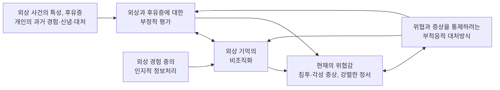



요약

다섯 이론은 결국 같은 이야기를 다른 각도에서 한다. 외상은 "세상은 대체로 안전하고, 나는 괜찮은 사람"이라는 기존의 믿음에 들어맞지 않는 정보라, 마음이 그것을 소화하지 못한 채 남긴다. 소화되지 못한 기억은 말로 떠올리기는 어려운데 작은 단서에는 생생하게 튀어나오고, 사람은 그 고통을 피하느라 더 소화할 기회를 잃는다. 그래서 치료는 모두 외상 기억을 안전하게 다시 처리해 기존 믿음에 통합시키는 것을 목표로 한다.

## 예시로 보기

폭행 피해자 DR의 마음에서 다섯 이론이 각각 무엇을 짚는지 보자[^s1].

| 이론 | DR에게서 보이는 것 |
|---|---|
| 스트레스 반응 이론 | 사건 뒤 멍하게 부인하다가, 지금은 기억이 침투했다 피했다를 오가는 "동요 단계"에 머물러 있다 |
| 박살난 가정 이론 | "세상은 안전하다", "나쁜 일은 이유가 있어 생긴다", "나는 가치 있는 사람이다"가 모두 무너졌다 |
| 정서적 처리 이론 | 어두운 골목, 특정 향수 냄새 같은 사소한 단서가 공포 기억구조 전체를 켠다 |
| 이중 표상 이론 | 사건을 말로 설명하라면 뒤죽박죽인데, 비슷한 냄새를 맡으면 그 순간의 공포가 생생히 살아난다 |
| 통합적 인지모델 | "내가 약해서 당했다"는 부정적 평가와 조각난 기억이 "지금도 위험하다"는 위협감을 만든다 |

## 정의

### 스트레스 반응 이론(Horowitz, 1976, 1986)[^1]

외상적 사건을 인지적으로 처리하는 다섯 단계다.

| 단계 | 내용 |
|---|---|
| 1. 절규 단계 | 정신적 충격과 고통. 받아들이기 어렵고 정보가 넘친다 |
| 2. 회피 단계 | 부인과 마비 |
| 3. 동요 단계 | 침투와 회피가 번갈아 온다. 새로운 경험을 기존의 사고체계에 통합하려 하지만 처리되지 않아 외상 기억이 침투한다: PTSD |
| 4. 전이 단계 | 외상 정보가 조금씩 기본 신념으로 흡수된다 |
| 5. 통합 단계 | 외상 정보가 완전히 처리된다 |

필기는 "3단계에 머무는 것 → PTSD"라고 요약했다[^1].

### 박살난 가정 이론(Janoff-Bulman, 1989, 1992)[^2]

외상은 세상과 자신에 대한 기본 가정과 신념체계를 흔들고 부순다. 무너지는 세 가지 신념은 세상의 우호성(세상은 대체로 좋은 곳이다), 세상의 합리성(일은 이유가 있어 일어난다), 자신의 가치(나는 가치 있는 사람이다)다.

### 정서적 처리 이론[^2]

외상 경험과 관련된 부정적 정보들이 연결된 "공포 기억구조"가 만들어진다. 사소한 단서가 이 구조를 활성화하면 회피 증상이 나타나고, 회피 때문에 외상 경험의 정서적 정보처리가 이루어지지 못한다. 지속적 노출법이 이 구조를 수정하는 치료다.

### 이중 표상 이론(Brewin et al., 1996)[^3][^4]

외상 기억을 떠올리지 못하는 증상(기억 불능)과 원치 않게 떠오르는 증상(기억 침투)이 함께 나타나는 모순을 두 기억 체계로 설명한다.

| | 언어적으로 접근 가능한 기억 (VAM) | 상황적으로 접근 가능한 기억 (SAM) |
|---|---|---|
| 저장하는 것 | 외상 경험에 대한 의식적 평가 정보 | 외상 사건의 감각적 인식과 생리적·정서적 반응 정보 |
| 떠올리기 | 필요할 때 의도적으로 회상 가능 | 언어적으로 접근하기 어려워 의식적 통제가 어렵다. 상황 단서가 주어지면 감각적 표상이 튀어나온다(비의도적 침투, 플래시백) |
| 증상 | 부정적 신념과 그로 인한 부정 정서 | 플래시백, 악몽, 외상 특유의 정서, 생리적 각성 |
| 치료 방향 | 인지적 평가를 고쳐 부정 정서를 줄인다 | 자동적 활성화를 막고, 이완 상태와 외상 기억을 반복해 짝지어 새로운 SAM을 학습한다 |

p.19의 그림 위에는 "SAM의 VAM으로의 편입"이라고 쓰여 있다[^4]. 감각 조각으로만 있던 기억을 말로 정리된 기억 속으로 옮기는 것이 회복이다.

### PTSD의 통합적 인지모델(Ehlers & Clark, 2000)[^5]

외상과 그 후유증을 부정적으로 평가하고(예: "내가 약해서 당했다", "이제 나는 망가졌다") 외상 기억이 조각나 조직화되지 않으면, 이미 지나간 사건인데도 "지금 위협받고 있다"는 느낌이 생긴다. 이 위협감을 통제하려는 부적응적 대처(회피, 기억 억누르기, 음주)가 다시 평가와 기억의 비조직화를 유지해 PTSD가 지속된다.

## 연결

- 이론이 설명하는 장애: [외상 후 스트레스 장애](/Hongs_Blog/studies/abnormal-psychology/ptsd/)
- 이론에서 나온 치료: 지속적 노출법(정서적 처리 이론), 인지처리치료(박살난 가정, 부정적 평가)
- 같은 인지적 틀: [우울증의 인지이론](/Hongs_Blog/studies/abnormal-psychology/beck-cognitive-theory/)(도식과 부정적 평가), [공황의 인지모델](/Hongs_Blog/studies/abnormal-psychology/panic-cognitive-model/)(위협 지각의 악순환)
- 해리성 기억상실증의 인지적 설명도 "충격적 경험이 기존 인지도식에 통합되지 못함"이다: [해리성 기억상실증](/Hongs_Blog/studies/abnormal-psychology/dissociative-amnesia/)

## 확인 문제

<b>C1</b> 호로위츠의 스트레스 반응 이론의 다섯 단계를 순서대로 쓰고, PTSD는 어느 단계에 머문 상태인지 쓰라.

**답:** 절규 → 회피 → 동요 → 전이 → 통합. PTSD는 침투와 회피가 번갈아 오는 3단계(동요 단계)에 머문 상태다.

<b>C2</b> PTSD 환자가 외상 사건을 말로는 잘 떠올리지 못하는데, 비슷한 냄새만 맡아도 그 순간이 생생히 떠오르는 모순을 이중 표상 이론으로 설명하라.

**답:** 외상 기억이 두 체계에 따로 저장되기 때문이다. 말로 떠올리는 것은 언어적으로 접근 가능한 기억(VAM)인데, 외상 순간에는 처리가 제대로 안 되어 조각나 있다. 반면 감각·생리 반응은 상황적으로 접근 가능한 기억(SAM)에 저장되어, 의도로는 꺼내기 어렵지만 냄새 같은 상황 단서가 오면 자동으로 튀어나온다. 회복은 SAM의 내용을 VAM으로 편입하는 것이다.

<b>C3</b> 교통사고 생존자 DS는 "내가 운전을 조심하지 않아서 동생이 다쳤다, 나는 가족을 지킬 수 없는 사람"이라고 말하고, 사고 이야기를 피하며 술로 잠든다. 엘러스와 클라크 모형의 칸(부정적 평가, 부적응적 대처)에 넣고, 이 모형이 이 대처가 문제인 이유를 어떻게 설명하는지 쓰라.

**답:** 부정적 평가: "내가 조심하지 않아서", "가족을 지킬 수 없는 사람". 부적응적 대처: 사고 이야기 회피, 술. 이 대처는 위협감과 증상을 잠시 줄이지만, 기억을 정리하고 평가를 고칠 기회를 막아 부정적 평가와 기억의 비조직화를 유지하고, 그래서 "지금도 위험하다"는 위협감이 계속된다.

[^1]: 4-1학기/이상 심리학/1.수업자료/06.외상 후 스트레스 장애 및 해리장애.pdf, p.16. "3단계에 머무는 것 → PTSD"는 손글씨 필기다.
[^2]: 4-1학기/이상 심리학/1.수업자료/06.외상 후 스트레스 장애 및 해리장애.pdf, p.17
[^3]: 4-1학기/이상 심리학/1.수업자료/06.외상 후 스트레스 장애 및 해리장애.pdf, p.18
[^4]: 4-1학기/이상 심리학/1.수업자료/06.외상 후 스트레스 장애 및 해리장애.pdf, p.19 (이중 표상 이론 도식, "SAM의 VAM으로의 편입")
[^5]: 4-1학기/이상 심리학/1.수업자료/06.외상 후 스트레스 장애 및 해리장애.pdf, p.20 (PTSD의 통합적 인지모델 도식)
[^s1]: 에이전트 보충. DR의 사례와 비교 표는 다섯 이론을 한 사례에 적용한 가상 예다.

