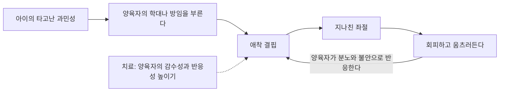



요약

아기 때 돌봄을 거의 받지 못해, 누구에게도 애착을 맺지 못하고 움츠러든 아이의 장애다. 넘어져 울어도 어른을 찾지 않고, 안아 줘도 반응하지 않는다. 기대했다가 번번이 실망하자 애착하려는 노력 자체를 포기한 모습이다. 심하게 방임된 아이 가운데서도 10% 이하에게만 나타나며, 한 명의 민감하고 일관된 양육자와 관계를 새로 맺는 것이 치료의 핵심이다.

## 예시로 보기

세 살 ED는 태어나서 2년 동안 아이는 많고 보호자는 적은 보육 시설에서 지냈다. 입양된 지 반년이 지났지만, 넘어져 무릎이 까져도 울기만 할 뿐 양부모에게 가지 않는다. 양어머니가 안아 달래도 몸이 굳고, 웃는 일이 거의 없으며, 이유 없이 짜증을 내거나 슬퍼한다[^s1].

- 고통스러울 때 위안을 구하지 않고, 위로에 거의 반응하지 않는다(A).
- 사회적·정서적 반응이 적고, 긍정적 정서가 제한되며, 이유 없는 짜증과 슬픔이 있다(B).
- 선택적 애착을 맺기 어려운 시설 양육(C).
- 9개월 이상, 5세 이전(D).

## 정의

양육자와의 애착 외상 때문에 지나치게 위축된 대인관계 패턴을 보이는 장애다[^1]. 애착장애의 두 유형 가운데 억제형이다[^2].

반응성 애착장애의 진단기준

A. 성인 보호자에게 억제되고 정서적으로 위축된 행동을 일관되게 보인다(둘 다)[^1]
1. 고통스러울 때 위안을 구하지 않거나 최소한으로만 구한다.
2. 고통스러울 때 위로에 거의 반응하지 않거나 최소한으로만 반응한다.

B. 지속적인 사회적·감정적 문제(2가지 이상)
1. 타인에 대한 최소한의 사회적·정서적 반응
2. 제한된 긍정적 정서
3. 보호자와의 위협적이지 않은 상호작용 중에도 이유 없는 짜증, 슬픔, 두려움의 에피소드

C. 극단적으로 불충분한 양육을 경험했다(하나 이상)[^3]
1. 기본 정서적 욕구(위로, 자극, 애정)가 지속적으로 채워지지 않는 사회적 방임이나 박탈
2. 주 양육자가 자주 바뀌어 안정 애착을 맺을 기회가 제한됨(위탁 보육)
3. 선택적 애착을 맺을 기회가 심각하게 제한된 환경(아이는 많고 보호자는 적은 보육 기관)

D. 증상이 발달 연령 9개월 이상, 5세 이전에 나타난다.

### 임상적 특징[^4]

- 매우 드물다. 심각하게 방임된 아동 가운데서도 10% 이하에게만 나타난다.
- **자폐증과의 구별**
    - 비슷한 점: 사회적 관계를 맺기 어렵다.
    - 다른 점: 자폐증은 정상 양육을 받았어도 나타나지만, 반응성 애착장애는 양육 결핍이라는 후천적 요인에서 온다. 자폐증 아동은 기이한 언어, 특정 영역에 고착된 관심, 의례화된 반복 행동을 보이지만 반응성 애착장애 아동은 그렇지 않다.

## 원인[^5]

1. **애착 외상:** 분명한 환경적 촉발 요인이 있지만, 애착 외상을 겪은 아이가 모두 장애가 되지는 않는다. 부모의 양육과 아이의 기질이 상호작용한다.
2. **기질:** 타고난 과민성이 양육자의 학대나 방임을 부르고, 애착 결핍에 지나치게 좌절해 회피적으로 행동한다.
3. **정신분석적 입장:** 애착 대상을 잃은 경험으로 생긴 일종의 우울이다. 실망과 좌절로 애착 노력을 포기한 탈애착(detachment)이다.

기질과 양육이 서로를 부추기는 고리다. 치료는 양육자 쪽에서 고리에 들어가 애착 결핍을 줄인다[^s3].

## 치료[^6]

- **양육자와의 애착관계 개선**
    - 양육자와 아동의 "적합도(goodness of fit)"를 평가한다.
    - 양육자의 정서적 감수성과 반응성을 높여 긍정적 상호작용을 늘린다. 반응성 애착장애 아동의 양육자는 아이의 행동에 분노와 불안으로 반응하는 경향이 있다.
    - 교육을 받아도 건강한 애착을 맺기 어렵다면 새로운 양육자가 필수다.
- **놀이치료:** 양육자와 아동의 긍정적 상호작용이 일어나도록 교육하고 유도하며, 아이의 욕구와 감정을 민감하게 알아채고 반응하는 양육 기술을 가르친다.

## 연결

- 애착의 개념: [애착](/Hongs_Blog/studies/abnormal-psychology/attachment/)(할로의 원숭이 실험은 접촉 위안의 결핍이 무엇을 낳는지 보여 준다)
- 짝이 되는 장애: [탈억제성 사회적 유대감 장애](/Hongs_Blog/studies/abnormal-psychology/dsed/), [반응성 애착장애와 탈억제성 사회적 유대감 장애 비교](/Hongs_Blog/studies/abnormal-psychology/rad-vs-dsed/)
- 구별: 자폐스펙트럼장애(11회)

## 확인 문제

<b>C1</b> 반응성 애착장애의 진단기준 A의 두 행동과, C의 극단적 양육 결핍 세 형태, D의 나이 조건을 쓰라.

**답:** A: 고통스러울 때 위안을 구하지 않음, 위로에 반응하지 않음. C: 사회적 방임·박탈, 잦은 주 양육자 교체(위탁), 선택적 애착이 어려운 환경(보육 기관). D: 발달 연령 9개월 이상, 5세 이전.

<b>C2</b> 반응성 애착장애와 자폐스펙트럼장애는 모두 사회적 관계를 맺기 어렵다. 둘을 가르는 기준 두 가지를 쓰라.

**답:** (1) 원인: 반응성 애착장애는 극단적 양육 결핍이라는 후천적 요인이 필수이고, 자폐는 정상 양육에서도 나타난다. (2) 증상: 자폐는 기이한 언어, 제한된 관심, 의례적 반복 행동이 있고, 반응성 애착장애는 이것이 없다. 양육 환경이 좋아지면 반응성 애착장애는 호전되는 경우가 많다는 점도 다르다[^s2].

[^1]: 4-1학기/이상 심리학/1.수업자료/06.외상 후 스트레스 장애 및 해리장애.pdf, p.46
[^2]: 4-1학기/이상 심리학/1.수업자료/06.외상 후 스트레스 장애 및 해리장애.pdf, p.44 (애착 장애의 두 유형)
[^3]: 4-1학기/이상 심리학/1.수업자료/06.외상 후 스트레스 장애 및 해리장애.pdf, p.47
[^4]: 4-1학기/이상 심리학/1.수업자료/06.외상 후 스트레스 장애 및 해리장애.pdf, p.48
[^5]: 4-1학기/이상 심리학/1.수업자료/06.외상 후 스트레스 장애 및 해리장애.pdf, p.49
[^6]: 4-1학기/이상 심리학/1.수업자료/06.외상 후 스트레스 장애 및 해리장애.pdf, p.50
[^s1]: 에이전트 보충. ED의 사례는 진단기준을 보이려고 만든 가상 사례다.
[^s2]: 에이전트 보충. 양육 환경 개선 뒤 반응성 애착장애가 호전되는 경향은 루마니아 고아 입양 연구 등에서 보고된 결과다.
[^s3]: 에이전트 보충. 다이어그램 1개는 원본에 없다. 이 문서 `원인`의 애착 외상·기질 항목(슬라이드 p.49)과 `치료`의 양육자 반응 서술(슬라이드 p.50)을 이어 그렸다. 두 쪽의 내용을 하나의 고리로 잇는 것은 해석이다.

