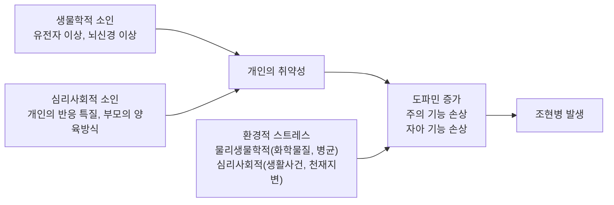
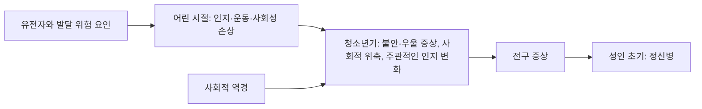



요약

망상, 환각, 뒤죽박죽인 말과 행동, 감정과 의욕의 상실이 한동안 계속되면서 일상생활이 크게 무너지는 병이다. 대개 10대 후반에서 30대 중반에 시작하고, 좋아졌다 나빠지기를 되풀이하며 오래 가는 경우가 많다. 한 가지 원인이 아니라 타고난 취약성과 환경 스트레스가 겹쳐 생긴다고 보며, 약물치료로 급한 증상을 누르고 심리사회적 치료로 생활을 되찾는다. 핵심 증상이 한 달, 전체 징후가 여섯 달 넘게 이어져야 이 이름을 붙인다.

## 예시로 보기

대학생 Y의 1년을 따라가며 진단기준의 시간표를 본다[^s1].

| 시기 | Y의 모습 | 단계 |
|---|---|---|
| 1~4월 | 친구를 피하고, 씻지 않고, 수업을 빠진다. "사람들이 나를 이상하게 본다"는 말이 잦아진다 | 전구기: 약한 증상과 기능 저하 |
| 5~6월 | "교수님이 수업 중에 나에게 암호를 보낸다"고 확신하고, 벽에서 들리는 목소리와 대화한다. 말이 두서없어진다 | 활성기: 망상, 환각, 혼란스러운 언어가 1개월 넘게 |
| 7~9월 | 약을 먹고 목소리는 줄었지만 표정이 없고 하루 종일 누워 있다 | 잔류 증상 |

핵심 증상(망상, 환각, 혼란스러운 언어)이 1개월 넘게 있었고, 전구기부터 잔류기까지 징후가 6개월을 넘었으며, 학업과 대인관계가 무너졌다. 그래서 조현병이다. 같은 활성기 증상이 3개월 만에 완전히 끝났다면 [조현양상장애](/Hongs_Blog/studies/abnormal-psychology/schizophreniform-disorder/), 2주 만에 끝났다면 [단기 정신병적 장애](/Hongs_Blog/studies/abnormal-psychology/brief-psychotic-disorder/)였다.

## 정의

조현병의 진단기준

네 조건을 모두 만족한다[^1][^2].
1. **핵심 증상:** 다음 중 2개 이상이 1개월 동안 상당 부분의 시간에 나타난다. 적어도 하나는 1~3 중 하나다. 
    1) 망상 2) 환각 3) 혼란스러운 언어(예: 주제 이탈, 뒤죽박죽) 4) 심하게 혼란스러운 행동이나 긴장증적 행동 5) 음성 증상(예: 정서적 둔마, 무언어증, 무의욕증)
2. **현저한 부적응:** 직업, 대인관계, 자기 돌봄 가운데 1개 이상의 주요 생활 영역의 기능이 현저히 떨어진다.
3. **지속 기간:** 장애의 징후가 6개월 이상 이어진다. 여기에는 전구기, 1개월 이상의 활성기, 관해기가 들어간다. 
   — 전구기는 증상이 본격적으로 나타나기 전 약한 조짐이 보이는 시기, 활성기는 핵심 증상이 뚜렷한 시기, 관해기는 증상이 가라앉은 시기다. 이 셋을 모두 합쳐 6개월이 넘어야 한다.
4. **배제:** 조현정동장애나 정신병적 양상을 동반한 우울·양극성 장애로 더 잘 설명되지 않는다. 물질의 생리적 효과나 다른 의학적 상태 때문이 아니다. 
   — 기분장애, 약물이나 술, 몸의 병으로 더 잘 설명되면 조현병으로 진단하지 않는다.

증상은 [정신병적 증상](/Hongs_Blog/studies/abnormal-psychology/psychotic-symptoms/)에서 자세히 다룬다.

### 설계 이유

- **"1~3 중 하나는 필수"인 이유:** 음성 증상과 혼란스러운 행동만으로는 우울, 치매, 긴장증을 일으키는 다른 병과 구별하기 어렵다. 망상, 환각, 혼란스러운 언어 가운데 하나가 있어야 정신증이라는 핵심이 보장된다[^s2].
- **"6개월"인 이유:** 짧게 왔다가 사라지는 정신증과, 오래 가며 기능을 무너뜨리는 조현병을 가르기 위해서다. 같은 증상이라도 1개월 안에 끝나면 단기 정신병적 장애, 1~6개월이면 조현양상장애다.

### 조현병인 예와 아닌 예[^s1]

- 조현병이다: 위의 Y. 망상과 음성 증상만 7개월 이어지며 직장을 잃은 사람. 환청과 혼란스러운 행동이 1개월, 전구기와 잔류기를 합쳐 1년인 사람.
- 아니다: 필로폰을 쓴 뒤 사흘간 피해망상과 환각을 보인 사람(물질로 인한 정신병적 장애). 주요우울 삽화 동안에만 "나는 벌받아 마땅한 죄인"이라는 망상을 보인 사람(정신병적 양상을 동반한 우울장애).

## 임상적 특징과 경과

- **유병률:** 평생 유병률은 0.3~0.7%(DSM-5), 우리나라는 0.2%(보건복지부)다[^3].
- **발병:** 흔히 10대 후반~30대 중반에 시작한다. 평균 발병 연령은 남성 15~24세, 여성 25~34세다. 청소년기 이전이나 40대 이후에 처음 생기는 경우는 드물다[^3].
- **사회 계층:** 사회경제적 계층이 낮은 가정에서 발병률이 높다[^3]. 이유는 아래 사회환경적 원인에서 다룬다.
- **경과:** 일부는 완전히 회복하지만, 많은 환자가 활성기 증상의 악화와 관해를 되풀이하며 만성화된다. 환자들은 이질적인 집단이다. 약 20%는 양호하게 좋아지고 그중 일부는 완전히 회복한다. 음성 증상과 긴 유병 기간 같은 나쁜 예후는 남성에게 더 흔하다[^4].
- **인지 손상:** 정신병 삽화 중에, 또는 정신병보다 먼저 나타나고, 발병 뒤 성인기 내내 이어지기도 한다[^4].

## 원인

### 1. 생물학적 원인

**유전.** 부모나 형제자매가 함께 앓는 비율(공병률)이 높다[^5]. 슬라이드의 고츠먼(Gottesman, 1991) 자료는 환자와 유전자를 많이 공유할수록 발병 위험이 커지는 것을 보여 준다[^5].

| 환자와의 관계 | 공유 유전자 | 평생 발병 위험 |
|---|---|---|
| 일반 인구 | — | 1% |
| 사촌 | 12.5% | 2% |
| 삼촌·이모 | 25% | 2% |
| 조카 | 25% | 4% |
| 손자녀 | 25% | 5% |
| 이복형제 | 25% | 6% |
| 부모 | 50% | 6% |
| 형제자매 | 50% | 9% |
| 자녀 | 50% | 13% |
| 이란성 쌍둥이 | 50% | 17% |
| 일란성 쌍둥이 | 100% | 48% |

일란성 쌍둥이도 48%라서, 유전자가 같아도 절반 이상은 발병하지 않는다. 유전은 강한 취약성이지만 운명은 아니다([취약성-스트레스 모델](/Hongs_Blog/studies/abnormal-psychology/vulnerability-stress-model/)). 같은 50%를 공유하는 이란성 쌍둥이(17%)가 형제자매(9%)보다 높은 것은 같은 시기에 같은 환경에서 자란 영향으로 볼 수 있다[^s3].

**뇌의 구조와 기능[^5][^6].**
- 구조: 뇌실 확장, 전두엽 위축, 변연계와 소뇌의 이상. 특히 음성 증상을 보이는 환자에게서 뚜렷하다.
- 기능: 뇌 영상에서 전두엽 피질의 신진대사가 떨어지고, 좌반구가 지나치게 활동한다.

**신경화학.** 도파민 과다, 특히 양성 증상과의 관련. 세로토닌과의 상호작용도 관여한다. 자세한 내용은 [도파민 가설](/Hongs_Blog/studies/abnormal-psychology/dopamine-hypothesis/).

**출생 전후의 환경과 신경발달[^7].**
- 임신 중의 외상, 영양실조, 감염, 중독. 출산 때의 외상, 산소 부족, 출혈. 출생 직후의 영양 부족, 질병, 사고.
- 조현병은 대개 청소년기 후반에 나타나 성인기 초기에 진단되지만, 기원은 그보다 훨씬 이르고 출생 전일 수도 있다는 증거가 있다. 증상이 나타나기 수년 전부터 여러 행동에 미묘한 혼란이 있고, 사춘기 동안 뇌, 특히 전두엽의 이상이 천천히 드러난다. 그래서 조현병을 신경발달장애의 하나로 보기도 한다.

### 2. 심리적 원인

**정신분석적 입장[^8].** 프로이트는 두 과정으로 설명했다.
1. 자아가 생기기 이전 단계(오이디푸스 이전)로 퇴행한다. 그 시기의 갈등과 결손이 원인이고, 갈등은 신경증보다 강하다. 부정, 투사 같은 원시적 방어기제를 쓰고, 일차과정 사고(비논리적 사고)가 살아난다.
2. 자아 통제를 다시 세우려 애쓴다. 환청은 잃어버린 현실감을 보상하려는 무의식적 시도다.

페던(Federn)은 조현병을 자아와 바깥 세계의 경계, 곧 자아 경계(ego boundary)가 무너진 것으로 보았다. 내 생각과 바깥 소리의 경계가 무너지면 환각과 망상이 생긴다[^8].

**인지적 입장[^9].**
- 주의장애 입장: 조현병은 기본적으로 사고장애이고, 사고장애는 주의 기능의 손상에서 온다. 들어오는 정보 가운데 필요한 것을 고르고 나머지를 억제하는 기능이 무너져 혼란이 생긴다.
- 합리적 경로 입장: 비정상적인 감각 경험을 스스로 이해하려는 노력에 주목한다. 이상한 경험에 대한 설명을 찾다 보면 "미친 행동으로 이어지는 합리적 경로"를 밟는다.

**가족관계 이론.** 조현병을 만드는 어머니, 부모의 부부관계, 이중구속, 표현된 정서. [조현병의 가족관계 이론](/Hongs_Blog/studies/abnormal-psychology/family-theories-schizophrenia/)에서 다룬다.

### 3. 사회환경적 원인

사회경제적 하류층에 조현병 환자가 많은 이유를 두 가설이 반대 방향으로 설명한다[^10].

| 가설 | 인과의 방향 | 내용 |
|---|---|---|
| 사회적 유발설 (sociogenic) | 계층 → 조현병 | 부당한 대우, 낮은 교육 수준, 적은 취업 기회가 스트레스와 좌절을 만들어 조현병을 일으킨다 |
| 사회적 선택설 (social selection) | 조현병 → 계층 | 증상이 나타나 사회적 기능이 떨어지면서 하류층으로 이동한다 |

두 가설 모두 부분적으로 지지된다[^10].

### 4. 통합적 원인

슬라이드는 [취약성-스트레스 모델](/Hongs_Blog/studies/abnormal-psychology/vulnerability-stress-model/)로 원인을 모은다[^11].

필기는 이것을 "여러 요인의 상호작용 결과"로 요약했다[^12]. 하우스와 머리(Howes & Murray, 2014)의 그림은 이 상호작용을 시간 위에 펼친다. 유전자와 발달 위험 요인이 어린 시절의 인지·운동·사회성 손상으로, 사회적 역경이 겹치며 청소년기의 불안·우울 증상, 사회적 위축과 주관적인 인지 변화, 전구 증상을 거쳐 성인 초기의 정신병으로 이어진다[^12].

왼쪽에서 오른쪽으로 갈수록 나이가 든다. 사회적 역경은 중간에 겹쳐 청소년기의 변화를 거든다[^s6].

## 치료

| 치료 | 내용 |
|---|---|
| 입원치료 | 자해와 타해로부터 보호한다[^13] |
| 약물치료 | 우선 약물로 증상을 완화한다. 1세대와 2세대 항정신병 약물의 차이는 [정형과 비정형 항정신병 약물 비교](/Hongs_Blog/studies/abnormal-psychology/typical-vs-atypical-antipsychotics/)[^13] |
| 전기충격치료 | 다른 치료로 잘 낫지 않는 치료 저항성 환자에게, 뇌에 짧은 전기자극을 주어 호전을 이끈다("재부팅")[^14] |
| 심리교육 | 증상과 약물에 대해 환자와 가족을 교육한다[^15] |
| 정신역동적 치료 | 지지적 관계로 자아 기능을 강화하고 대상관계를 다시 경험하게 한다[^15] |
| 인지교정·인지재활 | 병 전부터 시작해 증상이 가라앉은 뒤에도 남는 인지 결함을 고친다. 직업재활의 작업 능력과 사회 기능이 좋아진다. 만성이고 음성 증상이 심하면 인지왜곡을 다루는 인지치료보다 효과적이다[^15] |
| 인지행동치료 | 망상과 환청이 사실인지 근거를 찾게 해 현실 검증력을 키운다. 토큰 경제로 적응 행동을 늘리고, 자기지시훈련으로 건강한 자기 대화를 익히고, 사회기술훈련(SST)에서 대화·직업 기술과 눈 맞춤, 목소리 톤을 역할 연기와 교정적 피드백으로 연습한다[^16][^17] |
| 집단치료 | 지지를 주고 상호작용 기술을 배운다. 만성 환자에게 효과가 더 좋다[^18] |
| 가족치료 | 효과적인 의사소통과 건강한 감정 표현을 가족에게 교육한다[^18] |
| 낮병원, 그룹홈 | 사회로 돌아가기 전 과도기의 적응과 사회복귀 훈련[^18] |

인지행동치료에서 망상을 다룰 때의 요령은 필기에 적혀 있다. 환청이 "넌 실패자야"라고 비난하면(A), 환자는 "목소리 말이 맞다, 나는 실패자다"라고 믿고(B), 불안·슬픔·고립·자해로 이어진다(C). 치료는 B를 겨냥하되, 믿음에 동조하거나 지나치게 반박하면 오히려 신념이 공고해질 수 있으니 주의한다[^16].

## 스스로 설명해 보기

1. "일란성 쌍둥이의 발병 위험 48%는 유전의 역할과 한계를 함께 보여 준다."
   

근거

   일반 인구 1%보다 48배 높으니 유전의 역할이 크다. 하지만 유전자가 100% 같은데도 52%는 발병하지 않으므로 유전만으로는 충분하지 않다. 둘을 합치면 취약성-스트레스 모델이 된다.
   

2. "음성 증상이 두드러진 환자는 예후가 나쁘다."
   

근거

   음성 증상은 뇌의 구조적 변화와 관련되고, 약물로 잘 나아지지 않으며, 서서히 악화되는 만성 경과를 밟는다(양성 증상과 음성 증상 비교의 표). 슬라이드도 음성 증상과 긴 유병 기간을 나쁜 예후로 든다.
   

3. "망상에 정면으로 반박하면 신념이 오히려 굳어진다."
   

근거

   망상은 반증에도 유지되는 믿음이라 반박을 증거로 받아들이지 않는다. 반박하는 치료자는 "적의 편"이 되어 관계가 깨지고, 방어할수록 믿음은 공고해진다. 그래서 믿음의 근거를 함께 탐색하는 방식을 쓴다.
   

- 조현병 원인론의 핵심 아이디어는?
  

답

  단일 원인이 아니라 생물학적 취약성(유전, 신경발달)과 환경 스트레스가 발달 과정 내내 상호작용해, 도파민 증가·주의 손상·자아 기능 손상을 거쳐 발병한다.
  

## 자주 하는 오해

"조현병 환자는 위험하고 폭력적이다"

틀렸다. 망상과 환각이 무섭게 보이고, 드문 사건이 크게 보도되어 그럴듯하다. 대부분의 조현병 환자는 폭력적이지 않고, 오히려 폭력의 피해자가 되는 경우가 많다[^s4]. 입원치료의 목적에 "타해로부터 보호"가 있는 것은 일부 급성기의 위험을 관리하려는 것이지, 환자 전체가 위험하다는 뜻이 아니다. 이런 오해가 바로 "정신분열증"이라는 이름을 바꾼 이유인 낙인이다.

"조현병은 한번 걸리면 절대 나아지지 않는다"

틀렸다. 만성화되는 경우가 많아서 그럴듯하다. 하지만 환자는 이질적인 집단이고, 약 20%는 양호한 수준으로 좋아지며 그중 일부는 완전히 회복한다[^4]. 급성으로 시작하고 양성 증상 위주이며 병전 적응이 좋았던 경우 예후가 더 좋다.

## 확인 문제

<b>C1</b> 조현병 진단기준의 네 조건(핵심 증상, 부적응, 지속 기간, 배제)을 수치까지 포함해 쓰라.

**답:** (1) 핵심 증상 5개(망상, 환각, 혼란스러운 언어, 혼란스러운 행동·긴장증, 음성 증상) 중 2개 이상이 1개월 동안, 그중 하나는 망상·환각·혼란스러운 언어 중 하나. (2) 직업, 대인관계, 자기 돌봄 중 1개 이상의 기능이 현저히 저하. (3) 징후가 6개월 이상(전구기, 1개월 이상의 활성기, 관해기 포함). (4) 조현정동장애나 정신병적 양상을 동반한 기분장애, 물질이나 의학적 상태로 설명되지 않음.

<b>C2</b> 30세 Z는 넉 달 전부터 표정이 없어지고(정서적 둔마) 집에만 있다가(무의욕증), 지난 5주 동안은 두서없는 말을 하고 알 수 없는 자세로 굳어 있곤 했다. 망상과 환각은 없다. 조현병으로 진단할 수 있는가?

**답:** 아직 아니다. 핵심 증상은 음성 증상, 혼란스러운 언어, 긴장증적 행동으로 2개 이상이고, 혼란스러운 언어가 있어 "1~3 중 하나" 조건도 채운다. 하지만 징후가 넉 달이라 6개월 기준에 못 미친다. 지금은 조현양상장애로 보고, 징후가 6개월을 넘기면 조현병으로 진단을 바꾼다. 
**흔한 오답:** "망상과 환각이 없으니 조현병이 아니다." 혼란스러운 언어만으로도 필수 조건을 채운다.

<b>C3</b> "조현병 환자는 사회경제적 하류층에 많다"는 사실을 사회적 유발설과 사회적 선택설은 각각 어떻게 설명하는가? 두 가설을 가르려면 어떤 자료가 필요한가?

**답:** 유발설: 하류층의 부당한 대우와 좌절이 스트레스가 되어 조현병을 일으킨다(계층 → 병). 선택설: 병으로 기능이 떨어져 하류층으로 밀려난다(병 → 계층). 가르려면 발병 전의 계층을 봐야 한다. 환자 부모의 계층이 이미 낮았다면 유발설, 부모는 중산층인데 본인만 발병 뒤 계층이 떨어졌다면 선택설을 지지한다[^s5].

<b>C4</b> 고츠먼의 자료에서 "형제자매 9%, 이란성 쌍둥이 17%, 일란성 쌍둥이 48%"를 취약성-스트레스 모델의 언어로 옮겨 설명하라.

**답:** 공유 유전자가 늘수록(형제자매·이란성 50% → 일란성 100%) 위험이 커지는 것은 유전이 취약성의 한 축이라는 뜻이다. 공유 유전자가 같은 형제자매(9%)와 이란성 쌍둥이(17%)의 차이는, 같은 시기·같은 환경이라는 공유된 스트레스나 환경 요인의 몫으로 읽을 수 있다. 일란성도 48%에 그치는 것은 취약성이 있어도 스트레스가 더해져야 발병한다는 뜻이다.

<b>C5</b> 만성이고 음성 증상이 심한 환자에게 인지치료보다 인지재활이 더 효과적인 이유를 쓰라.

**답:** 인지치료는 망상 같은 왜곡된 생각의 내용을 다루는데, 음성 증상이 심한 만성 환자의 문제는 생각의 내용보다 주의·기억·실행 기능 같은 인지 능력 자체의 결함이다. 인지재활은 이 결함을 훈련으로 직접 고쳐 작업 능력과 사회 기능을 높인다.

[^1]: 4-1학기/이상 심리학/1.수업자료/02.조현병 스펙트럼 장애.pdf, p.17
[^2]: 4-1학기/이상 심리학/1.수업자료/02.조현병 스펙트럼 장애.pdf, p.18
[^3]: 4-1학기/이상 심리학/1.수업자료/02.조현병 스펙트럼 장애.pdf, p.19
[^4]: 4-1학기/이상 심리학/1.수업자료/02.조현병 스펙트럼 장애.pdf, p.20
[^5]: 4-1학기/이상 심리학/1.수업자료/02.조현병 스펙트럼 장애.pdf, p.21 (Gottesman, 1991의 그래프와 뇌 그림)
[^6]: 4-1학기/이상 심리학/1.수업자료/02.조현병 스펙트럼 장애.pdf, p.22
[^7]: 4-1학기/이상 심리학/1.수업자료/02.조현병 스펙트럼 장애.pdf, p.24
[^8]: 4-1학기/이상 심리학/1.수업자료/02.조현병 스펙트럼 장애.pdf, p.25~26
[^9]: 4-1학기/이상 심리학/1.수업자료/02.조현병 스펙트럼 장애.pdf, p.27
[^10]: 4-1학기/이상 심리학/1.수업자료/02.조현병 스펙트럼 장애.pdf, p.31
[^11]: 4-1학기/이상 심리학/1.수업자료/02.조현병 스펙트럼 장애.pdf, p.32
[^12]: 4-1학기/이상 심리학/1.수업자료/02.조현병 스펙트럼 장애.pdf, p.33 (Howes & Murray, 2014의 그림). "여러 요인의 상호작용 결과"는 손글씨 필기다.
[^13]: 4-1학기/이상 심리학/1.수업자료/02.조현병 스펙트럼 장애.pdf, p.34
[^14]: 4-1학기/이상 심리학/1.수업자료/02.조현병 스펙트럼 장애.pdf, p.35
[^15]: 4-1학기/이상 심리학/1.수업자료/02.조현병 스펙트럼 장애.pdf, p.36
[^16]: 4-1학기/이상 심리학/1.수업자료/02.조현병 스펙트럼 장애.pdf, p.37. A-B-C 그림의 예와 "동조나 지나친 반박은 유의! ⇒ 신념이 공고화될 수 있음"은 손글씨 필기다.
[^17]: 4-1학기/이상 심리학/1.수업자료/02.조현병 스펙트럼 장애.pdf, p.38
[^18]: 4-1학기/이상 심리학/1.수업자료/02.조현병 스펙트럼 장애.pdf, p.39
[^s1]: 에이전트 보충. Y의 1년과 해당·비해당 예는 진단기준을 적용해 보이려고 만든 가상 사례다.
[^s2]: 에이전트 보충. "1~3 중 하나 필수"의 설계 이유는 진단기준의 구조에서 해석한 것이다.
[^s3]: 에이전트 보충. 이란성 쌍둥이와 형제자매의 차이를 공유 환경으로 읽는 것은 쌍둥이 연구의 표준 해석이다. 자료는 고츠먼(1991)의 종합 수치로, 연구마다 값이 다르다.
[^s4]: 에이전트 보충. 조현병 환자 대부분이 폭력적이지 않고 오히려 피해자가 되기 쉽다는 것은 역학 연구의 일관된 결과다. 물질 사용이 겹치면 폭력 위험이 올라간다는 점도 함께 보고된다.
[^s5]: 에이전트 보충. 부모 세대의 계층과 본인의 계층 이동을 비교하는 방법은 두 가설을 검증한 고전적 연구 설계다.
[^s6]: 에이전트 보충. 다이어그램 1개는 원본에 없다. '통합적 원인' 절의 하우스와 머리(2014) 그림 설명(슬라이드 p.33)을 그렸다.

