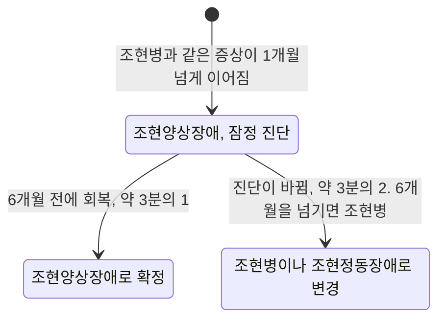



요약

증상은 조현병과 똑같지만 1개월에서 6개월 사이에 끝나는 경우다. 아직 6개월이 안 된 채 증상이 계속되면 일단 이 이름을 붙였다가, 6개월을 넘기면 조현병으로 바꾼다. 조현병보다 갑자기 시작하고 병 전의 생활이 좋았으며 빨리 완전히 회복하는 경우가 많다. 그래도 셋 중 둘은 결국 조현병이나 조현정동장애로 진단이 바뀐다.

## 예시로 보기

AC는 입대 두 달 만에 "부대원들이 내 생각을 읽는다"며 환청을 듣고 말이 두서없어졌다. 병원에서 조현양상장애 진단을 받았다[^s1].

- 석 달 만에 증상이 모두 사라지고 복귀했다면: 최종 진단도 조현양상장애다.
- 여덟 달째 증상이 이어진다면: 6개월을 넘긴 시점에 조현병으로 진단이 바뀐다.

같은 증상, 같은 시작인데 진단이 갈리는 기준은 오직 기간이다. 그래서 증상이 끝나기 전에 내린 조현양상장애 진단은 "잠정적"이다[^s2].

## 정의

조현병과 같은 증상(망상, 환각, 와해된 언어, 와해된 행동 등)을 보이지만 지속 기간이 1개월 이상 6개월 미만인 경우다[^1]. 두 경우가 여기에 든다.

- 증상이 나타났다가 6개월 전에 회복된 경우
- 증상이 지금 이어지지만 6개월이 지나지 않은 경우. 6개월이 지나면 조현병으로 진단을 바꾼다.

원본 오류 의심

원문: "지속기간이 1개월 이상 6개월 이하인 경우"(p.45) / 문제점: 조현병의 기준은 "6개월 이상"(p.18)이라, 정확히 6개월이면 두 진단에 모두 해당한다. / 수정안: "1개월 이상 6개월 미만" / 근거: DSM-5-TR 조현양상장애의 진단기준 B("at least 1 month but less than 6 months")[^s2].

DSM-5-TR은 조현병과 달리 조현양상장애에는 사회적·직업적 기능 저하를 필수로 요구하지 않는다[^s2].

### 조현병과의 차이[^2]

| | 조현양상장애 | 조현병 |
|---|---|---|
| 기간 | 1개월 이상 6개월 미만 | 6개월 이상 |
| 가족력 | 조현병 가족력이 드묾 | 가족력이 흔함 |
| 시작 | 대부분 정서적 스트레스가 먼저 있고 급성으로 시작 | 전구기를 거쳐 서서히 시작하는 경우가 많음 |
| 병전 적응 | 양호 | 전구기에 기능 저하 |
| 회복 | 병전 기능으로 급격하고 완전하게 회복 | 악화와 관해를 되풀이하며 만성화되는 경우가 많음 |

### 경과[^1]

- 3분의 1: 6개월 안에 회복해 최종 진단이 조현양상장애로 남는다.
- 3분의 2: 조현병이나 조현정동장애로 진단이 바뀐다.
- 평생 유병률 0.2%.

증상이 이어지는 동안의 진단은 가운데 칸에 머문다. 6개월 전에 회복하느냐에 따라 두 칸 중 하나로 옮겨 간다[^s3].

## 연결

- 같은 증상의 긴 형태: [조현병](/Hongs_Blog/studies/abnormal-psychology/schizophrenia/)
- 더 짧은 형태: [단기 정신병적 장애](/Hongs_Blog/studies/abnormal-psychology/brief-psychotic-disorder/)
- 셋의 기간 비교: [정신병적 장애의 지속 기간 비교](/Hongs_Blog/studies/abnormal-psychology/psychotic-duration-contrast/)

## 확인 문제

<b>C1</b> 조현양상장애의 기간 기준과, 조현양상장애로 진단받은 사람들의 경과를 비율로 쓰라.

**답:** 조현병과 같은 증상이 1개월 이상 6개월 미만. 3분의 1은 6개월 안에 회복해 최종 진단이 조현양상장애로 남고, 3분의 2는 조현병이나 조현정동장애로 진단이 바뀐다. 평생 유병률 0.2%.

<b>C2</b> 조현양상장애와 조현병은 증상이 같다. 기간 말고, 조현양상장애 쪽을 가리키는 특징 네 가지를 쓰라.

**답:** 조현병 가족력이 드물다. 정서적 스트레스가 먼저 있고 급성으로 시작한다. 병전 적응 상태가 양호하다. 병전 기능으로 빠르고 완전하게 회복한다.

<b>C3</b> 증상이 아직 계속되는 환자에게 내린 조현양상장애 진단을 "잠정적"이라고 부르는 이유를 쓰라.

**답:** 조현양상장애와 조현병을 가르는 것이 기간뿐이라, 증상이 끝나기 전에는 최종 기간을 알 수 없다. 6개월 전에 회복하면 조현양상장애로 확정되고, 6개월을 넘기면 조현병으로 바뀐다. 셋 중 둘이 바뀐다는 경과 자료도 이 진단이 중간 단계일 수 있음을 보여 준다.

[^1]: 4-1학기/이상 심리학/1.수업자료/02.조현병 스펙트럼 장애.pdf, p.45
[^2]: 4-1학기/이상 심리학/1.수업자료/02.조현병 스펙트럼 장애.pdf, p.46 (조현병과의 차이). 표의 조현병 열은 p.18~20에서 옮겼다.
[^s1]: 에이전트 보충. AC의 사례는 기간 기준을 보이려고 만든 가상 사례다.
[^s2]: 에이전트 보충. DSM-5-TR 조현양상장애의 진단기준은 삽화가 "1개월 이상 6개월 미만"이고, 기능 저하를 요구하지 않으며, 회복을 기다리는 동안에는 "잠정적(provisional)"이라고 명시한다.
[^s3]: 에이전트 보충. 다이어그램 1개는 원본에 없다. 정의 절의 두 경우와 '경과' 절(슬라이드 p.45)을 상태도로 그렸다.

