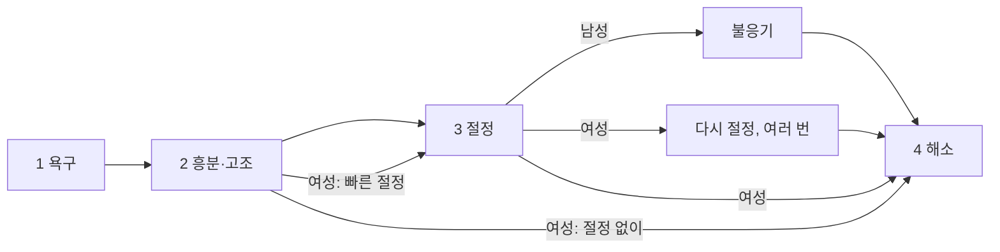
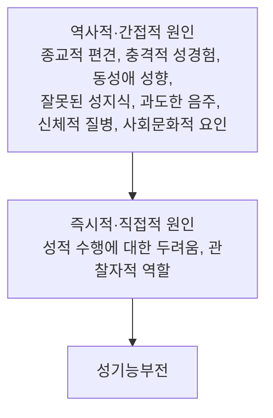



요약

성적인 반응은 욕구가 생기고, 흥분하고, 절정에 이르고, 가라앉는 네 단계로 흘러간다. 성기능부전은 앞의 세 단계 가운데 하나 이상에서 반응이나 즐거움을 느끼는 능력이 오래(대개 6개월 넘게) 뚜렷하게 손상되어 괴로운 상태다. 몸의 병이 원인일 때도 많지만, 잘해야 한다는 두려움과 자기 모습을 지켜보며 평가하는 태도가 반응을 막는 경우가 흔하다. 그래서 신체 평가와 함께 불안을 줄이는 심리치료가 쓰인다.

## 예시로 보기

30대 HO는 승진 시험을 준비하던 해에 한 번 발기가 되지 않은 뒤로, 성관계 때마다 "이번에도 안 되면 어쩌지" 하며 자신의 몸 상태를 지켜본다. 그럴수록 흥분이 사라지고, 반년째 거의 매번 발기가 유지되지 않는다. 비뇨기과 검사에서 신체 이상은 없었다[^s1].

- 흥분 단계의 장애(발기장애), 거의 모든 경우, 6개월 이상.
- 한때는 문제가 없었으므로 후천형이다.
- 즉시적 원인: 성적 수행에 대한 두려움과 관찰자적 역할.

## 정의

### 성반응주기[^1][^2]

| 단계 | 일어나는 일 |
|---|---|
| 1. 성욕구 단계(desire) | 성적 관심과 환상, 욕구가 생긴다 |
| 2. 흥분·고조 단계(excitement/plateau) | 몸이 성적으로 흥분하고 그 상태가 이어진다 |
| 3. 절정 단계(orgasm) | 극치감에 이른다 |
| 4. 해소 단계(resolution) | 몸이 흥분 전 상태로 돌아온다 |

성기능 장애는 해소 단계를 뺀 세 단계 가운데 하나 이상에서 나타난다. 남성은 절정 뒤 다시 반응하지 못하는 불응기(refractory period)를 거쳐 해소되고, 여성은 여러 번의 절정, 절정 없는 해소, 빠른 절정처럼 경로가 여럿이다[^2].

성기능부전은 1~3번 상자 가운데 하나 이상에서 반응이 막힌 것이다. 해소에 이르는 길은 남성은 불응기를 거치는 하나이고, 여성은 여러 갈래다[^s4].

### DSM-5-TR의 성기능부전[^3]

| 남성 | 여성 |
|---|---|
| [남성 성욕감퇴장애](/Hongs_Blog/studies/abnormal-psychology/male-hypoactive-desire/) | [여성 성적 관심·흥분장애](/Hongs_Blog/studies/abnormal-psychology/female-interest-arousal/) |
| [발기장애](/Hongs_Blog/studies/abnormal-psychology/erectile-disorder/) | [성기-골반 통증·삽입장애](/Hongs_Blog/studies/abnormal-psychology/genito-pelvic-pain/) |
| [조기사정](/Hongs_Blog/studies/abnormal-psychology/premature-ejaculation/) | [여성 극치감장애](/Hongs_Blog/studies/abnormal-psychology/female-orgasmic/) |
| [사정지연](/Hongs_Blog/studies/abnormal-psychology/delayed-ejaculation/) | |

- 여러 장애로 이루어진 이질적 집단이다.
- 성적으로 반응하거나 성적 즐거움을 경험하는 능력이 임상적으로 뚜렷하게 손상된 상태다.
- 평생형(처음 성생활을 시작할 때부터)과 후천형(한동안 정상이다가 생김)으로 나눈다.
- 한 사람이 여러 성기능부전을 함께 가질 수 있고, 그러면 모두 진단한다.
- 불충분한 성적 자극 때문에 생긴 문제라면, 치료가 필요할 수는 있어도 성기능부전으로 진단하지 않는다.

각 장애를 성반응주기에 놓으면 다음과 같다[^s2].

| 단계 | 장애 |
|---|---|
| 욕구 | 남성 성욕감퇴장애, 여성 성적 관심·흥분장애(관심 쪽) |
| 흥분 | 발기장애, 여성 성적 관심·흥분장애(흥분 쪽) |
| 절정 | 조기사정, 사정지연, 여성 극치감장애 |
| 단계와 별도 | 성기-골반 통증·삽입장애(통증과 삽입의 어려움) |

## 원인[^4][^5]

### 정신분석적 입장

상대방을 좌절시키려는 무의식적 동기, 감정의 전이, 거세불안, 남근선망, 내면화된 초자아가 성기능 장애를 낳는다.

### 인지적 입장

- 성에 대한 비현실적이고 과도한 기대와 믿음.
- 성에 대한 부정적 신념.
- 성행위 때의 부정적 사고, 특히 자기에게 쏠린 주의(자기초점적 주의).

### 역사적 원인과 즉시적 원인

- **역사적·간접적 원인:** 과거부터 쌓여 성기능부전에 취약하게 만드는 요인이다.
- **즉시적·직접적 원인:** 성행위 그 순간에 작용하는 요인이다. 성적 수행에 대한 두려움(잘해야 한다는 부담)과 관찰자적 역할(spectatoring: 성행위에 몰입하지 못하고 자기 반응을 바깥에서 지켜보며 평가하는 태도)이다.

그림의 "동성애 성향"은 성적 지향 자체가 원인이라는 뜻으로 읽으면 안 된다. 자신의 지향과 맞지 않는 관계를 유지하거나 지향 때문에 갈등과 낙인을 겪을 때 문제가 생길 수 있다는 뜻으로 이해한다[^s3].

## 치료[^6][^7]

- **다각적 평가:** 신체적 원인(당뇨, 고혈압, 심혈관 질환, 호르몬 이상, 신경 손상, 약물), 심리적 원인(불안, 우울, 스트레스, 대인관계, 과거 외상), 성생활과 관계 패턴을 함께 본다.
- **약물치료:** 원인과 증상에 따라 쓴다. 남성 발기장애에는 PDE5 억제제(비아그라, 시알리스 등), 낮은 테스토스테론에는 호르몬 치료, 여성의 성욕 저하에는 호르몬 대체요법.
- **생활습관 개선:** 규칙적 운동과 건강한 식습관, 금연, 절주, 스트레스 관리, 충분한 수면.
- **기타:** 물리치료, 골반저근 강화 운동, 경우에 따라 혈관 수술 같은 외과적 치료.
- **심리치료:**
    - 개인치료, 커플치료.
    - 정신분석적 치료: 배우자에 대한 무의식적 갈등과 분노, 부모에 대한 무의식적 성적 갈등을 다룬다.
    - 인지행동치료: 성에 대한 역기능적 신념과 성행위 때의 부정적 사고를 찾아 바꾼다. 불안과 긴장을 줄이려고 체계적 둔감법, 모방학습, 긴장이완 훈련을 한다. 구체적인 성적 기술을 배운다.
    - 파트너와 솔직하게 대화하고 갈등을 풀어야 하므로 의사소통 훈련, 자기주장 훈련, 사회기술 훈련, 부부관계 개선 훈련을 한다.
    - **마스터스와 존슨(Masters & Johnson)의 감각 초점 훈련(sensate focus):** 수행불안과 관찰자적 자세를 버리고, 성반응의 각 단계에서 느끼는 신체 감각에 집중하고 몰입한다.

## 연결

- 불안을 줄이는 기법: [노출치료와 체계적 둔감법](/Hongs_Blog/studies/abnormal-psychology/exposure-therapy/)
- 자기초점적 주의가 수행을 망치는 같은 구조: [사회불안장애](/Hongs_Blog/studies/abnormal-psychology/social-anxiety-disorder/)

## 확인 문제

<b>C1</b> 성기능부전 일곱 가지를 성반응주기의 단계(욕구, 흥분, 절정)와 "단계와 별도"로 나누어 표로 옮기라.

**답:** 욕구: 남성 성욕감퇴장애, 여성 성적 관심·흥분장애(관심). 흥분: 발기장애, 여성 성적 관심·흥분장애(흥분). 절정: 조기사정, 사정지연, 여성 극치감장애. 단계와 별도: 성기-골반 통증·삽입장애. 해소 단계의 장애는 없다.

<b>C2</b> 관찰자적 역할이 성기능부전을 유지하는 과정을 설명하고, 감각 초점 훈련이 이 고리를 어떻게 끊는지 쓰라.

**답:** 한 번의 실패 뒤 "이번에도 안 되면 어쩌지" 하며 성행위 중 자기 반응을 바깥에서 지켜보고 평가하면, 주의가 감각에서 평가로 옮겨 가고 불안이 커져 흥분이 사라진다. 실패가 다시 두려움을 키운다. 감각 초점 훈련은 수행의 목표를 내려놓고 지금 느끼는 신체 감각에만 주의를 두게 해, 평가와 불안 대신 몰입을 되찾게 한다.

<b>C3</b> HP는 파트너가 성적 자극을 거의 주지 않아서 극치감에 이르지 못한다. 다른 상황에서는 문제가 없다. 성기능부전으로 진단하는가?

**답:** 진단하지 않는다. 불충분한 성적 자극 때문에 생긴 문제라면 치료나 상담이 도움이 될 수는 있어도 성기능부전으로 진단하지 않는다. 먼저 커플의 의사소통과 성적 기술을 다룬다.

[^1]: 4-1학기/이상 심리학/1.수업자료/09.성 관련 장애.pdf, p.4
[^2]: 4-1학기/이상 심리학/1.수업자료/09.성 관련 장애.pdf, p.5 (남녀의 성반응주기 그림)
[^3]: 4-1학기/이상 심리학/1.수업자료/09.성 관련 장애.pdf, p.6
[^4]: 4-1학기/이상 심리학/1.수업자료/09.성 관련 장애.pdf, p.28
[^5]: 4-1학기/이상 심리학/1.수업자료/09.성 관련 장애.pdf, p.29 (역사적·즉시적 원인 그림)
[^6]: 4-1학기/이상 심리학/1.수업자료/09.성 관련 장애.pdf, p.30
[^7]: 4-1학기/이상 심리학/1.수업자료/09.성 관련 장애.pdf, p.31
[^s1]: 에이전트 보충. HO의 사례는 성반응주기와 즉시적 원인을 보이려고 만든 가상 사례다.
[^s2]: 에이전트 보충. 일곱 장애를 성반응주기 단계에 대응시킨 표는 p.4의 "세 단계 가운데 한 단계 이상에서 장애"와 각 장애의 진단기준을 이어 정리했다.
[^s3]: 에이전트 보충. 현재의 정신의학은 성적 지향을 장애나 장애의 원인으로 보지 않는다. 이 문장은 그림 속 항목을 어떻게 읽을지에 대한 해석이다.
[^s4]: 에이전트 보충. 다이어그램 1개는 원본에 없다. '성반응주기' 표와 p.5의 남녀 성반응주기 그림 설명을 흐름도로 옮겼다.

