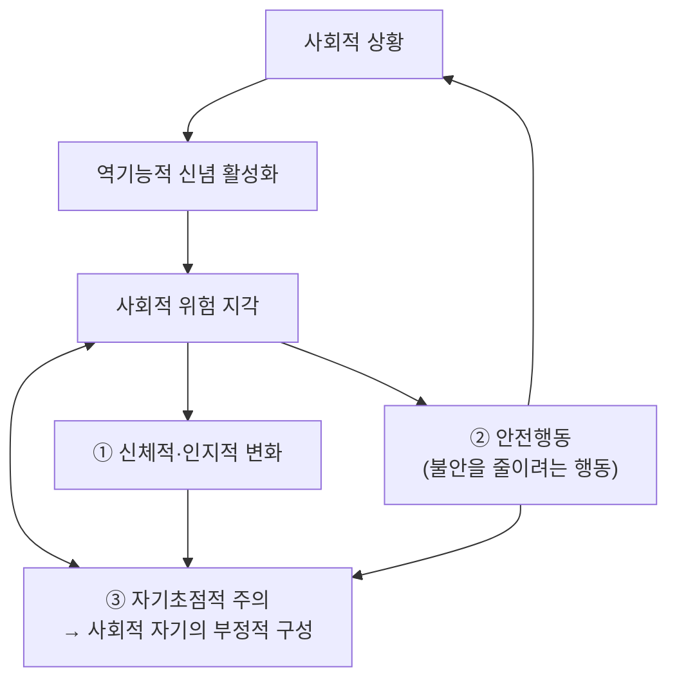



요약

남이 나를 지켜보거나 평가할 수 있는 자리에서, 창피당하거나 나쁘게 평가받을까 봐 심하게 두려워하고 그런 자리를 피하는 장애다. 발표, 낯선 사람과의 대화, 남 앞에서 밥 먹기가 모두 고통이 된다. 불안해서 쓰는 "안전행동"과 자기 모습에만 쏠리는 주의가 오히려 불안을 키우고 굳힌다. 수줍음과 달리 6개월 넘게 생활을 크게 방해해야 하고, 인지행동적 집단치료가 가장 효과적이다.

## 예시로 보기

대학생 CG가 조별 모임에서 의견을 말해야 한다[^s1].

| 단계 | CG의 마음과 행동 | 클라크와 웰스 모형의 이름 |
|---|---|---|
| 상황 | 다섯 명이 CG를 바라본다 | 사회적 상황 |
| 신념 | "완벽하게 말해야 해. 실수하면 다들 나를 무시할 거야. 나는 원래 말주변이 없어" | 역기능적 신념 활성화 |
| 위험 | "지금 망신당할 것 같다" | 사회적 위험 지각 |
| 몸 | 얼굴이 달아오르고 목소리가 떨린다 | 신체적·인지적 변화 |
| 주의 | "내 얼굴 빨간 거 다 보이겠지"라는 생각에 온 신경이 자기에게 쏠린다 | 자기초점적 주의 → 부정적 자기 이미지 |
| 행동 | 대본을 보고 빨리 읽고, 눈을 피하고, 컵을 꽉 쥔다 | 안전행동 |
| 결과 | 조원들이 CG를 무뚝뚝하다고 느낀다. CG는 모임이 끝난 뒤 밤새 자기 말을 곱씹는다 | 사후 반추 |

안전행동(눈 피하기, 빨리 읽기)은 불안을 줄이려는 것인데, 실제로는 남에게 어색하게 보이게 만들어 "역시 나는 어색하다"는 신념을 강화한다.

## 정의

사회불안장애의 진단기준

A. 남에게 관찰되거나 평가될 수 있는 1개 이상의 상황에 대한 현저한 불안과 공포[^1]
- 일상적인 상호작용 상황(대화하기, 낯선 사람 만나기)
- 관찰당하는 상황(남 앞에서 먹기)
- 수행 상황(연설, 발표)

B. 부정적 평가(경멸, 모욕, 거부)를 받거나 부적절한 행동을 할 것에 대한 두려움 
C. 사회적 상황이나 과제 수행의 회피 
D. 6개월 이상의 심한 고통, 직업적·사회적 생활의 현저한 방해

필기는 진단기준 아래에 "긍정적 평가도 마냥 좋게 바라보지 않음(ex. 빈말이겠지)"을 적었다[^1]. 칭찬도 믿지 않거나 부담스러워한다는 뜻으로, 아래의 "긍정적 평가에 대한 두려움"과 이어진다.

## 임상적 특징[^2]

- 평생 유병률 7%.
- 10대 중반 청소년에게서 많이 시작한다. 수줍고 내성적인 아동기를 보낸 청소년에게서 시작해 만성화되는 경우가 많고, 나이가 들수록 유병률이 줄어든다.
- **한국과 일본의 특이한 현상: 가해 염려형 사회불안.** 자신이 남을 불편하게 하거나 공격하고, 그 때문에 거부당할까 봐 두려워한다(예: "내 시선이 남을 불쾌하게 만든다", "내 몸 냄새가 남에게 피해를 준다")[^s2]. 서구의 사회불안이 "내가 창피당할까" 중심이라면, 이 유형은 "내가 남에게 피해를 줄까" 중심이다.

## 원인

### 1. 생물학적 입장[^3]

- 유전: 일란성 쌍둥이의 일치율이 높다.
- 기질: 행동억제 기질, 신경증과 내향성, 자율신경계 활동의 불안정, 부정적 정서 처리에 민감하도록 편도체가 쉽게 활성화되는 경향, 수줍음과 낯선 사람에 대한 두려움.

### 2. 정신분석적 입장[^4]

- **무의식적 갈등의 투사:** 자신의 공격적 충동을 남에게 투사해, 남이 자신에게 공격적·비판적일 것이라 느끼고 두려워한다.
- **대상관계이론:** 불안정하거나 거부적인 어머니와의 관계가 부적절한 자기 표상과 비판적인 타인 표상("나도 괜찮지 않고, 너도 괜찮지 않다")을 만들고, 자라서 대인관계에서 과도한 불안이 된다.

### 3. 인지적 입장

**클라크와 웰스(Clark & Wells, 1995)의 인지이론[^5].** 사회불안장애의 역기능적 신념은 셋이다.

| 신념 | 예 |
|---|---|
| 사회적 수행에 대한 과도한 기준 | "모든 사람에게 인정과 칭찬을 받아야 한다" |
| 사회적 평가에 대한 조건적 신념 | "실수하면 사람들이 나를 무시할 것이다" |
| 자기에 대한 부정적 신념 | "나는 매력이 없다", "나는 열등하다" |

필기는 안전행동 옆에 "불안을 감소시키기 위한 행동"이라고 적었다[^5]. 세 요소가 서로를 키우며 악순환을 만든다. 자기에게 쏠린 주의 때문에 실제 상대의 반응(대개 호의적)을 보지 못하고, 머릿속의 "빨개지고 떠는 나"를 남이 보는 모습이라 믿는다.

**라피와 하임버그(Rapee & Heimberg, 1997)의 인지행동모델[^6].** 청중을 지각하면 주의 자원을 두 곳에 먼저 쓴다. 청중에게 비친 자기 모습에 대한 생각과, 부정적 평가를 암시하는 외적 단서(하품, 찡그림)다. 떨림 같은 내적 단서도 자기 모습 판단에 더해진다. 그 모습을 "청중이 기대하는 모습"과 비교해 "부정적으로 평가받았다"고 판단하고, 행동·인지·신체 증상이 나타나 다시 악순환에 들어간다.

**그 밖의 인지적 요인[^7].**
- **부정적인 사후 반추(post-event rumination):** 모임이 끝난 뒤 실수를 되풀이해 곱씹는다. 수치심과 공포가 강해지고, 다음 수행에 대한 예기불안이 커져 자기효능감이 떨어지고 불안이 유지된다.
- **긍정적 평가에 대한 두려움과 평가절하:** 주목받는 것, 기대에 부응해야 하는 것이 불편하다. 좋은 일이 나중에 나쁜 일로 이어질 것이라 믿는다.
- **인지적 오류:** 흑백논리, 정신적 여과, 개인화, 독심술 등([우울증의 인지이론](/Hongs_Blog/studies/abnormal-psychology/beck-cognitive-theory/)의 오류 표).

## 치료[^8]

- **약물치료:** 항우울제와 항불안제. 약을 끊으면 증상이 재발하는 경향이 있다.
- **인지행동적 집단치료(가장 효과적):**
    - 인지적 재구성: 사회적 상황의 부정적 사고와 신념을 바꾼다. 예: "초조하고 긴장한다고 반드시 바보같이 보이는가?"
    - 사회적 상황에 반복 노출: 발표자와 청중 역할을 번갈아 연습하고, 비디오 피드백으로 실제 자기 모습을 확인한다.
    - 긴장이완 훈련.

비디오 피드백이 효과적인 이유는 자기초점적 주의가 만든 "머릿속 자기 모습"과 실제 모습의 차이를 직접 보게 하기 때문이다[^s3].

## 스스로 설명해 보기

1. "안전행동이 불안을 유지한다."
   

근거

   클라크와 웰스 모형에서 안전행동은 불안을 잠깐 줄이지만, (1) 무사히 넘긴 것을 안전행동 덕으로 돌리게 해 신념이 반증되지 않고, (2) 눈 피하기처럼 남에게 어색하게 보여 실제 부정적 반응을 부르며, (3) 자기에게 주의를 더 쏠리게 한다.
   

2. "자기초점적 주의는 부정적 자기 이미지를 만든다."
   

근거

   주의가 자기 몸의 감각(달아오름, 떨림)에 쏠리면 그 감각을 바탕으로 "남에게 보이는 내 모습"을 구성한다. 실제 상대의 호의적 반응은 보지 못하므로 과장된 부정적 이미지가 교정되지 않는다.
   

3. "사후 반추가 다음 불안을 키운다."
   

근거

   끝난 상황을 실수 위주로 되짚으면 기억이 실제보다 부정적으로 굳고(정신적 여과), 다음 수행에 대한 예기불안과 낮은 자기효능감으로 이어진다(p.33).
   

- 이 장애 설명의 핵심 아이디어는?
  

답

  사회불안은 남의 평가 자체보다, 평가를 두려워하는 신념이 주의(자기초점)와 행동(안전행동, 회피)을 바꿔 스스로를 확인하는 악순환으로 유지된다. 치료는 이 고리의 신념, 주의, 행동을 모두 겨냥한다.
  

## 자주 하는 오해

"사회불안장애는 수줍음이 좀 심한 것이다"

틀렸다. 둘 다 사람 앞에서 긴장한다는 점이 같아 그럴듯하다. 사회불안장애는 부정적 평가에 대한 두려움이 현저하고, 상황을 피하며, 6개월 넘게 직업과 사회생활을 크게 방해해야 진단한다. 수줍은 사람의 대부분은 긴장하면서도 필요한 자리에 나가고 적응한다. 다만 수줍고 내성적인 아동기는 사회불안장애로 이어지는 흔한 경로다(p.28).

## 확인 문제

<b>C1</b> 사회불안장애 진단기준의 네 요소(상황, 두려움, 행동, 기간·손상)와 상황의 세 종류를 쓰라.

**답:** A. 관찰·평가될 수 있는 상황에 대한 현저한 불안과 공포(일상적 상호작용, 관찰당하는 상황, 수행 상황). B. 부정적 평가나 부적절한 행동에 대한 두려움. C. 회피. D. 6개월 이상의 심한 고통과 생활의 현저한 방해.

<b>C2</b> 다음 사례의 요소를 클라크와 웰스 모형의 칸(역기능적 신념, 사회적 위험 지각, 신체적 변화, 안전행동, 자기초점적 주의)에 배치하라. "회식에서 건배사를 맡은 CH는 '재미없으면 다들 날 한심하게 볼 거야'라고 생각하자 손이 떨렸다. 떨림을 숨기려 잔을 두 손으로 쥐고, 준비한 말만 빠르게 읽었다. 읽는 내내 '내 목소리 떨리는 거 다 들리겠지'만 생각했다."

**답:** 역기능적 신념: "재미없으면 다들 날 한심하게 볼 거야"(조건적 신념). 사회적 위험 지각: 건배사 상황을 망신의 위험으로 봄. 신체적 변화: 손 떨림. 안전행동: 잔을 두 손으로 쥐기, 준비한 말만 빠르게 읽기. 자기초점적 주의: "내 목소리 떨리는 거 다 들리겠지"에 주의가 쏠림.

<b>C3</b> 두 사람 모두 사람들 앞에서 불안하다. CI는 "내가 실수해서 창피당할까 봐", CJ는 "내 시선이 상대를 불쾌하게 만들까 봐" 두렵다. 두 사람의 사회불안은 어떻게 다른가?

**답:** CI는 서구에서 흔한 전형적 사회불안으로, 자신이 부정적 평가를 받을 것을 두려워한다. CJ는 한국·일본에서 특이하게 보고되는 가해 염려형 사회불안으로, 자신이 남에게 불쾌감이나 피해를 줘서 거부당할 것을 두려워한다.

<b>C4</b> 사회불안장애의 인지행동적 집단치료에서 "비디오 피드백"을 쓰는 이유를 모형으로 설명하라.

**답:** 자기초점적 주의 때문에 환자는 몸의 감각으로 구성한 과장된 "남에게 보이는 내 모습"을 사실로 믿는다. 녹화한 실제 모습을 보면 떨림이나 붉어짐이 생각보다 훨씬 덜 보인다는 것을 확인해, 부정적 자기 이미지와 "모두가 알아챈다"는 신념이 반증된다.

[^1]: 4-1학기/이상 심리학/1.수업자료/04.불안장애.pdf, p.27. "긍정적 평가도 마냥 좋게 바라보지 않음(ex. 빈 말이겠지.)"는 손글씨 필기다.
[^2]: 4-1학기/이상 심리학/1.수업자료/04.불안장애.pdf, p.28
[^3]: 4-1학기/이상 심리학/1.수업자료/04.불안장애.pdf, p.29
[^4]: 4-1학기/이상 심리학/1.수업자료/04.불안장애.pdf, p.30
[^5]: 4-1학기/이상 심리학/1.수업자료/04.불안장애.pdf, p.31 (클라크와 웰스의 인지이론과 도식). "불안을 감소시키기 위한 행동"은 손글씨 필기다.
[^6]: 4-1학기/이상 심리학/1.수업자료/04.불안장애.pdf, p.32 (라피와 하임버그의 인지행동모델 도식)
[^7]: 4-1학기/이상 심리학/1.수업자료/04.불안장애.pdf, p.33
[^8]: 4-1학기/이상 심리학/1.수업자료/04.불안장애.pdf, p.34
[^s1]: 에이전트 보충. CG의 사례는 클라크와 웰스 모형의 칸을 보이려고 만든 가상 사례다.
[^s2]: 에이전트 보충. 가해 염려형의 예(시선, 체취)는 일본의 대인공포증(taijin kyofusho)과 한국의 대인공포 연구에서 보고되는 전형적 내용이다. DSM-5-TR도 사회불안장애의 문화적 표현으로 이 유형을 언급한다.
[^s3]: 에이전트 보충. 비디오 피드백의 원리는 클라크와 웰스 모형에 기반한 인지치료의 표준 설명이다.

